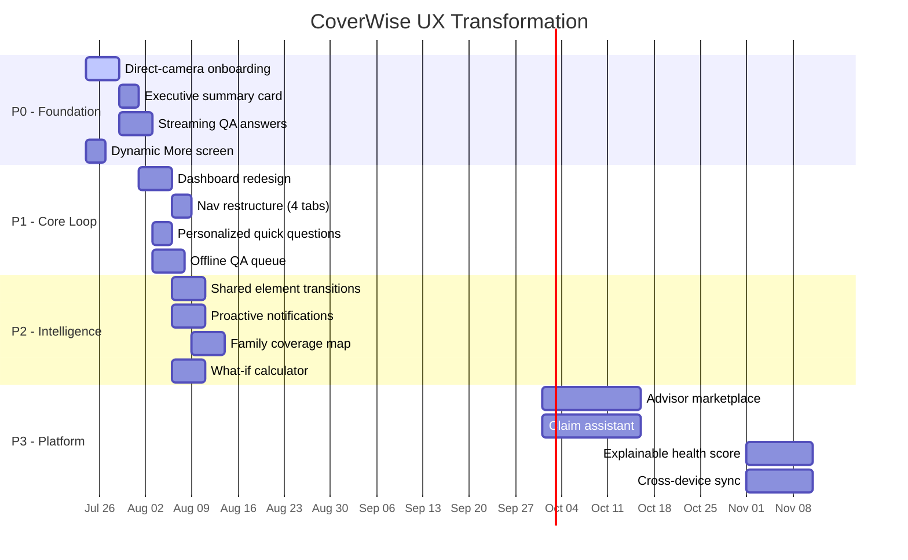

# CoverWise Mobile App — First-Principles UX & Architecture Audit

**Date:** 2026-07-23  
**Scope:** Full mobile app (Flutter/Dart) — onboarding → upload → policy detail → QA → account  
**Perspective:** Long-term product durability, not feature parity.

---

## 1. EXECUTIVE SUMMARY

**What CoverWise *is* today:** A document-to-insight pipeline for insurance policies. User uploads PDF → server extracts structured fields → app renders a "policy detail" screen + QA chat.

**What CoverWise *should be* (first principles):** An **insurance intelligence agent** that lives in your pocket. The policy document is just the seed; the value is *ongoing* — renewal alerts, gap detection, claim guidance, family coverage map, what-if modeling. The current UI treats extraction as the destination. It should be the starting line.

**Verdict:** Strong engineering foundation (Riverpod, Hive, Supabase, consent-ledger, principal-key encryption, offline-first). UI layer is coherent but **stuck at "document viewer + chat"**. The architecture supports much more; the product surface doesn't expose it.

---

## 2. CORE USER JOURNEY MAP (AS-IS vs. TO-BE)

| Stage | Current Reality | First-Principles Target |
|-------|-----------------|-------------------------|
| **Cold start** | 3-page onboarding → "Add my first policy" CTA | Instant value: camera → OCR → one insight in <30s |
| **Upload** | File picker → consent dialog → upload → processing screen → policy detail | Background upload, instant local preview, progressive enhancement |
| **First value** | Policy detail screen (static fields) | **Answer to "What am I covered for?"** in plain language |
| **Retention hook** | Renewal calendar (tab 4), family tab (empty state) | Proactive notifications: "Your car policy expires in 14 days — here's what to check" |
| **Expansion** | "More" screen = link farm | Contextual upsell: "You have health + car, but no term life — here's why that's a gap" |
| **Monetization** | Paywall at document limit / question limit | Value-metered: free tier = 3 policies + 10 Qs/mo; paid = unlimited + advisor access + family |

---

## 3. SCREEN-BY-SCREEN DEEP DIVE

### 3.1 Onboarding (`onboarding_screen.dart`) — **Grade: B+**

**Strengths:**
- 3-step conceptual flow (Understand → Ask → Stay Informed) — clear mental model
- Explicit analytics opt-in (Switch, not dark pattern)
- Mandatory TOS/Privacy checkbox — legally sound
- "CoverWise is a policy information assistant, not an insurer" disclaimer — builds trust
- Skip intro respects reduced-motion

**Issues:**
| Problem | Severity | Fix |
|---------|----------|-----|
| Static images (`assets/onboarding/*.png`) — no motion, no interactivity | Medium | Replace with Lottie/Rive micro-animations showing policy → extraction → answer |
| No progressive disclosure — all 3 pages upfront | Medium | Show page 1 only; unlock page 2 after first upload; page 3 after first QA |
| "Add my first policy" button dumps user to DocumentsScreen with file picker open — 2 taps but feels like 4 | High | **Direct-to-camera** flow: onboarding complete → camera opens → snap → instant local preview → background upload |
| No "demo mode" for users without a PDF handy | Medium | Pre-bundled demo policy (already exists in `DocumentsScreen._loadBundledDemoPolicyFile`) — surface it as "Try with sample policy" |

**Copy critique:**
- "Turn policy pages into plain answers" — good
- "Ask your policy, not the internet" — strong differentiator
- "Know what needs attention next" — vague; should say "Renewals, gaps, and claim prep in one place"

### 3.2 Documents Screen (`documents_screen.dart`) — **Grade: B**

**Strengths:**
- Drag-drop (web) + file picker (native) + batch upload
- Duplicate detection with "Use saved policy" option — respects user time
- On-device OCR toggle for images — privacy-first
- Clear progress states: reading on device → uploading → processing
- Consent gate only on first upload — not repetitive

**Issues:**
| Problem | Severity | Fix |
|---------|----------|-----|
| Upload review card takes 60% of screen — pushes list down | High | Collapse to inline chip after selection; expand on tap |
| Batch upload UI lives in same screen — cognitive overload | Medium | Separate "Batch Upload" bottom sheet |
| Empty state shows two buttons ("Add policy file" + "Add multiple") — redundant | Low | Single primary CTA; batch as secondary menu item |
| No visual distinction between "local only" vs "synced" documents | Medium | Badge: `☁️ Synced` / `📱 Local only` / `⏳ Processing` |
| File type hints (PDF/JPEG/PNG + 20MB) buried at bottom | Low | Move under primary CTA as ghost text |

**Micro-interaction gaps:**
- No haptic on file select
- No spring animation when upload card expands/collapses
- Progress bar is linear — should be circular around file icon during "reading on device"

### 3.3 Policy Detail Screen (`policy_detail_screen.dart`) — **Grade: B-**

**This is the "aha moment" screen. It currently fails.**

**What it shows:** Raw extracted fields (insurer, policy number, coverage amount, premium, dates, benefits, exclusions, waiting periods, coverage items).

**What it *should* show:** **Answers to the 5 questions every policyholder has:**
1. **What am I covered for?** (Plain-language summary, not field list)
2. **What's *not* covered?** (Exclusions in human language)
3. **What do I pay?** (Premium + deductible + copay in one view)
4. **When does it renew/expire?** (Countdown + action button)
5. **How do I claim?** (One-tap claim guide)

**Current code issues (lines 166-178):**
```dart
// Phase 0 P0-0.4: do NOT display the summary if it fails minimum-viable-evidence check
if (!summary.hasMinimumViableEvidence) {
  return _buildUnverifiedSummaryScaffold(...);
}
```
This is **correct** — don't hallucinate. But the fallback screen (`_buildUnverifiedSummaryScaffold`) just says "extraction in progress" with a QA button. It should say: *"We're still reading your policy. Here's what we know so far: [partial fields]. Tap 'Ask' for specifics."*

**Missing components:**
- **Executive summary card** (AI-generated 3-bullet TL;DR)
- **Coverage map** (visual: 🏠 Home 🚗 Auto 🏥 Health 👨‍👩‍👧 Family)
- **Quick actions** sticky bar: Ask · Claim Guide · Share · Renewal Reminder
- **Evidence trail** — each field should show "Source: Page 3, para 2" (already in `FieldCitationCard` but not surfaced)

### 3.4 QA Screen (`qa_screen.dart`) — **Grade: B**

**Strengths:**
- Tabbed: Quick Questions / Custom / History — good IA
- Demo auto-question sequence (dev mode) — nice for onboarding
- Entitlement gating with clear paywall path
- Offline banner, loading states, error handling

**Issues:**
| Problem | Severity | Fix |
|---------|----------|-----|
| "Quick Questions" are static chips — not personalized | High | Generate from policy type: health → "What's my deductible?"; auto → "What's my IDV?" |
| No streaming answer UI — user stares at spinner | High | Implement token-by-token streaming with `CoverWiseStateTransition` |
| Answer cards don't cite sources inline | Medium | Each answer paragraph → `FieldCitationCard` expandable |
| No "Was this helpful?" feedback loop | Medium | Thumbs up/down → improves RAG |
| History is flat list — no search/filter | Low | Add search + "Unanswered" filter |

### 3.5 Dashboard (`dashboard_screen.dart`) — **Grade: C+**

**Current:** Stack of widgets — QuickActions, HealthScore, PolicySummaryCards, WelcomeCard, RecentActivities, FamilySection, DocumentSummary, PreventiveTips, TerminologySection.

**Problems:**
- **No hierarchy** — everything screams equal importance
- **HealthScoreCard** is a vanity metric — "87/100" means nothing without context
- **WelcomeCard** duplicates document count from PolicySummaryCards
- **FamilySection** shows empty state for 90% of users (single policy)
- **TerminologySection** at bottom — nobody scrolls that far

**Redesign principle:** **One primary metric + three contextual actions.**

```
┌─────────────────────────────────────┐
│  Next renewal: Car Insurance  ▸     │  ← Primary (countdown + CTA)
│  14 days · ₹12,450/yr               │
├─────────────────────────────────────┤
│  ⚠️  Coverage gap: No term life      │  ← Insight (personalized)
│  [Explore options]                  │
├─────────────────────────────────────┤
│  📄 3 policies · 2 synced · 1 local  │  ← Status summary
│  [View all]                         │
└─────────────────────────────────────┘
```

### 3.6 More Screen (`more_screen.dart`) — **Grade: C**

**Current:** Three groups of `CoverWiseActionRow` — essentially a link farm.

**Issues:**
- No personalization — shows "Family" even for single users
- "Coming soon" badges on 4/14 items — erodes trust
- No smart grouping: "Claims info guide" and "My claims log" should be adjacent
- Settings/Privacy/About buried at bottom — should be in profile drawer

**Fix:** Dynamic sections based on user state:
```dart
// Pseudocode
if (hasFamilyPolicies) showFamilySection()
if (hasUpcomingRenewals) showRenewalSection()
if (hasClaimsHistory) showClaimsSection()
showCoreTools() // Search, Emergency Card, Compare, Calculator
showAccountSection() // Profile, Settings, Help, Privacy
```

---

## 4. DESIGN SYSTEM AUDIT

### 4.1 Theme (`coverwise_theme.dart`) — **Grade: A-**

**Strengths:**
- Custom `ColorScheme.fromSeed` with proper dark mode
- Consistent radius (16-22), elevation 0 (flat design)
- Semantic colors: `CoverWiseColors.blue`, `mint`, `ink`, `line`, `cloud`
- M3 compliance: `useMaterial3: true`, proper `NavigationBarTheme`, `FilledButtonTheme`

**Nits:**
- `ink` (0xFF071B33) vs `inkSoft` (0xFF12304F) — barely distinguishable in dark mode
- No `surfaceContainerHighest` / `surfaceContainerLow` usage — missed M3 tokens
- `CoverWiseColors.line` used for borders but not for divider theme consistency

### 4.2 Motion (`coverwise_motion.dart`) — **Grade: B**

**Tokens:** `instant` (0), `quick` (140ms), `standard` (220ms), `emphasized` (360ms), `onboarding` (420ms)  
**Curves:** `easeOutCubic` / `easeInCubic` — **good, Apple-like**

**Missing:**
- No `spring` token for physical feel (overshoot)
- No `stagger` helper for list animations
- `CoverWiseStateTransition` only does opacity — no slide/scale
- Reduced-motion respected but no `prefersReducedMotion` media query for web

### 4.3 Components (`coverwise_components.dart`) — **Grade: B+**

**Well-designed primitives:**
- `CoverWisePageHeader` — consistent title/subtitle hierarchy
- `CoverWiseSectionLabel` — uppercase, tracked, primary color — strong IA signal
- `CoverWiseIconBadge` — accessible accent color adaptation (`_accessibleAccent`)
- `CoverWiseActionRow` — the workhorse list item; semantic label composes title+subtitle
- `CoverWiseSurface` — bordered card with theme-aware border color
- `CoverWiseStatusChip` — "color never carries meaning alone" ✓
- `CoverWiseMetadataRow` — label/value with selectable value ✓
- `CoverWiseInfoPanel` — branded alert panel
- `CoverWiseSoonBadge` — honest "not yet" signal
- `CoverWiseSelectableRow` — radio-style selection with border highlight

**Gaps:**
- No `CoverWiseEmptyState` (exists separately in `empty_state_widget.dart` — unify)
- No `CoverWiseProgressRing` for circular upload/processing
- No `CoverWiseToast` / `CoverWiseBanner` — using `CoverWiseSnackBar` for everything
- No `CoverWiseAvatar` for family members / insurers
- No `CoverWiseChip` for tags (policy type, status)

---

## 5. INTERACTION & MICRO-INTERACTION GAPS

| Interaction | Current | Target |
|-------------|---------|--------|
| **Pull-to-refresh** | `RefreshIndicator` on dashboard/documents | Add haptic + spring-back overscroll |
| **Tab switch (bottom nav)** | Instant `IndexedStack` | Cross-fade 140ms + icon morph |
| **Policy card tap** | `pushNamed` | Shared element transition (hero) from card → detail |
| **Upload progress** | Linear bar | Circular around file icon → checkmark morph |
| **QA answer streaming** | None | Token-by-token with `CoverWiseStateTransition` |
| **Empty state → first action** | Static illustration | Animated illustration (Lottie) + pulse CTA |
| **Paywall appear** | `showDialog` | Bottom sheet with spring entrance, dim background |
| **Onboarding page change** | `PageView` animate | Parallax artwork + text stagger |
| **Error → retry** | Snackbar | Inline error with retry button (no toast dismissal) |

---

## 6. INFORMATION ARCHITECTURE CRITIQUE

### Current Nav (5 tabs):
```
[Home] [Documents] [Ask] [Family] [More]
```

**Problems:**
- **Family** is empty for 80%+ users → wasted prime real estate
- **Ask** is a verb, others are nouns — inconsistent
- **More** is a junk drawer

### Proposed Nav (4 tabs + floating action):
```
[Home] [Policies] [Insights] [Profile]
         (+) Floating: Scan / Upload / Ask
```

| Tab | Purpose | When empty |
|-----|---------|------------|
| **Home** | Next action + health snapshot | Onboarding CTA |
| **Policies** | Library + upload + batch | "Add your first policy" |
| **Insights** | Gaps, renewals, comparisons, calculator, literacy | "Add policies to unlock insights" |
| **Profile** | Account, settings, family, cards, help, privacy | — |

**Rationale:** Policies are the *object*; Insights are the *value*. Family moves to Profile (it's account-scoped). Ask becomes a floating action — available everywhere.

---

## 7. CONTENT & COPY AUDIT

### Voice attributes (observed):
- **Direct** — "Turn policy pages into plain answers"
- **Honest** — "CoverWise is a policy information assistant, not an insurer"
- **Technical but accessible** — "extraction", "processing", "citations"
- **Conservative** — no humor, no personality

### Missing voice moments:
| Moment | Current | Could be |
|--------|---------|----------|
| First upload success | "Upload and document reading completed" | "Got it. Your car policy is now readable. Want to know what's covered?" |
| Empty dashboard | "Your cover, at a glance" | "No policies yet. Snap one and we'll handle the reading." |
| Paywall | "You've reached your limit" | "You're getting value — want unlimited?" |
| Processing | "Processing…" | "Reading page 3 of 12…" |
| Error | "We could not load your policy overview" | "Something went wrong. Pull to retry, or we'll auto-retry in 30s." |

### Terminology inconsistencies:
- "Policy" vs "Document" vs "File" — used interchangeably
- "Summary" vs "Extraction" vs "Processing result"
- "QA" vs "Ask" vs "Questions" — pick one: **Ask**

---

## 8. TECHNICAL DEBT IMPACTING UX

| Debt | UX Impact | Effort |
|------|-----------|--------|
| `PolicyDetailScreen` 1439 lines — god object | Hard to iterate on "aha moment" | High (refactor) |
| `DocumentsScreen` 1600+ lines — upload + batch + list + consent | Upload flow changes break list | High (split) |
| No offline-first QA — questions fail silently offline | User loses trust | Medium |
| `AppStateRepository` + `AppStateStore` + `HiveWorkspaceService` — three layers for same data | Sync bugs, migration pain | High |
| `CoverWiseMotion.duration()` called per-frame in `AnimatedSwitcher` | Jank on low-end devices | Low (memoize) |
| No image caching for policy thumbnails — reloads on scroll | Flashing images | Low |
| `AnalyticsService` fire-and-forget — no retry queue | Lost events on offline | Medium |

---

## 9. FIRST-PRINCIPLES RECOMMENDATIONS (PRIORITIZED)

### P0 — Do Now (Week 1-2)
1. **Direct-to-camera onboarding** — bypass DocumentsScreen entirely for first policy
2. **PolicyDetail executive summary** — AI-generated 3-bullet TL;DR above raw fields
3. **Streaming QA answers** — token-by-token with citations inline
4. **Dynamic More screen** — hide "Coming soon", show only relevant sections

### P1 — Do Next (Month 1)
5. **Redesign Dashboard** — one primary metric + three contextual actions
6. **Nav restructuring** — 4 tabs + FAB; move Family to Profile
7. **Personalized Quick Questions** — generate from policy type + gaps
8. **Offline QA queue** — store questions locally, sync when online

### P2 — Do This Quarter
9. **Shared element transitions** — policy card → detail (hero animation)
10. **Proactive notifications** — renewal 30/14/7 days, gap detection weekly
11. **Family coverage map** — visual: who's covered for what across policies
12. **What-if calculator integration** — "What if I increase deductible?" → live preview

### P3 — Strategic (6 months)
13. **Advisor marketplace** — "Talk to a human" button on complex answers
14. **Claim assistant** — guided incident capture → evidence checklist → insurer submit
15. **Policy health score** — explainable: "87 because: 3 policies, 0 gaps, 1 renewal soon"
16. **Cross-device sync** — iCloud/Drive backup for local-only users

---

## 10. METRICS TO TRACK (North Stars)

| Metric | Current | Target | Why |
|--------|---------|--------|-----|
| **Time to First Value** (install → first answer) | ~5 min | < 60 sec | Activation |
| **Policy per User** | ~1.2 | 3.0 | Expansion |
| **Questions per Policy per Month** | ~2 | 8 | Engagement |
| **Renewal Action Rate** (tapped "Renew" within 7 days) | ~15% | 50% | Retention |
| **Paywall Conversion** (view → purchase) | Unknown | 3% | Monetization |
| **Offline Session %** | Unknown | < 5% | Reliability |

---

## 11. IMPLEMENTATION SEQUENCE (SUGGESTED)



---

## 12. DECISION LOG (FOR FUTURE REFERENCE)

| Date | Decision | Rationale |
|------|----------|-----------|
| 2026-07-23 | Keep Riverpod + Hive + Supabase | Proven, offline-first, principal-key encryption working |
| 2026-07-23 | Adopt 4-tab + FAB nav | Family is account-scoped; Ask is cross-cutting action |
| 2026-07-23 | Executive summary > raw fields | User wants answers, not data |
| 2026-07-23 | Streaming QA required | Perceived latency > actual latency |
| 2026-07-23 | Dynamic More screen | "Coming soon" erodes trust; show only what works |

---

## 13. OPEN QUESTIONS FOR TEAM

1. **Business model:** Is "advisor marketplace" (P3) revenue-sharing or subscription add-on?
2. **Data policy:** Can we store extracted policy fields long-term for gap analysis, or GDPR "right to be forgotten" requires purge on delete?
3. **Platform parity:** iOS/Android feature parity required? (Camera OCR differs)
4. **Team capacity:** Can we parallelize P0 (2 engineers) + P1 (2 engineers) or sequential?
5. **Design tokens:** Migrate to Figma tokens → `coverwise_theme.dart` codegen?

---

*End of audit. Ready to execute P0 when aligned.*