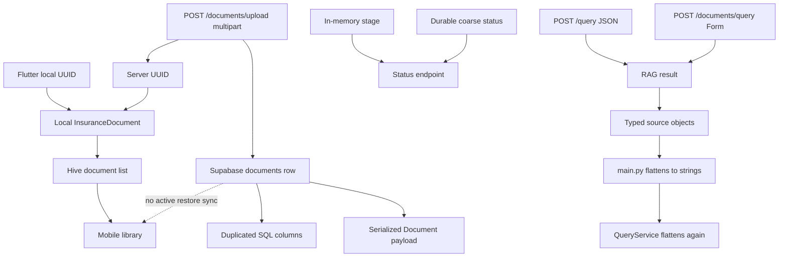

# CoverWise API, Domain Model, Data Consistency, and Integration Audit

**Date:** 2026-07-18  
**Repository:** `pranaysuyash/insurance_q`  
**Branch:** `main`  
**Commit:** `e3440a5da174c0cbbe279878bdff21950d8cab63`  
**Evidence tier:** Tier 1 static implementation inspection  
**Scope:** API contracts, domain entities, local/remote identity, repository consistency, endpoint semantics, client transport, ownership, pagination, idempotency, versioning, mutations, sync, and integration boundaries

---

## Technical Summary

CoverWise has useful repository and object-store abstractions, but it does not yet have one coherent application contract.

The current system simultaneously uses:

- a local Flutter document ID and a remote document ID;
- a document row with duplicated SQL columns and a serialized Pydantic payload;
- local Hive as the mobile “single source of truth” and Supabase as production truth;
- two query endpoints and request formats;
- typed source objects that are flattened into strings by backend and mobile layers;
- durable coarse state, local state, and in-memory granular state;
- a catch-all metadata dictionary for consent, network data, contacts, classification, and policy facts;
- async endpoints calling synchronous SDKs;
- multi-file uploads without a transaction or per-file reconciliation contract.

These cause incorrect deletion and replacement, inability to restore a workspace, loss of citation provenance, ambiguous retries, stale state, orphaned records, mobile/server disagreement, and API errors that look successful.

**Verdict: NO-GO for a stable public API contract.**

The target is one versioned API, one canonical principal-scoped document aggregate, one server document ID, one durable operation model, strict client DTOs, semantic HTTP errors, transactional state transitions, and an explicit offline-sync protocol.

---

# 1. Current Contract Map



---

# 2. What Is Strong and Should Be Preserved

- Owner scope is required at repository `get`, list, update, and delete boundaries.
- Query owner scope is overwritten from the verified bearer, not accepted from client data.
- Production backend factories fail closed rather than allowing local storage.
- Source-hash idempotency is owner-scoped.
- `_client_document()` excludes storage path, owner, hash, and raw metadata.
- Source storage is behind an opaque object-store abstraction.

These are the right foundations. They need one domain and API contract around them.

---

# 3. P0 Findings

## P0-01: Local and remote document identities create competing object identities

The mobile app creates a local UUID after the server creates a remote UUID. `InsuranceDocument` stores both `id` and `remoteId`, and methods accept either through fallback searches.

### Failure modes

- routes pass local ID to server endpoints;
- summary cache and selection use different IDs;
- deletion/replacement remove only local record;
- restored documents receive new local identity;
- analytics, feedback, and citations cannot join reliably.

### Required fix

Use server `document_id` as the canonical logical ID on synced objects. A pre-upload local ID must be a temporary `client_operation_id`, not a second permanent identity.

---

## P0-02: Mobile local storage is called the source of truth while production truth is remote

`documentsProvider` reads only local Hive. No active mobile flow reconciles `GET /documents` into a clean-device library.

### Impact

- account restore does not work;
- server deletion/migration can leave stale local data;
- completion is not reconciled;
- conflict rules do not exist.

### Required fix

For account/synced mode:

```text
server = authoritative library
local = encrypted cache + offline operation queue
```

---

## P0-03: Duplicate query APIs have incompatible contracts

The app exposes JSON `POST /query` and form-based `POST /documents/query`. Compatibility paths and docs reference different shapes.

### Required fix

One versioned endpoint, such as `POST /v1/answers`, with one schema and explicit retirement of compatibility routes.

---

## P0-04: The API destroys source provenance

RAG source objects contain document, page, section, score, and text. `src/app/main.py` converts them to strings. Mobile can flatten them again.

### Impact

Page/document attribution, citation resolution, evidence feedback, and source navigation are lost.

### Required fix

Use a typed `EvidenceSource` DTO end to end. Never flatten for compatibility.

---

## P0-05: Application errors are often returned as HTTP 200

The root query endpoint returns a normal `QueryResponse` with `error` for service unavailable, retrieval failures, unexpected shapes, and exceptions.

### Impact

Clients treat failures as answers; retries, quota deduction, monitoring, caching, and future billing are wrong.

### Required fix

Use semantic statuses and one stable error envelope:

```json
{
  "error": {
    "code": "document_not_ready",
    "message": "This policy is still being processed.",
    "retryable": true,
    "correlation_id": "..."
  }
}
```

---

## P0-06: Lifecycle fields are unconstrained strings with unsafe defaults

Backend and mobile state fields are arbitrary strings. Mobile defaults missing status to completed, synced, and ready.

### Required fix

Use enums plus validated transition functions. Missing state must become unknown or fail validation, never ready.

---

## P0-07: Supabase stores duplicated truth in columns and JSON payload

The row contains owner, status, source hash, object reference, leases, and timestamps, while `payload` contains the full serialized model. Repository reads from payload only.

### Failure modes

- SQL and payload state drift;
- RPC/migration updates one copy;
- filters use one truth while clients see another.

### Required fix

Normalise first-class fields into columns and reserve bounded JSON for truly extensible metadata. Build DTOs from columns.

---

## P0-08: Multi-file upload has no atomic or per-item reconciliation contract

An `HTTPException` from a later file aborts the response after earlier files may already be stored and queued. Other exceptions increment a total without structured item errors.

### Required fix

Prefer a single-file upload endpoint. Otherwise return a durable batch resource with per-item state, idempotency, and retry semantics.

---

## P0-09: Offline upload is a label, not a sync protocol

`pending_upload` records have no operation entity containing hash, consent version, retry count, next attempt, idempotency key, or reconciliation state.

### Required fix

Create an `UploadOperation` with a complete state machine and durable encrypted source reference.

---

## P0-10: Multiple mobile services bypass the shared authenticated transport

Processing status, policy summary, and analytics create raw Dio clients.

### Impact

401s become fallbacks, token refresh does not apply, timeout/retry rules diverge, and no common correlation exists.

### Required fix

One `ApiClient` owns authentication, base URL, deadlines, error mapping, retry, correlation IDs, and DTO decoding.

---

## P0-11: Synchronous Supabase calls run inside async paths

The Python Supabase client is synchronous in async routes/services, blocking the event loop.

### Required fix

Use async clients, bounded executors, or a consistently synchronous worker model. Tune concurrency from measurements.

---

## P0-12: Summary, document, chunks, and processing are not one transactional aggregate

Source objects, rows, summaries, chunks, in-memory status, and mobile caches mutate separately.

### User-visible inconsistent states

- ready document without summary;
- summary without source;
- chunks under old owner;
- local record without remote record;
- remote source after local deletion;
- stale chunks after reprocessing.

### Required fix

Use document versions and processing runs. Write derived artifacts under a run, validate them, then atomically promote the complete extraction/index set.

---

## P0-13: Contact, consent, security, classification, and domain data are mixed in metadata

Document metadata contains IP, user agent, hash, consent, contacts, classification, policy number, and dates.

### Required fix

Separate domain data, processing/evidence, security events, consent, contact/lead, and analytics into purpose-specific entities with separate retention/access.

---

## P0-14: API schemas are broad and not generated into mobile

Several routes return `dict`, arbitrary maps, or string lists. Mobile checks multiple legacy shapes manually.

### Required fix

Publish one OpenAPI contract and generate or validate strict Dart DTOs in CI. Remove legacy branching after a bounded migration.

---

## P0-15: Mutations lack a general idempotency and concurrency contract

Delete, replace, claim, consent, feedback, usage, and future billing do not have operation IDs or expected resource versions.

### Required fix

Use `Idempotency-Key`, resource version/ETag, and durable operation resources for long-running commands.

---

# 4. P1 Findings

1. `GET /documents` loads all records before filter/sort/pagination.
2. `sort` accepts arbitrary attributes and can raise runtime errors.
3. repository lists have no cursor pagination.
4. recoverable processing is filtered in application memory.
5. upload `metadata` form field is unused.
6. upload contact fields are not aligned with current mobile request.
7. Supabase Storage always uses `application/pdf`, including images.
8. object mutation responses are not consistently checked.
9. source object checksum, ETag, content type, and version are not first-class.
10. initial background task keeps full file bytes instead of re-fetching source.
11. status merges durable and in-memory state without source/version marker.
12. status endpoint includes lead data, mixing concerns.
13. account claim reports only document count, not aggregate transfer state.
14. filename inference writes domain values before processing.
15. document-type refresh uses Q&A rather than canonical classification.
16. Pydantic response model uses a mutable list default.
17. root API and router duplicate models.
18. application globals complicate dependency injection and tests.
19. repository/object store are constructed at import time.
20. active compatibility backends increase conceptual surface after Supabase decision.
21. API/mobile compatibility matrix does not exist.
22. timestamps mix naive and timezone-aware datetimes.
23. missing summary is 404 with no pending/failed distinction.
24. all-summaries reads a global store and filters in memory.
25. no document-version endpoint exists for replacement.
26. no durable answer/feedback entity.
27. JSON/analytics body limits are not standardised.
28. no support correlation ID returned to mobile.
29. no deprecation policy.
30. no minimum supported app/API version contract.

---

# 5. Canonical Domain Model

```text
Principal
DeviceInstallation
Document
DocumentVersion
SourceObject
UploadOperation
ProcessingRun
PageArtifact
SourceSpan
ExtractionRun
ExtractedField
FieldEvidence
IndexVersion
ChunkSet
Answer
AnswerCitation
Feedback
ConsentEvent
Entitlement
PurchaseTransaction
DeletionJob
AuditEvent
```

Document identity:

- `document_id`: logical policy record;
- `document_version_id`: immutable source revision;
- `client_operation_id`: temporary offline command identity.

Capability readiness:

```text
source_ready
text_ready
summary_ready
qa_ready
emergency_snapshot_ready
```

---

# 6. Canonical API Shape

Commands:

```http
POST   /v1/upload-operations
GET    /v1/operations/{operation_id}
POST   /v1/documents/{document_id}/versions
DELETE /v1/documents/{document_id}
POST   /v1/answers
POST   /v1/answers/{answer_id}/feedback
POST   /v1/principal-claims
POST   /v1/deletion-jobs
```

Queries:

```http
GET /v1/documents?cursor=&limit=
GET /v1/documents/{document_id}
GET /v1/documents/{document_id}/summary
GET /v1/documents/{document_id}/evidence/{field}
GET /v1/operations/{operation_id}
GET /v1/deletion-jobs/{job_id}
```

Evidence source:

```json
{
  "source_id": "...",
  "document_id": "...",
  "document_version_id": "...",
  "filename": "policy.pdf",
  "page": 7,
  "section": "Waiting periods",
  "quote": "...",
  "verification_status": "verified"
}
```

---

# 7. Ordered Remediation

## Phase 0

Declare one endpoint per use case, preserve structured sources, use semantic HTTP failures, replace ready defaults with unknown, and centralise mobile transport.

## Phase 1

Use server document IDs, server library plus encrypted cache, offline operation queue, and strict DTOs/contract tests.

## Phase 2

Normalise Supabase schema, add versions/runs, transactional artifact promotion, and server-side pagination/filtering.

## Phase 3

Add idempotent mutation framework, deletion/claim operations, answer/feedback/entitlement entities, and retire compatibility paths.

---

# 8. Release Gates

- one document identity across mobile/server;
- clean-device remote restore;
- one authenticated client;
- one answer endpoint and typed sources;
- no HTTP 200 failures;
- no duplicated truth for first-class fields;
- unambiguous upload semantics;
- idempotent offline sync;
- server pagination/filtering;
- operation resources for long work;
- OpenAPI/Dart contract tests;
- claim, replace, delete, and reprocess preserve aggregate consistency.

---

# 9. Evidence Index

| Area | Paths |
|---|---|
| Root query/source flattening | `src/app/main.py` |
| Document routes/upload | `src/api/document.py` |
| Domain model | `src/models/document.py` |
| Repository duplication | `src/services/document_repository.py` |
| Object metadata | `src/services/document_object_store.py` |
| Supabase schema | `infra/supabase/001_coverwise_schema.sql` |
| Local/remote identity | `mobile/lib/models/document_model.dart` |
| Local source | `mobile/lib/providers/document_providers.dart`, `mobile/lib/services/local_storage_service.dart` |
| Upload/fallbacks | `mobile/lib/services/document_service.dart` |
| Multiple transports | `mobile/lib/providers/service_providers.dart`, `mobile/lib/screens/processing_status_screen.dart`, `mobile/lib/services/policy_extraction_service.dart`, `mobile/lib/services/analytics_service.dart` |

---

# 10. Bottom Line

CoverWise has useful boundaries but no single contract joining them. Document identity, state, evidence, ownership, errors, and mutations must agree across Postgres, Storage, FastAPI, and Flutter before higher-level features can be reliable.
