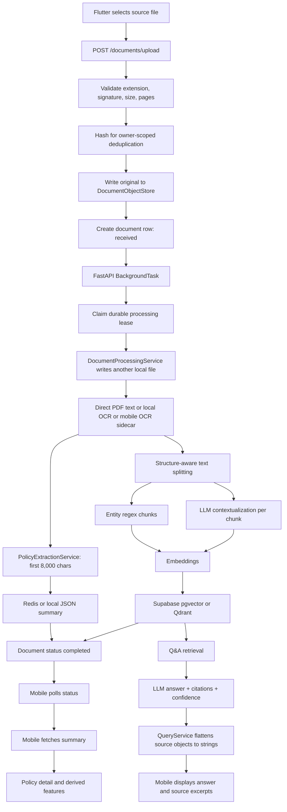
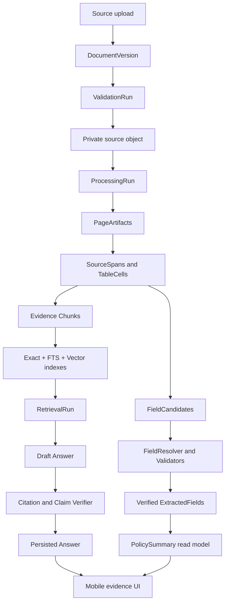

# CoverWise Document Intelligence and Trust Pipeline Audit

**Date:** 2026-07-18  
**Repository:** `pranaysuyash/insurance_q`  
**Branch audited:** `main`  
**Commit audited:** `e3440a5da174c0cbbe279878bdff21950d8cab63`  
**Audit area:** upload validation, document parsing, OCR, structured extraction, classification, chunking, embeddings, retrieval, answer generation, citations, mobile evidence presentation, evaluation, and failure recovery  
**Evidence tier:** Tier 1, static inspection of the current repository state  
**Runtime status:** no combined GitHub status or workflow run was attached to the audited commit  
**Doctrine:** `motto_v3.md`, with particular emphasis on truthful completion, risk-based verification, model and data architecture, observability, customer-facing claims, and the model-pipeline-data third-layer rule

---

## Technical Summary

CoverWise has the beginnings of a strong document product, but its document-intelligence layer is not yet trustworthy enough for customer-facing insurance interpretation.

The central problem is not that the models are too weak. The central problem is that the system does not preserve a reliable chain from:

```text
source file
  -> page
  -> extracted span
  -> normalized field
  -> indexed chunk
  -> retrieved evidence
  -> generated claim
  -> customer-visible citation
```

The current implementation breaks that chain in several places:

- the pipeline can mark a document `completed` when OCR, extraction, or indexing failed;
- direct PDF extraction discards page boundaries before chunking;
- contextual retrieval prepends model-generated text to the stored source chunk, contaminating evidence;
- exact lookup is routed to a local FTS index that does not exist in the canonical Supabase production path;
- Supabase uses a fixed 1,536-dimensional vector column, while the embedding fallback chain can switch to incompatible dimensions and then attempts to recreate a Qdrant collection that does not exist in the Supabase path;
- structured summaries are persisted in Redis or local disk rather than the canonical Supabase data plane;
- summary extraction uses only the first 8,000 characters of a policy and has no field-level page, quote, or confidence evidence;
- the mobile layer discards structured source metadata before rendering, and it does not render the model-returned citation objects;
- the evaluation runner is structurally disconnected from the actual response schema and does not constitute an integration or quality gate.

**Verdict: NO-GO for trust-critical customer use.**

The product can continue internal development, controlled testing, and UX work. It should not present extracted insurance values, coverage status, exclusions, waiting periods, claim guidance, or Q&A confidence as dependable until the P0 findings in this audit are closed with Tier 3 or higher evidence.

The recommended direction is not a rewrite and not another RAG technique. It is a controlled convergence around:

1. one canonical document-intelligence data model;
2. immutable source and page-level provenance;
3. explicit partial and failed states;
4. separate raw evidence text and model-generated retrieval text;
5. one versioned structured-extraction pipeline;
6. retrieval that supports exact, lexical, and semantic search in the production database;
7. citation and claim verification before display;
8. real datasets, metrics, and release gates.

---

# 1. Why This Was Chosen as the Next Audit Area

The previous architecture audit established that the repository is converging toward:

- one Cloud Run FastAPI runtime;
- Supabase Postgres, pgvector, and private Storage;
- a Flutter mobile client;
- owner-scoped document access;
- a non-regulated policy-understanding product boundary.

The next highest-leverage question is therefore:

> Can the system reliably transform an insurance source document into customer-visible facts and answers without losing, inventing, or overstating evidence?

Every major CoverWise surface depends on this answer:

- policy detail;
- emergency card;
- renewal dates;
- coverage and exclusions;
- Q&A;
- comparisons;
- claim guidance;
- coverage-gap analysis;
- health scores;
- notifications;
- exported and shared summaries.

If the document-intelligence substrate is wrong, polishing those surfaces increases the scale and confidence of incorrect output. This audit therefore focuses on the trust substrate rather than feature breadth.

---

# 2. Evidence Standard and Limitations

## 2.1 What was inspected

Primary code paths inspected at the audited commit include:

### Backend orchestration and data plane

- `src/app/main.py`
- `src/api/document.py`
- `src/services/document_processing_service.py`
- `src/services/document_repository.py`
- `src/services/document_object_store.py`
- `src/services/policy_extraction_service.py`
- `src/services/supabase_vector_store.py`
- `src/utils/upload_validation.py`
- `src/utils/pdf_access.py`
- `src/utils/document_classifier.py`
- `infra/supabase/001_coverwise_schema.sql`
- `infra/supabase/002_document_processing_leases.sql`

### OCR, extraction, models, and RAG

- `src/ocr/pipeline.py`
- `src/ocr/pdf_processor.py`
- `src/ocr/image_processor.py`
- `src/models/extraction.py`
- `src/models/rag.py`
- `src/llm/client.py`
- `src/config/settings.py`
- `src/rag/pipeline.py`

### Mobile trust surfaces

- `mobile/lib/providers/service_providers.dart`
- `mobile/lib/services/document_service.dart`
- `mobile/lib/services/query_service.dart`
- `mobile/lib/services/policy_extraction_service.dart`
- `mobile/lib/models/qa_models.dart`
- `mobile/lib/models/policy_summary.dart`
- `mobile/lib/screens/processing_status_screen.dart`
- `mobile/lib/screens/policy_detail_screen.dart`
- `mobile/lib/screens/qa_screen.dart`
- `mobile/lib/providers/policy_providers.dart`

### Evaluation and tests

- `src/eval/dataset.py`
- `src/eval/runner.py`
- `tests/test_rag_pipeline.py`
- `tests/test_fallbacks.py`
- `tests/test_integration.py`
- `tests/test_performance.py`
- `tests/test_mobile_ocr_sidecar.py`
- `tests/test_upload_validation.py`
- `tests/test_pdf_access.py`
- `.github/workflows/ci.yml`

## 2.2 What was not verified

This audit did not execute:

- the Python test suite;
- Flutter tests or `flutter analyze`;
- a real Supabase project;
- Cloud Run;
- OpenAI calls;
- local OCR models;
- a representative real-policy benchmark;
- account migration against real vector chunks;
- mobile flows on a device;
- deletion and recovery against production-like infrastructure.

Any statement about runtime effect is therefore either:

- a direct consequence of static control flow and schema mismatch; or
- an explicitly labelled risk requiring runtime verification.

## 2.3 Confidence

**Overall audit confidence: 0.94 for the static findings.**

Confidence is below 1.00 because no Tier 2 to Tier 5 execution evidence was available. The most important P0 findings are direct code-contract contradictions rather than speculative performance concerns.

---

# 3. First-Principles Trust Contract

A policy-understanding product should satisfy the following invariants.

## 3.1 Source completeness

The system must know whether it processed:

- all pages;
- some pages;
- no pages;
- embedded text only;
- OCR text;
- a client-provided OCR sidecar;
- tables and layout;
- password-protected content.

A partial document must never be presented as a complete document.

## 3.2 Immutable provenance

Every extracted value and answer claim must be traceable to:

- document version;
- page number;
- text span or table cell;
- extraction method;
- parser version;
- model and prompt version;
- normalized value;
- confidence and validation state.

## 3.3 Separation of source and derivation

The system must store separately:

- immutable source text;
- normalized source text;
- parser annotations;
- model-generated context;
- extracted fields;
- generated answers.

Model-generated context must never become indistinguishable from source evidence.

## 3.4 Truthful state

`ready` must mean that the required source, parsing, extraction, indexing, and persistence contracts succeeded.

The system must have distinct states for:

- password required;
- OCR required;
- partially parsed;
- extraction incomplete;
- indexing incomplete;
- retryable failure;
- terminal failure;
- ready for summary;
- ready for Q&A.

## 3.5 Owner and version consistency

A document, its pages, fields, chunks, summaries, answers, and citations must move, delete, expire, and recover as one logical aggregate.

## 3.6 Verified claims

A generated claim is displayable only when:

- evidence exists;
- the citation resolves to current owned content;
- the cited quote is present in the source span;
- critical normalized values pass deterministic validation;
- unsupported claims are removed or explicitly marked unknown.

## 3.7 Calibrated abstention

The system must prefer:

```text
not found
partial document
low-confidence extraction
please verify page X
```

over a polished but unsupported answer.

## 3.8 Evaluation before optimization

The order must be:

```text
dataset
  -> baseline
  -> metric
  -> error analysis
  -> change
  -> regression test
  -> release gate
```

not:

```text
add RAG technique
  -> cite a research improvement number
  -> assume local benefit
```

---

# 4. Reconstructed Current Flow



This diagram exposes the central architecture mismatch:

- the canonical durable source is Supabase Storage;
- document metadata and vectors are intended for Supabase;
- processing still creates a second local source copy;
- summaries remain Redis or disk artifacts;
- page-level evidence is not a first-class persistent object;
- mobile presentation loses structured source identity.

---

# 5. What Is Strong and Should Be Preserved

The findings below are static strengths, not production verification.

## 5.1 Upload validation is bounded and format-aware

`src/utils/upload_validation.py` validates:

- supported extensions;
- file size;
- signatures;
- PDF readability;
- page count;
- image parseability;
- image pixel count.

This is materially better than trusting MIME type or filename alone.

**Preserve:** one canonical validation module called before hashing, storage, or parsing.

## 5.2 Original source storage has a canonical abstraction

`DocumentObjectStore` separates:

- local development;
- historical S3 compatibility;
- canonical Supabase Storage.

Production local storage is explicitly rejected by the factory.

**Preserve:** the object-store boundary and fail-closed production factory.

## 5.3 Metadata access is owner-scoped

`DocumentRepository` requires `owner_id` for reads and deletes, and Supabase vector search requires an owner filter.

**Preserve:** owner scope as a mandatory repository and retrieval invariant.

## 5.4 Upload deduplication is owner-scoped

Identical source hashes are reused within an owner boundary.

**Preserve:** source-hash idempotency, but extend it to document versions and processing-run versions.

## 5.5 Structured outputs use typed models

Pydantic models exist for:

- policy summary extraction;
- RAG answers;
- citations.

**Preserve:** typed outputs, but strengthen them with evidence objects and validation status.

## 5.6 Q&A has an abstention path

The RAG pipeline returns a no-answer response when no results or low-quality results are found.

**Preserve:** explicit abstention, but calibrate it with a real benchmark.

## 5.7 Mobile OCR sidecar has explicit provenance

The on-device OCR sidecar is labelled `client_on_device_ocr_sidecar` and does not override embedded PDF text.

**Preserve:** the provenance distinction and source-file authority.

## 5.8 The product shows source excerpts

The Q&A UI has a source card and can show a document name and page number when those values survive the pipeline.

**Preserve:** evidence-adjacent UI, but stop discarding the metadata required to populate it.

---

# 6. Scorecard

| Area | Current judgement | Why |
|---|---|---|
| Upload bounds and signatures | Directionally strong | Canonical validation exists, but encrypted-PDF contract conflicts with UI/API |
| Source persistence | Transitional | Canonical object store exists; processing creates an unmanaged duplicate local copy |
| Page completeness | Unsafe | Mixed digital/scanned PDFs can silently omit pages |
| OCR production support | Narrow | Production supports direct PDF text and optional mobile sidecar, not general server OCR |
| Layout and table preservation | Weak | Main production path flattens text and loses page/table structure |
| Structured extraction | Unsafe | First 8,000 characters, no evidence per field, non-durable summary store |
| Classification | Heuristic-heavy | Generic keywords and overlapping extraction paths produce competing truth |
| Chunking | Basic | Paragraph/header split, but page and source spans are lost |
| Retrieval | Over-complex and under-validated | RAG Fusion, HyDE, contextualization, reranking, and fallbacks precede a sound benchmark |
| Exact lookup | Broken in canonical production path | Routes to local FTS, which is disabled for Supabase |
| Embedding fallback | Broken for Supabase | Variable dimensions conflict with fixed vector schema and Qdrant-specific fallback code |
| Citation integrity | Unsafe | Citation indices and quotes are not verified |
| Mobile evidence rendering | Broken | Source objects become strings; citation objects are not rendered |
| Confidence | Misleading | Model confidence is raised using `max`, never constrained by evidence verification |
| Evaluation | Not decision-grade | Runner schema mismatch; “integration” and “performance” tests do not test real integration/performance |
| Observability | Partial | Stage labels exist, but durable per-stage evidence and model-call audit records do not |
| Release readiness | NO-GO | No current CI status and multiple trust-critical static contradictions |

---

# 7. P0 Findings

## P0-01: A document can be marked completed when required stages failed

### Evidence

`DocumentProcessingService.process_document_full()`:

- records OCR output even when `ocr_result["status"] == "failed"`;
- continues with empty text;
- allows RAG ingestion to return `skipped` or `failed`;
- allows policy extraction to return `skipped` or `failed`;
- unconditionally sets the overall result to `completed`.

`src/api/document.py::process_document_background()` then sets the repository document to `completed` whenever the outer result says completed.

### Failure mode

Examples:

- scanned PDF has no embedded text and production OCR is unavailable;
- OCR returns failed and empty text;
- RAG ingestion is skipped for insufficient content;
- embedding generation fails;
- structured extraction returns no summary.

The document can still become customer-visible as complete.

### Impact

- processing UI says the policy is ready;
- the policy detail screen may be missing;
- Q&A may return nothing;
- downstream features may interpret absence as an insurance gap;
- retry logic does not know which stage failed;
- operators cannot distinguish a valid empty result from a failed pipeline.

### Required fix

Define required-stage completion by processing mode.

Example:

```python
required = {
    "full": {"source", "pages", "text", "summary", "chunks"},
    "ocr_only": {"source", "pages", "text"},
    "rag_only": {"source_text_reference", "chunks"},
}
```

The orchestrator must derive the terminal document state from stage outcomes, not set it directly.

### Acceptance criteria

- OCR failure cannot result in `ready`;
- indexing failure cannot result in Q&A-ready;
- summary failure cannot result in summary-ready;
- each stage has a durable status and safe failure class;
- integration tests verify partial success and retry behaviour.

---

## P0-02: Page provenance is destroyed before chunking

### Evidence

The primary production PDF path in `DocumentProcessingService._extract_text()`:

- iterates pages;
- appends page text to a plain list;
- joins the text into one string;
- returns no page spans.

`_split_text_into_blocks()` receives the flattened string and emits blocks without page numbers.

### Failure mode

A retrieved chunk may combine or originate from unknown pages. The vector store receives no reliable page number.

### Impact

- source cards cannot point to the exact page;
- citations cannot be independently checked;
- table values can be separated from headers;
- repeated terms across pages cannot be disambiguated;
- a “page source” claim is unsupported.

### Required fix

Persist `PageArtifact` and `TextSpan` records before chunking.

Every chunk must contain:

- `document_version_id`;
- start and end page;
- source span IDs;
- raw source text;
- normalized text;
- parser method;
- extraction quality.

### Acceptance criteria

- every retrieved chunk resolves to one or more immutable source spans;
- every source span resolves to page coordinates or a table cell;
- mobile can open the exact page for each evidence card.

---

## P0-03: Contextual retrieval contaminates source evidence with model-generated text

### Evidence

`RAGPipeline._contextualize_chunks()` generates model-written context and replaces:

```python
block["text"]
```

with:

```text
generated context

original source chunk
```

The modified text is then:

- embedded;
- stored as chunk content;
- returned as source text;
- available for model citations.

### Failure mode

An LLM-generated sentence becomes indistinguishable from policy text.

The answer model can cite a generated context sentence as if it were in the policy.

### Impact

This invalidates the core source-of-truth contract.

### Required fix

Store at least two fields:

```text
source_text
retrieval_text
```

Where:

- `source_text` is immutable source-derived text;
- `retrieval_text` may include generated context;
- citations may quote only `source_text`;
- generated context is labelled with model, prompt, version, and run ID.

### Acceptance criteria

- no customer-visible quote can originate from generated context;
- contextualization can be disabled independently;
- evaluation compares retrieval with and without contextualization;
- generated context is auditable and deletable as derived data.

---

## P0-04: Exact lookup is broken in the canonical Supabase path

### Evidence

`RAGPipeline.__init__()` initializes the local SQLite FTS index only when the vector backend is not Supabase.

`query_rag()` classifies policy-number queries as `exact_lookup` and then skips dense search, calling only `_query_hybrid_index()`.

In Supabase production:

```text
hybrid_index_enabled = false
```

Therefore the exact-lookup path returns no results.

### Impact

Queries such as:

- “What is my policy number?”
- “Find policy number X”
- “What is the policy ID?”

can fail specifically in the canonical production architecture.

### Required fix

Implement production lexical and exact lookup in Postgres.

Options, in order:

1. indexed normalized entity table;
2. Postgres full-text search over source spans;
3. trigram search for identifiers and names;
4. vector search as a fallback, not the primary exact path.

### Acceptance criteria

- exact lookup runs in Supabase;
- document and owner filters are applied in SQL;
- real identifier benchmark meets a defined recall and latency target.

---

## P0-05: Supabase embedding fallback is dimensionally and operationally broken

### Evidence

The production schema uses:

```sql
embedding vector(1536)
```

The embedding fallback chain can switch to:

- Ollama dimensions such as 768 or 1,024;
- local sentence-transformer dimensions such as 384, 768, or 1,024.

On dimension change, `_generate_embeddings_with_fallback()` attempts:

```python
self.qdrant_client.recreate_collection(...)
```

even when the active vector backend is Supabase and `qdrant_client` was not initialized.

### Failure mode

After an OpenAI embedding failure:

- the fallback may raise an attribute error;
- or produce vectors incompatible with the Postgres column;
- or mix embedding spaces if the schema is changed without reindexing.

### Impact

The advertised fallback can make production indexing or query fail at the exact time it is needed.

### Required fix

Select one embedding contract per index version.

Example:

```text
index_version=coverwise-embed-v1
provider=openai
model=text-embedding-3-small
dimension=1536
distance=cosine
```

Fallback options must either:

- produce the same dimension and be benchmarked as compatible; or
- write to a separate index version and trigger a controlled migration.

### Acceptance criteria

- production fallback never mutates index dimensions;
- query and document embeddings always use the same index contract;
- incompatible providers fail closed with an explicit retryable state;
- shadow-index migration is tested before cutover.

---

## P0-06: Structured summaries are not stored in the canonical durable data plane

### Evidence

`PolicyExtractionService` stores summaries in:

1. Redis, if available;
2. local JSON files under `storage/summaries`.

The canonical platform decision says Redis is not required for correctness and Cloud Run local disk is not durable.

### Failure mode

- scale-to-zero removes disk summaries;
- a second instance cannot see another instance’s disk;
- Redis is not part of the canonical production contract;
- document metadata and vectors survive while the summary disappears.

### Impact

The main product screen, emergency card, dates, exclusions, and derived features can become inconsistent after restart or scale-out.

### Required fix

Persist summaries and field evidence in Supabase tables within the same document aggregate.

Suggested entities:

- `extraction_runs`;
- `extracted_fields`;
- `field_evidence`;
- `policy_summaries` as a materialized read model.

### Acceptance criteria

- summaries survive restart and multi-instance access;
- summary version is linked to document version and extraction run;
- deletion cascades across fields and evidence;
- reprocessing can supersede, not silently reuse, an old summary.

---

## P0-07: Summary extraction is incomplete by design and has no field evidence

### Evidence

`PolicyExtractionService.extract_summary()` truncates document text to the first 8,000 characters.

`PolicySummaryExtraction` contains values only. It does not contain:

- page;
- quote;
- source span;
- field confidence;
- extraction method;
- validation status;
- currency;
- unit;
- ambiguity alternatives.

### Failure mode

Insurance schedules, endorsements, exclusions, sublimits, and renewal dates often appear outside the first part of a document.

A plausible value can be extracted with no proof of where it came from.

### Impact

The policy detail page renders values such as sum insured, premium, deductible, dates, benefits, and exclusions as clean facts, with only a general footer telling users to verify.

### Required fix

Use evidence-first field extraction.

Each field candidate should look like:

```json
{
  "field": "coverage_amount",
  "raw_value": "₹25,00,000",
  "normalized_value": 2500000,
  "currency": "INR",
  "document_version_id": "...",
  "page": 3,
  "source_span_id": "...",
  "quote": "Sum Insured: ₹25,00,000",
  "extractor": "deterministic|model",
  "model": "...",
  "prompt_version": "...",
  "confidence": 0.94,
  "validation_status": "verified|conflict|unknown"
}
```

### Acceptance criteria

- no critical field is displayed without evidence;
- fields can be marked unknown or conflicting;
- extraction covers the entire document using page- and section-aware candidates;
- summary output is a projection of verified field records.

---

## P0-08: Mixed digital and scanned PDFs can silently become partial but “complete”

### Evidence

When at least one PDF page has embedded text, `_extract_text()` returns the joined embedded text even if other pages are image-only.

It logs skipped image-only pages but does not:

- OCR those pages in the main production path;
- mark the result partial;
- return skipped page numbers;
- block completion.

The mobile OCR sidecar is used only when the entire PDF has no embedded text.

### Failure mode

A policy with a digital schedule and scanned endorsements can lose the scanned pages.

### Impact

- missing exclusions;
- missing endorsements;
- missing claim conditions;
- incorrect coverage conclusions;
- false “not found” and gap analysis.

### Required fix

Parsing must be page-level.

For each page:

```text
embedded text quality check
  -> accept embedded text
  -> else OCR
  -> else mark page unreadable
```

The document state must be `partial` if required pages remain unreadable.

### Acceptance criteria

- mixed PDFs process each page independently;
- skipped pages are visible to the user;
- no document becomes fully ready while unreadable pages remain unacknowledged.

---

## P0-09: The password-protected PDF contract contradicts itself

### Evidence

The upload API and mobile service accept `pdf_password`.

The downstream parser has `unlock_pdf()` and tests for password-required, invalid-password, and successful in-memory unlock.

However, `validate_upload_content()` ignores the supplied password and rejects every encrypted PDF as `encrypted_pdf_not_supported`.

Tests explicitly assert the rejection.

### Impact

The product exposes a capability that cannot succeed.

### Required fix

Choose one contract:

- remove password support from API and UI until implemented; or
- validate and unlock in memory using the supplied password, without persisting the password.

### Acceptance criteria

- UI, API schema, validator, tests, and parser agree;
- password is never logged or persisted;
- wrong-password and retry behaviour are explicit.

---

## P0-10: Processing creates an unmanaged local copy of the customer document

### Evidence

The upload API writes the original source to `DocumentObjectStore`.

`DocumentProcessingService._save_file()` writes the full source again to:

```text
storage/documents/{document_id}_{filename}
```

The file is not deleted after processing.

The raw filename is not sanitized in this path.

### Failure modes

- Cloud Run ephemeral disk retains an unnecessary copy for the instance lifetime;
- deletion of the canonical object does not delete the processing copy;
- an adversarial filename can introduce path segments;
- local disk usage grows;
- a source file exists outside the canonical audit and retention workflow.

### Required fix

Processing should read from:

- the canonical object store; or
- a secure temporary file with a generated name, restrictive permissions, and guaranteed `finally` cleanup.

Never use the user filename as a filesystem path component without canonical sanitization.

### Acceptance criteria

- only the canonical object store retains source documents;
- temporary files are deleted on success, failure, timeout, and cancellation;
- deletion tests verify no residual local source copy.

---

## P0-11: Selected-document filtering occurs after Supabase top-N retrieval

### Evidence

`SupabaseVectorStore.search()` calls `match_document_chunks()` with owner scope and a result limit.

It applies `document_ids` filtering in Python after the RPC returns.

### Failure mode

For an owner with multiple policies, the SQL query can return top results from other documents. The client then discards them, leaving too few or zero results for the selected document even when relevant chunks exist.

### Impact

Single-policy Q&A becomes corpus-distribution dependent.

### Required fix

Push all allowed document IDs into the SQL function and filter before distance ordering and limit.

### Acceptance criteria

- owner and document filters execute inside Postgres;
- selected-document recall is independent of other owned documents;
- tests cover one relevant selected document among many more-similar non-selected documents.

---

## P0-12: Citation objects are not verified

### Evidence

`RAGCitation` validates only:

- source index is at least 1;
- quote is a string.

There is no post-generation check that:

- source index exists;
- quote is contained in source text;
- quote comes from raw source rather than generated context;
- each material answer claim has evidence;
- citation belongs to the selected document and owner.

### Impact

The model can produce citation-shaped output that appears trustworthy but is invalid.

### Required fix

Add an answer verification stage:

1. validate source index bounds;
2. normalize and substring/fuzzy-match the quote against immutable source text;
3. reject citations to generated retrieval context;
4. identify uncited factual claims;
5. reduce confidence or abstain if verification fails.

### Acceptance criteria

- invalid citations never render;
- citation precision and claim coverage are benchmarked;
- answer output includes a verification status.

---

## P0-13: The mobile layer discards structured source provenance and ignores citation objects

### Evidence

`QueryService._extractSources()` converts backend source objects to strings.

The resulting `QaAnswer` therefore loses:

- `document_id`;
- `page_number`;
- `score`;
- `section`;
- source index.

`QaAnswer.citations` is parsed and stored, but `qa_screen.dart` does not render citation objects. It renders only `answer.sources`.

### Impact

Even if the backend returns correct evidence, the user usually sees a generic “Policy source” excerpt without page or document attribution.

### Required fix

Preserve the backend source DTO unchanged through the mobile service.

Render:

- document name;
- page;
- source excerpt;
- citation marker linked to answer claims;
- “open page” action;
- evidence verification state.

### Acceptance criteria

- mobile contract tests prove source metadata survives serialization;
- citations render and resolve to source cards;
- copy/share includes evidence links or a clear “verify in policy” label.

---

## P0-14: Mobile fallback amount parsing can catastrophically corrupt values

### Evidence

`mobile/lib/services/policy_extraction_service.dart::_parseAmount()` multiplies a parsed number by 100,000 whenever the original text contains the letter `l`.

It multiplies by 1,000 whenever the text contains `k`.

This is not token- or unit-aware.

Example:

```text
"5000 annually"
```

contains `l` and can be interpreted as:

```text
500,000,000
```

rather than 5,000.

### Context

The mobile summary fetch uses a raw Dio client without the shared bearer interceptor. On failure, it falls back to 13 sequential Q&A calls, making this parser reachable.

### Impact

Premiums, deductibles, and coverage values can be silently inflated.

### Required fix

Remove mobile free-text financial extraction as a production fallback.

All normalized amounts should come from the canonical backend field pipeline with:

- raw value;
- parsed numeric value;
- currency;
- scale unit;
- evidence;
- validation.

### Acceptance criteria

- mobile never independently normalizes financial policy values;
- comprehensive locale and unit tests cover lakh, lac, crore, INR, rupees, commas, decimals, and ambiguous text.

---

## P0-15: The evaluation system is not connected to the real contract

### Evidence

`src/eval/runner.py`:

- calls the canonical `query_rag()`;
- looks for `sources` at the top level, while sources are under `result`;
- checks expected fields such as `policy_number` inside a RAG answer response that does not expose those fields;
- skips source checks entirely when the incorrectly-read source list is empty;
- has no document ingestion fixture or document filter.

`src/eval/dataset.py` contains six synthetic queries without a bound source corpus.

### Impact

A score from this runner would not measure end-to-end extraction, retrieval, grounding, or citation quality.

### Required fix

Replace the current runner with explicit task suites:

- parser;
- OCR;
- field extraction;
- retrieval;
- answer grounding;
- abstention;
- mobile contract.

### Acceptance criteria

- each sample names a source document version;
- expected evidence spans are labelled;
- the runner fails on missing sources;
- evaluation artifacts include model, prompt, parser, index, and dataset versions;
- release gates run in CI against deterministic fixtures and in scheduled production-like benchmarks.

---

# 8. P1 Findings

## P1-01: Retry upserts can leave stale chunks

Supabase upserts by `(document_id, chunk_index)`.

If a retry or new parser produces fewer chunks, old higher-index chunks are not deleted. Stale text can remain searchable.

**Fix:** write chunks under `processing_run_id` or `index_version`, then atomically promote the complete set and delete or supersede the old set.

---

## P1-02: “Multi-view indexing” loses its structured metadata in Supabase

Entity blocks contain:

- `chunk_type`;
- `entity_type`;
- `entity_value`.

`SupabaseVectorStore.upsert()` preserves only a small metadata allowlist and drops those fields.

**Fix:** define a versioned chunk schema and preserve typed entity metadata in indexed columns.

---

## P1-03: The pipeline stores generated contextual text but reports `contextualized: true` even when generation fails

Contextualization degrades per chunk, but the ingestion response reports the feature as true globally.

**Fix:** report counts:

```text
chunks_total
chunks_contextualized
chunks_context_failed
context_prompt_version
```

---

## P1-04: Contextualization performs one sequential model call per chunk

A long policy can create many chunks, leading to many sequential LLM calls before embeddings.

There is no document-level cost cap, time budget, or evidence that this improves CoverWise retrieval.

**Fix:** disable by default until benchmarked. If retained, batch or bound it and store separate retrieval text.

---

## P1-05: RAG Fusion, HyDE, contextual retrieval, adaptive routing, and reranking are enabled before baseline validation

The code combines multiple retrieval transformations, each of which changes:

- latency;
- cost;
- recall;
- precision;
- debugging complexity;
- failure modes.

No repo evidence demonstrates incremental CoverWise benefit for each technique.

**Fix:** establish a baseline and add one technique at a time behind versioned flags with benchmark deltas.

---

## P1-06: HyDE can bias retrieval with invented policy language

The HyDE prompt asks for a specific hypothetical answer. That answer can introduce terms absent from the user’s policy and steer retrieval.

**Fix:** benchmark against raw-query embeddings and use only for query classes where it improves evidence recall without lowering precision.

---

## P1-07: Confidence is inflated rather than constrained

The final answer confidence is:

```python
max(model_confidence, retrieval_confidence)
```

A weakly supported answer can therefore retain a high model self-rating, and retrieval can only increase the value.

**Fix:** compute confidence from verified evidence and calibration data. Model self-confidence should not be a primary signal.

---

## P1-08: Retrieval thresholds are uncalibrated and score semantics are mixed

The system mixes:

- cosine similarity;
- RRF score;
- lexical overlap;
- reranker order;
- model confidence.

Fixed thresholds such as 0.20 and 0.01 are applied without a dataset-specific calibration report.

**Fix:** define metric semantics per retrieval path and calibrate thresholds on labelled positives, hard negatives, and abstention cases.

---

## P1-09: Source excerpts are too short and not evidence-span aware

`_format_source()` returns the first 240 characters of a chunk, not the exact supporting span.

**Fix:** return a quote window around the matched evidence span, preserving page and coordinates.

---

## P1-10: Policy-number validation is too narrow for real insurance formats

The backend summary validator allows a maximum of 25 characters and a limited character set.

The repository’s own example policy identifiers include long, slash-delimited formats.

**Fix:** treat policy number as a raw identifier plus normalized search form. Validate for safety, not a narrow assumed format.

---

## P1-11: Entity extraction is regex-fragile

The entity extractor:

- prefers uppercase policy IDs;
- supports limited date formats;
- uses a permissive amount character class;
- does not preserve page or span offsets;
- can confuse phone-like digit groups with other identifiers.

**Fix:** emit candidates with offsets, page, type confidence, and deterministic normalization. Resolve candidates against document sections.

---

## P1-12: Classification has generic keyword bias and competing truth sources

Health classification includes generic insurance terms such as premium, coverage, deductible, benefit, and claim.

Classification also overlaps with:

- structured extraction;
- OCR page extraction;
- filename heuristics;
- mobile query-based inference.

**Fix:** one canonical document-type field with evidence and a resolver. Remove downstream independent inference.

---

## P1-13: Model fallback routing is environment-implicit and latency-unbounded

Ollama has a non-empty default local URL, making it logically enabled even when no local service exists.

A call can retry across several models, each with several attempts, without an operation-level deadline.

**Fix:** explicit environment model policy, per-task routing, deadline, retry budget, and provider health circuit breaker.

---

## P1-14: Structured-output routing can still fall through to non-schema models

`generate_structured()` filters schema-capable models, but `generate()` automatically appends Groq, Ollama, and MLX fallbacks.

Those paths downgrade to JSON object mode and rely on final Pydantic parsing.

**Fix:** structured tasks should have a dedicated provider list with explicit schema guarantees and validation-repair policy.

---

## P1-15: There is no prompt or pipeline version persisted with customer-visible output

Summaries and answers do not durably record all of:

- prompt version;
- schema version;
- parser version;
- chunker version;
- retrieval version;
- reranker version;
- model provider;
- model revision;
- temperature;
- fallback path;
- validation version.

**Fix:** every processing and answer run should be reproducible from versioned metadata.

---

## P1-16: Prompt injection from document content is not explicitly handled

Policy text and generated retrieval content are inserted into model prompts. A document can contain instruction-like text.

**Fix:** clearly delimit untrusted document content, instruct models not to follow document instructions, and test injection fixtures. Critical fields should use deterministic validation and evidence matching.

---

## P1-17: Copy and share remove evidence context

Q&A copy/share sends only question and answer.

Policy-summary sharing exports extracted values and lists without:

- source page;
- extraction uncertainty;
- document version;
- verification warning attached to each value.

**Fix:** shared output should state that it is an extracted summary, include source identity, and provide a verification path.

---

## P1-18: Feedback identity is too weak for learning

Answer feedback is keyed by question text only.

It does not bind:

- owner;
- document;
- answer;
- model;
- prompt;
- retrieval run;
- timestamp.

**Fix:** feedback must reference a durable answer ID and evidence set.

---

## P1-19: The current “integration” tests do not execute an integration flow

`tests/test_integration.py` mostly:

- constructs sample variables;
- reimplements classifier logic locally;
- reimplements retrieval evaluator logic locally;
- reimplements RRF locally.

It does not execute upload, OCR, extraction, persistence, retrieval, answer generation, and citation verification together.

**Fix:** rename helper tests accurately and add real integration tests against isolated Supabase or a faithful Postgres container.

---

## P1-20: The current “performance” tests do not measure the product

`tests/test_performance.py` sleeps for milliseconds and asserts test-framework overhead.

It does not call the pipeline or measure:

- parser latency;
- model latency;
- document size scaling;
- query latency;
- p95;
- timeout rate;
- cost.

**Fix:** create benchmark harnesses with representative documents and provider mocks for deterministic component budgets, plus scheduled live-provider measurements.

---

## P1-21: A RAG unit test appears statically inconsistent with the current exact-lookup route

`tests/test_rag_pipeline.py::test_query_rag_reranks_sources_and_returns_structured_answer()` asks “What is the policy number?”, which classifies as exact lookup.

The test expects Qdrant dense search to be called, but current production code skips dense search for exact lookup.

**Fix:** run the current suite, repair contract drift, and add explicit tests for both Supabase exact lookup and Qdrant compatibility.

---

## P1-22: Processing stage visibility is not a durable audit log

Granular stage status is kept in process memory.

After restart, the repository knows broad document state and lease fields, but not a full durable stage history.

**Fix:** persist processing events and stage artifacts with timestamps, attempts, model calls, and safe errors.

---

## P1-23: Lease recovery lacks a heartbeat and periodic reaper

A 15-minute lease is claimed once. Long OCR or model work can outlive the lease. Recovery runs at startup, not necessarily continuously.

**Fix:** heartbeat active work, use bounded stage deadlines, and run a periodic recovery job or queue-based lease executor.

---

# 9. Detailed Subsystem Review

## 9.1 Upload and validation

### Current strengths

- bounded file size;
- page and pixel limits;
- magic/signature checks;
- owner-scoped deduplication;
- source stored before metadata is committed;
- object cleanup when metadata create fails.

### Gaps

- `pdf_password` contract conflict;
- no filename sanitization in processing temp path;
- validation does not return a durable validation report;
- no malware scanning or active-content policy is visible;
- no document-version object;
- deduplication treats identical upload as the same logical document without a user-visible version decision.

### Long-term contract

Validation should produce:

```json
{
  "validation_version": "upload-v2",
  "content_type": "application/pdf",
  "source_hash": "...",
  "bytes": 123456,
  "pages": 42,
  "encrypted": false,
  "parser_eligible": true,
  "rejection_code": null,
  "warnings": []
}
```

---

## 9.2 Parsing and OCR

### Current paths

1. embedded PDF text through PyMuPDF;
2. local doctr OCR when dependencies exist;
3. optional mobile ML Kit OCR sidecar;
4. optional Docling;
5. optional MinerU.

### Problem

These are capabilities, not yet one parser architecture.

They return different shapes and preserve different levels of:

- page structure;
- tables;
- coordinates;
- confidence;
- provenance.

### Required parser router

```text
for each page:
  inspect source
  score embedded-text quality
  if reliable:
      use embedded text + coordinates
  else:
      select OCR/parser by page type
  preserve table cells and reading order
  emit page quality and warnings
```

### Do not do

Do not globally route a whole PDF to one parser based only on a feature flag.

---

## 9.3 Structured extraction

### Current shape

- one LLM call;
- typed Pydantic result;
- simple post-validation;
- cached result.

### Missing layer

Candidate extraction and evidence resolution.

The correct model is:

```text
source spans
  -> candidate values
  -> normalization
  -> conflict resolution
  -> validation
  -> verified field
  -> summary projection
```

Examples:

- sum insured may appear at policy, member, benefit, and sublimit levels;
- premium may include tax, installment, annual, and total values;
- dates may include issue, inception, renewal, waiting-period, endorsement, and expiry dates;
- “not covered” in an exclusion cannot be converted into a generic coverage item without context.

---

## 9.4 Retrieval

### Current techniques

- dense vector search;
- local SQLite FTS;
- RRF;
- query variants;
- HyDE;
- contextual retrieval;
- entity chunks;
- cross-encoder reranking;
- retrieval evaluator.

### First-principles judgement

This is too much machinery for the current evidence model.

The production baseline should be:

1. exact entity lookup;
2. Postgres FTS over immutable source spans;
3. dense search over evidence-preserving chunks;
4. simple fusion;
5. optional reranker only after benchmark evidence.

Contextual retrieval and HyDE should remain experiments until they demonstrate incremental value.

---

## 9.5 Answer generation

### Current strengths

- typed answer;
- missing-information field;
- follow-up questions;
- source list;
- abstention;
- context-only fallback.

### Gaps

- unverified citations;
- confidence inflation;
- no claim decomposition;
- generated context can be cited;
- raw context fallback may expose a large source fragment without explaining extraction status;
- no answer ID or model-call audit record.

### Required answer pipeline

```text
retrieve candidates
  -> select evidence
  -> generate draft
  -> validate citations
  -> detect unsupported claims
  -> normalize confidence
  -> persist answer + evidence
  -> render
```

---

## 9.6 Mobile trust presentation

### Current strengths

- source card component;
- confidence badge;
- document selector;
- view source document;
- feedback controls;
- missing-summary state;
- general verify-against-source footer.

### Gaps

- source metadata flattened;
- citations ignored;
- confidence not calibrated;
- no exact-page action;
- summary values have no field-level evidence;
- shared output strips verification context;
- fallback extraction can create corrupt values.

### Required UI semantics

Use statuses such as:

- **Verified in policy**
- **Found, please confirm**
- **Conflicting values**
- **Not found**
- **Page unreadable**
- **Processing incomplete**

Avoid a generic high/medium/low badge without explaining what confidence means.

---

# 10. Canonical Target Architecture

## 10.1 Target flow



## 10.2 Core domain objects

| Object | Purpose | Must contain |
|---|---|---|
| `document` | User-visible logical policy | owner, lifecycle, current version |
| `document_version` | Immutable source revision | source hash, object reference, upload metadata |
| `validation_run` | File safety and eligibility | validator version, result, warnings |
| `processing_run` | One attempt with one pipeline version | state, stages, retry lineage, deadlines |
| `page_artifact` | Per-page parse result | page number, dimensions, method, quality, status |
| `source_span` | Immutable evidence text | page, coordinates, raw text, normalized text |
| `table_cell` | Structured table evidence | row/column/header relationships |
| `field_candidate` | Extractor proposal | field, raw value, span, extractor |
| `extracted_field` | Resolved user-visible value | normalized value, status, evidence |
| `chunk` | Retrieval unit | source-span IDs, source text, retrieval text |
| `index_version` | Embedding and lexical contract | model, dimension, distance, schema |
| `retrieval_run` | Query evidence trace | strategy, candidates, scores, filters |
| `answer` | Persisted response | model, prompt, status, confidence |
| `answer_citation` | Verified answer evidence | claim, source span, quote |
| `model_call` | Safe audit record | task, provider, model, tokens, latency, error class |
| `feedback` | Learning signal | answer ID, evidence ID, user action |
| `eval_run` | Quality evidence | dataset, versions, metrics, result |

## 10.3 Processing state machine

```text
received
  -> validating
  -> rejected
  -> source_stored
  -> parsing
  -> password_required
  -> ocr_required
  -> partial_parse
  -> text_ready
  -> extracting_fields
  -> fields_ready
  -> indexing
  -> summary_ready
  -> qa_ready
  -> ready
```

Failure states:

```text
retryable_failed
terminal_failed
cancelled
expired
deleted
```

A document may be summary-ready but not Q&A-ready, or Q&A-ready but have unresolved summary fields. Readiness must be capability-specific.

## 10.4 Raw and derived text contract

```text
source_text:
  immutable
  source-derived only
  citable

normalized_text:
  deterministic cleanup
  citable with raw mapping

retrieval_text:
  may include generated context
  never directly citable

answer_text:
  generated
  must cite source_text
```

## 10.5 Extraction strategy

### Deterministic first

Use deterministic extractors for:

- labelled policy numbers;
- dates;
- currencies and amounts;
- phone and email;
- insurer identifiers;
- table headers and rows.

### Model-assisted resolution

Use models for:

- field-role disambiguation;
- section classification;
- benefit and exclusion summarization;
- conflict resolution proposals.

### Validation

Critical fields require:

- evidence span;
- type validation;
- domain validation;
- conflict detection;
- no silent fallback to a guessed value.

---

# 11. Model Routing Contract

Every task needs its own explicit routing policy.

| Task | Default approach | Model role | Required validation | Failure behaviour |
|---|---|---|---|---|
| File validation | deterministic | none | signature, size, page limits | reject safely |
| Embedded text extraction | deterministic parser | none | page completeness and quality | OCR or partial |
| OCR | selected OCR engine | recognition only | CER sample, page quality | mark unreadable |
| Entity candidates | deterministic + NER | candidate proposal | span match | keep unresolved |
| Field extraction | schema model | structured proposal | evidence and domain validators | unknown/conflict |
| Classification | deterministic + schema model | tie-break | evidence and taxonomy | unknown |
| Chunk context | disabled baseline | retrieval experiment | benchmark and source separation | source-only |
| Query routing | deterministic rules | optional classifier | route test set | safe default |
| Retrieval | exact + FTS + vector | none | recall benchmark | abstain |
| Answer generation | schema model | draft answer | citation verifier | context-only or abstain |
| Follow-up suggestions | model | suggestions | safety and scope | omit |
| User-facing confidence | calibrated service | none | reliability curve | omit if uncalibrated |

---

# 12. Evaluation Architecture

## 12.1 Dataset structure

The repository needs a versioned dataset with:

```text
datasets/
  document_intelligence/
    manifests/
    source_docs/
    labels/
    splits/
    adversarial/
    regression/
```

Each sample should record:

- document type;
- country and policy format;
- language;
- digital, scanned, mixed, rotated, noisy, table-heavy;
- page count;
- protected or unprotected;
- source hash;
- permission and retention status;
- gold page text;
- gold fields with evidence;
- gold retrieval questions;
- acceptable answers;
- required abstentions.

## 12.2 Required coverage

Include:

- Indian health policies;
- motor policies;
- term and life policies;
- travel policies;
- endorsements;
- schedules;
- benefit tables;
- exclusion-heavy pages;
- multi-member policies;
- bilingual and mixed-language documents;
- scans and photos;
- long identifiers;
- lakh and crore amounts;
- handwritten or stamped additions where permitted;
- corrupted and hostile files;
- prompt-injection text;
- duplicated and conflicting values.

## 12.3 Metrics

### Parsing and OCR

| Metric | Meaning |
|---|---|
| page success rate | readable pages / total pages |
| partial-document rate | documents with unreadable pages |
| CER | character error rate |
| WER | word error rate |
| reading-order accuracy | correct sequence of spans |
| table structure F1 | correct cells, headers, and relationships |
| coordinate coverage | evidence with valid page coordinates |

### Field extraction

| Metric | Meaning |
|---|---|
| exact match | identifiers and dates |
| normalized accuracy | amount, currency, date, percentage |
| field precision/recall/F1 | populated field correctness |
| evidence precision | predicted evidence supports value |
| evidence recall | gold evidence found |
| conflict-detection recall | multiple competing values flagged |
| unknown precision | missing fields correctly left unknown |

### Retrieval

| Metric | Meaning |
|---|---|
| recall@k | gold evidence retrieved |
| MRR | first relevant result rank |
| nDCG@k | ranked relevance |
| exact-lookup accuracy | identifier and labelled-field queries |
| filtered recall | selected-document and owner filters |
| hard-negative precision | similar but wrong policy text rejected |

### Answering

| Metric | Meaning |
|---|---|
| answer correctness | expected fact or acceptable answer |
| faithfulness | claims supported by evidence |
| citation precision | citations truly support claims |
| citation recall | material claims cited |
| quote validity | quote exists in immutable source |
| abstention precision/recall | unsupported questions handled correctly |
| calibration error | confidence versus observed correctness |

### Operations

| Metric | Meaning |
|---|---|
| p50/p95 latency | by stage and document class |
| cost per page/document/query | model and parser cost |
| retry rate | stage-level retries |
| partial and failure rate | by parser and source type |
| stale-artifact rate | superseded chunks or summaries |
| deletion completeness | source and all derived artifacts removed |

## 12.4 Evaluation tiers

### Tier A: deterministic unit fixtures

- normalizers;
- file validation;
- state machine;
- source span mapping;
- citation verifier;
- ownership filters.

### Tier B: component benchmarks

- parsers;
- OCR;
- field extraction;
- retrieval.

### Tier C: integration

```text
upload
  -> source store
  -> parse
  -> extract
  -> index
  -> query
  -> verified answer
  -> delete
```

### Tier D: production-like shadow

- real Supabase schema;
- Cloud Run container;
- representative documents;
- real provider calls under budget;
- multi-instance recovery;
- account claim and deletion.

## 12.5 Release gates

Suggested initial gates, to be refined after baseline:

- 100% critical-field evidence coverage for displayed values;
- 0 invalid rendered citations in the regression set;
- 0 documents marked ready when a required stage failed;
- 0 owner-filter violations;
- 100% deletion of source and derived artifacts in integration tests;
- exact lookup recall@5 above 0.98 on labelled identifiers;
- citation precision above 0.98;
- abstention precision above 0.95;
- no unbounded model fallback path;
- p95 and cost budgets explicitly met.

---

# 13. Ordered Remediation Plan

## Phase 0: Stop overstating readiness

**Goal:** make current behaviour honest before adding capability.

1. Derive document state from required stage outcomes.
2. Add `partial`, `ocr_required`, `summary_failed`, and `index_failed`.
3. Disable confidence badges when calibration is absent.
4. Prevent policy summary display when critical fields lack evidence.
5. Remove or hide password support until validator and parser agree.
6. Disable contextual retrieval in customer-facing evidence until source separation exists.

**Exit gate:** a failed or partial document cannot appear ready.

---

## Phase 1: Create the evidence substrate

1. Add `document_versions`.
2. Add `processing_runs`.
3. Add `page_artifacts`.
4. Add `source_spans`.
5. Add `extraction_runs`, `extracted_fields`, and `field_evidence`.
6. Add `index_versions`, versioned chunks, retrieval runs, answers, and citations.
7. Move summaries from Redis/disk to Supabase.

**Exit gate:** every displayed field resolves to source evidence.

---

## Phase 2: Repair parsing and source completeness

1. Page-level direct-text quality checks.
2. Page-level OCR fallback.
3. Preserve page coordinates and tables.
4. Mark unreadable pages.
5. Secure temporary-file lifecycle.
6. Resolve encrypted-PDF contract.

**Exit gate:** mixed PDFs are either complete or explicitly partial.

---

## Phase 3: Build a canonical extraction pipeline

1. Deterministic candidates.
2. Model-assisted field resolution.
3. Currency and unit normalization.
4. Conflict detection.
5. Evidence-first output.
6. Remove mobile financial extraction and duplicate classifiers.
7. Version prompts, schemas, and validators.

**Exit gate:** summary benchmark passes and every critical value is evidenced.

---

## Phase 4: Simplify and repair retrieval

1. Implement Postgres exact entity lookup.
2. Implement Postgres FTS.
3. Apply document filters inside SQL.
4. Keep one embedding index contract.
5. Establish dense-search baseline.
6. Add simple fusion.
7. Evaluate optional reranker.
8. Reintroduce HyDE, query variants, or contextual retrieval only with proven incremental benefit.

**Exit gate:** retrieval benchmark and selected-document tests pass.

---

## Phase 5: Verify answers and preserve evidence in mobile

1. Citation verifier.
2. Unsupported-claim detector.
3. Calibrated confidence or no confidence.
4. Preserve source DTOs in QueryService.
5. Render document, page, quote, and open-page action.
6. Include evidence context in copy/share.
7. Bind feedback to answer IDs.

**Exit gate:** mobile displays only verified evidence and citations.

---

## Phase 6: Replace the evaluation facade with release evidence

1. Versioned real-policy dataset.
2. Correct task-specific runners.
3. Component metrics.
4. Postgres integration environment.
5. Real end-to-end tests.
6. Scheduled production-like benchmark.
7. CI release gates.
8. Regression dashboard.

**Exit gate:** launch claims are backed by Tier 3 to Tier 5 evidence.

---

# 14. Immediate File-Level Work Map

## Backend contracts

- `src/models/document.py`
  - capability-specific states;
  - current version and processing run.

- `src/services/document_processing_service.py`
  - stage result contract;
  - no unconditional completion;
  - page artifacts;
  - secure temp cleanup;
  - remove raw filename paths.

- `src/api/document.py`
  - status response based on durable processing run;
  - retry endpoint;
  - partial and password-required responses.

## Supabase

- `infra/supabase/003_document_intelligence_evidence.sql`
  - versions, pages, spans, fields, evidence, runs.

- `infra/supabase/004_retrieval_contract.sql`
  - FTS, entity lookup, filtered vector RPC, index versions.

- `src/services/supabase_vector_store.py`
  - fail-closed owner and document filters;
  - index-version contract;
  - atomic chunk-set promotion.

## Parsing

- `src/ocr/pipeline.py`
  - return canonical page artifacts;
  - remove customer-facing research claims from code comments;
  - parser router;
  - injection-resistant boundaries;
  - metrics.

- `src/utils/upload_validation.py`
  - consistent encrypted-PDF policy;
  - validation report.

## Extraction

- `src/models/extraction.py`
  - evidence-aware field model;
  - currency and units;
  - conflict and unknown states.

- `src/services/policy_extraction_service.py`
  - full-document evidence-driven extraction;
  - Supabase persistence;
  - versioned runs;
  - no disk/Redis correctness dependency.

- `src/utils/document_classifier.py`
  - convert to candidate producer or retire;
  - remove competing truth.

## RAG and LLM

- `src/rag/pipeline.py`
  - separate source and retrieval text;
  - production exact lookup;
  - simplify baseline;
  - citation verifier;
  - calibrated confidence.

- `src/llm/client.py`
  - per-task routing;
  - deadlines;
  - explicit provider policy;
  - model-call audit records.

## Mobile

- `mobile/lib/services/query_service.dart`
  - preserve source objects.

- `mobile/lib/services/policy_extraction_service.dart`
  - remove 13-query and amount-parsing production fallback.

- `mobile/lib/models/qa_models.dart`
  - typed citations and verified evidence.

- `mobile/lib/screens/qa_screen.dart`
  - render citations and open-page actions;
  - evidence-aware share/copy.

- `mobile/lib/screens/policy_detail_screen.dart`
  - field evidence status and source navigation.

## Evaluation

- replace or rebuild:
  - `src/eval/dataset.py`;
  - `src/eval/runner.py`;
  - `tests/test_integration.py`;
  - `tests/test_performance.py`.

- extend:
  - `.github/workflows/ci.yml`.

---

# 15. Tests Required Before Any Trust-Readiness Claim

## 15.1 Processing state tests

- OCR failure does not become ready.
- summary failure does not become summary-ready.
- embedding failure does not become Q&A-ready.
- partial page processing becomes partial.
- retry resumes the failed stage.
- stale lease cannot create two promoted chunk sets.
- long-running work renews or safely loses its lease.

## 15.2 Provenance tests

- every chunk has source-span IDs;
- every field has evidence;
- every citation quote exists in source text;
- generated contextual text cannot be cited;
- page navigation resolves to correct source.

## 15.3 Supabase retrieval tests

- exact lookup;
- FTS;
- vector search;
- selected-document filter;
- all-document query;
- owner isolation;
- account ownership transfer;
- deletion;
- reindex with fewer chunks;
- embedding index version mismatch.

## 15.4 Mobile contract tests

- source metadata survives QueryService;
- citation objects render;
- confidence hidden when unverified;
- no question budget deducted for transport failure;
- copy/share contains evidence disclaimer;
- no local financial normalization.

## 15.5 Evaluation harness tests

- missing sources fail;
- wrong quote fails;
- wrong page fails;
- unsupported claim fails;
- correct abstention passes;
- dataset and pipeline versions are recorded.

---

# 16. Motto v3 Alignment

| Motto principle | Current alignment | Audit judgement |
|---|---|---|
| Bold long-term architecture | Partial | Supabase direction is strong, but derived intelligence remains fragmented |
| No parallel truth sources | Violated | summary extractor, classifier, OCR field extraction, mobile queries, and filename inference overlap |
| End-to-end flow review | Violated | stage failures are hidden by outer completion |
| Confidence honesty | Violated | confidence is uncalibrated and can be inflated |
| Evidence tiers | Weak | repository claims exceed available runtime evidence |
| Risk-based verification | Violated | insurance fields and answers lack Tier 3 evidence |
| AI output is a proposal | Violated | generated context becomes stored evidence text |
| Data/config as product | Partial | schemas exist, but prompts, thresholds, and routing lack versioned release governance |
| Prompt/model/routing architecture | Violated | routing is environment-implicit and not benchmark-backed |
| Observability is delivery | Partial | logs and stages exist, but no durable evidence trail |
| Customer-facing claim checks | Violated | completed, confidence, active, covered, and exclusion states exceed evidence |
| Scope-expansion control | Violated | advanced RAG methods expanded faster than the evaluation substrate |
| Product/operator workflow | Partial | user sees progress and sources, but operators cannot reconstruct a trustworthy processing run |
| Model-pipeline-data third layer | Violated | model methods expanded without a canonical data and evaluation layer |

---

# 17. Decisions

## Keep

- one Cloud Run runtime;
- Supabase Postgres, pgvector, and private Storage;
- repository and object-store boundaries;
- owner-scoped access;
- typed structured outputs;
- on-device OCR sidecar provenance;
- abstention behaviour;
- evidence-adjacent mobile UI;
- durable processing leases as a foundation.

## Change

- “completed” to capability-specific readiness;
- flattened text to page-level artifacts;
- summary values to evidenced fields;
- generated-context chunks to separate retrieval text;
- Qdrant/local FTS assumptions to production Postgres exact and lexical search;
- variable embedding fallbacks to versioned index contracts;
- Redis/disk summaries to Supabase;
- generic confidence to verified/calibrated status;
- string sources to typed evidence DTOs;
- synthetic helper tests to real quality gates.

## Retire

- mobile 13-query summary extraction as a production fallback;
- mobile free-text amount normalization;
- independent filename-based insurer/type truth;
- unconditional HyDE, RAG Fusion, and contextualization;
- local-disk summary correctness;
- claims of integration or performance coverage from tests that do not exercise those behaviours.

## Do not add yet

- another OCR model;
- another vector database;
- another reranker;
- another agent layer;
- fine-tuning;
- model training on user policy documents;
- more derived insurance scores or recommendations.

Those become reasonable only after the evidence and evaluation substrate exists.

---

# 18. Release Decision

## Current decision

**NO-GO for public trust-critical release.**

## Permitted work

- internal alpha;
- synthetic and permissioned policy benchmarking;
- UI development with clearly labelled test data;
- infrastructure and data-model migration;
- controlled shadow processing;
- non-authoritative document preview and storage flows.

## Blocked claims

Until P0 closure, do not claim that CoverWise reliably:

- reads the whole policy;
- extracts authoritative coverage, premium, deductible, dates, exclusions, or waiting periods;
- makes a policy searchable;
- gives page-grounded answers;
- provides high-confidence answers;
- supports password-protected PDFs;
- works across scans and mixed PDFs;
- preserves summaries through production restarts;
- has integration or performance validation.

---

# 19. Final Acceptance Contract for the Remediation Program

The document-intelligence layer may be called production-ready only when all of the following are true:

- exact source file and document version are known;
- every page has a parse status;
- partial documents are visible and cannot masquerade as complete;
- raw source text is immutable and separate from generated context;
- every displayed critical field has source evidence;
- summaries live in the canonical database;
- all chunks belong to one promoted index version;
- exact lookup works in Supabase;
- owner and document filters execute before retrieval limits;
- embedding dimensions cannot drift within an index;
- generated citations are verified;
- mobile preserves and renders evidence;
- confidence is calibrated or omitted;
- account migration moves all derived intelligence consistently;
- deletion removes source and every derived artifact;
- real integration tests pass;
- a representative benchmark passes defined release gates;
- production-like evidence reaches Tier 3 or higher for high-risk paths;
- all remaining gaps have an owner, rationale, and closure trigger.

---

# 20. Bottom Line

CoverWise should stop optimizing the intelligence layer for sophistication and start optimizing it for proof.

The repository already contains enough advanced methods to build a strong retrieval system. It does not yet contain the evidence model, state semantics, evaluation discipline, and mobile contract required to trust those methods.

The long-term path is:

```text
page-level evidence
  -> verified fields
  -> versioned indexes
  -> filtered retrieval
  -> verified citations
  -> calibrated customer display
```

Once that foundation is in place, model and parser experimentation becomes useful leverage rather than additional uncertainty.

---

# Appendix A: High-Signal Evidence Index

All references below are at commit `e3440a5da174c0cbbe279878bdff21950d8cab63`.

| Finding area | Path and symbol |
|---|---|
| unconditional completion | `src/services/document_processing_service.py::process_document_full` |
| local duplicate source copy | `src/services/document_processing_service.py::_save_file` |
| mixed PDF pages skipped | `src/services/document_processing_service.py::_extract_text` |
| page-less chunking | `src/services/document_processing_service.py::_split_text_into_blocks` |
| entity chunks | `src/services/document_processing_service.py::_extract_entity_blocks` |
| first-8k extraction | `src/services/policy_extraction_service.py::extract_summary` |
| Redis/disk summary store | `src/services/policy_extraction_service.py::_store_summary` |
| narrow summary schema | `src/models/extraction.py::PolicySummaryExtraction` |
| contextual evidence contamination | `src/rag/pipeline.py::_contextualize_chunks` |
| exact lookup route | `src/rag/pipeline.py::query_rag` |
| embedding fallback dimension mutation | `src/rag/pipeline.py::_generate_embeddings_with_fallback` |
| confidence inflation | `src/rag/pipeline.py::query_rag` |
| citation shape only | `src/models/rag.py::RAGCitation` |
| Supabase post-limit document filter | `src/services/supabase_vector_store.py::search` |
| fixed vector dimension | `infra/supabase/001_coverwise_schema.sql::document_chunks` |
| mobile source flattening | `mobile/lib/services/query_service.dart::_extractSources` |
| citation objects not rendered | `mobile/lib/screens/qa_screen.dart::_AnswerCard` |
| evidence card capability | `mobile/lib/screens/qa_screen.dart::_SourceCard` |
| mobile amount corruption | `mobile/lib/services/policy_extraction_service.dart::_parseAmount` |
| policy detail factual presentation | `mobile/lib/screens/policy_detail_screen.dart` |
| summary sharing without evidence | `mobile/lib/screens/policy_detail_screen.dart::buildShareSummaryText` |
| broken eval response mapping | `src/eval/runner.py::run_eval` |
| unbound synthetic eval set | `src/eval/dataset.py::INSURANCE_EVAL_SET` |
| mock integration facade | `tests/test_integration.py` |
| non-performance tests | `tests/test_performance.py` |
| exact-lookup test drift | `tests/test_rag_pipeline.py::test_query_rag_reranks_sources_and_returns_structured_answer` |
| encrypted-PDF contradiction | `src/utils/upload_validation.py`, `tests/test_pdf_access.py`, `tests/test_upload_validation.py` |
| no current commit status | GitHub combined status for the audited commit returned no statuses |

# Appendix B: Suggested New Canonical Documents

After implementation begins, maintain only a small canonical set:

1. `docs/architecture/document_intelligence.md`
2. `docs/architecture/evidence_and_provenance.md`
3. `docs/architecture/model_routing.md`
4. `docs/evaluation/document_intelligence_eval.md`
5. `docs/operations/document_processing_runbook.md`
6. `docs/decisions/ADR-document-intelligence-data-model.md`

Archive or clearly supersede research notes that describe techniques not active in the canonical pipeline.
