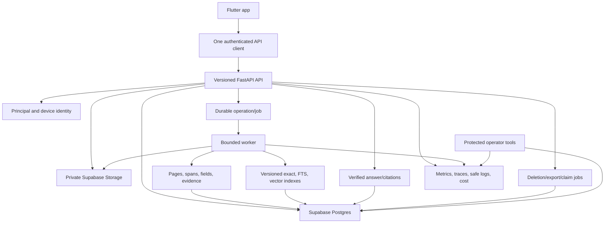

# CoverWise Full Repository Audit Coverage Index and Master Remediation Program

**Date:** 2026-07-18  
**Repository:** `pranaysuyash/insurance_q`  
**Branch:** `main`  
**Commit:** `e3440a5da174c0cbbe279878bdff21950d8cab63`  
**Audit mode:** repository-wide Tier 1 static inspection  
**Purpose:** map completed audits, cross-cutting blockers, remediation order, release gates, and remaining verification work

---

## Executive Decision

The major static audit areas of the current CoverWise repository are now covered:

1. architecture and end-to-end flow;
2. document intelligence, OCR, extraction, RAG, evidence, and evaluation;
3. security, privacy, identity, consent, and data lifecycle;
4. product experience, mobile UX, accessibility, and customer trust;
5. API, domain model, data consistency, and client integration;
6. operations, reliability, observability, performance, and cost;
7. testing, release engineering, developer experience, and documentation;
8. product strategy, monetization, permanent scope boundary, compliance readiness, and marketing.

**Repository-wide static verdict: NO-GO for public customer use.**

The app is not one bug-fix sprint from launch. It requires controlled convergence around identity, evidence, lifecycle, durable work, API contracts, quality gates, and a substantially narrower product surface.

This does not imply a rewrite. Preserve:

- Flutter and the current design system;
- FastAPI;
- one Cloud Run-oriented codebase;
- Supabase Auth, Postgres, pgvector, and private Storage;
- owner-scoped repository boundaries;
- source-hash idempotency;
- anonymous-first onboarding;
- typed structured outputs;
- visible processing states;
- evidence-adjacent Q&A and policy detail;
- permanent non-regulated positioning.

The correct next step is implementation against the sequence below, followed by runtime verification. More independent feature development would increase remediation cost.

---

# 1. Completed Audit Artifacts

| # | Audit | Primary coverage | Artifact |
|---|---|---|---|
| 1 | Architecture and Flow | topology, service composition, storage, processing, mobile/backend flow, target architecture | `coverwise_architecture_audit_2026-07-18.docx` |
| 2 | Document Intelligence and Trust | upload parsing, OCR, extraction, provenance, embeddings, retrieval, answers, citations, evaluation | `coverwise_document_intelligence_trust_audit_2026-07-18.md` |
| 3 | Security, Privacy, Identity, Lifecycle | principal model, consent, deletion, local data, analytics, abuse, secrets, mobile security | `coverwise_security_privacy_identity_data_lifecycle_audit_2026-07-18.md` |
| 4 | Product, Mobile UX, Accessibility | user flows, information architecture, unsafe features, offline, evidence UI, accessibility | `coverwise_product_mobile_experience_accessibility_audit_2026-07-18.md` |
| 5 | API and Domain Integrity | IDs, schemas, source DTOs, state, sync, transactions, endpoint semantics | `coverwise_api_domain_data_consistency_integration_audit_2026-07-18.md` |
| 6 | Operations and Reliability | jobs, leases, health, metrics, cost, scaling, deployment, DR, operator workflows | `coverwise_operations_reliability_observability_performance_cost_audit_2026-07-18.md` |
| 7 | Testing and Release Engineering | CI, Flutter, integration, evaluation, migrations, security gates, docs, release manifest | `coverwise_testing_release_engineering_devex_documentation_audit_2026-07-18.md` |
| 8 | Strategy, Monetization, Boundary | wedge, unsafe recommendations, billing, pricing, support, marketing, compliance readiness | `coverwise_product_strategy_monetization_scope_compliance_marketing_audit_2026-07-18.md` |

---

# 2. Coverage Matrix

| Surface | Architecture | Intelligence | Security | Product | API | Operations | Testing | Strategy |
|---|:---:|:---:|:---:|:---:|:---:|:---:|:---:|:---:|
| Flutter navigation/screens | ✓ | partial | ✓ | ✓ | ✓ | partial | ✓ | ✓ |
| Upload/local storage | ✓ | ✓ | ✓ | ✓ | ✓ | ✓ | ✓ | partial |
| Auth/account migration | ✓ | partial | ✓ | partial | ✓ | ✓ | ✓ | partial |
| Supabase schema/Storage | ✓ | ✓ | ✓ | partial | ✓ | ✓ | ✓ | partial |
| Processing jobs/leases | ✓ | ✓ | ✓ | ✓ | ✓ | ✓ | ✓ | partial |
| OCR/parser/extraction | ✓ | ✓ | partial | ✓ | ✓ | ✓ | ✓ | ✓ |
| RAG/embeddings/citations | ✓ | ✓ | partial | ✓ | ✓ | ✓ | ✓ | ✓ |
| Policy summary/detail | ✓ | ✓ | ✓ | ✓ | ✓ | ✓ | ✓ | ✓ |
| Q&A | ✓ | ✓ | ✓ | ✓ | ✓ | ✓ | ✓ | ✓ |
| Family/emergency/renewal | partial | ✓ | ✓ | ✓ | ✓ | ✓ | ✓ | ✓ |
| Claims/gaps/score/what-if | partial | ✓ | ✓ | ✓ | partial | partial | ✓ | ✓ |
| Analytics/anti-abuse | ✓ | partial | ✓ | partial | ✓ | ✓ | ✓ | ✓ |
| Deletion/retention/export | ✓ | ✓ | ✓ | ✓ | ✓ | ✓ | ✓ | ✓ |
| Billing/entitlements | partial | partial | ✓ | ✓ | ✓ | ✓ | ✓ | ✓ |
| Marketing/README claims | partial | ✓ | ✓ | ✓ | partial | partial | ✓ | ✓ |
| CI/CD/supply chain | partial | partial | ✓ | partial | ✓ | ✓ | ✓ | ✓ |
| Operator/runbook/DR | ✓ | partial | ✓ | partial | ✓ | ✓ | ✓ | partial |
| Accessibility/i18n | partial | partial | ✓ | ✓ | partial | partial | ✓ | ✓ |

“Partial” means the area is covered as it intersects that audit; the owning audit is marked ✓.

---

# 3. Consolidated Cross-Cutting P0 Themes

## 3.1 Truthful state

The system can present:

- completed document after failed stages;
- synced local record after only server acceptance;
- Active policy with missing/uncertain dates;
- successful deletion with retained source/auth data;
- successful purchase without payment;
- backed-up phone-linked workspace without an account mapping.

**Invariant:** customer state derives from durable verified state, never optimistic copy or local defaults.

## 3.2 Canonical principal and ownership

Local data is not principal-scoped. Anonymous claim does not transfer the full aggregate. Old anonymous access remains. Account switch and restore are incoherent.

**Invariant:** every local and remote artifact has one principal and moves/deletes as one aggregate.

## 3.3 Evidence substrate

Pages, source spans, fields, chunks, answers, and citations are not linked in a verifiable chain. Generated context can contaminate source evidence.

**Invariant:** every critical displayed claim resolves to immutable current source evidence and version.

## 3.4 Durable work

202 processing uses process-local background tasks, startup-only recovery, and non-heartbeating leases.

**Invariant:** long work is a durable operation with bounded retries, deadlines, cost, and repair.

## 3.5 Data lifecycle

Deletion, replacement, erasure, summaries, vectors, analytics, anti-abuse, temp files, and backups do not share one lifecycle graph.

**Invariant:** every persistent store registers enumerate, export, delete, and verify behaviour.

## 3.6 One API and one document identity

Local/remote IDs, duplicate query routes, flattened sources, broad maps, HTTP 200 errors, and duplicated database truth cause systemic inconsistency.

**Invariant:** one versioned API and server document ID from Postgres through Flutter.

## 3.7 Product boundary

Health score, coverage recommendations, premium simulations, generic claim deadlines, and renewal instructions violate permanent scope.

**Invariant:** explain owned documents; do not recommend, price, rank, predict, procure, renew, or represent.

## 3.8 Monetization integrity

Billing is a stub, entitlements are local, and prices/purchases look real.

**Invariant:** no purchase UI without verified store transaction and server entitlement.

## 3.9 Operational evidence

No metrics, traces, SLOs, alerts, cost enforcement, backup drill, rollback, or repair surface are demonstrated.

**Invariant:** production is observable, budgeted, recoverable, and repairable.

## 3.10 Release evidence

The commit has no attached status; CI is stale and omits Flutter; integration/performance/evaluation labels overstate what tests execute.

**Invariant:** release claims come from immutable run artifacts for the exact commit, schema, model, and binaries.

---

# 4. Master Target Architecture



Canonical entities:

```text
Principal
DeviceInstallation
Document
DocumentVersion
UploadOperation
ProcessingRun
PageArtifact
SourceSpan
ExtractionRun
ExtractedField
FieldEvidence
IndexVersion
ChunkSet
Answer
AnswerCitation
Feedback
ConsentEvent
Entitlement
PurchaseTransaction
DeletionJob
AuditEvent
ModelCall
EvaluationRun
```

---

# 5. Master Remediation Sequence

The order matters because later contracts depend on earlier ones.

## Phase 0: Freeze and remove unsafe claims

- hide/remove Health Score;
- remove coverage recommendations;
- remove What-If premium estimate;
- remove generic claim deadlines/requirements;
- hide purchase/upgrade/pack UI;
- remove token copy;
- remove phone-backup claims;
- relabel local deletion and pending sync truthfully;
- correct landing page, README, and store copy;
- freeze new feature work.

### Exit gate

No customer-facing statement claims a state, recommendation, payment, deletion, backup, evidence, or capability the system cannot prove.

---

## Phase 1: Canonical principal, document identity, and local storage

- principal-scoped encrypted local database/files;
- one server document ID;
- one authenticated API client;
- account-switch workspace isolation;
- full anonymous-to-account transactional migration;
- anonymous revocation;
- server library and clean-device restore;
- explicit offline operations.

### Exit gate

No cross-principal leakage; account restore and claim migration pass production-like integration.

---

## Phase 2: Evidence and document domain

- document versions;
- page artifacts/completeness;
- immutable source spans/tables;
- evidence-first fields;
- correction/conflict state;
- source/retrieval text separation;
- summaries in Postgres;
- versioned chunks/indexes;
- exact and FTS search in Postgres;
- verified citations.

### Exit gate

Every critical field and answer claim is traceable to current owned source evidence.

---

## Phase 3: Durable operations and lifecycle

- durable upload/processing jobs;
- heartbeat/reaper/retry/dead-letter;
- page/token/call/time/cost budgets;
- transactional artifact promotion;
- document deletion job;
- account erasure job;
- export/retention;
- store registry;
- operator retry/cancel/quarantine.

### Exit gate

Instance death does not lose work; every store is recoverable, exportable, and deletable with verification.

---

## Phase 4: API and client convergence

- `/v1` contract;
- one answer endpoint;
- typed `EvidenceSource`;
- semantic HTTP errors;
- server pagination/filtering;
- idempotency/resource versions;
- generated/validated Dart DTOs;
- remove compatibility endpoints and active legacy backends.

### Exit gate

Mobile/server contract and clean-device end-to-end tests pass without legacy shape branching.

---

## Phase 5: Quality and operational evidence

- repair CI;
- required Flutter/Python checks;
- Supabase migration/integration environment;
- real document-intelligence evaluations;
- security/supply-chain scans;
- metrics, traces, cost, SLOs, alerts;
- load/chaos tests;
- immutable artifacts/release manifest;
- staging canary/rollback;
- backup restore/deletion drill.

### Exit gate

High-risk paths reach Tier 3 to Tier 5 evidence at the exact release artifact.

---

## Phase 6: Narrow product launch

Launch only:

- policy library;
- evidence-linked summary;
- verified Q&A;
- verified renewal reminder;
- verified insurer contacts;
- verified offline emergency snapshot;
- account/data controls.

Run user research and measure retention, trust, correction, support, and unit economics.

### Exit gate

The core job is trusted, repeated, supportable, and economically sustainable.

---

## Phase 7: Real monetization and deliberate expansion

- select billing/store products;
- server receipt verification and entitlement ledger;
- refund/restore/grace/cancellation/support;
- pricing tests;
- one capacity-based paid offer;
- expansion only after evidence.

Do not restore removed recommendation, scoring, premium, or generic claim-procedure features without a separate product-boundary review.

---

# 6. Suggested Workstream Ownership

| Workstream | Primary responsibility |
|---|---|
| Product boundary | allowed claims/features and unsafe-surface removal |
| Domain/API | principal, documents, versions, operations, DTOs |
| Intelligence | pages, evidence, extraction, retrieval, citations, eval |
| Security/privacy | identity, consent, lifecycle, telemetry, mobile protection |
| Reliability | jobs, budgets, metrics, alerts, operator tools, DR |
| Mobile | principal cache, core flows, evidence UI, accessibility |
| Quality/release | CI, migrations, integration, builds, scans, manifest |
| Customer/revenue | research, support, pricing, billing, launch claims |

Even for a solo founder, changes should name the responsible workstream and acceptance owner.

---

# 7. Repository-Wide Release Gates

## Product

- unsafe recommendation/score/price/deadline features removed;
- launch surface limited to approved evidence-backed jobs;
- marketing claim registry passes.

## Data and identity

- one principal/document identity;
- local storage encrypted/principal-scoped;
- claim/switch/restore verified;
- consent server-authoritative.

## Intelligence

- page completeness known;
- critical fields evidenced;
- exact lookup works;
- citations verified;
- confidence calibrated or omitted;
- evaluations meet thresholds.

## Lifecycle

- replacement, deletion, erasure, export, retention, and backup verified;
- no orphan source/derived data;
- user confirmation follows verified completion.

## Operations

- durable jobs/recovery;
- bounded retries/cost;
- metrics/SLOs/alerts/operator repair;
- load, chaos, restore, rollback evidence.

## Quality

- exact commit has required checks;
- Python/Flutter pass;
- schema/contract integration passes;
- security scans pass;
- immutable artifacts/release manifest exist;
- staging uses the same artifacts.

## Revenue

- no stub billing;
- server verified entitlements;
- refund/restore/support paths;
- measured unit economics;
- approved consumer/store disclosures.

---

# 8. What Static Audit Has Not Proven

This program is comprehensive for repository-visible architecture and behaviour. It cannot prove:

- actual deployed Supabase policies/configuration;
- Cloud Run IAM, networking, secrets, or revision behaviour;
- current model-provider behaviour;
- test pass/fail without execution;
- performance/cost/reliability under load;
- real Android/iOS behaviour;
- backup/file protection;
- penetration testing;
- TalkBack/VoiceOver results;
- user comprehension, trust, retention, or willingness to pay;
- legal/regulatory compliance;
- app-store approval;
- production incident response.

These are not missing static audit areas. They are the next evidence tiers.

---

# 9. Definition of Static Audit Coverage Complete

For the current commit, static audit coverage is complete when:

- every major runtime, data, intelligence, customer, security, operational, quality, and business surface has an owning audit;
- cross-cutting defects are consolidated;
- target architecture/remediation order are defined;
- runtime/legal/user claims are separated;
- no new static area is likely to change the master decision materially.

That condition is now met.

The appropriate next activity is remediation and verification, not another independent high-level audit of the unchanged commit. Material code/schema/product changes should trigger targeted re-audit and an updated master index.

---

# 10. Immediate Next Ten Actions

1. Disable unsafe product and stub-purchase surfaces through a production feature registry.
2. Repair CI and make Flutter/Python checks visible on `main`.
3. Define canonical Principal, Document, DocumentVersion, Operation, Evidence, and DeletionJob schemas.
4. Build one authenticated mobile API client and preserve source DTOs.
5. Partition/encrypt local data by principal and implement clean-device restore.
6. Replace FastAPI BackgroundTasks with durable jobs and heartbeat recovery.
7. Add page/source evidence and move summaries to Supabase.
8. Implement Postgres exact/FTS retrieval and one fixed embedding-index contract.
9. Implement truthful deletion jobs and full ownership claim.
10. Build the first real evaluation and production-like integration gate before restoring launch claims.

---

# 11. Bottom Line

CoverWise does not need more ideation at this commit. It needs convergence.

The repository currently contains several conflicting products: a polished insurance platform, a document-RAG experiment, a local-first mobile app, a Supabase account product, a privacy-first tool, and a simulated subscription business.

The master goal is one narrow, evidence-backed, recoverable policy-understanding product whose promises, code, data, tests, operations, and business model all agree.
