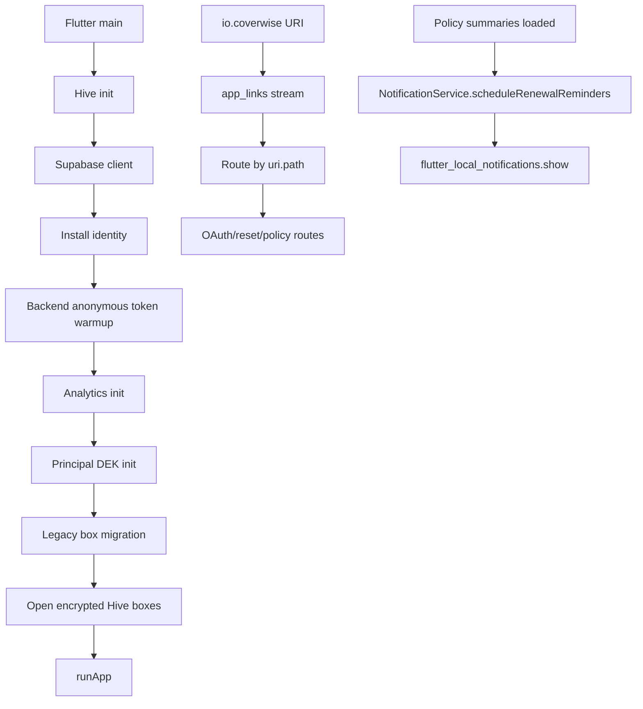

# CoverWise Native Mobile Platform, App-Store Readiness, Permissions, Deep Links, Notifications, Device Lifecycle, and Release Audit

**Date:** 2026-07-21  
**Repository:** `pranaysuyash/insurance_q`  
**Branch:** `main`  
**Commit audited:** `14c81da4a96661806b8eabae98bec4a8ea6162b4`  
**Previous audited commit:** `9e42b54a159025fd1d5268495df2be9acbda90c7`  
**Evidence tier:** Tier 1 static inspection  
**Runtime evidence:** no GitHub workflow run or combined status attached to the audited commit  
**Risk class:** high  
**Doctrine:** `motto_v4.md`  
**Scope:** Flutter bootstrap, Android and iOS native projects, signing, permissions, notification scheduling, custom links, OAuth/password-reset callbacks, file and local-data lifecycle, device backup, install attribution, application lifecycle, release scripts, privacy manifests, and store-submission readiness.

---

# Executive Verdict

The native mobile project is **not currently build-ready or store-ready**.

The most urgent problem is not an App Store form or a missing screenshot. The latest launch-blocker commit introduced static compile and startup-order defects in `mobile/lib/main.dart` and the new principal-encryption bootstrap.

Current `main` appears to contain all of the following:

- `SharedPreferences` is used without importing `shared_preferences`.
- `main.dart` accesses `PrincipalKeyService._oldDeviceKeyStorageKey`, a private symbol from another Dart library.
- `PrincipalKeyService` uses `Uint8List` without importing `dart:typed_data`.
- analytics initializes before the Hive box it immediately reads has been opened;
- different `PrincipalKeyService()` instances are used for initialization, migration, and key retrieval even though the key cache is instance state;
- the local-only principal ID changes on every launch;
- the upgrade migration assumes an old encrypted key, while the prior active app opened boxes unencrypted;
- migration calls pass an empty box path and cannot replace the legacy file;
- the app creates a Supabase anonymous principal while separately warming a different backend anonymous-bearer identity.

Even after those blockers are corrected, the platform integration has major security and product-truth defects:

- OAuth and password-reset redirects use `io.coverwise://login-callback`, where `login-callback` is the URI host, while the router switches on `/login-callback` as a path. The callback handlers do not match the URLs generated by `AuthService`.
- the custom deep-link scheme accepts untrusted citation JSON and presents it as evidence taken from the user’s policy;
- renewal “scheduling” calls `show()`, which displays immediately instead of scheduling for the future;
- the notification plugin is not initialized from startup and notification permission is not requested;
- notification settings promise quiet-hour deferral that is not implemented;
- Android release builds silently fall back to the debug keystore;
- Android targets API 35, which becomes insufficient for new apps and updates on Google Play on August 31, 2026;
- the Android install-referrer receiver is exported and trusts a spoofable legacy broadcast;
- iOS has no Associated Domains entitlement or Universal Links configuration;
- no iOS store-archive build path exists;
- development-only local-network and Dart Observatory declarations are present in the shared iOS release plist;
- local data clearing deletes the application documents directory while encrypted Hive boxes remain open;
- the Settings screen again claims a locally stored phone number links an account and enables backup, contradicting the truthful phone-capture screen.

## Release Decision

**NO-GO for Android internal testing, Play Store submission, TestFlight, or App Store submission from the current commit.**

The correct next action is to restore a deterministic mobile bootstrap and produce one signed, runtime-tested release artifact per platform before further native features are added.

---

# 1. What Was Inspected

## Flutter bootstrap and lifecycle

- `mobile/lib/main.dart`
- `mobile/lib/config/app_config.dart`
- `mobile/lib/services/auth_service.dart`
- `mobile/lib/services/principal_key_service.dart`
- `mobile/lib/services/analytics_service.dart`
- `mobile/lib/services/local_storage_service.dart`
- `mobile/lib/services/notification_service.dart`
- `mobile/lib/services/install_service.dart`

## Android

- `mobile/android/app/src/main/AndroidManifest.xml`
- `mobile/android/app/src/debug/AndroidManifest.xml`
- `mobile/android/app/build.gradle.kts`
- `mobile/android/app/src/main/kotlin/com/coverwise/app/MainActivity.kt`
- `mobile/android/app/src/main/kotlin/com/coverwise/app/InstallReferrerReceiver.kt`

## iOS

- `mobile/ios/Runner/Info.plist`
- `mobile/ios/Runner/AppDelegate.swift`
- `mobile/ios/Runner.xcodeproj/project.pbxproj`
- `mobile/ios/Podfile`
- `mobile/ios/Podfile.lock`
- search for `Runner.entitlements`
- search for `PrivacyInfo.xcprivacy`

## Feature surfaces

- notification preferences;
- renewal reminders;
- OAuth and reset links;
- coverage deep links;
- document storage;
- local clear-data;
- phone capture;
- settings;
- account deletion;
- billing initialization.

## Release tooling

- `tools/build_mobile_release.sh`
- GitHub workflow status for current commit
- repository search for iOS archive/IPA automation
- repository search for store privacy and content declarations

---

# 2. What Is Genuinely Good

## 2.1 Stable random per-principal DEK is the right encryption direction

`PrincipalKeyService` no longer derives persistent encryption from a rotating JWT. Its intended design now uses:

- a random 256-bit data-encryption key;
- secure storage;
- principal namespacing;
- per-box migration markers.

That is a major architectural improvement over the former JWT-derived key.

The current app bootstrap misuses the service, but the underlying direction should be retained.

## 2.2 Android backup is explicitly disabled

The main Android manifest sets:

```xml
android:allowBackup="false"
```

This is appropriate for locally stored policy files and sensitive extracted data unless a separately designed backup/restore contract exists.

## 2.3 Android’s notification runtime permission is declared

`POST_NOTIFICATIONS` is present in the Android manifest.

The remaining problem is that the app never invokes the permission request at the appropriate user-driven moment.

## 2.4 iOS camera and photo-library usage descriptions exist

The iOS project includes human-readable descriptions for camera and photo-library access.

These declarations should be removed if those capabilities remain unused, but the descriptions themselves are reasonably scoped.

## 2.5 Release configuration is injected rather than hard-coded

The release script requires:

- API URL;
- policy URL;
- terms URL;
- support email;
- privacy version;
- Supabase URL and publishable key;
- RevenueCat key.

It also validates HTTPS URLs and runs Flutter analysis and tests before building the Android bundle.

This is a useful foundation.

## 2.6 The custom scheme is consistent across Android and iOS declarations

Both native projects register:

```text
io.coverwise
```

The remaining problems are URI parsing, secure association, parameter validation, and callback matching.

## 2.7 Phone-capture copy was corrected in its own surface

`PhoneCaptureSheet` clearly says that the phone number:

- stays on the device;
- does not identify an account;
- does not enable backup;
- does not enable cross-device recovery.

That truthful contract should become the only phone-number wording in the app.

---

# 3. Current Native Architecture



The intended sequence is reasonable conceptually, but the actual ordering and state ownership are incorrect.

---

# 4. P0 Findings

## P0-01: Current mobile bootstrap contains static compile blockers

### Missing import

`main.dart` calls:

```dart
SharedPreferences.getInstance()
```

but the current import list does not import:

```dart
package:shared_preferences/shared_preferences.dart
```

Dart imports are not transitive.

### Private symbol access

`main.dart` calls:

```dart
PrincipalKeyService._oldDeviceKeyStorageKey
```

The underscore makes that member private to `principal_key_service.dart`’s library.

### Missing typed-data import

`PrincipalKeyService` uses `Uint8List` throughout but does not import:

```dart
dart:typed_data
```

### Required move

Make the mobile release build a required check and correct all three before any other mobile work.

## P0-02: Analytics initializes before its Hive dependency exists

`main.dart` calls:

```dart
AnalyticsService.init();
```

before `_openEncryptedHiveBoxes()`.

`AnalyticsService.init()` immediately calls `_loadBuffer()` and checks the consent ledger through:

```dart
Hive.box(AppStateStore.boxName)
```

The box has not been opened.

### Impact

Even after compile fixes, startup can throw before `runApp()`.

### Required move

Use one bootstrap composition:

```text
Hive init
  -> principal resolution
  -> key resolution/migration
  -> open boxes
  -> consent cache
  -> analytics
  -> notifications
  -> billing
  -> runApp
```

## P0-03: Principal-key initialization uses unrelated service instances

The key service stores `_cachedKey` and `_principalId` as instance fields.

`main.dart` creates new instances separately for:

- `initForPrincipal`;
- every `migrateBox` call;
- `getOrThrow`.

The initialized instance is discarded.

### Impact

Migration instances have no principal ID, and the box-opening instance has no cached key.

### Required move

Create exactly one application-scoped `PrincipalKeyService` and inject it into bootstrap, auth transitions, and clear-data flows.

## P0-04: Local-only data becomes unreadable on the next launch

When Supabase configuration is absent, the app uses:

```text
local-only-{current milliseconds}
```

as the principal ID.

A new ID produces a new DEK on every launch.

### Impact

The previous encrypted boxes cannot be reopened after restart.

### Required move

Generate and persist one stable installation principal in secure storage. Never derive persistent data identity from current time.

## P0-05: Existing installs can be locked out by the migration

The previous active mobile path opened Hive boxes without principal encryption.

The migration looks only for an old key named:

```text
coverwise_legacy_device_hive_key_v1
```

If that key is absent, it assumes a fresh install, marks migration complete, and does not transform an existing unencrypted box.

It then attempts to open the old box with the new cipher.

### Impact

An existing user can lose access to all local documents and state immediately after upgrading.

### Required move

Design a real migration matrix:

```text
no box
unencrypted legacy box
old device-key box
new principal-key box
partially migrated box
corrupt box
```

Copy to a new file, verify, atomically swap, and retain rollback material until every box succeeds.

## P0-06: The migration cannot replace the source files it claims to migrate

Every call passes:

```dart
boxPath: ''
```

The migration deletes the source file only when `boxPath.isNotEmpty`.

It therefore reopens the existing file with a different encryption cipher instead of creating a verified replacement.

### Required move

The migration service must discover Hive’s actual file path itself. Callers should not pass an empty placeholder.

## P0-07: Migration failure handling is internally contradictory

`_migrateLegacyHiveBoxes()` catches errors and says the app may continue with potentially unencrypted boxes.

Immediately afterward, `_openEncryptedHiveBoxes()` opens all boxes with the new key and rethrows on failure.

### Impact

There is neither a safe fallback nor a clean fail-closed recovery screen.

### Required move

Use an explicit bootstrap state:

- migrated;
- no migration required;
- recoverable migration failure;
- unrecoverable local-data failure.

Do not silently continue.

## P0-08: The app creates two unrelated anonymous identities

When Supabase is configured and no account exists, startup calls:

```dart
Supabase.instance.client.auth.signInAnonymously()
```

It also asynchronously warms the backend’s separate `/user/anonymous` bearer.

### Impact

CoverWise now has:

- a Supabase anonymous principal used for the local encryption namespace;
- a backend anonymous principal used for document ownership.

These are not guaranteed to be the same identity.

Account claim, deletion, restore, and local isolation cannot be reasoned about coherently.

### Required move

Choose one canonical principal and one token issuance path.

## P0-09: OAuth and password-reset callbacks do not match the router

`AuthService` generates:

```text
io.coverwise://login-callback
io.coverwise://reset-callback
```

For these URIs:

```text
host = login-callback / reset-callback
path = empty
```

The router switches only on:

```text
/login-callback
/reset-callback
```

from `uri.path`.

### Impact

Google OAuth and password-reset flows do not enter their intended handlers.

### Required move

Move to verified HTTPS links and parse both host and path through a typed route table. Add cold-start, warm-start, cancelled, expired, and malicious-link tests.

## P0-10: An external deep link can inject fake policy evidence

The `io.coverwise` scheme is available to any application.

The `/coverage-gaps` handler accepts a URL-encoded JSON array of citation maps and converts them directly to `FieldCitation`.

`CoverageGapScreen` then tells the user:

> Each item below is taken from a specific page of your policy document.

It does not refetch evidence from the authenticated backend.

### Impact

A malicious link can display a fake insurer, room-rent cap, confidence, page number, or citation and have CoverWise label it as policy evidence.

### Required move

Deep links may carry only opaque resource IDs.

After authentication, the app must fetch the owned document and citations from the server.

Never transport evidence values through an external URI.

## P0-11: Sensitive callbacks use an unverified custom scheme

Both Android and iOS register only `io.coverwise`.

Custom schemes are not uniquely owned. Another app can register the same scheme, and Android/iOS may route the callback incorrectly.

Official Apple documentation recommends Universal Links and warns that custom schemes are an attack vector. Android recommends verified App Links with `android:autoVerify`.

### Required move

Use:

```text
https://coverwise-domain/auth/callback
https://coverwise-domain/reset/callback
```

with:

- Android `assetlinks.json`;
- iOS `apple-app-site-association`;
- Associated Domains entitlement;
- strict host/path allowlists;
- PKCE/state verification.

Retain the custom scheme only as a narrowly scoped fallback if required.

## P0-12: Renewal reminders are shown immediately instead of scheduled

The notification service computes a future `scheduledDate`, then calls:

```dart
_plugin.show(...)
```

`show()` displays now. It does not schedule.

### Impact

When summaries load, the app may show several immediate notifications claiming that policies expire in 30, 14, and 7 days.

### Required move

Initialize timezone data and call `zonedSchedule()` with a deterministic local delivery time.

## P0-13: Notification infrastructure is never initialized

`NotificationService.init()` exists, but the active bootstrap does not call it.

The main navigation calls the schedule method directly.

### Impact

Platform notification calls can fail or behave as no-ops, while the app tells users reminders are enabled.

## P0-14: Notification permission is never requested correctly

The Android manifest declares `POST_NOTIFICATIONS`, but the only request function is not called.

The request helper also addresses Android only, not iOS.

Android 13 and later disable notifications by default until the user grants permission.

### Required move

Ask permission only after the user explicitly enables renewal reminders. Handle:

- granted;
- denied;
- permanently denied;
- notifications disabled in system settings;
- iOS provisional/full permission where appropriate.

## P0-15: The notification settings promise behaviour that does not exist

The screen says:

> Reminders will be delivered when quiet hours end.

The service only checks whether the app is currently in quiet hours. It skips the reminder entirely rather than moving its scheduled delivery.

### Required move

Calculate each actual delivery time. If it falls inside quiet hours, shift it to the quiet-hours end.

## P0-16: Notification copy violates the permanent product boundary

The body says:

> Renew now to avoid a coverage gap.

This is a renewal instruction and an inferred coverage consequence, not a neutral date reminder.

### Required copy

```text
Your policy is listed as expiring on {date}. Check the policy or contact the insurer to confirm the date and any renewal requirements.
```

## P0-17: Correct Android scheduling configuration is absent

For `flutter_local_notifications` 20.x, scheduled notifications require additional Android manifest configuration, including scheduled-notification receivers and reboot handling.

The manifest has none of those declarations.

### Impact

Even after replacing `show()` with `zonedSchedule()`, reminders will not have a correct reboot/reschedule path.

### Required move

Use the plugin’s documented receivers and choose the least-privileged scheduling mode. Renewal reminders generally do not require exact-alarm permission.

## P0-18: Android release builds silently fall back to the debug key

`build.gradle.kts` sets release signing to the debug signing configuration when `key.properties` is missing.

Android’s official documentation says the debug key is insecure by design and stores do not accept debug-signed releases.

### Impact

A script named “release” can produce an artifact with the wrong identity.

### Required move

Release builds must fail when upload-key configuration is missing. Configure Play App Signing and protect the upload key.

## P0-19: Android target API will miss the imminent Play deadline

Current configuration:

```text
targetSdk = 35
```

Google’s published requirement says that starting August 31, 2026, new apps and updates must target Android 16/API 36 or higher.

### Required move

Move to target 36 before the first store submission and execute the Android 16 behaviour-change test matrix.

## P0-20: There is no iOS release/archive pipeline

The repository has no verified `flutter build ipa`, Xcode archive, export-options, signing-team, provisioning, TestFlight upload, or App Store artifact flow.

The current release script builds only Android.

### Required move

Create a separate iOS release gate that:

- runs Flutter tests;
- installs pods;
- archives Release;
- validates signing and entitlements;
- exports IPA;
- inspects privacy report;
- records checksum and build metadata.

## P0-21: Clear-local-data can corrupt live application state

The settings flow:

1. clears two open Hive boxes;
2. deletes the entire application documents directory recursively;
3. recreates it;
4. leaves the boxes open.

Hive files and other app-managed files may be inside that directory.

### Impact

The live process can retain file handles to deleted databases, fail future writes, or create partial state.

### Required move

Perform a controlled data-reset operation:

- stop analytics timers;
- cancel notifications;
- close all boxes;
- delete only registered local stores;
- clear the active DEK according to account policy;
- reopen a fresh workspace;
- reinitialize providers.

## P0-22: Phone/account backup claims have regressed

`PhoneCaptureSheet` says the phone is local-only and does not enable backup or account recovery.

The Settings screen says:

- “Account linked”;
- “Connected as {phone}”;
- “Back up policies and use them on another device.”

Both cannot be true.

### Required move

Remove the “link phone” settings surface or reuse the truthful local-only copy exactly.

---

# 5. P1 Findings

## P1-01: The Android install-referrer receiver uses a spoofable legacy broadcast

The receiver is exported and listens for:

```text
com.android.vending.INSTALL_REFERRER
```

without a sender permission.

Any application can attempt to broadcast matching attribution data.

Google’s current guidance is to use the Play Install Referrer Client Library/API.

This is an analytics-integrity issue, not an authorization mechanism, but it can corrupt campaign reporting.

## P1-02: Install attribution is stored in ordinary SharedPreferences

Campaign values are not security-sensitive, but they should be length-limited, normalized, and source-labelled.

The receiver limits neither value length nor allowed characters.

## P1-03: The receiver comments incorrectly describe ATT as the iOS equivalent

App Tracking Transparency is a permission framework, not the direct functional equivalent of Play Install Referrer.

This should be corrected to avoid future architecture mistakes.

## P1-04: Deep-link routing lacks a typed allowlist

The switch uses path strings and route-specific ad hoc parsing.

A single typed parser should validate:

- allowed scheme;
- allowed host;
- allowed path;
- authentication requirement;
- argument types;
- maximum lengths;
- resource ownership;
- replay/expiry when applicable.

## P1-05: Initial links can be lost before navigation exists

`AppLinks` is instantiated in widget state and the stream listener returns immediately when `_navigatorKey.currentState` is null.

There is no deferred queue or explicit initial-link replay.

The `app_links` package recommends instantiating early and exposes `getInitialLink()`.

## P1-06: ResetPasswordScreen ignores the supplied redirect URL

The screen accepts `redirectUrl` but never validates or processes it.

It assumes Supabase has already established a recovery session.

A typed recovery-state gate is required before allowing password mutation.

## P1-07: The custom URL scheme has no host/path restriction in Android manifest

The intent filter declares only:

```xml
<data android:scheme="io.coverwise"/>
```

Every URI using that scheme enters the app.

Narrow the filter if the fallback scheme remains.

## P1-08: Android verified App Links are absent

There is no HTTPS intent filter with `android:autoVerify` and no repository-owned `assetlinks.json`.

## P1-09: iOS Universal Links and Associated Domains are absent

No `Runner.entitlements` file was found, the Xcode project has no `CODE_SIGN_ENTITLEMENTS`, and no `apple-app-site-association` resource was found.

## P1-10: Development-only local-network declarations ship in the shared iOS plist

The production plist includes:

- `NSLocalNetworkUsageDescription` for development/debugging;
- `_dartobservatory._tcp` Bonjour service.

These should be limited to Debug/Profile configuration unless the release app has a genuine local-network feature.

## P1-11: No app-owned privacy-manifest verification exists

No `PrivacyInfo.xcprivacy` was found in the app target.

Some dependencies may package their own manifests, but CoverWise has no checked aggregate privacy report or release gate.

Apple requires valid privacy manifests for applicable SDKs and required-reason APIs.

## P1-12: App Store privacy labels are not maintained as a release artifact

The app integrates Supabase, RevenueCat, connectivity, secure storage, analytics, document uploads, and optional camera/photo capabilities.

The repository has no current App Store privacy-label matrix mapping each data type to collection, linkage, use, and retention.

## P1-13: Play Data Safety and app-content declarations are not maintained

No current release artifact covers:

- Data Safety;
- financial-services declaration;
- health-app declaration;
- account deletion URL;
- content rating;
- ads declaration;
- data deletion;
- app access/review credentials.

## P1-14: iOS signing ownership is not represented in the project

No `DEVELOPMENT_TEAM` or signing-entitlement configuration was found in the inspected project file.

It may be supplied locally, but there is no reproducible release contract.

## P1-15: Android release optimization is disabled

Release has:

```text
isMinifyEnabled = false
isShrinkResources = false
```

This is not inherently unsafe, but it increases artifact size and leaves no release shrinker verification.

Enable only after plugin keep rules and release tests are established.

## P1-16: Android notification icon uses the launcher icon

Android small notification icons should be dedicated monochrome status-bar resources.

The adaptive launcher icon can render poorly or become a blank shape.

## P1-17: Notification identifiers use runtime `hashCode`

```text
documentId.hashCode + days
```

is not a durable cross-version identity.

Use a stable hash or a persisted reminder ID.

## P1-18: Old reminders are not reconciled

When reminder days, policy state, expiry date, or disabled policies change, the app schedules/shows again without first comparing and cancelling stale requests.

## P1-19: Notification scheduling repeats on every process launch

`_notificationsScheduled` is only an in-memory boolean.

Every cold start attempts to create/show reminders again.

## P1-20: Notifications have no tap payload or route

The app cannot open the relevant policy from a reminder or explain which source date generated it.

## P1-21: The app does not initialize the timezone database

The dependencies include `timezone` and `flutter_timezone`, but the notification service does not configure the device timezone for future scheduling.

## P1-22: Notifications default to enabled before platform permission

The local preference defaults to `true` even when the OS permission has never been requested or was denied.

Expose separate state:

- user preference;
- platform permission;
- scheduled reminder count;
- last reconciliation.

## P1-23: iOS pending-notification limits are not considered

iOS retains only a limited number of pending local notifications.

Scheduling many policies multiplied by several reminder days requires a prioritization and reconciliation policy.

## P1-24: Camera and image-picker dependencies appear unused

The repository includes `camera` and `image_picker`, but no current imports were found.

iOS still declares camera/photo usage descriptions.

Unused sensitive-capability dependencies and permissions should be removed until the capture flow is real.

## P1-25: Android has no camera permission for a future camera flow

If document capture is reintroduced through the `camera` plugin, the current main manifest does not declare `CAMERA`.

Add it only when the feature exists and has a denial fallback.

## P1-26: Local policy PDFs are stored as plaintext files

Hive metadata may be encrypted, but `LocalStorageService.saveDocument()` copies the original PDF/image into the app documents directory without encrypting the file contents.

A stolen or extracted app container can reveal policy contents independently of Hive.

Use file-level encryption or store only a protected cached representation.

## P1-27: iOS device backups are not addressed

Android backup is disabled. iOS local files in the application container may participate in device/iCloud backups according to platform behaviour.

This conflicts with categorical copy saying there is no automatic backup.

Choose and document one policy:

- allow OS-level encrypted device backup and describe it accurately;
- or store derived/cache data in an excluded location where appropriate.

## P1-28: No foreground/app-switcher privacy protection exists

Policy documents and health-related insurance details can remain visible in the app-switcher snapshot.

Consider a privacy cover on background and optional local authentication for sensitive views.

## P1-29: No app lifecycle reconciliation exists

No `WidgetsBindingObserver` was found for:

- auth refresh;
- RevenueCat refresh;
- notification reconciliation;
- privacy overlay;
- local key lock;
- pending upload recovery.

## P1-30: Account sign-out does not switch the encrypted workspace

The new principal-key service says `clearKey()` must be called on logout, but `AuthService.signOut()` only signs out Supabase.

Boxes remain open under the previous principal.

## P1-31: Clear-local-data does not clear all secure state

It clears the anonymous token but not:

- principal DEKs;
- Supabase account session;
- RevenueCat identity/cache;
- other secure-storage keys;
- every opened Hive box.

## P1-32: Multiple box names do not match actual service storage

Bootstrap opens separate boxes such as:

- `analytics_events`;
- `entitlements`.

Current analytics and entitlement services actually store keys inside `AppStateStore.boxName`.

This creates false confidence that those concerns have separate encrypted stores.

## P1-33: Several boxes are opened with restrictive `String` typing

The bootstrap opens boxes such as consent, analytics, and resolved gaps as `Box<String>`, while their services may persist maps, booleans, lists, or structured values.

This can produce runtime type failures.

## P1-34: Local encryption has no key-loss recovery contract

If secure-storage data is lost or becomes corrupt, the service silently generates a new DEK.

The old data becomes unreadable with no user-facing recovery or controlled wipe.

## P1-35: Key generation helper ignores its length parameter

`_generateRandomBytes(int length)` always returns `Hive.generateSecureKey()` and does not enforce `length`.

The current call happens to request 32 bytes, but the function contract is misleading and unsafe for future format changes.

## P1-36: Migration casts every Hive key to String

`key as String` can fail for boxes containing integer or other supported Hive keys.

## P1-37: Migration has no copy-verify-swap journal

A crash between read, file replacement, rewrite, and migration marker can strand data.

Use a versioned migration journal and checksums.

## P1-38: The release script produces no release manifest

It does not write:

- commit SHA;
- Flutter/Dart/Gradle/Xcode versions;
- bundle ID/application ID;
- build number;
- signing certificate fingerprint;
- dart defines;
- dependency lock hashes;
- artifact checksum.

## P1-39: The release script does not validate the built AAB

Add:

- bundletool validation;
- signing-certificate inspection;
- manifest permission inspection;
- release-size report;
- dependency/security scan.

## P1-40: No current mobile CI evidence exists

The audited commit has no associated workflow run.

Commit messages claiming Tier 3 are not a substitute for attached build/test evidence.

## P1-41: Android 16 behaviour changes are untested

Moving target API from 35 to 36 requires focused testing across:

- edge-to-edge/layout;
- background restrictions;
- alarms/notifications;
- file/media behaviour;
- third-party SDK compatibility.

## P1-42: Tablet and landscape support are declared without release evidence

The iOS target supports iPad and landscape orientations.

The repository has no current tablet/landscape store-review matrix proving all major workflows render correctly.

## P1-43: Store screenshots and review notes can expose unsupported features

The current app still routes to surfaces such as What-If, coverage gaps, family, and paid features.

Store metadata and review notes must reflect only active, verified capabilities.

---

# 6. Target Native Architecture

## 6.1 Deterministic bootstrap state machine

```text
platform bindings
  -> release configuration validation
  -> auth client initialization
  -> canonical principal resolution
  -> one PrincipalKeyService instance
  -> local-store migration/recovery
  -> open principal-scoped stores
  -> initialize consent
  -> initialize analytics
  -> initialize notification plugin
  -> initialize billing cache
  -> runApp
```

Every stage returns a typed status and a customer-safe recovery action.

## 6.2 Principal-scoped local workspace

```text
installation identity
principal identity
principal DEK
principal-specific directory
principal-specific Hive boxes
principal-specific local document files
```

On account switch:

1. stop services;
2. close boxes;
3. clear in-memory key;
4. resolve new principal;
5. open new workspace;
6. refresh server state.

## 6.3 Secure link boundary

```text
verified HTTPS URL
  -> platform domain association
  -> typed link parser
  -> auth/state validation
  -> resource ID
  -> server owner check
  -> server fetch
  -> navigation
```

No externally supplied policy value is rendered as verified evidence.

## 6.4 Notification reconciliation

```text
user enables reminders
  -> request platform permission
  -> verify policy expiry evidence
  -> calculate quiet-hour-adjusted times
  -> reconcile desired vs pending schedule
  -> use stable reminder IDs
  -> persist schedule manifest
  -> handle tap to policy
```

Use inexact scheduling unless exact delivery is truly necessary.

## 6.5 Reproducible release pipeline

### Android

```text
flutter analyze/test
  -> target API validation
  -> required release key
  -> build AAB
  -> bundletool validation
  -> signing inspection
  -> permission manifest report
  -> checksum/release manifest
  -> internal track
  -> device matrix
```

### iOS

```text
flutter analyze/test
  -> pod install
  -> privacy manifest report
  -> signing/entitlement validation
  -> archive
  -> IPA export
  -> App Store validation
  -> checksum/release manifest
  -> TestFlight
  -> device matrix
```

---

# 7. Ordered Remediation

## Commit group A: Restore buildable startup

1. Fix missing imports and private API access.
2. Make `PrincipalKeyService` application-scoped.
3. Open local storage before analytics.
4. Remove parallel anonymous identity creation.
5. Add typed bootstrap states.
6. Add upgrade migration fixtures.
7. Run Flutter analysis, tests, Android build, and iOS simulator build.

**Gate:** clean install and upgrade install both reach the first screen without data loss.

## Commit group B: Rebuild local workspace lifecycle

1. Define one canonical principal.
2. Use stable installation identity for local-only mode.
3. Namespace directories and boxes.
4. Encrypt document files, not only Hive metadata.
5. Implement close/switch/reopen on auth transitions.
6. Implement controlled local reset.
7. Add key-loss recovery UX.

**Gate:** account A and B never share local data or entitlements.

## Commit group C: Replace the external-link boundary

1. Add verified Android App Links.
2. Add iOS Associated Domains and Universal Links.
3. Host association files.
4. Fix OAuth/reset callback parsing.
5. Create typed allowlisted route parser.
6. Remove citation JSON from links.
7. Add malicious-link tests.

**Gate:** an external application cannot inject policy evidence or hijack an auth callback.

## Commit group D: Build real reminders

1. Initialize notifications.
2. Request permissions from the preferences screen.
3. Use timezone-aware scheduling.
4. Add Android scheduling receivers.
5. Implement quiet-hour shift.
6. Use stable IDs and a schedule manifest.
7. Cancel stale reminders.
8. Add tap payload.
9. Replace renewal advice copy.
10. Test reboot, timezone, denial, and expiry correction.

**Gate:** one future reminder appears at the expected time and opens the correct policy.

## Commit group E: Store-ready native projects

1. Require Android upload-key configuration.
2. Enable Play App Signing.
3. Target API 36.
4. Add Android release validation.
5. Add iOS team/signing/entitlements.
6. Add Universal Links.
7. Remove release local-network development declarations.
8. Produce and inspect privacy manifests.
9. Create iOS archive/IPA script.
10. Maintain Play Data Safety and App Store privacy artifacts.

**Gate:** AAB reaches Play internal testing and IPA reaches TestFlight with review metadata consistent with the build.

---

# 8. Required Verification

## 8.1 Bootstrap and migration

- fresh Android install;
- fresh iOS install;
- upgrade from unencrypted build;
- upgrade from legacy-key build;
- partially migrated box;
- corrupt migration marker;
- missing secure-storage key;
- offline startup;
- Supabase anonymous auth disabled;
- account switch;
- sign-out and sign-in.

## 8.2 Links

- cold-start OAuth;
- warm OAuth;
- password reset;
- expired reset;
- malformed link;
- wrong host;
- wrong scheme;
- other user’s document ID;
- injected citation JSON;
- replayed link;
- app not installed fallback.

## 8.3 Notifications

- Android 13+ allow/deny;
- iOS allow/deny;
- exact/inexact scheduling choice;
- future delivery;
- reboot;
- app update;
- timezone change;
- daylight-saving boundary;
- quiet-hour shift;
- expiry-date correction;
- document deletion;
- notification tap;
- 64-pending-notification iOS budget.

## 8.4 Native release

- debug signing rejected by release script;
- release-key fingerprint recorded;
- target API 36;
- Android phone and tablet;
- iPhone and iPad;
- portrait and landscape;
- low-memory process restart;
- background/foreground privacy;
- TestFlight;
- Play internal testing;
- store privacy manifests and declarations.

---

# 9. Immediate File Work Map

## Bootstrap and encryption

- `mobile/lib/main.dart`
- `mobile/lib/services/principal_key_service.dart`
- `mobile/lib/services/analytics_service.dart`
- `mobile/lib/services/auth_service.dart`
- `mobile/lib/services/local_storage_service.dart`
- `mobile/lib/screens/settings_screen.dart`

## Links

- `mobile/lib/main.dart`
- `mobile/lib/services/auth_service.dart`
- `mobile/android/app/src/main/AndroidManifest.xml`
- `mobile/ios/Runner/Info.plist`
- new Android App Links association
- new iOS entitlements and AASA files

## Notifications

- `mobile/lib/services/notification_service.dart`
- `mobile/lib/screens/notification_preferences_screen.dart`
- `mobile/lib/main.dart`
- Android manifest receivers
- iOS permission initialization

## Android release

- `mobile/android/app/build.gradle.kts`
- `tools/build_mobile_release.sh`
- new release-manifest tool
- CI mobile job

## iOS release

- `mobile/ios/Runner.xcodeproj/project.pbxproj`
- `mobile/ios/Runner/Info.plist`
- new `Runner.entitlements`
- new `PrivacyInfo.xcprivacy` if required by aggregate report
- new iOS release script

---

# 10. Decisions

## Keep

- Flutter;
- `app_links`;
- secure-storage-backed random DEKs;
- principal-scoped storage intent;
- `flutter_local_notifications`;
- Android backup disabled;
- runtime-injected release configuration;
- custom scheme only as a constrained fallback;
- camera/photo capability only when a real feature exists.

## Change

- ad hoc startup to typed bootstrap;
- new key-service instances to one instance;
- timestamp principal to stable installation principal;
- custom auth links to verified HTTPS links;
- deep-link evidence payloads to server resource IDs;
- immediate notifications to scheduled reconciliation;
- debug signing fallback to hard failure;
- Android target 35 to target 36;
- Android-only release script to two platform pipelines;
- recursive directory deletion to store registry reset.

## Remove

- development local-network/Bonjour declarations from Release;
- spoofable legacy install-referrer receiver;
- false phone backup copy;
- renewal instructions;
- unused camera/image-picker dependencies and declarations until needed;
- externally supplied citation JSON;
- release artifacts signed with debug key.

---

# 11. Motto v4 Alignment

| Principle | Current state | Judgement |
|---|---|---|
| Whole-answer mandate | Violated | Encryption wiring shipped without build/startup migration closure |
| Code is truth | Violated | Commit claims launch blockers closed while current bootstrap is statically broken |
| No parallel identity | Violated | Supabase anonymous and backend anonymous identities coexist |
| Risk-based verification | Violated | High-risk startup/auth/migration changes lack attached Tier 3 evidence |
| Data architecture is product | Partial | Correct DEK direction, incorrect lifecycle adoption |
| Customer-facing claim checks | Violated | False reminder and phone-backup claims |
| Completion means adopted | Violated | Notifications and encryption are described as active but are not operational |
| Operator/recovery path | Weak | No startup recovery screen or migration journal |
| Secure external inputs | Violated | Deep-link evidence is trusted |
| Release reproducibility | Violated | Debug signing fallback and no iOS pipeline |
| Anything-else sweep | Applied | Surfaced backup, store privacy, target API, and attribution issues |

---

# 12. Release Gate

The native app may be considered store-ready only when:

- Flutter analysis and tests pass on the exact commit;
- Android AAB and iOS archive build successfully;
- clean install and legacy upgrade both succeed;
- local data remains readable across restart;
- account switching isolates workspaces;
- no analytics access occurs before box initialization;
- OAuth and reset links pass cold/warm tests;
- external links cannot inject policy content;
- verified App/Universal Links are active;
- notification permission and future scheduling work;
- reminder copy is neutral and source-aware;
- Android release cannot use the debug key;
- target API 36 is active;
- Play App Signing is configured;
- iOS signing and entitlements are reproducible;
- privacy-manifest and store privacy reports are reviewed;
- Android Data Safety and app-content declarations are complete;
- account deletion explains active subscriptions;
- AAB reaches Play internal testing;
- IPA reaches TestFlight;
- current CI provides attached Tier 3 evidence.

---

# 13. Anything Else?

Yes.

## 13.1 The latest “launch blocker” work needs immediate rollback or repair

The current bootstrap regression is more severe than ordinary audit debt. Further feature commits should pause until the exact current commit has a successful mobile analysis/build result.

## 13.2 Mobile and billing identity must be solved together

Principal-scoped encryption, RevenueCat ownership, Supabase Auth, backend document ownership, and anonymous-to-account claim cannot be separate systems.

One principal transition must coordinate all five.

## 13.3 Device backup wording must distinguish CoverWise sync from OS backup

“Not backed up by CoverWise” and “never included in an operating-system device backup” are different claims.

The product must choose and disclose the actual behaviour.

## 13.4 Store readiness is a product-truth audit, not only a packaging task

App Store and Play reviewers will encounter:

- unsupported purchase claims;
- coverage-gap wording;
- health-score surfaces;
- What-If routes;
- false reminder behaviour;
- account deletion;
- privacy disclosures.

The submitted metadata and review account must expose only functionality that is real and supported.

---

# 14. Official Platform Sources Checked

- Google Play target API requirements: https://developer.android.com/google/play/requirements/target-sdk
- Android notification runtime permission: https://developer.android.com/develop/ui/compose/notifications/notification-permission
- Google Play Install Referrer API: https://developer.android.com/google/play/installreferrer
- Android unsafe deep-link guidance: https://developer.android.com/privacy-and-security/risks/unsafe-use-of-deeplinks
- Android app signing: https://developer.android.com/studio/publish/app-signing
- Apple custom URL schemes: https://developer.apple.com/documentation/Xcode/defining-a-custom-url-scheme-for-your-app
- Apple Universal Links: https://developer.apple.com/documentation/xcode/supporting-universal-links-in-your-app
- Apple Associated Domains: https://developer.apple.com/documentation/bundleresources/entitlements/com.apple.developer.associated-domains
- Apple privacy manifests: https://developer.apple.com/documentation/bundleresources/adding-a-privacy-manifest-to-your-app-or-third-party-sdk
- Apple third-party SDK requirements: https://developer.apple.com/support/third-party-SDK-requirements/
- Apple App Privacy Details: https://developer.apple.com/app-store/app-privacy-details/
- Apple account deletion: https://developer.apple.com/support/offering-account-deletion-in-your-app
- app_links package documentation: https://pub.dev/packages/app_links
- flutter_local_notifications package documentation: https://pub.dev/packages/flutter_local_notifications/versions/20.1.0

---

# 15. Bottom Line

The native project now has more platform features, but the integration surface has outrun its verification.

The correct near-term shape is:

```text
one principal
  -> one stable encrypted local workspace
  -> one deterministic startup
  -> verified external links
  -> truthful scheduled reminders
  -> reproducible signed Android and iOS artifacts
  -> store declarations that match the binary
```

Do not add another native capability until the current commit builds, starts, upgrades, links, schedules, and signs correctly.
