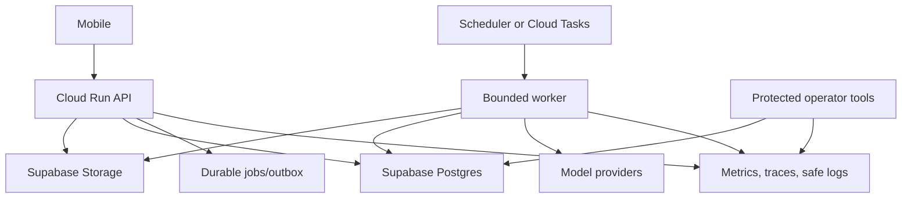

# CoverWise Operations, Reliability, Observability, Performance, and Cost Audit

**Date:** 2026-07-18  
**Repository:** `pranaysuyash/insurance_q`  
**Branch:** `main`  
**Commit:** `e3440a5da174c0cbbe279878bdff21950d8cab63`  
**Evidence tier:** Tier 1 static implementation inspection  
**Scope:** Cloud Run execution, background processing, leases, dependencies, health checks, concurrency, backpressure, model routing, cost, logging, metrics, tracing, alerting, deployment, rollback, backup, disaster recovery, and operator workflows

---

## Technical Summary

One Cloud Run service backed by Supabase is a sensible solo-operated topology. The runtime around that topology is not yet reliable enough for asynchronous document processing or cost-controlled AI workloads.

The dominant contradictions are:

- upload returns 202 but uses process-local FastAPI `BackgroundTasks`;
- recovery runs only at startup, leases have no heartbeat, and no periodic reaper exists;
- full source bytes are handed to the background task after durable upload;
- local disk remains part of processing, summaries, analytics, anti-abuse, and temporary data;
- production excludes local OCR/embedding dependencies while fallback code and product messaging imply they exist;
- ingestion and Q&A can trigger unbounded model fan-out;
- retries can traverse several models/providers without one deadline or budget;
- synchronous Supabase calls run in async routes;
- Cloud Run concurrency and memory are not benchmark-derived;
- health checks call external embedding generation and expose raw failure text;
- Prometheus is installed but no metrics are instrumented;
- no tracing, SLOs, alerts, cost limits, operator repair surface, restore drill, or rollback evidence exists;
- historical AWS/Azure deployment scripts remain active-looking and contradict the canonical platform.

**Verdict: NO-GO for unattended production operations.**

Keep one codebase, but make long-running work durable, establish resource/cost budgets, move correctness state to Supabase, and build an operator-visible repair path.

---

# 1. What Is Strong and Should Be Preserved

- One canonical Cloud Run-oriented service keeps solo operations simple.
- Production configuration fails closed for secrets, origins, HTTPS, and canonical backends.
- `/healthz` and `/readyz` distinguish liveness and readiness.
- Source documents and metadata are intended to be durable in Supabase.
- A database processing-lease primitive exists.
- The canonical Cloud Run script uses Secret Manager references.

---

# 2. P0 Findings

## P0-01: A 202 response is backed by process-local BackgroundTasks

`POST /documents/upload` stores source and metadata, then schedules `process_document_background` inside the serving process.

### Failure modes

- instance termination, deploy, or scale-down interrupts work;
- no queue-level retry, deadline, or dead-letter state;
- completion depends on process lifecycle;
- only stale lease and later startup recovery remain.

### Required fix

Use Cloud Tasks or a Supabase jobs/outbox executor. Return a durable operation ID.

---

## P0-02: Recovery runs only at startup and leases have no heartbeat

A 15-minute lease is claimed once. No periodic stale scan or heartbeat is visible.

### Required fix

Stage deadlines, heartbeat, periodic reaper, maximum attempts, exponential backoff, terminal/dead-letter state, and operator retry.

---

## P0-03: Initial processing retains full source bytes in process memory

The task receives the full upload despite the source already being stored.

### Required fix

Enqueue only document/version ID. Every worker fetches the canonical source object.

---

## P0-04: Production correctness still depends on local disk

Local disk is used or created for processing copies, summary JSON fallback, analytics SQLite, anti-abuse SQLite, hybrid index compatibility, parser temp files, and upload/temp directories.

### Required fix

No durable production state on disk. Temporary files need generated names, restrictive permissions, and guaranteed cleanup.

---

## P0-05: Production capability and fallback claims disagree

`requirements.txt` excludes doctr, sentence-transformers, Redis, Celery, and heavy local models. Settings still default Ollama to localhost and code/tests describe local OCR and embedding fallbacks.

### Required fix

Publish an environment capability manifest. Explicitly disable unavailable routes/fallbacks and surface only real production capabilities.

---

## P0-06: Ingestion and query have unbounded LLM fan-out

Potential work includes summary extraction, per-chunk contextualisation, embeddings, classification, query variants, HyDE, variant embeddings, reranking, and answer generation.

No document-level call, token, time, or currency budget is enforced.

### Required fix

Enforce:

```text
max pages
max source tokens
max chunks
max model calls
max input/output tokens
max elapsed time
max estimated cost
```

Experimental techniques must be disabled until incremental benefit is measured.

---

## P0-07: Retry routing has no operation deadline or circuit breaker

`LLMClient.generate()` can try multiple models, each with retries/backoff. Ollama is logically enabled by default. There is no global task deadline or provider circuit breaker.

### Required fix

Explicit provider flags, per-call timeout, task deadline, bounded attempts, circuit breaker, provider health state, and task-specific fallback policy.

---

## P0-08: Synchronous SDK calls block the async server

Repository, Storage, and vector paths use synchronous SDK calls from async routes/services.

### Required fix

Use async clients, bounded executors, or a consistently synchronous worker model. Measure event-loop lag and saturation.

---

## P0-09: Cloud Run sizing and concurrency are not workload-derived

Deployment defaults to 2 GiB, concurrency 4, 300 second timeout, and max 10 instances. One process handles marketing, auth, uploads, parsing, model orchestration, Q&A, analytics, and recovery.

### Required fix

Benchmark file/page classes and isolate API and worker scaling profiles if measurement requires it. One codebase does not require one resource profile.

---

## P0-10: Public health depends on external embedding and leaks raw errors

`/health` periodically invokes embedding generation and exposes `failed: {exception}`.

### Impact

Provider incidents can drain otherwise usable instances, health probes consume quota, and error detail can leak.

### Required fix

- liveness: process only;
- readiness: local initialisation and essential data plane;
- dependency health: protected operator metric;
- no raw exceptions in public health.

---

## P0-11: No operational metrics or traces exist

`prometheus-client` is installed, but no indexed metric implementation was found. No OpenTelemetry, trace ID, or correlation ID was found.

### Minimum metrics

- request latency/error by route/status;
- queued/active/stale jobs;
- stage latency/outcome;
- lease age/retries;
- page/byte/chunk distributions;
- provider latency/error/tokens/cost;
- retrieval latency/results;
- deletion and ownership-migration progress;
- event-loop lag, memory, CPU;
- mobile/API version mix.

---

## P0-12: No SLO, alert, or operator-response model

No canonical availability, processing, Q&A, deletion, alert, incident-severity, paging, dashboard, or repair contract exists.

### Required action

Define measurable SLOs and alerts for API availability, upload acceptance, truthful terminal processing, p95 processing, verified-answer success, deletion completion, and zero orphan data.

---

## P0-13: Cost tracking is process-local and unenforceable

Token/cost totals are in memory, lost on restart, not attached to owner/document/job, and unknown models default to zero cost.

### Required fix

Persist model calls by operation, document, principal, feature, release, provider, and model. Enforce budgets before each call.

---

## P0-14: No backup/restore/disaster-recovery evidence

No repository evidence demonstrates backup schedule, point-in-time restore, object recovery/versioning, restore testing, RPO/RTO, secret recovery, or migration rollback.

### Required fix

Execute a production-like restore drill before real customer data.

---

## P0-15: Deployment has no immutable promotion, canary, or rollback

The script deploys from current source checkout and `latest` secret versions. There is no immutable image promotion, migration gate, traffic split, or release manifest.

### Required fix

Build immutable image in CI, record SHA/SBOM, deploy staging, promote the same digest, canary, and retain a tested rollback revision.

---

## P0-16: Production startup still requires legacy SQLite anti-abuse

Lifespan initialises local anti-abuse tables and can raise in production, despite a documented Supabase rate-limit primitive.

### Required fix

Remove production SQLite anti-abuse and wire the shared Supabase limiter.

---

## P0-17: No operator workflow exists for stuck or destructive operations

No protected console or CLI contract can list/retry/cancel stale jobs, quarantine source, repair ownership, finish deletion, reindex, disable a provider, or inspect budget exhaustion.

### Required fix

Build minimal operator APIs and runbooks before broad launch.

---

# 3. P1 Findings

1. Startup recovery competes with serving traffic.
2. Startup tasks have no shutdown/drain contract.
3. Shutdown does not stop accepting work or release/renew leases.
4. Retry artifacts are not atomically promoted.
5. parser/MinerU temp paths lack unified cleanup.
6. processing status dictionary can grow in memory.
7. query cache/version state is process-local or Redis-dependent.
8. analytics SQLite is not durable across instances.
9. in-memory rate limits are inconsistent and can grow.
10. many logs include raw exception strings.
11. no structured logging/redaction schema.
12. no correlation ID from mobile to model call.
13. no log sampling/retention contract.
14. health version is hardcoded, not git/image digest.
15. public ingress relies entirely on application-level abuse control.
16. no documented WAF/edge-rate policy.
17. external client timeouts and connection limits are inconsistent.
18. no cancellation for abandoned work.
19. no queue fairness per principal.
20. no max active jobs per owner/provider.
21. no explicit embedding batch/token limits.
22. hardcoded price table can drift.
23. fallback logs can expose provider errors.
24. provider data-retention/residency is not operational metadata.
25. no schema-version/migration lock at startup.
26. Supabase migrations are documented as manual SQL-editor work.
27. no periodic cleanup for stale windows/files/operations.
28. no orphan object reconciliation.
29. no chaos tests for provider outage, instance kill, stale lease, or partial storage.
30. no load tests for concurrent large files and Q&A.
31. historical AWS/Azure scripts remain discoverable.
32. old scripts inject raw secret values and may copy `storage/` into images.
33. runtime image includes build-essential and git.
34. container runs as root.
35. base image is not digest-pinned.
36. no SBOM, signature, vulnerability gate, or provenance.
37. no mobile/backend compatibility monitoring.
38. no plan-limit cost forecast.
39. no customer support correlation flow.
40. no maintenance/migration communication plan.

---

# 4. Target Operational Architecture



API and worker can share one codebase/image but need different execution guarantees and potentially different scaling profiles.

Job states:

```text
queued
claimed
running
waiting_dependency
retry_scheduled
succeeded
partial
terminal_failed
cancelled
```

Each attempt records stage, lease owner, heartbeat, safe error code, retry decision, source/output versions, model calls/cost, and correlation ID.

---

# 5. Required Runbooks

- model-provider outage;
- Supabase outage/latency;
- stuck processing;
- stale lease/double processing;
- source-object orphan;
- bad extraction/reindex;
- account claim failure;
- deletion failure;
- secret compromise;
- deployment rollback;
- backup restore;
- cost spike.

---

# 6. Ordered Remediation

## Phase 0

Stop BackgroundTasks for durable work, remove external public health probes, remove production SQLite correctness, disable unavailable fallback claims, and enforce page/token/call/time/cost limits.

## Phase 1

Durable jobs, periodic claimer, heartbeat/retries, canonical source fetch, persistent stage events, and idempotent promotion.

## Phase 2

Metrics, traces, safe logs, correlation IDs, dashboards, alerts, operator retry/cancel/quarantine, and cost ledger.

## Phase 3

Load/chaos tests, concurrency tuning, immutable release, canary/rollback, and backup/restore drill.

---

# 7. Release Gates

- instance termination after 202 does not lose work;
- stale jobs recover without restart;
- leases heartbeat and cannot double-promote;
- no durable production state on disk;
- all external calls have deadlines and bounded retries;
- processing has page/token/call/time/cost budgets;
- p50/p95 API and stage metrics exist;
- model cost is persisted/enforced;
- alerts/runbooks/operator repair exist;
- load tests justify resources;
- immutable deployment and rollback are tested;
- backup restore and erasure drills pass;
- high-risk operations reach Tier 4/5 evidence.

---

# 8. Evidence Index

| Area | Paths |
|---|---|
| Startup, health, recovery | `src/app/main.py` |
| Background task/leases | `src/api/document.py`, `infra/supabase/001_coverwise_schema.sql`, `infra/supabase/002_document_processing_leases.sql` |
| Local processing state | `src/services/document_processing_service.py` |
| LLM retries/cost | `src/llm/client.py`, `src/config/settings.py` |
| RAG fan-out | `src/rag/pipeline.py` |
| Production capability packages | `requirements.txt`, `requirements-local.txt` |
| Blocking SDK paths | `src/services/document_repository.py`, `src/services/document_object_store.py`, `src/services/supabase_vector_store.py` |
| Disk analytics/abuse | `src/api/analytics.py`, `src/utils/anti_abuse.py`, `src/utils/database_migration.py` |
| Deployment | `tools/deploy_cloud_run.sh`, `Dockerfile`, `src/utils/runtime_config.py` |
| Historical drift | `deploy_aws_multiarch.sh`, `scripts/fix_services_config.sh`, `scripts/set_api_keys.sh` |

---

# 9. Bottom Line

The topology is simple enough to operate, but work execution is not durable enough to trust. The next milestone is a measurable, budgeted, recoverable job system with a small operator surface and proven restore/rollback paths.
