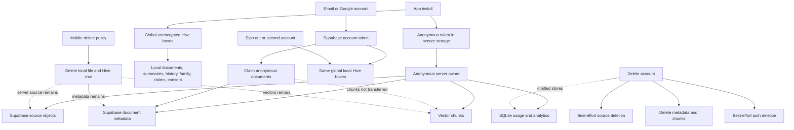
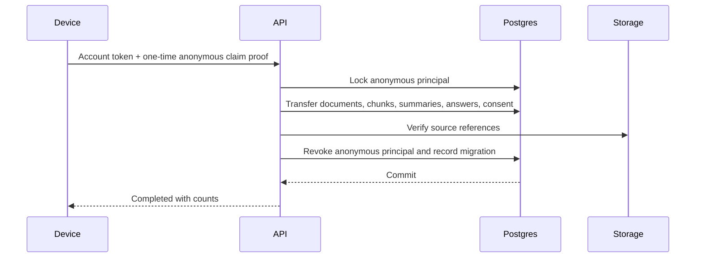
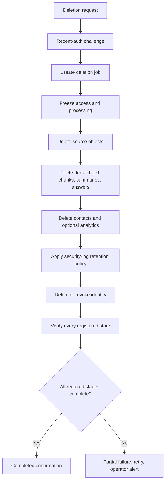

# CoverWise Security, Privacy, Identity, Consent, and Data Lifecycle Audit

**Date:** 2026-07-18  
**Repository:** `pranaysuyash/insurance_q`  
**Branch audited:** `main`  
**Commit audited:** `e3440a5da174c0cbbe279878bdff21950d8cab63`  
**Evidence tier:** Tier 1, static inspection of the current repository  
**Runtime evidence:** no combined GitHub status was attached to the audited commit  
**Doctrine:** `motto_v3.md`, especially risk-based verification, confidence honesty, customer-facing claim checks, data/config discipline, observability, operator workflows, and canonical-path convergence

---

## Executive Summary

CoverWise is not currently safe to release as a privacy-sensitive insurance workspace.

The repository contains several strong building blocks:

- bearer authentication is required on policy-bearing API routes;
- anonymous tokens have issuer and audience validation;
- account authentication delegates to Supabase;
- production configuration fails closed when required secrets or canonical backends are missing;
- source documents are intended to live in a private Supabase bucket;
- document metadata and retrieval are owner-scoped;
- production CORS for the main API is explicitly configured;
- the mobile app stores the anonymous bearer token in platform secure storage;
- non-production diagnostic endpoints are hidden in production;
- the canonical Cloud Run deployment uses Secret Manager.

Those controls do not yet form a coherent security and privacy architecture.

The dominant failure is **identity and lifecycle fragmentation**. CoverWise currently has three overlapping identity stories:

```text
device-local session
anonymous server owner
optional Supabase account
```

Data is not consistently partitioned, transferred, deleted, or audited across them. This creates concrete failure modes:

- one signed-in user can see sensitive local policies, family details, claim records, questions, and summaries left by another signed-in user on the same device;
- deleting a synced policy in the mobile app deletes only the local copy while the source file, metadata, embeddings, and summary remain on the server;
- replacing a document uploads a new server document and only removes the old local record;
- account deletion returns HTTP 200 and tells the user everything was permanently deleted even when source objects or the Supabase auth account remain;
- account deletion omits several derived and operational stores;
- anonymous-to-account migration changes document ownership but not vector-chunk ownership, leaving old anonymous access and breaking account retrieval;
- the mobile profile lets the user copy the active bearer token to the system clipboard;
- global analytics and error-aggregation endpoints are readable by any ordinary anonymous or account bearer;
- analytics consent is default-on, fabricated as a grant at first startup, and fails open when the ledger is absent or corrupt;
- analytics validation is debug-only and does not block PII-bearing payloads;
- unredacted exception messages and stack summaries can enter analytics;
- raw IP addresses, email addresses, session identifiers, document hashes, and user agents are persisted and logged by the anti-abuse layer without a canonical retention or deletion workflow;
- a phone number stored only in local Hive is presented as an account link and automatic cross-device backup;
- sensitive mobile data is held in unencrypted Hive and app files without explicit repository-level backup exclusion;
- historical deployment scripts can copy the `storage/` directory into a container image and inject secrets as ordinary runtime environment variables.

**Current release decision: NO-GO.**

The right long-term solution is not to add more disclaimers. It is to establish:

1. one canonical principal model;
2. account-scoped local storage;
3. a server-side consent and purpose ledger;
4. a complete data inventory and deletion graph;
5. asynchronous, retryable, auditable erasure;
6. explicit operator authorization;
7. enforced telemetry schemas and redaction;
8. shared, hashed, abuse-resistant rate limiting;
9. secure mobile backup and deep-link contracts;
10. production-like security verification.

---

# 1. Why This Is the Next Audit Area

The prior audits established two facts:

1. the top-level application architecture is converging toward one Cloud Run API plus Supabase;
2. the document-intelligence pipeline does not yet preserve a complete source-to-claim evidence chain.

The next first-principles question is:

> Who is allowed to hold, process, retrieve, transfer, observe, and delete each copy of sensitive user data, and can the system prove that the lifecycle completed?

This area is upstream of launch approval because CoverWise handles data that can include policyholder identity, dates of birth, contact details, policy identifiers, financial values, medical coverage, dependants, claim notes, user questions, source documents, extracted text, embeddings, model outputs, error messages, IP addresses, and device metadata.

Security and privacy cannot be deferred until the product has more users. The cost of correcting identity and data boundaries rises with every new store, screen, model, and integration.

---

# 2. Audit Scope and Limitations

## 2.1 Areas inspected

### Identity and authorization

- `src/api/user.py`
- `src/utils/anonymous_auth.py`
- `src/utils/supabase_auth.py`
- `src/models/user.py`
- `mobile/lib/services/auth_service.dart`
- `mobile/lib/providers/auth_provider.dart`
- `mobile/lib/services/session_service.dart`
- `mobile/lib/screens/account_screen.dart`
- `mobile/lib/screens/profile_screen.dart`
- `mobile/lib/screens/reset_password_screen.dart`
- `mobile/lib/main.dart`

### Server data and lifecycle

- `src/api/document.py`
- `src/services/document_repository.py`
- `src/services/document_object_store.py`
- `src/services/policy_extraction_service.py`
- `src/services/supabase_vector_store.py`
- `src/api/analytics.py`
- `src/utils/anti_abuse.py`
- `src/utils/database_migration.py`
- `infra/supabase/001_coverwise_schema.sql`
- `infra/supabase/002_document_processing_leases.sql`
- `infra/supabase/003_rate_limit_windows.sql`
- `infra/supabase/README.md`

### Mobile data and consent

- `mobile/lib/services/local_storage_service.dart`
- `mobile/lib/services/app_state_store.dart`
- `mobile/lib/services/app_state_repository.dart`
- `mobile/lib/services/consent_ledger.dart`
- `mobile/lib/services/analytics_schema.dart`
- `mobile/lib/services/analytics_service.dart`
- `mobile/lib/services/document_service.dart`
- `mobile/lib/widgets/lead_capture_dialog.dart`
- `mobile/lib/widgets/phone_capture_sheet.dart`
- `mobile/lib/widgets/shared/global_error_boundary.dart`
- `mobile/lib/screens/onboarding_screen.dart`
- `mobile/lib/screens/privacy_security_screen.dart`
- `mobile/lib/screens/settings_screen.dart`
- `mobile/lib/screens/documents_list.dart`

### Platform, deployment, and tests

- `src/utils/runtime_config.py`
- `src/utils/runtime_access.py`
- `src/frontend/app.py`
- `mobile/android/app/src/main/AndroidManifest.xml`
- `mobile/ios/Runner/Info.plist`
- `tools/deploy_cloud_run.sh`
- `deploy_aws_multiarch.sh`
- `Dockerfile`
- `.gitignore`
- `.github/workflows/ci.yml`
- `tests/test_anonymous_auth.py`
- `tests/test_user_account_deletion.py`

## 2.2 Not verified

This audit did not execute tests, inspect live Supabase/Cloud Run/OAuth configuration, inspect device backups, test account switching, perform penetration testing, search full Git history for secrets or deleted customer files, verify hosted legal pages, or provide a legal compliance opinion.

## 2.3 Confidence

**Static audit confidence: 0.96.**

The highest-risk findings are direct control-flow and data-model contradictions. Runtime testing is still required before any fix can be called complete.
---

# 3. First-Principles Security and Privacy Contract

## 3.1 One principal, one ownership graph

At any moment the app must know the canonical principal:

```text
anonymous principal
or
account principal
```

Every local and remote object must be associated with that principal or explicitly classified as device-shared.

No user should inherit another principal’s source documents, summaries, questions, answers, family members, claim records, consent, notifications, usage entitlements, or cached model output.

## 3.2 Possession is not lifecycle completion

A bearer token can establish access. It cannot prove that ownership transfer, source deletion, derived deletion, auth deletion, or backup expiry completed. Those require durable workflows and verifiable state.

## 3.3 Data must have purpose, owner, retention, and deletion

Every stored field requires:

- data class;
- owner/principal;
- purpose;
- source;
- processor;
- retention rule;
- access policy;
- export path;
- deletion path;
- audit evidence.

## 3.4 Privacy claims must match operational truth

A sentence such as “Your policies are backed up”, “Everything was permanently deleted”, “No personal data is shared”, or “Your personal details stay local” is a product contract. It may appear only when the system can prove it.

## 3.5 Consent must be explicit and authoritative

Consent records must be purpose-specific, policy-versioned, append-only, timestamped server-side, principal-associated, enforceable, withdrawable, and auditable. A missing or corrupt consent record must not become consent.

## 3.6 Deletion is a state machine

```text
requested
  -> access frozen
  -> source deletion pending
  -> derived deletion pending
  -> identity deletion pending
  -> verification pending
  -> completed
or
  -> partially failed
```

## 3.7 Operators are not ordinary users

Founder dashboards, global errors, telemetry, data repair, and deletion recovery require explicit operator roles and separate authorization.

## 3.8 Sensitive telemetry is hostile input

Error strings, stack traces, filenames, URLs, model exceptions, and request context can contain secrets or personal data. Telemetry must be allowlisted and redacted before persistence.

---

# 4. Reconstructed Identity and Data Flow



---

# 5. Data Inventory

| Data class | Current location | Protection observed | Lifecycle problem |
|---|---|---|---|
| Original policy file | Mobile app documents directory | Platform sandbox only | Not account-scoped; no explicit backup exclusion; mobile deletion local-only |
| Original policy file | Supabase private Storage | Server service-role path | Account deletion is best-effort; no durable erasure verification |
| Document metadata | Hive | Unencrypted box | Global across users; cleared separately |
| Document metadata | Supabase `documents` | Owner-scoped application query | Contains raw IP, user agent, document hash, consent and optional contacts |
| Extracted summary | Hive | Unencrypted box | Global across users |
| Extracted summary | Redis or local server JSON | No canonical durable boundary | Omitted from account deletion |
| Vector chunks | Supabase `document_chunks` | Owner field + service-role API | Ownership not transferred during anonymous claim |
| Questions and answers | Hive | Unencrypted box | Global across users |
| Family members and DOBs | Hive | Unencrypted box | Global across users |
| Claim records and notes | Hive | Unencrypted box | Global across users |
| Coverage-gap notes | Hive | Unencrypted box | Global across users |
| Phone number | Hive | Unencrypted box | Presented as account/backup but local-only |
| Contact lead data | Document JSON metadata | Duplicated into every document | Consent and retention unclear |
| Analytics queue | Hive | Unencrypted box | Consent fail-open; queue retained after opt-out |
| Analytics events | Server SQLite | Ephemeral local DB | Global endpoints accessible to ordinary bearer |
| Error messages and stack summaries | Analytics | Weak redaction | Can contain personal data or secrets |
| IP, email, session, UA, hash | Server SQLite/Redis/logs/document payload | Raw values | No canonical retention, export, or erasure |
| Anonymous token | FlutterSecureStorage | Platform secure storage | Copy-to-clipboard UI; no token revocation |
| Account session | Supabase Flutter persistence | SDK-managed | Sign-out does not partition/clear local data |
| Consent ledger | Hive JSON | Unencrypted, mutable | Local-only, fail-open, writes suppress errors |

---

# 6. What Is Strong and Should Be Preserved

1. **Bearer protection:** policy-bearing API routes reject missing credentials.
2. **JWT claims:** anonymous tokens validate issuer, audience, expiry, signature, and subject form.
3. **Fail-closed production config:** required secrets, HTTPS, explicit CORS, non-debug logs, and canonical Supabase backends are checked.
4. **Main API CORS:** wildcard origins are rejected in production.
5. **Secret Manager deployment:** canonical Cloud Run script binds secret references, not values.
6. **Private source bucket:** Supabase Storage is configured as private.
7. **Diagnostic isolation:** retired and debug routes return 404 in production.
8. **Secure credential storage:** anonymous bearer was migrated from Hive to `FlutterSecureStorage`.
9. **Destructive confirmation UX:** account deletion has two confirmation steps.

These are useful foundations. They must be retained while the identity and lifecycle model is rebuilt.
---

# 7. P0 Findings

## P0-01: Local sensitive data is not scoped to the active principal

The app opens one global `documents_box` and one global `app_state_box`. They hold policies, summaries, Q&A history, family members, DOBs, claims, contact details, gap notes, entitlements, feedback, and consent.

`AuthService.signOut()` signs out Supabase only. It does not switch, lock, partition, or clear local data.

**Failure scenario:** Account A signs out, Account B signs in on the same device, and Account B sees Account A’s local content.

**Fix:** introduce a principal-scoped encrypted local data root and explicit workspace switching.

**Acceptance:** account-switch integration tests prove zero cross-principal local visibility.

---

## P0-02: Mobile “Delete policy” deletes only the local copy

`DocumentsList` calls `DocumentService.deleteDocument(local_id)`. That method calls only `LocalStorageService.deleteDocument()`, removing the local file and Hive row. It never calls `DELETE /documents/{remote_id}`.

The UI says “Document deleted successfully”, while the Privacy screen claims synced server records are removed.

**Fix:** remote-first durable deletion for synced documents; offline deletion must remain visibly pending.

**Acceptance:** source, metadata, summary, chunks, answers, contacts, and lifecycle records are verified erased before success.

---

## P0-03: “Replace policy” leaves the old server document behind

Replacement uploads a new server document and then invokes the same local-only delete for the old item.

**Fix:** implement document versions or atomically replace and erase the old remote aggregate.

**Acceptance:** replacement cannot create an undisclosed server orphan.

---

## P0-04: Account deletion reports success when source files or the auth user remain

`DELETE /user/account` counts source deletion failures, catches Supabase auth deletion failures, returns HTTP 200, and says all data was permanently deleted. The mobile client trusts 200 and shows final success.

The tests explicitly codify that storage deletion failure does not block success.

**Fix:** return `202 deletion_requested`; use a durable deletion job with retryable stages and verification.

**Acceptance:** no completed result while any required store remains.

---

## P0-05: Account deletion omits material stores

The path does not delete or verify Redis/local summary files, processing temp copies, analytics, anti-abuse tracking, raw IP/session/UA records, lead data outside reachable documents, backups, mobile local data, notification state, or future answer/model-call records.

**Fix:** create a data-store registry with `enumerate`, `freeze`, `delete`, and `verify` adapters.

**Acceptance:** a new persistent store cannot ship without lifecycle adapters.

---

## P0-06: Anonymous-to-account migration transfers documents but not vector chunks

`claim_anonymous_documents` changes document ownership but does not change `document_chunks.owner_id`. The old anonymous token remains valid.

**Impact:** the new account can lose retrieval access while the old anonymous bearer can retain chunk access.

**Fix:** transfer the full aggregate in one transaction and revoke the anonymous principal.

**Acceptance:** old bearer cannot access migrated data; account can access all migrated source and derived data.

---

## P0-07: The active bearer can be copied to the system clipboard

Profile exposes a production UI action that copies the full anonymous bearer. That credential grants access to policy data for up to 30 days.

**Fix:** remove token display/export entirely; expose only masked identity, expiry, rotate, and revoke controls.

---

## P0-08: Global analytics and error endpoints are ordinary user routes

`/analytics/summary`, `/analytics/health`, and `/analytics/errors` depend only on ordinary bearer authentication. Any anonymous or account user can read global product and error data.

**Fix:** explicit operator roles and scopes, with audited privileged reads.

---

## P0-09: Analytics ingestion accepts arbitrary, unbounded data

The backend accepts arbitrary event names, arbitrary JSON properties, unparsed timestamps, and unbounded event lists. There is no server allowlist, size/depth limit, ingestion limit, or deduplication ID.

**Fix:** strict server schema, bounded batches, replay protection, and rate limiting.

---

## P0-10: Analytics consent is default-on and fabricated as a grant

The onboarding toggle defaults on, Skip can bypass it, missing/corrupt consent is treated as true, and the service writes a grant on first startup.

**Fix:** separate necessary operational telemetry from optional analytics. Optional analytics must fail closed and require an explicit recorded action.

---

## P0-11: Analytics privacy validation is not enforced

Client validation runs only in debug, prints violations, still queues the event, allows unknown events, and largely detects PII by key name. The server accepts arbitrary properties.

**Fix:** one generated schema enforced in release client and server.

---

## P0-12: Error telemetry can transmit personal data and secrets

`GlobalErrorBoundary` sends `exception.toString()` and stack summaries. Exceptions can contain filenames, questions, contacts, URLs, server responses, bearer tokens, paths, or policy IDs.

**Fix:** emit allowlisted error codes only. Put detailed crash diagnostics in a separate protected, redacted system.

---

## P0-13: Phone “linking” makes false backup and identity claims

`PhoneCaptureSheet` stores the number only in local Hive but says the user can access policies from any device, automatic backup is enabled, the number identifies an account, and policies are backed up.

**Fix:** remove the feature until a verified account/restore contract exists, or relabel it as a local preference with no backup claim.

---

## P0-14: Sensitive mobile data lacks a coherent protection and backup policy

Policies and sensitive records are stored in ordinary app files and unencrypted Hive. The inspected Android manifest contains no explicit backup/data-extraction rules. No repository-level iOS file protection contract was found.

**Fix:** encrypted principal-scoped stores, explicit Android backup policy, iOS file protection and backup exclusions, and deliberate restore behaviour.

---

## P0-15: Anti-abuse processing stores raw personal and network identifiers outside the deletion graph

The active layer stores/logs full document hashes, raw IPs, session/owner IDs, email addresses/domains, user agents, and optional metadata in Redis, memory, SQLite, document payloads, and logs.

**Fix:** use the existing shared Supabase limiter with HMACed identifiers and explicit security-event retention.

---

## P0-16: Public anonymous issuance defeats per-session limits

`POST /user/anonymous` is public and not visibly issuance-limited. Upload limits use Redis or per-instance memory and fail open on Redis errors. New anonymous tokens reset session budgets. Forwarding headers are trusted without an explicit proxy boundary.

**Fix:** shared identity-issuance limits, trusted edge normalization, privacy-preserving identifiers, and explicit failure policy.

---

## P0-17: Consent is local, mutable, and disconnected from server enforcement

The purpose ledger is mutable JSON in Hive. It suppresses write failures, some callers do not await writes, unknown purposes coerce to document-processing, withdrawal does not propagate, clearing local data erases the record, and server consent is a separate snapshot in document payloads.

**Fix:** server-side append-only purpose ledger; local data becomes a cache only.

---

## P0-18: Customer-facing privacy claims contradict operational truth

Examples include “personal details stay local”, “phone linking backs up policies”, “no data is shared with third parties”, “deleting a synced policy removes server records”, and “account deletion removes all server data”.

**Fix:** freeze privacy copy until each sentence has an owner, code path, processor, retention rule, deletion path, and verification evidence.
---

# 8. P1 Findings

1. **Google OAuth does not explicitly claim the anonymous workspace.** Email/password auth calls migration; OAuth callback does not.
2. **Anonymous claim relies on possession of any valid anonymous bearer.** There is no one-time claim, recent-auth challenge, notification, or revocation.
3. **Anonymous tokens have no server-side revocation.**
4. **`/user/refresh` accepts account principals and can issue an invalid anonymous-shaped token.**
5. **Token acquisition/refresh is not single-flight**, risking multiple anonymous principals on one device.
6. **Sign-out leaves local sensitive data visible** even before another account signs in.
7. **Clear local data does not sign out the Supabase account**, despite saying session data is removed.
8. **Account deletion does not require recent reauthentication.**
9. **Server deletion is synchronous, non-idempotent, and order-sensitive.**
10. **Summary deletion is best-effort and not verified.**
11. **Lead capture does not reject `consent == false`.**
12. **Lead/contact consent is bundled with processing consent.**
13. **Contact data is duplicated into every document.**
14. **“No sharing” copy is imprecise while Supabase and OpenAI process data.**
15. **No self-service data export/access flow was found.**
16. **Retention, expiry, Storage lifecycle, and backup retention are not a canonical system contract.**
17. **Analytics opt-out does not purge already queued optional events.**
18. **Analytics sync currently uses raw Dio without bearer auth.** Repairing it before hardening ingestion would activate unsafe telemetry.
19. **Analytics flushing lacks single-flight and event replay control.**
20. **Mounted marketing sub-app has wildcard CORS with credentials.**
21. **No canonical web security-header middleware was found.**
22. **Non-production frontend logs raw queries and complete OCR/processing payloads.**
23. **OAuth/reset use custom URL schemes rather than verified App/Universal Links.**
24. **Deep-link handler validates path but not a strict scheme/host/auth-state contract.**
25. **Supabase service-role client is used for ordinary token verification**, increasing blast radius.
26. **RLS is enabled but the application depends entirely on service-role discipline.**
27. **Document payload mixes domain metadata, network identifiers, contacts, and consent.**
28. **Global document-hash checking creates a cross-user side channel and false duplicate blocking.**
29. **Anti-abuse failures are fail-open and per-instance memory is incorrect under scale-out.**
30. **Trusted proxy boundaries are not explicit.**
31. **Historical AWS deployment can bake `storage/` into an image.**
32. **Historical deployment injects secrets as ordinary runtime variables.**
33. **`.gitignore` does not cover all sensitive storage forms; no `.dockerignore` exists.**
34. **Canonical container runs as root.**
35. **Base image and supply chain are not pinned, scanned, signed, or accompanied by an SBOM.**
36. **CI omits Flutter and security gates.**
37. **Consent and privileged-action audit logs are not tamper-evident.**
38. **No singular current incident-response and erasure-recovery runbook was found.**

---

# 9. Threat Model

## 9.1 Assets

- policy source files and extracted text;
- family and dependant details;
- claim notes and financial/medical-adjacent policy information;
- anonymous and account credentials;
- consent evidence;
- telemetry and errors;
- service-role and model-provider secrets;
- deletion evidence and recovery references.

## 9.2 Actors

- ordinary anonymous or account user;
- user on a shared/lost device;
- malicious app with clipboard access;
- abusive client minting identities;
- attacker with a stolen bearer;
- compromised dependency or deployment credential;
- operator;
- external model/storage processor;
- developer accidentally handling real files in local/staging.

## 9.3 High-value attack paths

1. copy and reuse anonymous token;
2. sign in as a second account and read the first user’s local data;
3. read global `/analytics/errors` with an ordinary bearer;
4. submit arbitrary telemetry;
5. mint identities to bypass budgets;
6. spoof forwarding headers where the edge permits;
7. exploit partial deletion to leave orphaned source files;
8. claim a stolen anonymous workspace;
9. intercept a custom-scheme callback;
10. bake local storage into a container image;
11. leak PII through exception strings;
12. rely on false backup or deletion confirmation.
---

# 10. Canonical Target Architecture

## 10.1 Principal model

```text
Principal
  id
  type: anonymous | account
  status: active | claimed | revoked | deletion_pending | deleted
  created_at
  expires_at
```

```text
DeviceInstallation
  id
  principal_id
  installation binding/public key
  last_seen_at
  revoked_at
```

Local storage is keyed by `principal_id`.

## 10.2 Anonymous-to-account migration



## 10.3 Consent model

```text
ConsentEvent
  id
  principal_id
  purpose
  disclosure_version
  action: granted | withdrawn
  occurred_at_server
  client_occurred_at
  source_surface
  app_release
  evidence_hash
```

The current state is a projection of append-only events.

## 10.4 Data-store registry

```text
DataStoreRegistry
  store_name
  data_classes
  purpose
  retention
  export_adapter
  delete_adapter
  verify_adapter
  owner
```

Build checks should fail when a persistent store has no lifecycle adapter.

## 10.5 Deletion workflow



## 10.6 Operator authorization

Separate customer principal, support operator, security operator, analytics reader, and deletion worker. Use explicit scopes and audit every privileged read.

## 10.7 Telemetry

- Necessary operations: allowlisted codes, latency, release, retries, safe provider status.
- Optional analytics: strict event schema, explicit purpose, no free text or policy identifiers.
- Crash diagnostics: separate protected system, redaction, sampling, short retention, operator-only.

## 10.8 Local data

- encrypted principal-scoped database;
- platform-protected source files;
- explicit backup policy;
- no global user content;
- lock/re-entry for sensitive screens where justified;
- documented platform deletion limits.
---

# 11. Ordered Remediation Plan

## Phase 0: Stop false claims

1. Remove “Copy session token”.
2. Remove/relabel phone backup and account claims.
3. Rename current policy action to “Remove from this device” until remote deletion exists.
4. Disable Replace until old remote data is handled.
5. Return pending/partial deletion, never false completion.
6. Restrict analytics reads to operators.
7. Disable optional analytics by default.
8. Stop raw exception telemetry.
9. Correct device-first, no-sharing, and deletion copy.

**Exit:** no customer-facing security, backup, consent, or deletion claim exceeds code truth.

## Phase 1: Repair identity boundaries

1. Canonical principal state.
2. Principal-scoped encrypted local storage.
3. Auth-change workspace switch.
4. One post-auth migration flow for every provider.
5. Transactional full-aggregate transfer.
6. Anonymous revocation after claim.
7. Anonymous-only refresh endpoint.
8. Single-flight token coordinator.
9. Device/session management.

**Exit:** account-switch and claim tests show no leakage or stale access.

## Phase 2: Consent and purpose

1. Server append-only ledger.
2. Versioned disclosures.
3. Separate processing, analytics, contact, model-improvement, and marketing purposes.
4. Server enforcement.
5. Withdrawal propagation.
6. Local ledger as cache only.
7. Fail closed.

**Exit:** server can explain and enforce purpose for every optional action.

## Phase 3: Data lifecycle

1. Complete inventory.
2. Store registry.
3. Document deletion job.
4. Account erasure job.
5. Data export job.
6. Retention scheduler.
7. Backup/lifecycle documentation.
8. Verification and operator retry.

**Exit:** production-like erasure reaches every registered store.

## Phase 4: Telemetry and abuse

1. Shared generated analytics schema.
2. Server bounds and allowlists.
3. Operator authorization.
4. Redacted crash diagnostics.
5. Hashed shared rate limits.
6. Identity-issuance limits.
7. Trusted proxy normalization.
8. Security-event retention.
9. Replay protection.

**Exit:** clients cannot write free text, read global telemetry, or bypass limits by minting principals.

## Phase 5: Platform and supply chain

1. Android backup/data-extraction rules.
2. iOS file protection and backup rules.
3. Verified App/Universal Links.
4. Non-root container.
5. Strict `.dockerignore`.
6. Archive historical deployments.
7. Secret/dependency/container scans.
8. SBOM and signed image.
9. Security release checks.

**Exit:** mobile and container artifacts pass the documented security pipeline.
---

# 12. Immediate File-Level Work Map

## Identity

- `src/api/user.py`: anonymous-only refresh, recent-auth deletion challenge, deletion jobs, full migration, operator dependencies.
- `src/utils/anonymous_auth.py`: principal revocation and shorter-lived access.
- `mobile/lib/services/auth_service.dart`: auth coordinator, central post-auth migration, account switch, deletion polling.
- `mobile/lib/main.dart`: verified deep links and post-OAuth migration.

## Local data

- `mobile/lib/services/local_storage_service.dart`: principal-scoped paths, encryption, remote deletion.
- `mobile/lib/services/app_state_repository.dart`: remove global user-content keys.
- Android/iOS configuration: backup and file protection.

## Consent/privacy

- `mobile/lib/services/consent_ledger.dart`: server-backed append-only API.
- `mobile/lib/screens/onboarding_screen.dart`: optional analytics default off.
- `mobile/lib/widgets/lead_capture_dialog.dart`: independent, awaited contact consent.
- `mobile/lib/screens/privacy_security_screen.dart`: operationally generated privacy facts.

## Deletion

- `mobile/lib/services/document_service.dart`: remote delete and offline queue.
- `mobile/lib/screens/documents_list.dart`: pending state, no false success.
- `src/api/document.py`: deletion job/tombstones and dedicated lead entity.
- `src/services/policy_extraction_service.py`: durable summary and verified delete.

## Analytics/abuse

- `mobile/lib/services/analytics_schema.dart`: generated strict schema.
- `mobile/lib/services/analytics_service.dart`: auth, single-flight, purge on withdrawal.
- `mobile/lib/widgets/shared/global_error_boundary.dart`: codes only.
- `src/api/analytics.py`: operator reads, strict ingestion, retention.
- `src/utils/anti_abuse.py`: Supabase shared HMACed limiter.

## Deployment

- `Dockerfile`: non-root, minimal and pinned.
- `.dockerignore`: deny runtime data and secrets.
- `.github/workflows/ci.yml`: Flutter, secret scan, SAST, dependency/container scan, lifecycle integration.
- historical scripts: archive and prevent `COPY storage/`.

---

# 13. Required Tests

## Identity isolation

- Account A data invisible to Account B.
- Sign-out locks/separates workspace.
- Google and email auth run identical migration.
- Concurrent auth creates one principal.
- Claimed bearer is revoked.

## Authorization

- Normal users cannot read analytics/errors.
- Operator scope works and is audited.
- No cross-owner access.
- Public Supabase roles cannot read server-only tables.

## Consent

- Fresh install optional analytics off.
- Skip does not grant.
- Corrupt/missing state does not grant.
- Withdrawal stops collection and handles queue.
- Contact requires independent grant.
- Disclosure version is preserved.

## Deletion

- Synced mobile delete reaches server.
- Offline delete stays pending.
- Source failure remains retryable.
- Account deletion cannot complete with residual source/auth.
- Every store adapter runs.
- Repeated deletion is idempotent.
- Backup-retention status is truthful.

## Telemetry

- Unknown/free-text/oversized events rejected.
- PII and secret fixtures rejected/redacted.
- Duplicates deduplicated.
- Ordinary users cannot query global telemetry.

## Abuse

- Identity issuance limited.
- New bearer cannot reset device/edge budget.
- Multi-instance enforcement.
- Spoofed forwarding header ignored.
- Raw identifiers absent from storage/logs.

## Platform/supply chain

- Backups contain no readable sensitive data.
- Verified links reject malicious app interception.
- Token never enters clipboard/logs.
- Container non-root.
- No secrets in tree/history.
- SBOM, image scan, signing and build-context exclusion pass.
---

# 14. Security Release Gates

CoverWise may be called security/privacy ready only when:

- no P0 remains;
- all local and remote user content is principal-scoped;
- mobile and account deletion are durable and verifiable;
- anonymous migration transfers all data and revokes old access;
- ordinary users cannot access operator data;
- optional analytics is explicitly authorized and schema-enforced;
- raw exceptions are absent from analytics;
- anti-abuse signals are privacy-preserving and shared;
- mobile backup and deep links are verified;
- inventory, retention, export, and deletion are canonical;
- CI runs secret, dependency, mobile, and container security checks;
- high-risk flows have Tier 3+ evidence;
- a production-like erasure drill passes;
- incident response has named owners.

---

# 15. Motto v3 Alignment

| Principle | Status | Judgement |
|---|---|---|
| Bold long-term architecture | Partial | Cloud Run/Supabase choice is strong |
| No parallel truth sources | Violated | Device, anonymous, account, SQLite, Redis, disk, logs overlap |
| End-to-end flow | Violated | Deletion and migration stop before all stores |
| Confidence honesty | Violated | UI confirms outcomes that did not occur |
| Evidence tiers | Weak | Security claims lack runtime proof |
| Risk-based verification | Violated | Identity/deletion/consent need Tier 3+ |
| Data/config as product | Violated | Consent, retention, backup, analytics not canonical |
| Observability | Violated | Ordinary users can read global telemetry; failed deletion unrecoverable |
| Customer-facing claim checks | Violated | Device-first, no-sharing, backup and deletion copy are false |
| Scope control | Violated | Features expanded before identity/lifecycle foundations |
| Product/operator workflow | Violated | No deletion status/retry/operator workflow |

---

# 16. Decisions

## Keep

- one Cloud Run service;
- Supabase canonical data plane;
- private source bucket;
- bearer-protected policy routes;
- owner-scoped repositories;
- fail-closed production config;
- Secret Manager;
- secure credential storage;
- destructive confirmation;
- non-production route guard.

## Change

- global local stores to encrypted principal stores;
- bearer-only migration to full one-time aggregate claim;
- synchronous deletion to durable jobs;
- local consent to server append-only ledger;
- analytics JSON to strict generated schema;
- raw anti-abuse identifiers to HMACed short-retention signals;
- ordinary analytics access to operator scopes;
- custom schemes to verified links;
- privacy copy to operational facts.

## Remove immediately

- session-token copy;
- local-only phone account/backup claims;
- false delete success;
- optional analytics fail-open;
- raw exception telemetry;
- ordinary-user analytics dashboards;
- historical deployments that copy `storage/`.

## Do not add yet

- advertising;
- model training on user policies;
- family sharing;
- broker/insurer integrations;
- more account providers;
- more telemetry;
- enterprise admin.

---

# 17. Release Decision

**NO-GO for public release with real customer policies.**

Permitted work: internal development with synthetic/permissioned data, identity/lifecycle refactor, security testing, static UI work with synthetic fixtures, controlled Supabase shadowing, and privacy-copy correction.

Do not claim that data stays local, phone linking backs up policies, no data is shared with processors, policy deletion removes server data, account deletion removes everything, analytics contains no PII, rate limits are per-device, consent is auditable, or local customer data is encrypted beyond the platform sandbox.

---

# 18. Final Acceptance Contract

Completion requires an exact principal model, local/remote inventory, purpose and retention per class, account-switch behaviour, claim/revocation flow, consent versions and enforcement, document/account deletion stages, backup treatment, operator roles, telemetry schema/redaction, anti-abuse identifiers, tests/commands, evidence tiers, incident paths, and production-like erasure observation.

A successful API response or snackbar is not completion evidence.

---

# 19. Bottom Line

CoverWise has enough individual controls to become a strong privacy-first product, but they are not connected into one system.

The next build direction is:

```text
canonical principal
  -> principal-scoped local and remote data
  -> explicit purpose
  -> verified access
  -> durable lifecycle
  -> truthful customer state
  -> operator-visible recovery
```

Until then, every account, sync, analytics, family, claim, or monetization feature expands the blast radius.

---

# Appendix A: High-Signal Evidence Index

All paths refer to commit `e3440a5da174c0cbbe279878bdff21950d8cab63`.

| Finding | Primary evidence |
|---|---|
| Global local user data | `mobile/lib/main.dart`, `mobile/lib/services/local_storage_service.dart`, `mobile/lib/services/app_state_repository.dart` |
| Sign-out leaves local data | `mobile/lib/services/auth_service.dart::signOut`, `mobile/lib/screens/profile_screen.dart::_signOut` |
| Local-only document delete | `mobile/lib/services/document_service.dart::deleteDocument` |
| Replace leaves old server copy | `mobile/lib/services/document_service.dart::replaceDocument` |
| False account deletion success | `src/api/user.py::delete_account`, `tests/test_user_account_deletion.py` |
| Incomplete account deletion | `src/api/user.py`, `src/api/analytics.py`, `src/utils/database_migration.py`, `src/services/policy_extraction_service.py` |
| Chunk owner not transferred | `infra/supabase/001_coverwise_schema.sql::claim_anonymous_documents` |
| Bearer copy | `mobile/lib/screens/profile_screen.dart` |
| Operator endpoints open | `src/api/analytics.py` |
| Arbitrary analytics | `src/api/analytics.py::ingest_events` |
| Consent fail-open | `mobile/lib/services/analytics_service.dart`, `mobile/lib/screens/onboarding_screen.dart` |
| Schema not enforced | `mobile/lib/services/analytics_schema.dart`, `mobile/lib/services/analytics_service.dart`, `src/api/analytics.py` |
| Error PII | `mobile/lib/widgets/shared/global_error_boundary.dart` |
| Phone backup falsehood | `mobile/lib/widgets/phone_capture_sheet.dart` |
| Unencrypted local data | `mobile/lib/services/local_storage_service.dart`, `mobile/lib/services/app_state_repository.dart` |
| Backup controls absent | Android manifest, iOS Info.plist |
| Raw anti-abuse identifiers | `src/utils/anti_abuse.py`, `src/utils/database_migration.py`, `src/api/document.py` |
| Shared limiter not wired | `infra/supabase/README.md`, `003_rate_limit_windows.sql`, `src/utils/anti_abuse.py` |
| Local mutable consent | `mobile/lib/services/consent_ledger.dart` |
| Lead consent/duplication | `mobile/lib/widgets/lead_capture_dialog.dart`, `src/api/document.py::capture_lead` |
| Custom auth scheme | Android manifest, iOS Info.plist, `mobile/lib/main.dart` |
| Wildcard mounted CORS | `src/frontend/app.py` |
| Production config strength | `src/utils/runtime_config.py`, `tools/deploy_cloud_run.sh` |
| Historical image data risk | `deploy_aws_multiarch.sh` |
| Ignore rules | `.gitignore`; no `.dockerignore` found |
| CI gaps | `.github/workflows/ci.yml` |
| No current CI evidence | GitHub combined status returned no statuses |

# Appendix B: Recommended Canonical Documents

1. `docs/security/threat_model.md`
2. `docs/security/identity_and_session_architecture.md`
3. `docs/privacy/data_inventory_and_purposes.md`
4. `docs/privacy/consent_architecture.md`
5. `docs/privacy/retention_and_erasure.md`
6. `docs/security/operator_authorization.md`
7. `docs/security/telemetry_and_redaction.md`
8. `docs/security/mobile_data_protection.md`
9. `docs/operations/deletion_runbook.md`
10. `docs/operations/security_incident_response.md`

Archive or supersede historical deployment and security documents that no longer describe the canonical stack.
