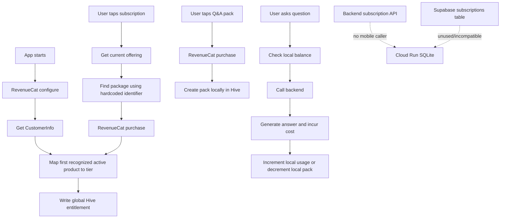

# CoverWise Billing, Entitlements, RevenueCat, Consumables, Subscription Lifecycle, and Financial Integrity Audit

**Date:** 2026-07-20  
**Repository:** `pranaysuyash/insurance_q`  
**Branch:** `main`  
**Commit audited:** `9e42b54a159025fd1d5268495df2be9acbda90c7`  
**Previous area-audit commit:** `ace259055c86ba8f8e9d6e4790831be8f788741d`  
**Evidence tier:** Tier 1 static inspection  
**Runtime evidence:** no combined GitHub status and no workflow run attached to the audited commit  
**Risk class:** high  
**Doctrine:** `motto_v4.md`, which retains the v3 rules and requires Tier 3 or higher evidence for payments, refunds, activation, external webhooks, and customer-visible financial language.

---

## Executive Summary

CoverWise now contains a real RevenueCat mobile SDK integration and substantially better purchase UI than the earlier billing stubs.

The useful pieces include:

- one Riverpod-owned `EntitlementService` shared with the billing adapter;
- RevenueCat offering, purchase, customer-info, and restore calls;
- explicit Free, Plus, and Family plan models;
- optional Q&A packs;
- monthly and annual pricing surfaces;
- current-plan and balance UI;
- FIFO pack consumption;
- a backend subscription route skeleton;
- monetization research aligned with the permanent non-regulated product boundary;
- widget and local model tests.

These pieces do **not** yet form a financial system.

The active authorization path is effectively:

```text
RevenueCat client response
  -> mutable global Hive entitlement
  -> UI decides which features appear available
```

The system does not establish the required chain:

```text
verified store transaction
  -> stable CoverWise principal
  -> immutable billing event
  -> durable entitlement projection
  -> server-side authorization
  -> exact-once usage consumption
  -> refund/cancellation reconciliation
  -> operator audit
```

This creates failures in both directions:

- a modified or stale client can consume expensive backend capabilities without a valid paid entitlement;
- an honest paying user can lose access or consumable credits after a crash, failed local write, reinstall, account switch, or device change.

### Headline findings

- Paid plans and limits are not enforced by the backend.
- Paid state and usage balances are mutable, device-global Hive data.
- RevenueCat identity is not linked to the CoverWise principal.
- The mobile app never calls the new subscription-sync endpoint.
- The endpoint itself trusts client claims and stores them in ephemeral SQLite.
- No RevenueCat webhook or server verification exists.
- Expired or malformed paid entitlements can still receive paid Q&A capacity.
- Consumable packs are granted through a non-idempotent local write after payment.
- Q&A usage is decremented locally after model work has already occurred.
- Account deletion does not address an active auto-renewing store subscription.
- Billing can report ready when RevenueCat is unconfigured or synchronization failed.
- Static prices, savings, renewal, and proration claims are not store-derived.
- Privacy and Terms do not accurately describe the new billing data or lifecycle.
- No Tier 3 or higher payment evidence exists.

## Release decision

**NO-GO for enabling real-money purchases in a production store build.**

RevenueCat is still an appropriate provider. Subscription monetization remains directionally correct. Real charges must stay disabled until paid value is durable, restorable, server-enforced, reconcilable, and explainable.


---

## 1. Scope

### Mobile billing and entitlements

- `mobile/lib/services/billing_adapter.dart`
- `mobile/lib/services/entitlement_service.dart`
- `mobile/lib/providers/entitlement_provider.dart`
- `mobile/lib/models/entitlement.dart`
- `mobile/lib/models/qa_pack.dart`
- `mobile/lib/screens/upgrade_screen.dart`
- `mobile/lib/screens/qa_packs_screen.dart`
- `mobile/lib/screens/qa_screen.dart`
- `mobile/lib/screens/documents_screen.dart`
- `mobile/lib/screens/profile_screen.dart`
- `mobile/lib/services/auth_service.dart`
- `mobile/lib/config/app_config.dart`
- `mobile/lib/main.dart`
- `mobile/pubspec.yaml`

### Backend and data

- `src/api/subscription.py`
- `src/api/document.py`
- `src/api/user.py`
- `src/utils/anti_abuse.py`
- `supabase/migrations/2026_07_18_revops_tables.sql`
- `src/app/main.py`

### Product and legal contracts

- `docs/legal/privacy_policy.md`
- `docs/legal/terms_of_service.md`
- `docs/planning/coverwise_monetization_ads_responsible_data_research_2026-07-16.md`
- `docs/planning/coverwise_revops_system_2026-07-18.md`
- `motto_v4.md`

### Tests reviewed

- `mobile/test/entitlement_test.dart`
- `mobile/test/qa_pack_test.dart`
- `mobile/test/upgrade_screen_test.dart`

This audit did not execute RevenueCat sandbox purchases, App Store or Play Store billing, webhooks, refunds, reinstalls, multi-device restoration, or server authorization tests.


---

## 2. First-Principles Financial Contract

A reliable paid-software system needs six independent truths.

### 2.1 Transaction truth

The system must know whether a real store transaction occurred, including:

- provider and environment;
- store;
- transaction ID;
- original transaction ID;
- product ID;
- offering/package;
- amount and currency;
- purchase timestamp;
- lifecycle event timestamp;
- refund, chargeback, and revocation status.

### 2.2 Customer truth

A transaction must be owned by one stable CoverWise principal.

An installation-anonymous RevenueCat customer is not sufficient once CoverWise supports:

- accounts;
- account switching;
- anonymous-to-account claims;
- cross-device restoration;
- deletion;
- support and refunds.

### 2.3 Entitlement truth

The system must derive active capabilities from verified events and account for:

- tier;
- expiry;
- cancellation;
- `willRenew`;
- grace period;
- billing issue;
- product change;
- refund;
- chargeback;
- store revocation.

### 2.4 Usage truth

Paid capacity requires a ledger:

```text
grant
  -> reserve
  -> settle
or
  -> release
  -> expire/revoke
```

One mutable monthly counter is not a financial ledger.

### 2.5 Authorization truth

Every costly or premium operation must be authorized server-side:

- policy upload;
- Q&A;
- comparison;
- advanced search;
- family workspace;
- emergency capability if plan-gated;
- annual review;
- cloud synchronization.

UI hiding is not authorization.

### 2.6 Customer communication truth

Prices, taxes, savings, renewal, cancellation, grace periods, refunds, and pack expiry shown to users must come from verified provider state and the current store product.


---

## 3. What Is Genuinely Good

### 3.1 RevenueCat is a sensible purchase abstraction

RevenueCat is appropriate for:

- offering retrieval;
- store purchase presentation;
- receipt validation at the provider;
- subscription lifecycle events;
- customer information;
- restoration and management links.

It should be retained as the provider boundary, but its client callback must not be the final CoverWise authorization record.

### 3.2 The shared client service fixed a real inconsistency

The UI notifier and `BillingAdapter` now share one `EntitlementService` instance. This is better than two independent instances reading and writing unrelated state.

Keep one client cache service.

### 3.3 Plan metadata is centralized

Plan limits and feature flags live in one registry. This is useful for:

- display;
- generated client configuration;
- tests;
- feature descriptions.

The same constants must not remain the authoritative financial policy.

### 3.4 Pack consumption has an explicit rule

The intended order is:

1. subscription allocation;
2. earliest-expiring pack.

That is a reasonable customer contract when implemented atomically in a server ledger.

### 3.5 Purchase UI has useful interaction patterns

The app has:

- current-plan display;
- monthly/annual selector;
- loading states;
- balance display;
- pack expiry display;
- success feedback;
- manage-subscription entry point.

These surfaces are worth preserving after the financial authority is corrected.

### 3.6 Monetization direction remains product-aligned

Charging for neutral software capacity is compatible with the permanent decision to reject:

- insurance commissions;
- lead sales;
- product ranking;
- solicitation;
- behavioural advertising inside the policy workspace.


---

## 4. Current Flow



There is no durable financial handoff between provider transaction, CoverWise principal, backend capability authorization, and usage settlement.


---

## 5. P0 Findings


### P0-01: Paid authorization exists only on the client

The backend Q&A and upload routes verify bearer ownership but do not check an active plan, capability, monthly allocation, or pack balance. A modified client or direct API caller can consume model, retrieval, OCR, and storage resources without a valid paid entitlement.

**Move:** add server dependencies such as `require_capability("qa.ask")` and `require_capability("policy.upload")`, backed by canonical server entitlements.


### P0-02: The financial source of truth is mutable global Hive state

`entitlement_v1` stores plan, expiry, usage, packs, and balances in the global app-state box.

It can be modified, cleared, lost on reinstall, duplicated across devices, and inherited across CoverWise accounts.

**Move:** Hive becomes a derived cache only. Grants and debits originate in the server ledger.


### P0-03: RevenueCat identity is not linked to the CoverWise principal

The app configures RevenueCat but never calls `Purchases.logIn(stablePrincipalId)` or reconciles RevenueCat identity on auth transitions.

Cross-device restore, account switching, anonymous claim, deletion, support, and refunds therefore have ambiguous ownership.

**Move:** require an account before purchase and bind RevenueCat to the immutable CoverWise principal.


### P0-04: Another CoverWise account can inherit paid state

Supabase sign-out does not clear/rebind the global entitlement cache or RevenueCat customer. On a shared device, account B can inherit account A's plan and pack balance.

This is unauthorized value transfer and an identity defect.


### P0-05: No RevenueCat webhook or server verification exists

The server has no authoritative path for purchase, renewal, cancellation, expiration, billing issue, grace, product change, refund, chargeback, transfer, or revocation events.

It cannot make a reliable authorization decision or explain why access changed.


### P0-06: The backend subscription endpoint is unused, client-authoritative, and ephemeral

The mobile app declares `subscriptionSyncEndpoint` but does not call it. The endpoint accepts plan and expiry claims from the client, calls the client the source of truth, and writes to `insurance_app.db`.

Even if wired, it would permit plan spoofing and lose state on Cloud Run restart.


### P0-07: Expired or malformed paid plans retain paid Q&A capacity

`hasSubscriptionQuestionsRemaining` checks only the counter against the tier limit. It does not require `isActive`.

The Q&A screen gates directly on `hasQuestionsRemaining`, so stale paid state with a past or missing expiry can retain 200 or 500 questions.


### P0-08: The centralized paid-feature gate is unused

`EntitlementNotifier.checkAction()` defines capability rules, but product screens do not call it. Family, Compare, Search, Emergency, and Q&A routes remain directly reachable.

The app sells features that are not protected.


### P0-09: Advertised paid features are accessible free or not meaningfully differentiated

Family is a bottom-navigation destination for every user. Compare, Search, Emergency, and cloud-backed uploads are routed without verified plan authority.

Before monetizing a feature, CoverWise must prove that the feature exists, has distinct value, and is enforceable on both client and server.


### P0-10: Product policy limits conflict with backend anti-abuse limits

The product advertises 1, 10, and 50 policies, while generic backend limits are approximately five session/monthly uploads and do not understand plans.

A free user can bypass local limits, while an honest paid user can be blocked below the advertised plan capacity. Abuse budgets and purchased capacity must be separate server concepts.


### P0-11: Monthly Q&A usage is local and non-atomic

The app checks local balance, incurs backend/model work, then decrements locally after a non-empty answer.

Direct calls, crashes, timeouts, concurrent submissions, reinstall, device changes, and clock manipulation all create free or duplicated usage.

**Move:** server-side reserve, settle, and release with an idempotent operation ID.


### P0-12: Q&A pack credit is a non-idempotent local write after payment

After RevenueCat success, `addPack()` creates a local pack without transaction identity.

A crash can lose paid credit, a repeated callback can duplicate it, and a failed Hive write can still lead to success UI.

A verified transaction must create exactly one durable server grant.


### P0-13: Consumable packs cannot be reliably restored

Restore refreshes subscription entitlements but cannot reconstruct consumed and remaining pack grants. No restore UI exists.

Unused purchased value can disappear after reinstall or device change before the advertised 90-day expiry. Packs must not be sold until a server consumable ledger exists.


### P0-14: Account deletion ignores active auto-renewing subscriptions

Deleting a CoverWise account does not detect or address the separate App Store/Play subscription.

A user can delete the app account and continue being charged.

**Move:** show verified billing state, provide management access, require acknowledgment, and define billing identity retention/detachment before deletion.


### P0-15: Billing can report ready when unconfigured or stale

`billingInitProvider` returns success when the RevenueCat key is absent. `syncEntitlement()` catches synchronization failures and does not rethrow. Upgrade UI treats `AsyncData` as ready in both cases.

Use typed states: `unconfigured`, `initializing`, `ready_verified`, `degraded_cached`, and `unavailable`.


### P0-16: Payment and local persistence failures can produce false success

`EntitlementService.save()` suppresses errors. `setPlan()` and `addPack()` can fail to persist but return normally, allowing the adapter and UI to report successful delivery.

Payment success and benefit delivery need a recoverable reconciliation state.


### P0-17: All purchase failures are classified as cancellation

The adapter catches all errors and returns `null`. The UI records null as `user_cancelled`.

Product missing, payment decline, network failure, SDK misconfiguration, pending transaction, and cancellation become indistinguishable.

Return a typed purchase result with provider category, retryability, safe message, and delivery state.


### P0-18: Prices and savings are hard-coded rather than store-derived

Plans and packs contain static rupee strings, static price-per-question calculations, and “Save up to 44%.”

Actual store price may differ by locale, currency, tax, platform, promotion, or price change.

All purchasable financial display must come from the current `StoreProduct` or provider offering.


### P0-19: Package selection relies on a fragile identifier assumption

The adapter constructs a product-like ID and searches RevenueCat `Package.identifier`. Package identifier and store product identifier are distinct concepts unless explicitly configured to match.

A product catalog must map internal product, offering, package, store product, and entitlement IDs and validate them at startup.


### P0-20: Subscription lifecycle changes are not observed continuously

There is no CustomerInfo update listener, app-resume reconciliation, or server webhook.

Cancellation, refund, billing issue, renewal, grace, and store-management changes can leave stale access active.


### P0-21: Multiple active entitlements can resolve to an arbitrary tier

The adapter returns after the first recognized active product. If Plus and Family overlap during migration or configuration, iteration order controls the tier.

Use deterministic precedence and retain the source entitlement.


### P0-22: Legal and privacy documents do not describe the billing system

The Privacy Policy says CoverWise does not collect financial information or payment details, while the new path processes product IDs, subscription status, expiry, RevenueCat customer identity, and possibly raw CustomerInfo.

Terms omit auto-renewal, store billing, localized price, taxes, cancellation effect, refunds, grace, pack expiry/restoration, and account deletion versus subscription cancellation. Governing law remains a placeholder.

Real-money charging must remain disabled until corrected and reviewed.


---

## 6. P1 Findings


### P1-01: No user-facing Restore Purchases surface exists.


### P1-02: The RevenueCat public key is not required by release validation.


### P1-03: There is no platform-specific billing capability matrix.


### P1-04: No stable RevenueCat customer mapping is stored server-side.


### P1-05: The backend sync route accepts anonymous principals.


### P1-06: The backend can store free but return the caller's invalid tier.


### P1-07: Expiry is accepted as untyped text and malformed values can remain active.


### P1-08: Raw RevenueCat CustomerInfo is retained in SQLite without a lifecycle.


### P1-09: The Supabase subscription schema models Dodo/Razorpay rather than the active RevenueCat path.


### P1-10: Monthly quota resets by device calendar month rather than a defined billing period.


### P1-11: Device time controls plan expiry, pack expiry, and monthly reset.


### P1-12: `copyWith` cannot intentionally clear nullable expiry values.


### P1-13: The local entitlement lacks product, store, environment, will-renew, grace, billing-issue, and verification fields.


### P1-14: The UI labels `expiresAt` as `Renews` without knowing `willRenew`.


### P1-15: The FAQ promises immediate prorated plan changes too broadly.


### P1-16: `Free forever` is an unnecessary permanent financial promise.


### P1-17: `Best value` and savings claims are not recalculated from store prices.


### P1-18: One purchase does not disable other plan and pack purchase buttons globally.


### P1-19: No pending, deferred, interrupted, or externally completed transaction state exists.


### P1-20: Returning from subscription management does not trigger reconciliation.


### P1-21: Generic store subscription URLs are used rather than a provider customer-management URL when available.


### P1-22: Pack identity has no provider transaction/grant ID.


### P1-23: Pack deserialization does not validate negative, oversized, or temporally invalid values.


### P1-24: Comments claim expired packs are pruned on every read, but `current()` does not prune them.


### P1-25: Hive read-modify-write usage has no version, reservation, or compare-and-swap.


### P1-26: Billability is inferred from non-empty answer text rather than a server outcome code.


### P1-27: Free policy limit counts only device-local documents.


### P1-28: Billing state is not reconciled on sign-in, OAuth callback, anonymous claim, sign-out, or account deletion.


### P1-29: No refund or chargeback adjustment exists for consumable packs.


### P1-30: No operator reconciliation workflow exists.


### P1-31: Purchase analytics omit provider outcome, localized amount/currency, environment, delivery, and reconciliation state.


### P1-32: Billing tests are model/widget/fake-adapter tests rather than provider and server lifecycle tests.


### P1-33: No current CI or Tier 3 payment evidence exists.


---

## 7. Target Financial Architecture

### 7.1 Stable billing identity

```text
billing_customers
  principal_id
  revenuecat_app_user_id
  created_at
  detached_at
```

Rules:

- require a CoverWise account before real-money purchase;
- call `Purchases.logIn(principal_id)`;
- reconcile identity on every auth transition;
- define account-switch, anonymous-claim, and deletion behaviour;
- keep anonymous use free-only.

### 7.2 Immutable provider event ledger

```text
billing_events
  id
  provider
  provider_event_id UNIQUE
  event_type
  environment
  store
  app_user_id
  original_transaction_id
  transaction_id
  product_id
  entitlement_id
  occurred_at
  received_at
  signature_verified
  processing_status
```

Webhook ingestion must be authenticated, idempotent, retryable, and auditable.

### 7.3 Subscription projection

```text
subscriptions
  id
  principal_id
  product_id
  plan_tier
  status
  period_start
  period_end
  will_renew
  cancellation_at
  grace_period_end
  billing_issue_at
  provider_updated_at
  source_event_id
```

This is the current projection, not immutable history.

### 7.4 Capability entitlement projection

```text
entitlements
  principal_id
  capability
  active
  limit
  valid_from
  valid_until
  source_type
  source_id
  version
```

Examples:

- `policy.max_count = 10`;
- `qa.monthly_grant = 200`;
- `policy.compare = true`.

### 7.5 Usage ledger

```text
usage_ledger
  id
  principal_id
  capability
  operation_id UNIQUE
  entry_type: grant | reserve | settle | release | expire | revoke
  quantity
  balance_after
  source_id
  created_at
```

Question execution:

```text
reserve one unit
  -> perform query
  -> settle if customer result delivered
or
  -> release on internal failure
```

Retries reuse the same operation ID.

### 7.6 Consumable grant ledger

A verified pack transaction creates one server grant:

```text
transaction_id UNIQUE
principal_id
quantity
remaining
purchased_at
expires_at
status
```

Restore and multiple devices read the same ledger.

### 7.7 Product catalog

```text
product_catalog
  internal_product_id
  plan_tier / pack_type
  platform
  offering_id
  package_id
  store_product_id
  entitlement_id
  capability_grants
  active
  config_version
```

Prices remain provider/store data, not catalog constants.

### 7.8 Server authorization

Every protected operation evaluates:

- principal;
- capability;
- current entitlement;
- operation ID;
- remaining usage;
- abuse controls.

The mobile app displays the decision. It cannot create it.


---

## 8. Ordered Remediation

### Commit group A: Freeze unsafe purchase exposure

1. Hide or disable real purchase actions outside sandbox/internal builds.
2. Introduce an explicit billing-unavailable state.
3. Remove hard-coded renewal, proration, savings, and authoritative price claims.
4. Add an active-subscription warning to account deletion.
5. Correct Privacy Policy and Terms.
6. Ensure no production build can charge a user.

### Commit group B: Principal and RevenueCat identity

1. Require an account before purchase.
2. Bind RevenueCat to the stable principal.
3. Handle sign-in, OAuth, anonymous claim, sign-out, account switch, and deletion.
4. Build account-switch and device-change tests.
5. Define transfer and restore behaviour.

### Commit group C: Server event and entitlement projection

1. Add authenticated RevenueCat webhook ingestion.
2. Store idempotent provider events.
3. Project subscription state.
4. Project capability entitlements.
5. Add an operator reconciliation view.
6. Remove production SQLite subscription truth.

### Commit group D: Server usage and consumables

1. Add a Q&A grant/reservation ledger.
2. Create pack grants only from verified transactions.
3. Implement reserve, settle, and release.
4. Enforce upload and premium capabilities server-side.
5. Handle refunds and revocations.
6. Add exact-once and concurrent tests.

### Commit group E: Store-derived UI

1. Load current offerings and product metadata.
2. Validate the product catalog.
3. Display localized store prices.
4. Show verified status, expiry, `willRenew`, billing issue, and grace.
5. Return typed purchase outcomes.
6. Refresh on app resume and after management.
7. Add restore and reconciliation UI.


---

## 9. Required Verification

### RevenueCat sandbox lifecycle

- new Plus and Family subscriptions;
- monthly and annual;
- upgrade and downgrade;
- cancellation;
- renewal;
- billing issue;
- grace period;
- expiry;
- refund/revocation;
- restore after reinstall;
- second device;
- account A to account B;
- anonymous to account.

### Consumables

- purchase success;
- duplicate callback;
- crash after payment before client response;
- reinstall;
- multiple devices;
- simultaneous purchases;
- refund;
- expiry;
- concurrent Q&A;
- timeout and retry.

### Server authorization

- forged client cannot grant a tier;
- direct Q&A API checks balance;
- direct upload API checks entitlement;
- free principal cannot call premium capability;
- refunded subscription loses access;
- provider/server outage follows an explicit fail policy;
- stale client cache cannot overrule server.

### Financial language

- displayed price equals store confirmation;
- correct locale, currency, tax, and period;
- savings are calculated from current products;
- `willRenew` wording;
- cancellation and grace wording;
- deletion warning;
- pack expiry and restore policy.

### Operator evidence

- provider event trace;
- subscription and entitlement projection;
- usage operation;
- safe error classification;
- delivery/reconciliation status;
- no receipt or secret leakage.


---

## 10. Immediate File Work Map

### Mobile authority boundary

- `mobile/lib/services/billing_adapter.dart`
- `mobile/lib/services/entitlement_service.dart`
- `mobile/lib/providers/entitlement_provider.dart`
- `mobile/lib/models/entitlement.dart`
- `mobile/lib/models/qa_pack.dart`
- `mobile/lib/services/auth_service.dart`

### Paid UI and copy

- `mobile/lib/screens/upgrade_screen.dart`
- `mobile/lib/screens/qa_packs_screen.dart`
- `mobile/lib/screens/qa_screen.dart`
- `mobile/lib/screens/documents_screen.dart`
- `mobile/lib/screens/profile_screen.dart`
- `mobile/lib/config/app_config.dart`

### Server and data

- `src/api/subscription.py`
- `src/api/document.py`
- `src/api/user.py`
- `supabase/migrations/2026_07_18_revops_tables.sql`
- new billing-event, entitlement, and usage-ledger migrations
- new RevenueCat webhook service

### Legal

- `docs/legal/privacy_policy.md`
- `docs/legal/terms_of_service.md`

### Verification

Replace fake-only completion evidence with RevenueCat sandbox, webhook, server authorization, and exact-once usage tests.


---

## 11. Decisions

### Keep

- RevenueCat;
- subscription-first monetization;
- optional Q&A packs only if a durable consumable ledger is built;
- Free, Plus, and Family as product hypotheses;
- one local entitlement cache;
- monthly/annual interaction pattern;
- balance and expiry visibility;
- restore concept;
- software-capacity monetization.

### Change

- Hive authority to server projection;
- installation-anonymous billing identity to stable principal identity;
- static prices to store prices;
- null purchase results to typed outcomes;
- local counters to a usage ledger;
- client subscription sync to provider webhook projection;
- UI-only gates to server capability checks;
- account deletion to a billing-aware lifecycle.

### Remove or disable until rebuilt

- production real-money purchase actions;
- hard-coded authoritative prices;
- `Renews` without `willRenew`;
- universal proration claim;
- `Free forever`;
- local-only consumable grants;
- client-asserted paid tiers;
- paid feature promises that are not enforceable.


---

## 12. Motto v4 Alignment

| Principle | Current state | Judgement |
|---|---|---|
| Whole-answer mandate | Violated | Purchase UI shipped without the full financial lifecycle |
| No parallel truth sources | Violated | RevenueCat, Hive, SQLite, and unused Supabase state conflict |
| Evidence-tier honesty | Violated | Payment work has only static/unit evidence |
| Risk-based verification | Violated | No refund, retry, duplicate, account-switch, or provider lifecycle verification |
| Customer financial language | Violated | Static prices, renewal, proration, and savings claims |
| Completion means adopted | Violated | Server sync and subscription table are not active authority |
| End-to-end flow | Violated | Transaction does not reach server authorization and usage |
| Operator visibility | Violated | No financial reconciliation |
| Recovery path | Violated | Crash/reinstall can lose consumable value |
| Long-term architecture | Partial | RevenueCat is right; the authority boundary is wrong |
| Anything-else sweep | Applied | Surfaced deletion, legal, feature, cost, and abuse conflicts |


---

## 13. Release Gate

Real-money billing may be enabled only when:

- RevenueCat is linked to a stable CoverWise principal;
- provider events are verified and idempotent;
- Supabase holds canonical subscription and entitlement state;
- direct backend calls enforce capabilities;
- Q&A uses reserve, settle, and release;
- consumables have transaction-backed grants;
- reinstall and device change preserve purchased value;
- refunds and revocations reconcile;
- account deletion addresses active billing;
- prices are provider/store-derived and localized;
- legal and financial copy is accurate;
- paid features are real and enforceable;
- sandbox lifecycle tests pass;
- current CI provides Tier 3 or higher evidence;
- operator reconciliation exists.


---

## 14. Anything Else?

Yes. The audit surfaced four load-bearing product decisions.

### 14.1 Account requirement

Real-money purchase should require a stable CoverWise account. Anonymous purchase creates unacceptable ownership, restore, refund, and deletion ambiguity.

### 14.2 Plan differentiation

Plus and Family must be revalidated against actual product capabilities. Family, Compare, Search, Emergency, and cloud-backed storage are currently available or routable without paid authority.

### 14.3 Unit economics

The proposed 200 and 500 monthly AI-question allocations may be unsafe until model cost, retrieval cost, abuse, caching, and heavy-user behaviour are measured. Limits belong in a server-configured catalog, not app constants.

### 14.4 Consumable decision

Q&A packs are viable only with a durable transaction and usage ledger. Without it, remove packs rather than risk taking payment without recoverable delivery.


---

## 15. Bottom Line

The current work is a useful RevenueCat SDK and purchase-UI prototype. It is not a release-grade financial system.

The correct long-term shape is:

```text
RevenueCat verified event
  -> stable CoverWise principal
  -> immutable billing event
  -> subscription and entitlement projection
  -> server capability authorization
  -> exact-once usage ledger
  -> client cache and truthful UI
  -> refund, deletion, and reconciliation
```

CoverWise should keep RevenueCat and keep subscription monetization.

It should not charge a user until paid value is durable, restorable, enforceable, and explainable.
