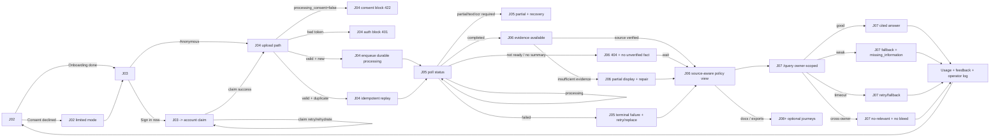

# System Exploration Map

## Mobile local-model evaluation and runtime frontier (2026-07-26)

### Active canonical status (2026-07-26)

For this request, treat these files as your current canonical set:

- [`mobile_model_gatebook_2026-07-26.md`](mobile_model_gatebook_2026-07-26.md) — one-file authority for evaluated vs catalog/scaffold by stage and execution lane.
- [`mobile_model_shortlist_truth_and_gaps_2026-07-26.md`](mobile_model_shortlist_truth_and_gaps_2026-07-26.md) — concise list of what ran, what is scaffold-only, and what is catalog-only.
- [`mobile_model_full_evaluation_compendium_2026-07-26.md`](mobile_model_full_evaluation_compendium_2026-07-26.md) — all 77 frontier entries with lane-by-lane status.
- [`mobile_model_77_frontier_mobile_execution_matrix_2026-07-26.md`](mobile_model_77_frontier_mobile_execution_matrix_2026-07-26.md) — explicit 77-row mobile execution matrix (model-by-model) with status + why.
- [`mobile_model_frontier_2026_plus_truth_matrix_2026-07-26.md`](mobile_model_frontier_2026_plus_truth_matrix_2026-07-26.md) — matrix by Android/iOS candidacy, transformers.js, and fine-tune status.
- [`mobile_model_frontier_2026_plus_truth_matrix_2026-07-26.md`](mobile_model_frontier_2026_plus_truth_matrix_2026-07-26.md) includes a source integrity check (`77 / 77` source-to-matrix coverage) against `recent_models_2024_plus_inventory_2026-07-25.json`.
- [`mobile_model_execution_readiness_matrix_2026-07-26.md`](mobile_model_execution_readiness_matrix_2026-07-26.md) — ready/scaffold/no-path by execution lane.
- [`mobile_model_execution_decision_sheet_2026-07-26.md`](mobile_model_execution_decision_sheet_2026-07-26.md) — canonical single-page decision sheet for this request (evaluated vs not, stage/lane boundaries, shortlist, and next gates).
- [`mobile_model_execution_ledger_2026-07-25.md`](mobile_model_execution_ledger_2026-07-25.md) — execution ledger by model and stage.
- [`mobile_model_key_surface_inventory_2026-07-25.md`](mobile_model_key_surface_inventory_2026-07-25.md) — cross-project paid-key inventory.
- [`docs/technical/mobile_local_model_evaluation_2026-07-24.md`](../technical/mobile_local_model_evaluation_2026-07-24.md) — legacy technical context.

### Update (2026-07-26 continuation)

The latest truth pass is now captured in:
[`mobile_model_truth_addendum_2026-07-25.md`](mobile_model_truth_addendum_2026-07-25.md).
Freshly added in this continuation:
- Hosted smoke continuation: `docs/review/evidence/provider-smoke/continuation-combined-2026-07-26c.json` (OpenAI 3/3, OpenRouter 2/3, HF 2/3)
- OpenRouter `gemma-3-4b-it` continuation: `docs/review/evidence/provider-smoke/continuation-combined-gemma3-2026-07-26c.json` (1/3)
- Device harness run: `docs/review/evidence/local-model-eval/mobile-ondevice-harness-2026-07-26b.json` (3/3 control-path)
It explicitly separates:

- what is actually run in repo evidence,
- what is scaffold/candidate-only,
- and what is hosted or desktop-only.

Latest correction from this pass:
`flutter devices` is showing attached runtimes (`iPhone 17` simulator, `macOS`, `Chrome`), and
the on-device test harness can reach install path logic when `ON_DEVICE_TEST_INSTALL_ATTEMPT`
flags are set. That is not the same as a production-like run: no real `.task` download,
install, load, or ask-on-device proof was completed.

Additional 2026-07-25 continuation checkpoint:
we re-ran the same seam checks in this turn and confirmed the state is unchanged:
the mobile on-device runtime path is scaffolded and key-gated, but no Android/iOS
`install -> load -> ask` artifact proof has been produced in-repo.

Disk has been tight across passes; we now track it as a recurring constraint and a
pre-run check item before large mobile artifacts are attempted.

For the concrete "what is evaluated vs not-evaluated" inventory (including pipeline
stage tags and mobile-runtime lane tags), use:
[`mobile_model_evaluation_inventory_2026-07-25.md`](mobile_model_evaluation_inventory_2026-07-25.md).
For the full model/lane compendium with execution metrics + cross-project key
inventory + fallback chain reasoning, use:
[`mobile_model_full_evaluation_compendium_2026-07-25.md`](mobile_model_full_evaluation_compendium_2026-07-25.md).
For the 2026-07-26 frontier truth table with all 77 model entries and explicit
pipeline-stage/Android+iOS/transformers.js/fine-tune statuses, use:
[`mobile_model_frontier_2026_plus_truth_matrix_2026-07-26.md`](mobile_model_frontier_2026_plus_truth_matrix_2026-07-26.md).
For a concrete provider key-surface inventory (names only, values omitted), use:
[`mobile_model_key_surface_inventory_2026-07-25.md`](mobile_model_key_surface_inventory_2026-07-25.md).
That file now includes a dedicated section "Mobile-ready model/options matrix requested
in this pass" with stage-tagged local/offline, hosted, and catalog-only status.
For a tighter one-page "evaluated vs not / catalog-only vs scaffold" decision sheet
for this exact pass, use:
[`mobile_model_runtime_execution_inventory_2026-07-25.md`](mobile_model_runtime_execution_inventory_2026-07-25.md).
For the compact checklist that also includes the transformed shortlist with transform.js/managed-runtime/fine-tune visibility, use:
[`mobile_model_shortlist_truth_and_gaps_2026-07-26.md`](mobile_model_shortlist_truth_and_gaps_2026-07-26.md).
For the direct shortlist matching your requested criteria (`Android/iOS`, `transformers.js`, HF/OpenRouter/Modal, `fine-tune`, and stage mapping), use:
[`mobile_model_decision_shortlist_2026-07-25.md`](mobile_model_decision_shortlist_2026-07-25.md).
For a consolidated authority sheet tied directly to this same request with fresh test run context and frontier-listing anchors, use:
[`mobile_model_authority_sheet_2026-07-25.md`](mobile_model_authority_sheet_2026-07-25.md).

**Canonical decision register:**
[`mobile_model_exploration_map_2026-07-24.md`](mobile_model_exploration_map_2026-07-24.md).
It is the model-by-model candidate, evidence, device-architecture, and closure
map; this top-level file carries only the strategic pointer and delta.
For the active canonical on-device execution ledger (status as of 2026-07-25), use:
[`mobile_model_execution_ledger_2026-07-25.md`](mobile_model_execution_ledger_2026-07-25.md).

The consolidated strict evidence+evaluation ledger is:
[`mobile_model_evidence_appendix_2026-07-24.md`](mobile_model_evidence_appendix_2026-07-24.md)
for historical strict status.
For the active strict status ledger (evaluated-vs-catalog-only), use:
[`mobile_model_execution_ledger_2026-07-25.md`](mobile_model_execution_ledger_2026-07-25.md).
For the consolidated stage-wise truth map that directly answers:
evaluated vs scaffold vs catalog-only, Android/iOS candidacy, on-device vs hosted
vs Transformers.js/web split, and fine-tune/adapter status in one place, use:
[`mobile_model_evaluation_truth_map_2026-07-25.md`](mobile_model_evaluation_truth_map_2026-07-25.md).

The canonical mobile research record is [`docs/technical/mobile_local_model_evaluation_2026-07-24.md`](../technical/mobile_local_model_evaluation_2026-07-24.md).
A short, first-read map that ties stage-by-stage status and fallback choices is
[`mobile_model_decision_onepager_2026-07-24.md`](mobile_model_decision_onepager_2026-07-24.md).
For the explicit pass/fail by model and execution lane, and what is still missing,
see [`mobile_model_full_truth_register_2026-07-24.md`](mobile_model_full_truth_register_2026-07-24.md).
The short truth is: **no Android/iOS local LLM runtime or real-device model evaluation exists in the current Flutter app yet**. Existing Ollama, MLX, Gemma, Qwen2.5-VL, Surya, and desktop OCR evidence must not be represented as mobile proof.

For the current consolidated stage-by-stage status and reasoned shortlist, use:
[`mobile_model_truth_matrix_2026-07-25.md`](mobile_model_truth_matrix_2026-07-25.md).
For the 2026-07-26 full frontier compendium (all 77 entries, including catalog-only
pipeline-stage mapping), use:
[`mobile_model_full_evaluation_compendium_2026-07-26.md`](mobile_model_full_evaluation_compendium_2026-07-26.md).
For a single-file audited matrix that answers requested "evaluated vs not", "pipeline stage", "transformers.js/on-device", "HF Pro / OpenRouter / Modal", "Android vs iOS", and "fine-tune status", use the canonical:
[`mobile_model_gatebook_2026-07-26.md`](mobile_model_gatebook_2026-07-26.md).
This is the most recent single-source list of:
- evaluated vs scaffold vs catalog-only vs hosted-only
- Android/iOS candidacy
- current blockers and next contract-completion gates

The 2026-07-24 entries below remain valid for historical context; this matrix
is now the active truth reference for decisions and execution planning.

For the full 2025-2026 frontier candidate list (including OCR/parsing specialists
such as Baidu Unlimited-OCR variants and other newer entrants), use:
[`mobile_model_catalog_2025_2026_2026-07-24.md`](mobile_model_catalog_2025_2026_2026-07-24.md) (catalog snapshot).
For the extracted, status-annotated 2024+ frontier register generated from
`document_parsers_extractors_catalog_2026_v2.xlsx`, use:
[`mobile_model_frontier_2024_plus_inventory_2026-07-25.md`](mobile_model_frontier_2024_plus_inventory_2026-07-25.md).

Active status addendum (2026-07-26):
- Device-path evidence is now reproducible for attached runtimes and harness reachability on `iPhone 16e`/`iPhone 17` simulators, `macOS`, and `Chrome`.
- No real production-style `.task` install/load/ask trace has been added yet; current result is still guard-path + harness control coverage only.
- `flutter devices --machine` reports **0 Android targets** in this pass, so Android parity for the on-device milestone remains pending until an Android device is attached.

### Current closure map

| Lane | Current status | Evidence | Next gate |
|---|---|---|---|
| Android Gemini Nano/AICore | Candidate; not integrated | Official Android platform documentation only | Capability detection and real Pixel/AICore device run |
| iOS Foundation Models | Candidate; not integrated | Official Apple framework documentation only | Supported/unsupported device run and OS-model prompt regression |
| Shared custom runtime | Candidate; not integrated | MediaPipe/LiteRT, ExecuTorch, ONNX Mobile, MLC, and llama.cpp docs | Flutter native bridge plus Android/iOS device matrix |
| Transformers.js | Candidate for WebView/mobile-web only | HF WebGPU/WASM docs | Small-model WebView experiment; do not treat as Flutter-native |
| Gemma 3n E2B/E4B | Leading newer shared-model candidate | Google mobile model docs | Export/runtime compatibility and corpus/device benchmark |
| Qwen3 1.7B/4B, Phi-4-mini, SmolLM3 3B, Ministral 3 3B | Newer model candidates | Model cards / runtime availability | Quantization/export, license, corpus, latency, thermal evaluation |
| Hugging Face Pro / Inference Providers | Cloud execution | HF provider/pricing docs | Data-handling approval and hosted benchmark only |
| Modal Labs | Cloud GPU execution | Modal docs | Private hosted benchmark only; never label as on-device |

The required evaluation contract is now recorded: model, pipeline, and data/config layers; held-out policy corpus; source/page grounding; schema validity; latency/memory/thermal/battery; failure/retry/cancellation; network/privacy traces; and real Android/iOS device evidence. “Candidate” is not “evaluated,” and “desktop local” is not “mobile local.” Android/iOS users are not expected to install Ollama; Ollama/MLX/llama-server remain server or developer benchmark lanes only.

The 2026-07-24 cross-project credential recheck added an important correction:
CoverWise has an OpenAI key-name surface; OrbitCover has an OpenRouter
key-name surface; Comfy and the speech model-lab have Hugging Face and Modal
credential names; other projects contain Gemini, Groq, Anthropic, and Together
credential names. These are inventory signals only, not permission to reuse
credentials or send CoverWise policy data. The earlier local Gemma/Qwen timings
are server/desktop comparison evidence only and do not belong in the mobile
execution decision.

### Scope correction — mobile user architecture

The actual question is which models and execution paths an Android/iOS user can
benefit from: platform-managed on-device models, bundled/downloaded native
models, WebView/Transformers.js models, or hosted APIs/private GPU services.
Workstation-installed runtimes are not mobile product options and are tracked
only as benchmark infrastructure.

### Live provider and Modal evidence (2026-07-24)

The reusable synthetic-only provider smoke at
[`tools/evaluate_provider_smoke.py`](../../tools/evaluate_provider_smoke.py)
now separates a discovered credential from a compatible provider response; it
never reads the CoverWise policy corpus. OpenAI `gpt-5-nano` passed 3/3
JSON/refusal/source-ID checks (median 1,237 ms; API reported
`gpt-5-nano-2025-08-07`). OpenRouter Gemini Flash Lite and HF Inference
Providers Qwen3 4B each passed 2/3, while OpenRouter Gemma 3 4B passed 1/3;
each non-passing route failed at least one grounding check and is comparison
only, not an automatic factual fallback. The existing Comfy Modal remote smoke
completed, proving a private-GPU execution account but not a CoverWise model or
mobile evaluation. Exact sanitized artifacts, selected fallback posture, and
fine-tuning gates are in
[`mobile_local_model_evaluation_2026-07-24.md`](../technical/mobile_local_model_evaluation_2026-07-24.md).

### Anything else?

The mobile direction must preserve the existing evidence-backed policy boundary. Local models can assist with bounded extraction, classification, and offline explanation, but cannot become an ungrounded insurance-fact source or silently replace the canonical PyMuPDF/evidence pipeline.

## Monetization and onboarding claim hardening (2026-07-21)

Paywall and Upgrade now have one UI owner, but local RevenueCat-derived state is
still not server-enforced. Customer copy is conditional; entitlement integrity,
usage reservation, refunds, and cross-device reconciliation remain open
research/implementation work.

## Insurance-card action closure (2026-07-21)

The card’s phone and share controls now perform their labeled platform actions.
Sharing is limited to displayed policy fields and includes a verification
disclaimer; claim filing, insurer representation, and proof guarantees remain
out of scope. Platform sheet behavior still needs device-level validation.

## Principal workspace lifecycle hardening (2026-07-21)

Sensitive Hive-box lifecycle is now centralized in
`mobile/lib/services/hive_workspace_service.dart`. Sign-out and authenticated
principal changes reset the cleared workspace and reopen it with the active
principal DEK; analytics and session state are reinitialized. Real two-account
authenticated traversal remains the required Tier 3 evidence.

## 2026-07-22 — Document parsing capability exploration (local + web frontier)

I re-ran the parser exploration against
`/Users/pranay/Downloads/document_parsers_extractors_catalog_2026_v2.xlsx` and
cross-checked frontier sources for OCR, layout/structure, tables, image/figure,
sentence-like structure, and formula/markup extraction.

Current output:

- Workbook breadth remains the primary discovery lane for local capability candidates:
  - `docs/review/evidence/local-model-eval/workbook_class_summary_2026-07-22.json`
  - `docs/review/evidence/local-model-eval/capability_class_coverage_index_2026-07-22.json`
- Frontier scan + benchmark pressure is now updated in
  `docs/review/evidence/local-model-eval/capability_frontier_candidates_2026-07-22.json`.
- Runtime ownership truth remains:
  - `src/ocr/capability_registry.py`
  - `docs/eval/document_intelligence/capability_manifest_v1.json`

Decision posture from this pass:

- Owned (source-linked): native text, scanned OCR, sentence segmentation, layout,
  reading order, digital tables, figures (artifact-preserving), office/web/email
  structure, and native form widgets.
- Candidate: headings/sections, chart-derived understanding, formulas, full form/KVP
  with marks, image-understanding semantics.
- Open: handwriting and multilingual quality claims remain unclosed until corpus-level
  benchmark and review-state gates pass.

2026-07-22 frontier delta since the prior scan:

- Added **RT-DocLayout** (layout + reading-order + distortion/rotation recovery) as a frontier layout candidate.
- Added **MDPBench** as the primary multilingual document parsing benchmark anchor.
- Added frontier coverage fields (`OmniOCR`, `Typhoon-OCR`, `dots.ocr`, `HunyuanOCR-1.5`) under multilingual candidate lanes.

### Requested-lane closure map (2026-07-22 web + workbook pass)

For the exact requested capability lanes, this is the closure posture that should drive execution:

| Capability class | Owned in runtime now | Candidate/fallback lanes | Open gate for launch-safe claims |
|---|---|---|---|
| Text + sentence extraction | `native_text`, `sentence_segmentation`, `scanned_ocr` | Docling, Surya, PP-StructureV3 | locale/script-aware sentence fixtures and confidence-failure telemetry |
| Structures / headings | `layout`, `reading_order`, `headings_and_sections` (candidate) | Docling, MinerU, Surya, GROBID | heading-depth and hierarchy semantics fixtures |
| Layout + reading order | `layout`, `reading_order` | RT-DocLayout, PP-StructureV3, Surya, Docling profiles | rotated/multi-column/low-DPI closure |
| Tables / rows / cells | `tables` (born-digital + office) | Docling, PP-StructureV3, MinerU, TATR/TG | merged/borderless/malformed-grid + continuity fixtures |
| Images / figures / charts | `figures` artifact lineage + hashes | Docling, Marker, Mistral OCR, PP-StructureV3, MMDocBench | crop→bbox→caption provenance + anti-hallucination policy |
| Forms / KVP / marks | `forms` (native widgets), `key_value_extraction` candidate | Azure DI, Google DI, AWS Textract, Paddle KIE | selection-mark + schema-bound review/retry states |
| Formula / math | `formulas` candidate | TexOCR, MinerU, PP-StructureV3, GLM-OCR | formula span grounding + normalization / uncertainty contract |
| Office / web / email | `office_and_email_structure` | Docling/open-source ETL | malformed-container + relationship-preservation fixtures |
| Multilingual | `multilingual` routing signal only | OmniOCR, Typhoon-OCR, HunyuanOCR-1.5, PaddleOCR-VL | script/locale matrix + unsupported-language policy |
| Handwriting | `handwriting` unavailable | specialist OCR/VLM lanes | handwriting corpus and explicit manual-review fallback |

Web pass additions reflected in this run:

- **ParseBench (Apr 2026)** and **MPDocBench-Parse (May 2026)** are now in the benchmark lane for structure/layout/table/heading continuity.
- **Dr.DocBench (May/Jun 2026)** is now the expert-level long-document complexity lane for multi-page structural stress.
- **Dr.DocBench / OCRBench v2 / socOCRbench / Zero-Shot Table extraction (WACV 2026)** are flagged as pressure lanes before any table/formula/chart semantic defaults.

## 2026-07-21 — migration source and deep-link resilience

- **Canonical migration source:** `supabase/migrations/` is the executable
  timestamped chain; `infra/supabase/` is a retained SQL-editor snapshot. The
  equivalence of the first three snapshot files was statically checked, and
  operator-facing references were aligned to prevent applying both sources.
- **Configuration contract:** server code consistently requires
  `SUPABASE_SERVICE_ROLE_KEY`; `.env.example` was corrected to match.
- **Deep-link resilience:** initial-link lookup now has an explicit error path;
  custom-scheme host routing and universal-link path routing remain supported.
- **Open exploration:** verify remote migration history and perform a cold-start
  deep-link traversal on each release platform.
- **Identity lifecycle:** sign-out cleanup now clears service-owned state before
  Hive boxes close and drops the cached principal ID. Same-process sign-in still
  needs an auth-transition-owned reinitialize/reopen cycle before isolation can
  be called end-to-end verified.
- **Offline upload:** local persistence is real, but automatic reconciliation is
  not implemented. User copy now separates local save from server upload; a
  future retry worker must own idempotency, backoff, auth transitions, and
  operator visibility.
- **Deletion semantics:** partial account deletion no longer claims an
  unimplemented durable retry job. The unresolved long-term path is an
  outbox-backed erasure receipt with full inventory, retries, tombstones, and
  operator verification.

## Exploration update: canonical user journey map (2026-07-21)

The canonical journey-shaped source of truth is now [`docs/user_experience/coverwise_user_journey_map.md`](../user_experience/coverwise_user_journey_map.md), governed by [ADR-2026-07-21-01](../decisions/ADR-2026-07-21-01-canonical-user-journey-map.md). It inventories ideal, current, future, rejected, optional, alternate, happy, non-happy, privacy, and operator journeys.

This strategic map remains the source of truth for product boundary and exploration direction. The journey map remains the source of truth for end-to-end user flow. The canonical architecture remains the source of truth for system structure. These are complementary artifacts, not competing architecture or flow documents.

The first reconciliation found that the current mobile surface still contains or references several journeys that need neutralization or separate approval: coverage-gap recommendations, premium/what-if guidance, renewal action language, claims handling implications, and optional health-record expansion. Future exploration must preserve the permanent non-regulated boundary below and must state whether a proposed journey is approved, exploratory, or rejected.

### Anything else?

The most important follow-through is evidence closure: a screen existing is not the same as a reliable end-to-end journey. Auth, document processing, evidence citations, Q&A, billing, deletion, and consent need Tier 3+ proof before their journeys can be described as launch-complete.

## Permanent product boundary (owner decision, 2026-07-16)

CoverWise is a solo, non-regulated personal-information product. It helps users understand and organize policies they already have. It will never sell, solicit, procure, rank, recommend, or renew insurance; represent claims; earn commissions; sell leads; or become insurer/broker infrastructure.

```text
IN SCOPE
  user-owned policy -> extract -> cite -> explain -> organize -> remind
  user-entered health -> store -> chart -> remind -> export

OUT OF SCOPE
  recommend -> rank -> quote -> sell -> paid referral -> renew
  diagnose -> predict disease -> prescribe -> triage -> clinical risk score
  share sensitive signals with insurer/employer/advertiser/data buyer
```

### Existing surfaces requiring alignment

| Surface | Conflict | Direction |
|---|---|---|
| `mobile/lib/screens/coverage_gap_screen.dart` | Recommendations imply needed coverage | Reduce to factual "not found in uploaded documents" or remove |
| `mobile/lib/screens/what_if_calculator_screen.dart` | Premium estimates imply pricing guidance | Remove from product surface |
| `mobile/lib/screens/renewal_calendar_screen.dart` | "Start renewal" resembles an action funnel | Use neutral reminder/contact language |
| `mobile/lib/services/preventive_health_service.dart` | Treatment-planning language becomes medical guidance | Limit to policy-stated benefit reminders and clinician-directed actions |
| `mobile/lib/screens/onboarding_screen.dart` | "Coverage gaps and claim guidance" overstates the role | Reframe as policy details, dates, contacts, and personal records |
| Paid expert/claim services | Advice/representation ambiguity | Rejected |
| Broker/insurer B2B and commission branches | Conflicts with solo consumer neutrality | Rejected |

Health tracking remains exploration, not an approved broad feature. The preferred lane is optional, local-first records, neutral charts, reminders, and export. Diagnosis, treatment, prediction, medical-device claims, insurer use, advertising use, and default training use are prohibited.

### Approved comparative judgment lane

The product may make evidence-based judgments about policies the user already owns. This is not the same as giving an overall insurance recommendation.

Allowed: "Policy B is ₹4,000 cheaper," "Policy A has the shorter listed waiting period," "Policy B lists an additional exclusion," and "we could not verify equivalence because the deductible is missing."

Not allowed: "Policy B is better for you," "switch to Policy B," "Policy A is overpriced," "this is the best plan," or "you are under-insured."

The comparison pipeline must normalize price frequency, taxes, and riders, calculate percentages with an explicit denominator, cite source clauses, expose missing fields, and render only dimension-specific conclusions.

## Exploration update: monetization, ads, and responsible data (2026-07-16)

**Canonical research:** [`docs/planning/coverwise_monetization_ads_responsible_data_research_2026-07-16.md`](../planning/coverwise_monetization_ads_responsible_data_research_2026-07-16.md)

### Strategic branch map

```text
CoverWise: trusted policy intelligence
|
+-- Consumer revenue
|   +-- Free: one useful policy-understanding outcome
|   +-- Plus: household policies, reminders, comparison, higher Q&A
|   +-- Family: sharing, emergency access, annual review
|   `-- Fixed-fee review and claim-packet services
|
+-- Platform revenue
|   +-- Regulated broker/insurer workspace
|   +-- Employer-benefits policy intelligence
|   `-- Tenant-isolated extraction and Q&A API
|
+-- Regulated distribution (later)
|   +-- Technology partnership with regulated entity
|   `-- Appropriate registration after demand proof
|
+-- Advertising
|   +-- Behavioral/ad-network monetization: rejected in core product
|   `-- Fixed contextual sponsor: public education only, if ever
|
`-- Model improvement
    +-- Public wordings and expert cases
    +-- Controlled synthetic documents
    +-- Opt-in corrected structured fields
    `-- Raw redacted samples: gated future research, never default
```

### Opinionated direction

- **Monetize the ongoing job, not sensitive data.** Recurring value is household management, renewal readiness, sourced Q&A, comparison, and claim preparation.
- **Do not become an ad-supported policy viewer.** Ad SDKs create disproportionate privacy, disclosure, trust, and incident surface.
- **No commission path exists.** CoverWise must work for policies bought anywhere and will not participate in distribution.
- **Separate operational and learning data.** Upload permission covers the requested service, not shared-model training.
- **Earn the right to request contributions.** Begin with previewable field corrections. Consider redacted samples only if benchmarks prove material need.

### Exploration update: founder monetization proposal (2026-07-21)

The new [`monetization_research_and_decision_2026-07-21.md`](../planning/product/monetization_research_and_decision_2026-07-21.md)
is recorded as **decision pending**, not as a superseding product decision.
It proposes a 1-policy free tier, 5 questions/month, optional rewarded ads,
one-time ad removal, paid policy/question capacity, and a future commission /
web-aggregator path.

First-principles reconciliation:

- The 1-policy capacity hypothesis is directionally compatible with the current
  companion wedge.
- Rewarded ads require a separate privacy, consent, policy-compliance, and
  trust review; they cannot be implemented merely as an entitlement feature.
- The commission/web-aggregator path conflicts with the permanent non-regulated
  boundary above and requires a separate founder-approved regulated-business
  decision. It is not part of the current CoverWise product map.
- The current implementation remains 1 policy / 20 free questions per month,
  with Plus, Family, and Q&A-pack concepts. The proposal’s 5-question limit,
  rewarded credits, ad-removal entitlement, and grandfathering behavior are
  unresolved contract changes.

Next gate: founder decision on the free-capacity hypothesis and whether ads are
allowed at all; only then define entitlement, consent, billing, analytics, and
abuse/replay contracts.

### New architecture nodes

| Node | Purpose | Current state | Gate |
|---|---|---|---|
| Entitlements service | Canonical plan and usage decisions | Missing | Before paywall |
| Billing adapter | Provider-neutral subscription/reconciliation | Missing | Sandbox and idempotency |
| Commercial disclosure registry | Partner role, compensation, approval | Missing | Before sponsor/referral |
| Purpose/consent ledger | Notice, consent, withdrawal, propagation | Partial UI consent | Before contribution |
| Dataset registry | Provenance, allowed use, expiry, lineage | Missing | Before shared training |
| Contribution quarantine | Isolate opted-in artifacts | Missing | Before customer corpus |
| Privacy release gate | Detection, transformation, review, risk | Missing | Before research release |
| Cost attribution | OCR/LLM/storage cost by safe bucket | Partial LLM tracking | Before pricing |

### Current gaps surfaced by the exploration

- Analytics safety is caller-enforced rather than schema-enforced: the backend currently accepts arbitrary event properties.
- Full questions are used in local Hive feedback keys even though the transmitted feedback event contains only sentiment.
- Processing consent is not a reusable purpose/consent ledger.
- Retention and production deletion behavior remain incomplete in the privacy draft.
- Upload policy limits are currently client-side and asymmetric: native local
  counting is bypassed by the web upload path, and the check is not atomic at
  the server boundary. Entitlement enforcement therefore remains an
  architecture gate, not a completed monetization capability.
- Q&A entitlement is also client-authoritative: the local Hive plan/usage
  cache gates and charges after the response, while `/query` has no server-side
  budget reservation. Billing sync accepts client-declared RevenueCat state
  until webhook/receipt verification is implemented. The canonical future
  shape is one server entitlement/usage ledger shared by upload and Q&A.
- Offline upload currently records `pending_upload` and promises future sync,
  but no mobile pending-upload consumer/retry path is present. This is an
  explicit J03/J04 non-happy-path exploration gate: local persistence is not
  evidence of eventual server delivery.
- No entitlements, billing, commercial disclosure, dataset registry, quarantine, or privacy-release system exists yet.

### Architecture review note (2026-07-16)

Reference: [`docs/review/coverwise_architecture_review_2026-07-16.md`](coverwise_architecture_review_2026-07-16.md)

The current repo shape is strongest when the canonical path stays singular:

- one FastAPI backend as the product runtime;
- one storage/auth/data boundary aligned to the newer platform decision docs;
- one consumer product boundary with the non-regulated scope above;
- compatibility surfaces only when they have a documented retirement trigger.

The review found the most important follow-through areas are retiring legacy service paths, collapsing frontend compatibility fallbacks once contracts stabilize, and neutralizing mobile surfaces that still imply recommendation or renewal behavior.

### Research queue

### 2026-07-21 — J02–J07 implementation deep dive

The onboarding → identity → upload → processing → evidence → Q&A chain was
traced against current code and migrations. The durable audit is
`docs/review/coverwise_j02_j07_deep_dive_2026-07-21.md`; the canonical product
journey remains `docs/user_experience/coverwise_user_journey_map.md`.
The broader current-diff review is
`docs/review/coverwise_diff_review_2026-07-21.md`.

Confirmed exploration items:

- consent purpose vocabulary and server/local recording have a converging contract path
  via server vocabulary sync + retry cache, but consent is still explicitly cache-first
  on offline/unavailable-ledger paths;
- anonymous/account principal migration now has local workspace continuity and encrypted
  key migration hardening, but two-principal migration/restart replay with active runtime
  services is still a Tier 3+ gate;
- upload processing runs through durable outbox in production composition and keeps
  non-production `BackgroundTasks` compatibility explicit; remote queue delivery, dead-letter,
  and restart recovery remain open;
- account deletion route now fences `deleting` state before cleanup and inventory transition
  exists, but cross-service erasure propagation is still a live-retry/open-runtime gate;
- evidence citation verification is present in the main RAG flow and typed extraction is
  stronger, but real-policy cross-owner evidence-owner proof remains open;
- `/query` is the mobile canonical surface and `/documents/query` remains compatibility/legacy;
  deprecation trigger is recorded and not yet executed;
- account-switch isolation, Hive migration, status language, and test teardown have partial
  test closure in this environment; authenticated two-principal Tier 3+ proof is still
  the remaining closure blocker;
- short-viewport Documents overflow and analytics role hardening both have focused regression
  proof and remain open only for applied runtime migration verification.

### 2026-07-22 — J02–J07 status refinement

Additions since 2026-07-21:

- `docs/review/coverwise_j02_j07_deep_dive_2026-07-21.md` now records the current
  verification frontier with one local-invariant closure and one runtime blocker set:
  - (closed in this branch) local principal migration and typed Box safety are now
    proven by `test/migration_integrity_test.dart`.
  - (remaining) two-principal authenticated restart/replay and cross-stack retrieval/
    evidence-owner proof on real documents.

### 2026-07-22 (continuation pass) — live API contract check for J02–J07

The same API stack at `127.0.0.1:8000`/`:8001` was used to add direct
observational evidence to the J02–J07 branch:

- **J02/J04 boundary gates confirmed in runtime**
  - upload requires `processing_consent=true` and `processing_consent_version`.
  - bad/invalid bearer token is rejected (`401`).
- **J04/J05 queue and failure branches confirmed**
  - duplicate/replayed documents are rate-gated with `429` (document fingerprint branch),
  - accepted uploads produce `202` and transition through `status=processing`.
  - processing failure branch is surfaced (`status=failed`, explicit stage/error message).
  - failed documents return `404` for summary/evidence/source endpoints (no false positive trust).
- **J07 route topology and safety**
  - canonical `/query` JSON contract shape is enforced (missing query → `422`),
  - legacy `/documents/query` remains active and returns success payloads (explicitly not canonical).
- **Open in this live lane**
  - cross-owner evidence isolation and authenticated replay for two principals are still not closed,
    and no same-token fully-successful full-policy-to-summary run was completed in this pass.

Priority stays unchanged: complete a full authenticated identity migration and
successful/failed replay path for upload → processing → evidence → Q&A under one
principal transition chain before claiming J02–J07 as Tier 3+ closed.
- A previously open citation-verifier + Supabase-FTS mismatch in this deep dive is now
  closed at the static/fixture layer for the focused verifier/FTS pass (31/77 passing
  command set), and the broader branch probe run now reaches 84 passing tests.
  Runtime live-stack replay remains the remaining high-confidence gate.
- Outbox/lease/process hardening remains the operational gate and should drive the next
  live verification pass.

These are now the next high-priority exploration/implementation gates. They are
not treated as closed by the presence of migrations, ADRs, or UI states alone.

### 2026-07-22 continuation map artifact

The frontier execution for J02–J07 is now represented as a single decision-ready
trace to make branching and owner transitions visible:



### Frontier state after this map pass

| Decision lane | Current lane state | Tier 3+ gap |
|---|---|---|
| J02 | Onboarding and consent checks are observable in-path | Onboarding as a hard server contract still open |
| J03 | Anon-to-account claim is functionally routed and tested | authenticated restart/replay proof across two principals and local encrypted state is open |
| J04 | Duplicate/hash and consent/auth branches are observable | proof that production upload always uses durable outbox branch is open |
| J05 | Failed/partial states remain non-success, with explicit reasons | recovery under restart/crash contention remains open |
| J06 | Unauthorized owner cannot read summary/evidence in this branch | real-policy source-page navigation remains unclosed end-to-end |
| J07 | Canonical `/query` and compatibility fallback behaviors are separated | two-owner real-document citation navigation and contract-proof restart path remains |

### 2026-07-22 continuation pass (Lane B)

- A focused same-token run on `127.0.0.1:8010` repeatedly transitions new uploads to
  `completed_summary_partial` and leaves `/summary` and evidence endpoints closed
  (`No policy summary found` / `Not Found`) while still producing constrained
  Q&A answers with verified citations when source text exists.
- Cross-owner fallback remains strong (`/documents/{id}` and `/query` for mismatched
  owner produce closed or no-relevant states), and compatibility `/documents/query`
  still requires list-form document ids in runtime.
- Opener frontier is unchanged on product value terms but narrowed for proof targets:
  1) close authenticated restart/replay path after anonymous→account migration,
  2) prove true post-transition `summary/evidence/source` readiness for a successful
     single-owner lane, and
  3) verify citation tap/page navigation from a live query result after successful
     evidence availability.

1. Interview 12-20 households after a real policy summary; test Plus value and annual willingness to pay.
2. Build bottom-up unit economics from actual OCR, LLM, storage, support, payment, and tax costs.
3. Review app copy and behavior to remove solicitation, advice, premium prediction, and transactional renewal implications.
4. Compare Indian subscription payment providers and app-store billing rules against the final distribution plan.
5. Interview consumer users about neutral policy organization and optional private health-record needs.
6. Benchmark public+synthetic+expert data against permissioned corrected fields before proposing raw contributions.
7. Design deletion propagation across object, metadata, vector, cache, analytics, quarantine, dataset, and model lineage.
8. Threat-model membership inference, memorization, poisoning, reviewer access, and experiment-tracker leakage.
9. Decide whether permanently banning raw customer documents from shared training should become a public trust promise.

### Explicitly parked

- Behavioral ad SDKs in the authenticated product.
- Leads inferred from uploaded contents.
- Training consent bundled into the privacy policy.
- Cross-customer benchmarks before minimum-cohort and privacy standards.
- Personalized pricing based on premium, claim urgency, health, or financial capacity.
- A second billing, consent, analytics, or training path outside the canonical backend.

## Architecture Overview

```
┌─────────────────────┐
│   Frontend Service   │────▶  Main API (consolidated)
│  src/frontend/app.py │      src/app/main.py
│                      │      ┌──────────────────────────┐
│  Jinja2 templates    │      │  /process-and-ingest     │
│                      │      │  /documents/upload       │
│                      │      │  /documents/query        │
│                      │      │  /query                  │
│                      │      │                          │
│                      │      │  DocumentProcessingService│
│                      │      │  ┌────────────────────┐   │
│                      │      │  │ OCR (PyMuPDF/     │   │
│                      │      │  │      doctr/Docling)│   │
│                      │      │  │ Classify (keyword │   │
│                      │      │  │           /LLM)   │   │
│                      │      │  │ Embed (OpenAI/    │   │
│                      │      │  │   Ollama/MLX/BGE) │   │
│                      │      │  │ Store (Qdrant)   │   │
│                      │      │  └────────────────────┘   │
│                      │      │                          │
│                      │      │  RAGPipeline              │
│                      │      │  ┌────────────────────┐   │
│                      │      │  │ LLM (OpenAI/      │   │
│                      │      │  │   Ollama/MLX)     │   │
│                      │      │  │ Embeddings        │   │
│                      │      │  │ Qdrant + Redis    │   │
│                      │      │  └────────────────────┘   │
│                      │      └──────────────────────────┘
└─────────────────────┘
```

## Architecture Decision: Consolidated Single Backend

### Problem
Two parallel code paths for document processing:
- **Standalone OCR service** (`src/ocr/service.py`) — separate FastAPI process with its own `OCRPipeline()`, Redis cache, httpx client. Frontend proxied to it.
- **Main app** (`src/app/main.py`) — in-process `DocumentProcessingService` with OCR + RAG + classification + anti-abuse + lead capture.

Two paths → duplicate model loading, HTTP latency, Redis sync complexity, code drift.

### Decision
**Consolidate to a single backend.** The pipeline (upload → OCR → classify → embed → store → query) is linear — no stage needs independent scaling. The OCR service's only real benefit was isolating the heavy torch/doctr model, which is a deployment detail, not an architectural need.

### What changed
1. **Added `/process-and-ingest`** to main app — synchronous endpoint matching the OCR service's response contract. Uses the same `DocumentProcessingService` internally.
2. **Updated frontend** — calls `/process-and-ingest` on the main app instead of the OCR service. No more `/cached_ocr_data` Redis round-trip.
3. **Deprecated `src/ocr/service.py`** — marked with `@deprecated` docstring, removal target next major release.

### Architecture (after)
```
Frontend (thin proxy)
  └─ /upload → Main App (in-process: OCR → classify → embed → store)
  └─ /query  → Main App (in-process: embed → search → LLM)
```

One process, one model load, one code path.

## Component Map

### Settings (src/config/settings.py)
- pydantic-settings `Settings` class
- Single `.env` source of truth
- Models: `gpt-5-nano`, `text-embedding-3-small`
- Ollama: `ollama_base_url`, `ollama_chat_model` (llama3.2), `ollama_embedding_model` (nomic-embed-text)

### LLM Client (src/llm/client.py)
- `AsyncOpenAI` wrapper with multi-client support (OpenAI + Ollama)
- `generate()` with retry + semaphore (5 concurrent)
- `generate_structured()` with `json_schema` response format
- `CostTracker` per-call token tracking
- Model fallback: `gpt-5-nano` → `gpt-4o-mini` → `llama3.2` (Ollama)
- `_adapt_response_format()` — auto-converts `json_schema` → `json_object` for unsupported models
- `_supports_json_schema()` — checks model capability set
- `_select_client()` — routes to Ollama client for local models

### OCR Layers

**Layer 1**: `src/ocr/pipeline.py` `OCRPipeline` (shared, single instance)
- Initializes doctr OCR predictor (db_resnet50 + crnn_vgg16_bn) — heavy ~500MB+ download
- `_process_pdf()` — PyMuPDF direct text extraction first, image fallback
- `_process_pdf_with_docling()` — optional Docling parser (opt-in via `DOCLING_ENABLED=true`)
- `_get_ocr_text_for_image()` — doctr OCR for images
- `_get_layout_elements_for_text()` — LLM structured extraction on page text
- `process_document()` — orchestration: PDF/image → text/OCR → LLM extraction

**Layer 2**: `src/ocr/pdf_processor.py` `PDFProcessor`
- Wraps `OCRPipeline` for PDF files
- Accepts shared pipeline instance (no longer creates its own)

**Layer 3**: `src/ocr/image_processor.py` `ImageProcessor`
- Wraps `OCRPipeline` for image files
- Accepts shared pipeline instance (no longer creates its own)

**Service**: `src/ocr/service.py` — **@deprecated**
- Standalone FastAPI service (separate process)
- Being replaced by `/process-and-ingest` on the main app
- Removal target: next major release

### Orchestrator (src/services/document_processing_service.py)
`DocumentProcessingService`
- Used by Main API and Document API
- `process_document_full()` — file storage → OCR extraction → RAG ingestion
- Uses `PDFProcessor` / `ImageProcessor` / text fallback for OCR
- `_split_text_into_blocks()` — structure-aware chunking (section headers, paragraph boundaries)
- `query_documents()` → delegates to `rag_pipeline.query_rag()`

### RAG Pipeline (src/rag/pipeline.py)
`RAGPipeline`
- Embedding fallback: `try OpenAI → try Ollama → try local sentence-transformers`
- Qdrant fallback: `try server → try in-memory`
- Redis cache: `try connect → disable if fails`, used for versioned query-response caching
- `ingest_document_data()` — async embedding + Qdrant upsert
- `query_rag()` — versioned cache lookup → embed query → Qdrant search + local FTS fallback → rerank → structured LLM answer with citations, confidence, and filter support
- `query_rag_structured()` — same + structured output
- Ollama embedding client (OpenAI-compatible, lazy init)

### Document Classifier (src/utils/document_classifier.py)
- Keyword/regex-based with LLM fallback
- 4 types: health, auto, home, life
- 25+ insurers with pattern matching
- Policy number + date regex extraction
- LLM classification via `generate_structured()` when keyword confidence < 0.3
- Used in background after OCR in `api/document.py`

### API Layer

| Route | Router | Auth | Purpose |
|---|---|---|---|
| `/health` | main | No | Health check |
| `/query` | main | No | Root query (mobile app) |
| `/processing/status` | main | No | Background job status |
| `/rag/stats` | main | No | LLM cost + embedding stats |
| `/documents` | main | No | Test documents list |
| `/debug/*` | main | No | Debug endpoints |
| `/users/*` | user | Firebase | User management |
| `/families/*` | family | Firebase | Family management |
| `/policies/*` | policy | Firebase | Policy management |
| `/documents/upload` | document | No (lead gen) | Upload + process |
| `/documents/query` | document | No (lead gen) | Query via RAG |
| `/documents/*` | document | Firebase | CRUD for auth users |
| `/documents/*/status` | document | No | Processing status |

## Fallback Chain Analysis

### 1. Embedding Fallback
```
OpenAI (text-embedding-3-small, 1536d)
  └─ on failure: Ollama (nomic-embed-text, 768d) — local, OpenAI-compatible API
       └─ on failure: local sentence-transformers (all-MiniLM-L6-v2, 384d)
            └─ on failure: exception propagates up
```
**Status**: ✅ 3-tier fallback. Qdrant collection auto-recreates on dimension change.

### 2. Qdrant Fallback
```
Try: QdrantClient(url= configured URL, api_key= configured key)
  └─ on failure: QdrantClient(":memory:")
       └─ on failure: exception propagates up
```
**Status**: ✅ Working, verified in tests

### 3. OCR Fallback (within OCRPipeline)
```
PDF: direct text extraction (PyMuPDF)
  └─ always: also generate page images
Text: use directly extracted text
  └─ if no text: doctr OCR on image
Plus: .txt/.md/.csv/.json/.xml/.html → direct text (new)
```
**Status**: ✅ Working, now includes text-based file support.

### 4. Document Processing OCR Fallback
```
PDF → PDFProcessor (wraps shared OCRPipeline)
Image → ImageProcessor (wraps shared OCRPipeline)
Other extension → read file as text (utf-8)
```
**Status**: ✅ Fixed — lazy initialization with single shared OCRPipeline instance (was creating 3 separate instances before)

### 5. LLM Fallback
```
gpt-5-nano with retry (3 attempts, exponential backoff)
  └─ on permanent error (quota/invalid_key): skip retry → try gpt-4o-mini
       └─ on failure: try llama3.2 (Ollama, local)
            └─ on failure: context-only fallback (raw top source)
```
**Status**: ✅ 3-tier fallback + context-only mode. Response format auto-adapted for unsupported models.

### 6. Classification Fallback
```
RAG query (query_rag) → keyword/regex classification
  └─ if confidence < 0.3: LLM classification via generate_structured()
       └─ on failure: default "Insurance Policy" / "Unknown"
```
**Status**: ✅ LLM fallback added. Uses `generate_structured` with Pydantic schema.

### 7. Redis Cache Fallback
```
Try: connect Redis → ping
  └─ on failure: disable caching
```
**Status**: ✅ Working (graceful degradation)

### 8. Anti-Abuse SQLite Fallback
```
check_document_hash_exists_db(db_path=ANTI_ABUSE_DB_PATH)
  └─ on ImportError: skip hash check (allow upload)
```
**Status**: ✅ DB path configurable via `ANTI_ABUSE_DB_PATH` env var (default: `insurance_app.db`). Tests can set to `:memory:` or temp path.

## Fixes Applied

| # | Fix | File | Impact |
|---|---|---|---|---|
| 1 | `rag_pipeline.query()` → `query_rag()` | `src/utils/document_classifier.py` | Prevents RuntimeError |
| 2 | Shared OCRPipeline via lazy init | `src/services/document_processing_service.py`, `src/ocr/pdf_processor.py`, `src/ocr/image_processor.py` | ~1.5GB RAM, fast startup |
| 3 | Local `sentence-transformers` fallback | `src/rag/pipeline.py` | Works offline, 384d |
| 4 | LLM model fallback chain (gpt-5-nano→gpt-4o-mini→Ollama) | `src/llm/client.py`, `src/rag/pipeline.py` | Survives quota exhaustion |
| 5 | Quota short-circuit in LLM client | `src/llm/client.py` | 429 doesn't retry 3× |
| 6 | Text file support in OCR pipeline | `src/ocr/pipeline.py` | `.txt`/`.md`/`.csv` etc |
| 7 | Date regex fixed in classifier | `src/utils/document_classifier.py` | "Coverage period from X to Y" |
| 8 | `_adapt_response_format()` for json_schema→json_object | `src/llm/client.py` | gpt-4o-mini works with structured output |
| 9 | Embedding fallback catches ALL errors (not just non-quota) | `src/rag/pipeline.py` | Local fallback works on quota exhaustion |
| 10 | Qdrant collection recreation on dim change | `src/rag/pipeline.py` | 1536d→768d→384d seamless |
| 11 | Context-only LLM fallback | `src/rag/pipeline.py` | Returns raw context when all LLMs fail |
| 12 | Structure-aware chunking (section headers) | `src/services/document_processing_service.py` | Preserves document structure |
| 13 | LLM classification fallback | `src/utils/document_classifier.py` | Uses `generate_structured` when keywords insufficient |
| 14 | Ollama local LLM + embeddings support | `src/llm/client.py`, `src/rag/pipeline.py`, `src/config/settings.py` | Fully local operation |
| 15 | Anti-abuse DB path configurable | `src/utils/anti_abuse.py` | `ANTI_ABUSE_DB_PATH` env var for tests |
| 16 | Phi-3-mini as alt LLM model | `src/llm/client.py`, `src/config/settings.py` | Better JSON extraction, zero risk |
| 17 | BGE-base-en-v1.5 configurable embedding | `src/rag/pipeline.py`, `src/config/settings.py` | +4.8 MTEB over MiniLM |
| 18 | Docling optional PDF parser | `src/ocr/pipeline.py`, `src/config/settings.py` | Deep layout analysis for insurance PDFs |
| 19 | Shared OCR pipeline (single instance) | `src/services/document_processing_service.py` | ~1GB RAM saved, 2→1 instances |
| 20 | Consolidated backend (deprecated OCR service) | `src/app/main.py`, `src/frontend/app.py`, `src/ocr/service.py` | One code path, no HTTP latency, no Redis sync |

## New Dependencies Installed
- `sentence-transformers` (all-MiniLM-L6-v2 cached locally)
- `python-doctr[torch]` (db_resnet50 + crnn_vgg16_bn cached locally)
- `torch` + `torchvision` (prerequisite for doctr)
- **Ollama** (external, not pip) — `ollama pull llama3.2 nomic-embed-text`

Both models cached in `~/.cache/doctr/models/` and HF cache. First-time startup downloads ~160MB for doctr models. Subsequent starts are instant.

## Local Model Options — Full Evaluation

### Decision Framework
Each option evaluated on: **Effort** (days to integrate), **Risk** (breakage probability), **Benefit** (accuracy/speed gain), **Dependency weight** (disk/RAM). Decisions are documented with rationale.

---

### 1. LLM Runtime: Ollama vs MLX vs llama.cpp vs ONNX

| Runtime | Install | Speed on M-series | Effort | Risk | Benefit | Decision |
|---|---|---|---|---|---|---|
| **Ollama** (current) | `brew install ollama` | Good | 0d (done) | None | Baseline | ✅ **Keep** |
| **MLX** | `pip install mlx-lm` | **Fastest** (+30-50%) | 2d | Medium — different API, error modes | Speed | ❌ Defer — app is async/batch, not latency-sensitive |
| **llama.cpp** | `brew install llama.cpp` | Good | 2d | Medium — different API | Portability | ❌ Defer — Ollama wraps this already |
| **ONNX Runtime** | `pip install onnxruntime-silicon` | Comparable to MLX | 3d | High — fewer models, less mature | Speed | ❌ Defer — not enough model selection |
| **HF Transformers** | `pip install transformers` | Slowest | 1d | Low | None | ❌ Too slow without quantization |

**Rationale**: Ollama is already integrated, provides OpenAI-compatible API, and is fast enough for document processing (which is async/batch, not real-time). MLX would be faster but the app doesn't need sub-second LLM latency. Revisit if we add real-time chat features.

---

### 2. LLM Model: llama3.2 vs Phi-3-mini vs Qwen2.5-3B vs alternatives

| Model | Size (Q4) | JSON Extraction | Chat | RAM | Available via Ollama | Decision |
|---|---|---|---|---|---|---|
| **llama3.2-3B** (current) | ~1.8GB | ★★★☆☆ | ★★★★☆ | 3GB+ | ✅ | ✅ **Keep as primary** |
| **Phi-3-mini-3.8B** | ~2.2GB | ★★★★☆ | ★★★★☆ | 4GB+ | ✅ (`phi3:mini`) | ✅ **Add as alt** — better JSON extraction, zero risk |
| **Qwen2.5-3B** | ~1.8GB | ★★★★☆ | ★★★★☆ | 3GB+ | ✅ | ✅ **Add as alt** — comparable to Phi-3 |
| **Qwen2.5-1.5B** | ~900MB | ★★★☆☆ | ★★★☆☆ | 2GB+ | ✅ | ❌ Defer — weaker than current |
| **Mistral-7B** | ~4.1GB | ★★★★★ | ★★★★★ | 6GB+ | ✅ | ❌ Defer — needs 8GB+ RAM, heavy |
| **Llama-3.1-8B** | ~4.5GB | ★★★★★ | ★★★★★ | 6GB+ | ✅ | ❌ Defer — needs 8GB+ RAM |

**Rationale**: Phi-3-mini is trained on synthetic data and excels at structured JSON output — exactly what this app needs for document extraction. Adding it as a configurable alt model (`ollama_alt_model`) costs nothing: just a model name change. Users `ollama pull phi3:mini` and set the env var.

**Implementation**: Added `ollama_alt_model: str = "phi3:mini"` to settings. Fallback chain: `gpt-5-nano` → `gpt-4o-mini` → `llama3.2` → `phi3:mini`. ✅ Done.

---

### 3. Embeddings: all-MiniLM-L6-v2 vs BGE-base vs GTE vs nomic-embed-text

| Model | Size | MTEB | Dims | Speed | Effort | Risk | Benefit | Decision |
|---|---|---|---|---|---|---|---|---|
| **all-MiniLM-L6-v2** (current) | 90MB | 58.8 | 384 | ★★★★★ | 0d | None | Baseline | ✅ **Keep as final fallback** |
| **BAAI/bge-base-en-v1.5** | 400MB | 63.6 | 768 | ★★★★☆ | 0.5d | Low — same sentence-transformers API | +4.8 MTEB | ✅ **Add as configurable** |
| **BAAI/bge-small-en-v1.5** | 130MB | 61.0 | 384 | ★★★★★ | 0.5d | Low | +2.2 MTEB | ❌ Defer — small gain over MiniLM |
| **Alibaba/gte-base-en-v1.5** | 400MB | 64.1 | 768 | ★★★★☆ | 0.5d | Low | +5.3 MTEB | ❌ Defer — marginal over BGE-base |
| **nomic-embed-text** (Ollama) | 275MB | 62.4 | 768 | ★★★★☆ | 0d (already in Ollama) | None | +3.6 MTEB | ✅ **Already available** via Ollama |
| **intfloat/e5-mistral-7b** | 4GB | 66.7 | 4096 | ★★☆☆☆ | 2d | Medium | +7.9 MTEB | ❌ Defer — too heavy for retrieval |

**Rationale**: BGE-base-en-v1.5 is the best upgrade — same sentence-transformers API (zero code change), meaningful accuracy gain, and the dimension change (384→768) is already handled by the Qdrant collection recreation code. Users just set `HF_EMBEDDING_MODEL=BAAI/bge-base-en-v1.5` in `.env`.

---

### 4. PDF Parser: PyMuPDF vs Docling vs Unstructured vs pdfplumber

| Tool | Install | Layout | Tables | Effort | Risk | Benefit | Decision |
|---|---|---|---|---|---|---|---|
| **PyMuPDF** (current) | `pip install pymupdf` | Basic text | ❌ Manual | 0d | None | Baseline | ✅ **Keep as fallback** |
| **Docling** (IBM) | `pip install docling` | ★★★★★ Deep | ✅ Built-in | 2d | Medium — heavy dep, edge cases | **Highest** | ✅ **Add as optional parser** |
| **Unstructured.io** | `pip install unstructured[pdf]` | ★★★★☆ | ✅ | 2d | Medium | High | ❌ Defer — Docling is better for insurance |
| **pdfplumber** | `pip install pdfplumber` | ★★★★☆ | ✅ | 0.5d | Low | Medium | ❌ Defer — lightweight but less capable than Docling |

**Rationale**: Insurance documents have complex layouts (tables, headers, nested sections). Docling is purpose-built for this. Heavy dependency (~1GB) but worth it for accuracy. Add as optional — PyMuPDF remains the fallback.

---

### 5. OCR: doctr vs PaddleOCR vs Tesseract vs Surya

| Tool | Install | Size | Speed | Accuracy | Effort | Risk | Decision |
|---|---|---|---|---|---|---|---|
| **doctr** (current) | `pip install python-doctr[torch]` | 500MB | ★★★☆☆ | ★★★★☆ | 0d | None | ✅ **Keep** |
| **PaddleOCR** | `pip install paddleocr` | 500MB | ★★★★☆ | ★★★★★ | 2d | Medium — paddlepaddle dep | ❌ Defer — Docling reduces OCR need |
| **Tesseract** | `brew install tesseract` | 50MB | ★★★★★ | ★★☆☆☆ | 0.5d | Low | ❌ Too inaccurate for insurance |
| **Surya OCR** | `pip install surya-ocr` | 2GB | ★★☆☆☆ | ★★★★★ | 3d | High | ❌ Too heavy, too slow |
| **Marker** | `pip install marker-pdf` | 2GB | ★★☆☆☆ | ★★★★★ | 3d | High | ❌ Too heavy, overlaps with Docling |

**Rationale**: Docling (PDF parser upgrade) will reduce OCR need significantly. PaddleOCR is the best upgrade if we still need OCR, but it's lower priority than Docling.

### 5.x Parser capability inventory addendum (2026-07-22)

The local workbook `document_parsers_extractors_catalog_2026_v2.xlsx` was re-queried as a durable lane map. See:

- `docs/technical/document_parser_capability_catalog_2026-07-22.md`
- `docs/review/evidence/local-model-eval/document_catalog_capability_summary_2026-07-22.json`

Capability breadth signals from the catalog (149 rows):

- **Text OCR/extraction:** 121 Yes, 13 No
- **Layout awareness:** 89 Yes, 17 No
- **Tables:** 91 Yes, 36 No
- **Math / LaTeX:** 34 Yes, 75 No
- **Header/section detection:** 86 Yes, 42 No
- **Coordinates / reading order:** 110 Yes, 5 No

This confirms what is already reflected in code decisions:

- Strong and mature lanes for structured text/layout/reading-order recovery exist in many tools, but **none are production defaults yet**.
- Formula, handwriting, and chart-annotation lanes remain explicitly **candidate** and currently belong behind benchmark + privacy + license gates.
- Form/KVP/selection is a **high-risk lane** because legal impact is high; managed form providers are still the only realistic candidate family in tests so far, with explicit consent/residency gates.

Operationally, this means our next exploration slice should be explicit and narrow:

1. keep PyMuPDF and native parsers as deterministic defaults,
2. route non-text/low-quality pages to one configurable scan/layout specialist profile,
3. keep managed form extraction in a separate governed cloud lane,
4. keep image understanding as bounded derived annotation only.

For policy-text and compliance safety, every non-native lane must emit parser name, page/block ids, and bounded confidence + unknown states in the same evidence envelope.

### 6.x Parser capability-by-capability execution ledger (2026-07-22)

This is the active capability map used for exploration planning:

- **Sentences:** conservative punctuation-based sentence segmentation is in CIR; language-aware segmentation is benchmarked separately.
- **Images / figures / charts:** image bytes, hashes, and bboxes are preserved as source artifacts; semantic chart understanding remains derived.
- **Tables:** native table/cell lineage exists for born-digital and office inputs; scanned-table reconstruction remains candidate-only.
- **Structures / hierarchy / headings:** source structure for DOCX/HTML/PPTX/XLSX/EML exists; semantic heading hierarchy is still benchmark-only.
- **Layout / reading order:** block geometry and order are emitted for supported lanes; semantic reordering for complex layouts remains open.
- **Forms / KVP / marks:** native AcroForm is production-safe evidence, while scanned KVP and marks are high-risk specialist lanes.
- **Formulas / math:** explicit formula lane is still pending policy-safe benchmarks and provenance.
- **Multilingual / handwriting:** script observation exists, but accuracy is not yet closed for all script families.

| Capability family | Runtime source | Closed in manifest | Current gate |
|---|---|---|---|
| Text OCR + sentence structure | `src/models/document_intelligence.py`, `src/ocr/pipeline.py`, `tests/test_document_intelligence_contract.py` | Native + scanned fixture cases verified (Tier 2) | Add word/line + multilingual sentence boundaries + p95 partial failure behavior |
| Layout + reading order | `src/ocr/native_pdf.py`, `src/models/document_intelligence.py` | Native layout blocks and page order verified; mixed-page route preserved | Add nested sections, multi-column, rotated/low-DPI fixtures |
| Tables (born-digital + office) | `src/ocr/native_pdf.py`, `src/ocr/native_docx.py`, `src/ocr/native_xlsx.py`, `src/ocr/native_pptx.py` | Table/cell lineage and formula text retention verified (Tier 2) | Scanned tables, merged cells, row/col spanning, malformed tables |
| Figures / charts / images | `src/ocr/native_pdf.py`, evidence attachment layer | Artifact hash and bbox lineage verified | Bounded crop→caption/claim mapping and annotation anti-hallucination checks |
| KVP + forms + marks | `src/ocr/native_pdf.py`, registry + manifest | AcroForm values/geometry in evidence substrate; KVP/marks candidate-only | Specialist schema + review/retry lane + confidence/unknown contract |
| Math/formula | `src/ocr/capability_registry.py`, manifest gate list | Catalog signal only | Formula lane requires benchmarked LaTeX/MathML + provenance |
| Office/web/email structure | `src/ocr/native_docx.py`, `src/ocr/native_xlsx.py`, `src/ocr/native_pptx.py`, native HTML/EML path | Structure nodes for core formats are in CIR and manifest-tested | Malformed-container and relationship-preservation tests |
| Image understanding / VLM | `src/ocr/capability_registry.py`, document-intelligence matrix | Candidate/configured-unverified only | Privacy-residency + provider failure + human-review policy + benchmark proof |

### 6.x Frontier owner-by-class atlas (requested capability classes)

This atlas is the direct answer for your capability sweep:
text, structures, layouts, tables, images/figures/charts, forms, formulas,
multilingual/handwriting.

For the compact one-row closure checklist used during execution handoffs, see
`docs/technical/document_parser_capability_catalog_2026-07-22.md` section:
`2026-07-22 execution matrix (single-row closure checklist)`.

Evidence files supporting this matrix:

- `docs/technical/document_parser_capability_catalog_2026-07-22.md`
- `docs/review/evidence/local-model-eval/capability_frontier_candidates_2026-07-22.json`
- `docs/review/evidence/local-model-eval/capability_gate_run_2026-07-22-doctr.json`

| Requested class | What local discovery says (catalog/frontier sweep) | Runtime owner today | Production-safe status | Next closure action |
|---|---|---|---|---|
| Text + OCR | Docling, SmolDocling, MinerU, Marker, Unstructured, OpenParse | `native_text`, `sentence_segmentation`, `scanned_ocr` | Partial/owned for native + synthetic OCR | Add word/line and multilingual sentence-boundary evidence on consented corpus |
| Structures + headings | Docling, Surya, PP-Structure, MinerU | `layout`, `reading_order`, `headings_and_sections(candidate)` | Structural blocks are owned; hierarchy is not yet source-grounded | Nested section/headline fixture set and hierarchy validation |
| Layout + reading order | Docling, Surya, PP-Structure, PaddleOCR-VL | `layout`, `reading_order` | Native page ordering is owned, complex ordering remains open | Cross-tool ordering stability for multicolumn/rotated/low-DPI pages |
| Tables | Docling, MinerU, Surya, PP-Structure, TATR/GMFT/img2table | `tables` + native table/cell adapters | Born-digital table cells covered | Scanned table recovery + merged/borderless/invalid-grid fixture suite |
| Images + figures + charts | Docling, Marker, LlamaParse, Mistral OCR, Gemini, OpenAI vision | `figures` + candidate chart/image semantics lanes | Structural image capture owned; semantic annotation is derived | Crop→bbox→caption lineage and anti-hallucination annotation policy |
| Forms + KVP + marks | Azure DI, Google Document AI, Textract, Paddle KIE, PP-Structure KIE | `forms` + `key_value_extraction(candidate)` + `selection_marks(unavailable)` | Native AcroForm only is owned | Specialist KVP/marks schema + review/retry/uncertainty path |
| Formula / math | MinerU, Surya, PaddleOCR PP-Structure, Mathpix/Pix2Text/Nougat | `formulas(candidate)` | No production lane | Source-linked formula region extraction and normalization before any policy use |
| Office/web/email | python-docx, openpyxl, python-pptx, trafilatura, mailparser | `office_and_email_structure` | Core structures are owned | Malformed-container and relationship-fidelity fixtures |
| Multilingual + handwriting | Surya/PaddleOCR families, LayoutXLM/LiLT + managed DI | `multilingual(routing_only)`, `handwriting(unavailable)` | Script routing only | Script/locale and handwritten OCR accuracy gates plus review fallback |

This map keeps exploration from becoming model shopping: capabilities remain tied to this single canonical router and evidence envelope.

### 6.y Capability sweep for requested classes (images/tables/sentences/structure/layouts)

The local workbook was expanded into a per-capability index with both catalog signal and hard runtime status.

- Evidence artifact: `docs/review/evidence/local-model-eval/capability_frontier_candidates_2026-07-22.json`

Current ownership at a glance:

| Requested class | Live runtime anchor | What’s owned today | Gap that blocks production claims |
|---|---|---|---|
| Text + OCR | `native_text`, `scanned_ocr` | Native text + OCR path are routed | Multilingual word/line boundary accuracy and confidence-failure behavior |
| Sentences | `sentence_segmentation` | Punctuation + exact-offset sentence nodes exist | Language-aware boundary + sentence edge-case benchmark |
| Structures / headings | `layout`, `reading_order`, `headings_and_sections(candidate)` | Layout geometry + order are source-linked | Heading semantics/hierarchy remains non-trivial and benchmarked only |
| Tables | `tables` | Table/cell lineage owned for born-digital paths | Scanned-table reconstruction, merged cells, borderless tables |
| Images / figures / charts | `figures`, `charts_and_diagrams(candidate)`, `image_understanding(candidate)` | Image/artifact capture and hash lineage owned | Crop→bbox→caption mapping and anti-hallucination checks for derived meaning |
| Forms + KVP + marks | `forms`, `key_value_extraction(candidate)`, `selection_marks(unavailable)` | Native AcroForm widget extraction owned | Schema-bound KVP/macro-mark specialist lane + review/retry |
| Formula / math / LaTeX | `formulas(candidate)` | No production lane yet | Formula region-grounded lane and normalization checks |
| Office/web/email structure | `office_and_email_structure` | Core structure for DOCX/HTML/EML/XLSX/PPTX owned | Malformed-container and relationship fidelity coverage |
| Multilingual + handwriting | `multilingual(routing_only)`, `handwriting(unavailable)` | Script observation only | Script/locale OCR accuracy + handwriting corpus + operator fallback |

Exploration additions from recent web scan:

- Docling remains a top structured-doc lane (document tree + provenance + reading-order semantics).
- Surya remains strong for OCR/layout/table/reading order in multilingual settings, but is heavy for local constraints.
- PaddleOCR PP-Structure keeps relevance for layout+table+formula and chart-class primitives with practical pipeline examples.
- MinerU remains a high-potential local-scanning candidate for table/formula/image continuity.

### 6.z Full per-class closure ledger for requested parser capabilities (local+web)

The table below is the explicit closure map for your requested classes across local research, web scan, and runtime.  
Source artifacts:
- Workbook: `/Users/pranay/Downloads/document_parsers_extractors_catalog_2026_v2.xlsx`
- Catalog summary: `docs/review/evidence/local-model-eval/document_catalog_capability_summary_2026-07-22.json`
- Frontier scan: `docs/review/evidence/local-model-eval/capability_frontier_candidates_2026-07-22.json`
- Runtime registry: `src/ocr/capability_registry.py`
- Execution gates: `docs/eval/document_intelligence/capability_manifest_v1.json`

| Requested class | Local-research signal (with caveat) | Runtime owner | Current evidence state | Hard close gate |
|---|---|---|---|---|
| Text extraction | `text ocr / extraction` has 121/149 strong signal; `Master Catalog` has no dedicated sentence-quality column | `native_text`, `sentence_segmentation`, `scanned_ocr` | Native text + OCR routing are emitted and tracked with provenance | Add sentence-boundary + multilingual and failure-tolerance fixtures; keep OCR as `scanned_ocr` only when page rasterization is used |
| Sentences / structure | Not directly represented as dedicated column; inferred from text + segmentation stack + downstream NLP cues | `sentence_segmentation` (conservative punctuation offsets) plus native layouts | Deterministic sentence offsets for source text are available in CIR; quality contract is syntax-focused only | Add script-aware sentence boundary benchmarks and abbreviation/abbrev-edge fixtures |
| Structures / headings | `header / section detection` has 86 yes/42 no; `structure`-oriented tools are present in web scan (Docling, GROBID, Surya, PP-Structure, etc.) | `layout`, `reading_order`, `headings_and_sections(candidate)` | Block geometry and order are source-linked for native and OCR-backed paths | Add heading-depth hierarchy fixtures and confidence policy for ambiguous nested section numbering |
| Layout + reading order | `coordinates / reading order` has 110 yes / 5 no; `layout awareness` has 89 yes / 17 no | `layout`, `reading_order` | Layout blocks + coordinates are present in CIR | Add rotated/multi-column/low-DPI stress fixtures and cross-column ordering telemetry |
| Tables (cells, rows, grid structure) | `table extraction` has 91 yes / 36 no; web scan adds PP-StructureV3, Surya, PDF transformers, Camelot/TABULA families | `tables` plus native table/cell adapters | Core digital table/cell lineage is owned for born-digital and office formats; scanned table reconstruction is candidate-only | Add merged-cell, borderless, malformed-grid, and multi-page continuity fixtures |
| Images / figures / charts | `Typical outputs` contains image-related output in multiple rows; web scan confirms Docling/Marker + multimodal options for chart/figure handling | `figures`, `charts_and_diagrams(candidate)`, `image_understanding(candidate)`, `vlm_annotation(candidate)` | Image artifacts and hashes are preserved; semantic chart understanding remains derived | Add crop→bbox→caption lineages with bounded confidence and anti-hallucination controls |
| Forms / KVP / marks | Local catalog has limited direct row-level form/mask density; frontier is dominated by managed KIE/DI systems (Azure/Google DI, Textract, Paddle KIE, PP-Structure KIE) | `forms`, `key_value_extraction(candidate)`, `selection_marks(unavailable)` | Native AcroForm capture is owned; scanned KVP/marks are unresolved |
| Formula / math / LaTeX | `math / latex` has 34 yes / 75 no; web scan adds MinerU/Surya/PP-Structure/Mathpix/Pix2Text | `formulas(candidate)` | No production-safe formula lane; only catalog + frontier candidates | Add region-grounded formula extraction + LaTeX/MathML normalization + policy-safe interpretation checks |
| Office/web/email structure | Workbook includes document types across parser families; `Master Catalog` and existing runtime stack cover these natively | `office_and_email_structure` | DOCX/HTML/EML/XLSX/PPTX structure nodes are available and tested in manifest cases | Add malformed-container and relationship-preservation fixtures |
| Multilingual | Limited explicit per-language row, with explicit `LayoutXLM` mention + frontier multilingual VLM/DI claims | `multilingual(routing_only)` | Script observation exists; accuracy is not yet language-closed | Add script/locale OCR and structural QA gates, plus unsupported-language fallback policy |
| Handwriting | No dedicated local column; frontier has specialist OCR/VLM candidates only | `handwriting(unavailable)` | No production-safe handwritten extraction path yet | Add handwriting corpus + manual-review fallback before any policy-level interpretation |

### 6.aa Parser capability continuation addendum (2026-07-22)

- Decision pack now lives in:
  - `docs/technical/document_parser_capability_catalog_2026-07-22.md`
  - `docs/technical/document_parser_capability_full_lane_map_2026-07-22.md`
  - `docs/review/evidence/local-model-eval/capability_frontier_candidates_2026-07-22.json`
  - `docs/review/evidence/local-model-eval/document_catalog_capability_summary_2026-07-22.json`

Owned/candidate posture from this pass:

- **Owned now:** text, native layout/reading order geometry, born-digital tables/cells, source image/figure artifacts, office/web/email structure, native forms.
- **Candidate-only:** semantic headings, scanned tables, chart/image interpretation, formulas/math, managed KVP and multilingual closure.
- **Open:** handwriting and selection-mark extraction remain specialist/open.

Class table for execution scheduling:

| Class | Live owner | Production-safe today | Close gate |
|---|---|---|---|
| Text/OCR | `native_text`, `sentence_segmentation`, `scanned_ocr` | Partial | multilingual boundaries + confidence failure telemetry |
| Sentences | `sentence_segmentation` + punctuation offsets | Partial | sentence-boundary locale/abbreviation fixtures |
| Structures / headings | `layout`, `reading_order`, `headings_and_sections(candidate)` | Candidate | heading-depth and nested numbering fixtures |
| Layout + order | `layout`, `reading_order` | Partial | multi-column/rotated/low-DPI tests |
| Tables | `tables` + native table/cell adapters | Partial | merged-cell, borderless-grid, malformed-table continuity |
| Images/figures/charts | `figures` + image candidates | Candidate-derived only | crop→bbox→caption lineage + anti-hallucination policy |
| Forms / KVP / marks | `forms` + `key_value_extraction(candidate)` + `selection_marks(unavailable)` | Partial | mark/schema/uncertainty + retry lane |
| Formula / math / LaTeX | `formulas(candidate)` | Open | formula-span grounding + normalization + policy-safe fallback |
| Office/web/email | `office_and_email_structure` | Closed (core owned formats) | malformed-container and relationship tests |
| Multilingual | `multilingual(routing_only)` | Candidate | per-script accuracy matrix and unsupported-language fallback |
| Handwriting | `handwriting(unavailable)` | Open | specialist corpus + manual-review policy before user claims |

### 6.ab Machine-generated evidence bundle for this lane

This map now has a machine-verifiable companion:

- `docs/review/evidence/local-model-eval/capability_class_coverage_index_2026-07-22.json`

This index is a generated cross-check of workbook coverage and runtime owners for the exact class set above (text/layout/tables/structures/images/forms/formulas/handwriting/multilingual). It is used as a consistency check before any new frontier lane gets promoted.

---

### 6. Vision/Layout Models: LayoutLMv3 vs Donut vs PaliGemma

| Model | Size | Approach | Effort | Risk | Decision |
|---|---|---|---|---|---|
| **LayoutLMv3** | 400MB | Text + layout + image | 3d | Medium | ❌ Defer — Docling covers layout needs |
| **Donut** | 1.2GB | OCR-free, end-to-end | 4d | High | ❌ Defer — heavy, needs fine-tuning |
| **PaliGemma** (3B) | 6GB | VLM | 5d | High | ❌ Defer — needs 16GB RAM |

**Rationale**: Vision models are overkill for this pipeline. Docling + LLM extraction covers the same ground with less complexity.

---

### 7. Quantization Format: MLX vs GGUF vs ONNX

| Format | Speed on M-series | Size Reduction | Effort | Decision |
|---|---|---|---|---|
| **GGUF Q4_K_M** (via Ollama) | ★★★★☆ | 75-80% | 0d (done) | ✅ **Keep** |
| **MLX 4-bit** | ★★★★★ | 75-80% | 2d | ❌ Defer — Ollama GGUF is fast enough |
| **ONNX INT8** | ★★★★☆ | 50-60% | 3d | ❌ Defer — fewer models |

**Rationale**: Ollama's GGUF quantization is already working and fast enough. MLX would be faster but not worth the integration cost for this app.

---

### Implementation Status

| # | Option | Status | Config | How to use |
|---|---|---|---|---|---|
| 1 | Ollama runtime | ✅ Integrated | `OLLAMA_BASE_URL` | `brew install ollama && ollama pull llama3.2` |
| 2 | Phi-3-mini LLM | ✅ Integrated | `OLLAMA_ALT_MODEL=phi3:mini` | `ollama pull phi3:mini` |
| 3 | BGE-base embeddings | ✅ Integrated | `HF_EMBEDDING_MODEL=BAAI/bge-base-en-v1.5` | Auto-downloads on first use |
| 4 | Docling PDF parser | ✅ Integrated (opt-in) | `DOCLING_ENABLED=true` | `pip install docling` |
| 5 | MLX runtime | ✅ Integrated (opt-in) | `MLX_ENABLED=true` | `pip install mlx-lm && mlx_lm.server --model ...` |
| 6 | PaddleOCR | ❌ Deferred | — | Revisit if Docling misses text |

### Recommended Pipeline for Mac

```
PDF Input
    │
    ▼
┌─────────────────────┐
│  Docling (IBM)      │  ← Optional, best for insurance docs
│  → Markdown + JSON  │     pip install docling
└─────────┬───────────┘
          │ (fallback)
          ▼
┌─────────────────────┐
│  PyMuPDF (current)  │  ← Always available, lightweight
└─────────┬───────────┘
          │
          ▼
┌─────────────────────┐
│  BGE-base-en-v1.5   │  ← Configurable, better retrieval
│  (sentence-transformers)│  pip install sentence-transformers
└─────────┬───────────┘
          │
          ▼
┌─────────────────────┐
│  Ollama + Phi-3-mini│  ← Configurable, best JSON extraction
│  or llama3.2        │     brew install ollama
│  (structured output)│     ollama pull phi3:mini
└─────────────────────┘
```

**Total disk: ~3-4GB** for the full pipeline. Runs on any M-series Mac with 8GB+ RAM.

## Tests Added
`tests/test_fallbacks.py` — 41 tests covering all fallback chains and new features:
- Qdrant in-memory init
- Local embedding generation  
- Embedding fallback from OpenAI failure
- PDF direct text extraction
- Text file OCR support
- Image OCR fallback
- Health/Auto classification
- Date/policy number extraction
- Insurer detection
- Default fallback
- LLM quota short-circuit
- Response format adaptation (3 tests: kept for supported, converted for unsupported, kept when no json_schema)
- Settings defaults
- Ollama integration (4 tests: client routing, json_schema, fallback chain)
- MLX integration (3 tests: client routing, json_schema, disabled exclusion)
- Phi-3-mini alt model (2 tests: client routing, fallback chain)
- BGE-base embedding (2 tests: settings usage, dimensions dict)
- Docling PDF parser (2 tests: ImportError handling, PyMuPDF fallback)
- Anti-abuse DB path (3 tests: default, env var override, path passing)
- Structure-aware chunking (3 tests: section headers, max block size, paragraph fallback)
- Shared OCR pipeline (2 tests: single instance, shared between processors)
- LLM classification fallback (2 tests: low confidence trigger, LLM unavailable)

## Addendum — Local document intelligence evaluation (2026-07-12)

`docs/technical/local_document_intelligence_evaluation_2026-07-12.md` is the
current evidence-backed research record for Gemma, DeepSeek-OCR, OLM OCR,
PaddleOCR-VL, Unlimited-OCR, and the existing local stack. It corrects the
older assumption that generic VLM invocation is an interchangeable OCR path.

Current machine proof on the synthetic policy fixture:

- PyMuPDF remains the correct instantaneous fast path for embedded-text PDFs.
- Gemma 3 4B transcribed the simple rendered page in 19.027s; 12B did so in
  40.217s; Qwen2.5-VL 7B in 77.441s. None can replace PyMuPDF by default.
- DeepSeek-OCR produced no text through the generic Ollama image request;
  future work needs the model-native adapter rather than a fallback swap.
- Unlimited-OCR and olmOCR currently require GPU-oriented official inference
  paths, so are research-lane candidates, not App Runner / Apple Silicon launch
  dependencies.

The reusable, text-safe evaluator is
`tools/evaluate_local_document_models.py`; reports contain hashes, timing, and
expected-token checks by default. The next accepted model must meet the corpus
contract in the technical evaluation record before becoming part of the
canonical OCR pipeline.

## Addendum — source acceptance before model selection (2026-07-13)

Model quality cannot compensate for unsafe or unparseable source input. The
launch pipeline is therefore constrained to signature-verified PDF and image
formats with explicit byte/page/pixel budgets. Office-document extraction is a
separate exploration item, not an extension-list change: evaluate only
sandboxed parsers with malware-scanning posture, resource limits, schema-aware
extraction metrics, and policy corpus evidence before it can join the canonical
pipeline. See `src/utils/upload_validation.py` and the document-storage
contract for the active boundary.

## Addendum — identity and offline journey closure (2026-07-21)

The J02–J07 deep dive found a split document identity contract. Local Hive IDs
are used by library/dashboard navigation, while server IDs are used by summary,
evidence, processing-status, and Q&A backends. `QueryService` resolves the
mapping for Q&A, but policy detail and evidence paths do not. Explore a single
identity resolver at the app boundary and prove a distinct local-ID/server-ID
journey before calling returning-user detail or evidence reliable.

Offline upload currently persists a `pending_upload` record but has no discovered
reconciliation worker, foreground retry, connectivity trigger, or explicit
retry/cancel UI. Keep this as a first-class exploration area: the long-term
contract needs durable queue ownership, source-hash idempotency, consent
preservation, backoff, observability, and an end-to-end reconnect test. Until
then, “saved locally” is verified at Tier 2 while “will sync” remains
unverified.

Deletion copy also drifted from implementation: the service is remote-first,
while the library still describes local-only removal. Reconcile the customer
contract and separately define local-only queue cancellation.

The evidence owner-check test initially failed before dependency injection
because its fixture patched the source module rather than the router-bound
dependency. The fixture now uses FastAPI dependency overrides and passes both
owner-UID and non-owner 404 cases. Keep the owner check intact; a deployed
authenticated traversal is still required for Tier 3 evidence.

The current diff also renames the Supabase migration set into sortable
timestamped filenames. Most replacements are byte-identical and analytics adds
view hardening, but the worktree currently represents them as deleted tracked
files plus untracked replacements. Treat migration preservation and fresh-reset
execution as a dedicated exploration gate; static ordering is not deployment
proof.

Branding generation exposed an important test principle: monochrome glyphs and
platform-masked icons cannot share a full-bleed pixel-coverage threshold. The
asset integrity test now encodes class-specific invariants; platform install
behavior still needs artifact-level verification.

Onboarding consent gating and paywall surface consolidation are directionally
aligned with the canonical journey. They do not change the open monetization
decision or the high-risk client-side entitlement/server-verification gaps.

The policy-detail identity gap has a first closure stage: the screen now
resolves local Hive IDs to server IDs for summary, evidence, status, and Q&A
surfaces while preserving local IDs for files and overrides. A distinct-ID
widget regression passes. Continue exploration with a real authenticated
detail → evidence → Q&A traversal; the widget test is Tier 2, not E2E proof.

The current UX expansion makes empty states actionable by routing users to the
canonical document picker, and legal-content failures now have retryable shared
error UI. These paths passed focused tests and preserve the product boundary:
claim assistance is preparation guidance, emergency cards are reference data,
and what-if results are explicitly estimates. Continue checking every new CTA
against entitlement, offline, and local/server identity behavior.

## Addendum — subscription response and share failure contracts (2026-07-21)

The subscription sync endpoint normalized unknown tiers for storage but echoed
the original client claim in its response. The response now reports the
normalized persisted tier. This is a correctness fix, not entitlement proof;
RevenueCat webhook/receipt verification and server-enforced usage remain open.

Insurance-card sharing now reports platform-share failure instead of allowing an
uncaught platform exception to escape the action. Continue exploration with
platform-level share/phone tests and an authenticated billing traversal.

Focused UI verification in this continuation passed 116 tests across upgrade,
legal, claims, documents, emergency/offline, what-if, and policy-detail flows.
The remaining evidence gap is platform/E2E behavior, not widget rendering.

## Addendum — entitlement expiry gate (2026-07-21)

An expired paid plan could still expose its unused monthly Q&A quota because
the model and Q&A screen did not share one expiry-aware gate. The model now
removes subscription quota when inactive, while preserving separately purchased
pack questions; Q&A and upload actions use the canonical provider gate.

The correction passed 20 entitlement tests and 20 Q&A/documents tests plus
focused analyzer checks. The long-term server-side receipt/entitlement gate is
still required before paid access can be treated as authoritative.

## Addendum — outbox fencing and job parity (2026-07-21)

Terminal queue transitions now require `status = running`, containing stale
worker writes after lease reclamation. The typed `account_deletion` job is also
present in the canonical SQL check and lifecycle migration. A lease-token
fencing version and real multi-worker contention test remain future hardening.

## Addendum — store identity reset (2026-07-21)

RevenueCat identity is now explicitly reset during the canonical sign-out/local
workspace-clear flow, preventing the local reset from diverging from the store
customer identity. Sandbox account-switch testing remains required.

## Addendum — durable deletion retry/idempotency (2026-07-21)

Deletion failures now persist a failed lifecycle state with stage counts before
the outbox retry. Account-deletion jobs are deduplicated by request identity at
the queue boundary. Before deployment, inspect existing queue payloads for
duplicates before applying the unique index; live retry and erasure proof are
still required.

## Addendum — dense retrieval dimension guard (2026-07-21)

Embedding contract validation was asymmetric: Supabase ingestion rejected
non-1536 vectors, while dense search deferred that error to the remote RPC.
Both directions now enforce the same 1536-dimensional boundary locally. The
remaining exploration is live migration plus owner-scoped retrieval proof.

## Addendum — evaluation registry and artifact erasure (2026-07-21)

The diff now includes a consent-aware dataset registry and a document-artifact
inventory. Dataset releases are service-role-only and purpose-bound; customer
items require a consent reference, approved releases reject new items, and
withdrawal is represented as state. Revocation reasons are now retained in the
release record. Explore consent eligibility validation (owner, consent type,
purpose, and current state) before any customer-derived example is approved.

Artifact inventory state is not yet equivalent to object-store erasure. Source
paths are deleted through the document path, but derived/page/embedding
artifacts need an inventory-driven, idempotent deletion worker with per-object
outcomes and retry visibility. Keep this as a high-risk deletion exploration
until a deployed Tier 3 erasure traversal covers all artifact kinds.

The production usage-stats reader now handles expired shared rate-limit windows
without waiting for a subsequent request. Enforcement remains atomic in the
database RPC; cross-instance and operational dashboard verification remain
open.

## Addendum — localization migration boundary (2026-07-21)

The catalog is currently adopted by Q&A only; the remaining screens still hold
direct literals. The catalog comment was corrected to describe this as an
incremental migration. Complete extraction is a follow-up requiring screen
coverage, locale/placeholder tests, and accessibility review.

The shared snackbar helper is also incremental; several legacy flows still
render raw snackbars. Consolidation should follow the same screen-by-screen
visual and accessibility verification rather than silently changing every
message surface in one pass.

The affected mobile cluster now has clean Flutter analysis and 69 focused tests
passing across Q&A, profile, documents, legal, and upgrade flows. Device
matrix, accessibility, and provider-backed runtime checks remain open.

Web and native document selection now share the same supported extensions and
20 MB early size gate. The server remains the source of truth for validation;
browser/device upload and malformed-content tests remain open.

The processing runner now separates classification fallback from normalized
policy-projection failure and records the latter as an explicit stage state.
This preserves honest operator recovery semantics; deployed projection failure
and retry behavior remain open.

The broad Python suite passes 337 tests; 4 unmarked async verification scripts
remain skipped by pytest and require direct execution or explicit async test
wrappers. A local endpoint probe reached OCR and RAG health but not the optional
frontend service. This is useful runtime evidence, not production E2E proof.

The full Flutter suite now passes 588 tests. Mobile's 20 MB early limit and the
backend's 50 MB safety ceiling are documented as distinct contracts; future
work should decide whether product policy should converge them, with server
validation remaining authoritative until then.

The governed dataset executor now finalizes a created model run as failed if
manifest artifact persistence fails, avoiding orphaned `started` runs. Its
hash/metric-only result boundary is locally tested; real approved-release and
operator replay evidence remain open.

## Addendum — retention credential and evidence-status boundary (2026-07-21)

The scheduled retention entry point now normalizes Supabase's server-secret
alias before invoking analytics and artifact cleanup, and both retention
services accept that alias at their own boundary. This keeps scheduled cleanup
aligned with the canonical runtime configuration instead of silently producing
an empty development result in a valid server deployment.

Contextual retrieval backfill is now bounded to batch sizes 1–1000, ordered for
stable pagination, and owner-fenced on updates when an owner scope is supplied.
Q&A citation cards now distinguish verified, failed, and unknown citation
status; an unverified citation no longer receives a verified icon. Focused
artifact/outbox/billing checks passed 39 Python tests, Flutter analysis is
clean, and Q&A/document tests passed 53 tests. Live retention execution,
backfill replay, and deployed citation rendering remain open. Subscription
writeback now parses serialized boolean values explicitly; the string
`"false"` cannot accidentally activate an entitlement.

## Addendum — retrieval context expansion owner fence (2026-07-21)

Dense and FTS retrieval were owner-scoped, but graph-style adjacent expansion
could fetch target chunks by ID without carrying the owner predicate. The
canonical vector adapter and RAG pipeline now require owner scope for expansion
and filter target chunks by owner. A missing owner scope causes expansion to be
skipped. Focused retrieval/RAG tests pass; deployed cross-owner link traversal
and policy verification remain open.

## Addendum — adjacent-link producer gap (2026-07-21)

The retrieval trace found that Supabase adjacent expansion reads the canonical
`chunk_links` table, but no active ingestion path writes `adjacent` links. A
clean deployment can therefore pass owner-fence tests while returning no
adjacent context at all. The next coherent stage must select one canonical
producer—deterministic chunk-index adjacency or an explicit link-generation
stage—with idempotency, deletion behavior, and held-out context-quality
verification before claiming the feature is available.

Owner fencing is implemented; adjacent-context availability remains unverified
Tier 3/4 work.

## Addendum — deterministic adjacent-context stage (2026-07-21)

The adjacent-link producer gap now has a first canonical implementation stage.
Supabase expansion prefers explicit owner-scoped `chunk_links`; when no
materialized adjacent link exists, it resolves neighboring `chunk_index`
values within the same owner and document. Adjacent hits now preserve
`source_text` separately from `retrieval_text`, preventing contextualized text
from becoming citation evidence. Existing graph links remain the extension
point for semantic/structural relations.

Verification: Supabase FTS, RAG, and owner-isolation tests pass 9 Supabase
tests plus the adjacent RAG/owner checks; compilation and `git diff --check`
pass (Tier 2). Remote link traversal, deletion, and held-out context-quality
verification remain Tier 3/4 gates.

## Addendum — durable document-processing adoption (2026-07-21)

The accepted outbox-only contract had drifted from code: production upload
still used FastAPI `BackgroundTasks`, and the first outbox handler duplicated
source bytes in the queue payload while bypassing the API finalization logic.
The first migration stage now carries an object reference, claims the
owner-scoped document in the worker, runs the canonical processing service, and
shares terminal state persistence with the development fallback. Production
fails startup when the outbox is unavailable; development fallback is explicit.

Focused runner/upload tests pass. Keep Tier 3 verification open for deployed
worker/object-store/lease/retry/UI behavior. Substrate extraction remains an
inline stage and the unregistered outbox job types remain future adoption areas.

## Addendum — webhook event ordering (2026-07-21)

RevenueCat webhook delivery was authenticated and event-ID idempotent, but an
older event could regress a newer verified subscription state. Provider event
timestamps are now persisted in the compatibility ledger and older/equal
events are recorded as `stale_ignored`. Live provider replay and durable
outbox-backed reconciliation remain open.

## Addendum — model configuration hash stability (2026-07-21)

Model-run lineage now hashes canonical JSON rather than Python dictionary
representation, so nested configuration key order does not create false run
identities. Real dataset-release approval, artifact storage, metrics, and
operator replay remain research-lane verification work.

## Addendum — migration-chain count and deployment gate (2026-07-21)

Static inventory found 33 uniquely versioned files under
`supabase/migrations/`. Documentation now points to the complete ordered
chain rather than a historical fixed count. This does not prove deployment:
fresh reset, applied-history comparison, duplicate destructive-job preflight,
and live migration execution remain open.

The latest migration adds partial indexes for nullable foreign-key columns
that otherwise weaken joins and deletion cascades. Local Supabase execution
was unavailable, so run the migration against a fresh local Postgres instance
and inspect advisors before deployment.

## Addendum — analytics replay identity (2026-07-21)

Canonical analytics ingestion now derives a stable event identity from the
authenticated principal and event payload. The migration backfills historical
rows, retires the timestamp-based uniqueness key, and adds a unique event key.
Focused analytics/retention/anti-abuse tests pass; live migration execution,
scheduler evidence, and deployed replay remain open.

## Addendum — policy projection and artifact transition fencing (2026-07-21)

Policy projection now uses document identity first, verifies owner scope, and
does not merge documents without a stable policy number into an existing policy.
Artifact retention/orphan transitions use compare-and-set fencing so only the
winning worker writes a lifecycle event. Focused tests pass; live Supabase,
object deletion, and concurrent-worker recovery remain open.

## Addendum — remote billing ledger ordering (2026-07-21)

The production billing path now has a server-side ledger RPC with per-account
transaction locking, atomic event-ID idempotency, and provider-timestamp
ordering. SQLite remains a development fallback. The migration and adapter are
static-only until local or deployed Supabase execution is available; concurrent
replay and entitlement-read verification remain required.

## Addendum — substrate worker owner binding (2026-07-21)

The substrate outbox handler now verifies `document_id` and `owner_id` through
the canonical document repository before reading persisted page OCR. This
closes the handler-boundary cross-owner risk found during the diff sweep.
Focused tests pass; deployed worker isolation and job-injection testing remain
open.

## Addendum — platform/CI/mobile diff sweep (2026-07-21)

Android 17/API 37.1 cold-launch evidence was visually inspected: the current
APK reaches the CoverWise onboarding surface after the native dark splash, and
the accessibility dump identifies the app package and onboarding actions. This
is Tier 4 startup/onboarding evidence, not launcher-icon proof; the launcher
placement limitation remains documented.

The CI change now uses the repository's canonical `tools/run_backend_tests.sh`
runner instead of duplicating the pytest invocation. The renewal empty state
had a copy-wiring regression where its CTA label was the explanatory subtitle;
it now uses `Choose policy file`, with a widget regression test. Flutter
analysis remains clean and the affected mobile/backend checks pass locally.

The new non-mutating Supabase schema probe was executed against the configured
remote environment. Auth settings returned HTTP 200 with email enabled and
anonymous users disabled; all required tables except `model_run_results` were
queryable, and the probe correctly exited 2. This is Tier 3 read-only drift
evidence and confirms that the governed-evaluation migration still needs
remote application before that execution path can be used.

Postgres review also found that the new result migration's `dataset_item_id`
foreign key lacked a leading index; the existing run/status index could not
efficiently support parent-item restriction checks. A dedicated
`model_run_results_dataset_item_idx` was added before remote application.

The Supabase Python dependency graph is now deterministic at the tested pair
`pydantic==2.13.4` and `pydantic-settings==2.2.1`; a dry-run resolver reported
no changes and the installed environment passed `uv pip check`.

## Addendum — document-intelligence capability matrix and router (2026-07-21)

The attached local research catalog was inspected and reconciled with the
current code and primary-source exploration. It catalogs 149 tools and keeps
specialist document parsers separate from general VLMs. The new canonical
record is `docs/technical/document_intelligence_capability_matrix_2026-07-21.md`.

The earlier exploration statement that “Docling + LLM extraction covers the
same ground” is superseded as a product recommendation, while preserved as
historical context. The current first-principles direction is capability
routing, not a universal model: native text first; scan OCR/layout recovery;
dedicated table/formula/form routes; source-preserving figure/chart artifacts;
bounded VLM annotations; then validated policy extraction and retrieval.

The existing evidence substrate is the correct ownership boundary. A
parser-specific parallel store or second upload route would create drift. The
required architecture decision is captured in
`docs/decisions/ADR-2026-07-21-05-document-intelligence-router-and-evidence-contract.md`:
introduce a versioned CIR with page/block/cell/figure/formula/field nodes,
coordinates, reading order, source hashes, parser/model lineage, confidence,
and evidence references.

Static code evidence also corrected two stale assumptions: preprocessing is
already implemented in `src/ocr/pipeline.py`, and the optional Docling/MinerU
branches do not yet provide complete tables/figures/formulas/provenance. The
eager doctr import is an open runtime-contract gap because the surrounding
configuration describes OCR as optional. Benchmark and dependency/license
review must close that gap before a new parser becomes a launch default.

Anything else? The broad catalog is useful as a capability map and research
inventory; installing every entry would reduce reliability and increase
privacy/license risk. The highest-leverage next implementation unit is the CIR
and benchmark harness, not another unvalidated model.

### 2026-07-22 requested-lane frontier map (for your capability list)

Goal: for each capability class from the research request (text, structure,
layouts, tables, images/figures/charts, formulas, forms, multilingual/handwriting),
pin who owns it and what still blocks launch ownership.

| Capability lane | Owned today | Open frontier |
|---|---|---|
| Text + sentence extraction | native/PDF text + conservative sentence segmentation (`native_text`, `sentence_segmentation`) | language-specific word/line boundaries and multilingual sentence-quality gates |
| Structures (headers/sections) | block-level structure via `layout` and `headings_and_sections(candidate)` | heading hierarchy evidence with depth/ordering fixtures |
| Layout + reading order | `layout` + `reading_order` available with native pages | rotated/multicolumn/low-DPI/complex-page ordering |
| Tables | table/cell nodes for native and office formats (`tables`) | scanned-table lane, merged-cell/borderless cases, cell-level provenance in failures |
| Images / figures / charts | artifact-preserving `figures` lane (`image_artifact` + hash references) | semantic image understanding and chart annotation remain candidate (`image_understanding`, `charts_and_diagrams`, `vlm_annotation`) |
| Forms + KVP + marks | native form field capture is owned (`forms`) | specialist scanned/KVP and marks lanes still open |
| Formula / math | `formulas` remains candidate and unpromoted in runtime | source-linked formula extraction with normalization and policy constraints |
| Multilingual + handwriting | `multilingual` is routing-only; `handwriting` unavailable | language-accuracy benchmarks and handwriting route with manual-review fallback |

Routing consequence: keep parser diversity as capability options, not defaults.
For each candidate family (Docling/Surya/PaddleOCR/MinerU/managed IDP/VLM),
require corpus gates and evidence closure before default promotion.

## Addendum — mobile copy contracts and renewal/document review (2026-07-21)

The documents, insurance-card, profile, settings, and renewal surfaces were
rechecked as one journey cluster. The settings device-data row now uses the
action-specific `Clear local data` label while retaining its explanatory
dialog title. Profile storage copy now distinguishes the protected local cache
from account data that may be securely synchronized, removing an over-broad
claim that all policy data remains local.

Verification: Flutter analysis passed; the focused profile, documents, and
renewal suite passed 23 tests; `git diff --check` passed. The broader Flutter
suite was recorded at 588 passed at that earlier checkpoint; a subsequent
checkpoint reached 594, and the latest deterministic full run is 595 passed.
This is Tier 2 evidence for the changed
mobile contracts. Full device-matrix accessibility and authenticated
production-runtime behavior remain open Tier 3/4 gates.

## Addendum — CIR provenance and optional Docling path (2026-07-21)

The document-intelligence model and OCR integration were audited against the
new capability-routing decision. The optional Docling path was collapsing
multi-page output into page 1; it now preserves page-grouped text when the
adapter exposes page items and reports the resulting page count. If page
grouping is unavailable, the bounded fallback remains page 1 and is visible
in the emitted CIR rather than pretending to have stronger provenance.

The CIR contract now has direct tests for deterministic page ordering, source
and page-image hashes, retrieval/source text separation, and the rule that
tables/forms/formulas are not inferred from keywords. Verification: 8 focused
Python tests passed, Python compilation passed, and `git diff --check` passed.
This is Tier 2 evidence; real Docling multi-page runtime output and persisted
CIR/evidence resolution remain Tier 3 gates.

Implementation has now started on that canonical path. `src/models/document_intelligence.py`
defines the first CIR version and conservative capability classifier; existing
OCR/document-processing outputs carry source hashes, page nodes, text nodes,
and page-image lineage without a new route or storage system. The doctr import
is lazy at OCR construction, so a slim API can import the module and report
truthful OCR unavailability. A known `rag_only` unbound-result bug in the same
orchestration path was fixed and regression-tested.

Verification: the new CIR/runtime tests and affected OCR/mobile/evidence tests
pass, and the full backend suite now passes 352 tests with 1 intentional skip.
The implementation does not yet claim table/formula/figure/form
extraction; those remain specialist adapters and benchmark gates under the
same CIR/evidence ownership boundary.

The earlier sentence in this section calling the doctr import eager is now
historical: the import is deferred until OCR construction. Module import
without doctr is covered by the CIR/runtime contract test; scanned-document
runtime execution remains an open Tier 3 gate.

## Addendum — family and Q&A evidence surfaces (2026-07-21)

The remaining behavior-bearing mobile screens were audited. Family removal
actions and tooltips now use the catalog consistently. Q&A citation cards now
show verified, rejected, or unknown status distinctly; unknown status is
explicit rather than silently represented by an icon, and the new evidence and
missing-information headings use the same localization boundary as the rest
of the Q&A surface. The existing entitlement gate and inactive-demo guard were
preserved.

Verification: Flutter analysis passed; the Q&A, pack, profile, documents, and
renewal suites passed 65 tests; `git diff --check` passed. This is Tier 2
evidence. Citation rendering against real API payloads and authenticated
cross-owner evidence remain Tier 3/4 gates.

## Addendum — billing, outbox, and retention execution pass (2026-07-21)

The remaining server-side operational diff was rechecked as one lifecycle:
RevenueCat webhook intake -> durable outbox -> ordered ledger reconciliation;
client entitlement writeback -> server-side ledger; and retention fencing ->
object deletion -> terminal artifact state. The canonical runtime alias for
the modern Supabase server secret remains normalized at entrypoints, and no
second webhook or retention path was introduced.

Verification: 44 focused Python tests passed, affected modules compiled, and
`git diff --check` passed. This is Tier 2 evidence. A real RevenueCat delivery,
remote retention run, and production operator recovery remain Tier 3/5 gates.

## Addendum — full-suite revalidation and upload-layout hardening (2026-07-21)

The full current verification pass found and closed two mobile issues in the
new document-upload test path: a 2.7px language-dropdown overflow at the
402x874 test viewport, and a brittle generic dropdown finder after the switch
was scrolled into view. The product now uses an expanded dropdown layout; the
test asserts the typed control and its visible language label.

Verification: the full backend suite passed 350 tests with 1 intentional skip;
the full Flutter suite passed 594 tests at that earlier checkpoint; the
focused upload-layout suite passed 19 tests; and `git diff --check` passed.
This is Tier 2 evidence. Device
matrix, authenticated deployed runtime, and real provider execution remain
open higher-tier gates.

## Addendum — remote-first document deletion contract (2026-07-21)

The document deletion journey had a confirmed contract mismatch. The service
already called the authenticated `DELETE /documents/{id}` endpoint before
removing local state, but the UI and privacy screen still described local-only
removal. The UI now says `Delete policy`, explains that deletion is remote-first,
and keeps the local copy when the server fails. The client also uses the
document's stored `backendId`/remote ID rather than assuming the local Hive ID
is the server identifier.

Verification: the remote-first deletion test passed, Flutter analysis passed,
and the full Flutter suite remains green at 595 tests when run with one worker.
This is Tier 2 evidence;
an authenticated deployed delete, retry/503 recovery, and post-delete remote
artifact audit remain Tier 3/4 gates.

## Addendum — deterministic full-suite confirmation after deletion changes (2026-07-21)

The first post-change parallel Flutter run produced five compile-load failures
while workers observed an incomplete localization surface. The source contains
the referenced catalog members, and the affected focused suites were already
green. A deterministic single-worker run removed the compilation race without
requiring a product rollback.

Verification: `flutter analyze --no-pub` passed with no issues; the complete
Flutter suite passed 595 tests with `--concurrency=1` at that earlier checkpoint; the backend suite remains
359 passed with 1 intentional deployment-gated skip; and `git diff --check`
passed. Parallel Flutter execution remains a tooling/test-isolation risk to
investigate separately; authenticated deployed deletion and remote artifact
cleanup remain Tier 3/4 gates.

## Addendum — native document capability adapter and benchmark manifest (2026-07-21)

The document-intelligence path now has a deterministic native-PDF specialist in
`src/ocr/native_pdf.py`. It emits text-layout blocks, table/table-cell geometry,
and hashed embedded-image figure nodes into the existing CIR. The versioned
manifest is `docs/eval/document_intelligence/capability_manifest_v1.json`, with
`tools/evaluate_document_capabilities.py` as the reusable evaluator.

The two local/synthetic cases pass: native text/layout and mixed native
text/layout/table/figure extraction. The report contains hashes and metrics,
not source text, by default. OCR, forms, formulas, multilingual/handwriting,
and VLM figure annotation remain explicit pending gates; no vendor score is
being promoted to product evidence.

## Addendum — CIR hash-format provenance guard (2026-07-21)

The new CIR contract previously checked hash length but accepted arbitrary
characters. Source-artifact and page-artifact hashes now require canonical
lowercase SHA-256 hexadecimal form, preventing malformed provenance identifiers
from entering the evidence boundary.

Verification: the document-intelligence, benchmark, and contract suites passed
12 tests; affected modules compiled; and `git diff --check` passed. This is Tier
2 contract evidence. It does not prove durable CIR persistence or authenticated
page-level citation resolution, which remain Tier 3 gates.

## Addendum — governed evaluation output-hash boundary (2026-07-21)

The approved-manifest execution path accepted a caller-supplied `output_hash`
without checking that it was a hash. That weakened the hash/metric-only
contract: a faulty evaluator could write raw output into the results field.
The service now accepts only canonical lowercase SHA-256 values, or derives
the hash from an in-memory output; invalid values become item-level errors.

Verification: dataset execution, registry, and model-lineage tests passed 12
tests; the affected service compiled; and `git diff --check` passed. A real
approved release, provider execution, and operator replay remain Tier 3/5
gates.

The generated local doctr scan case now passes as Tier 2 evidence: all three
expected tokens were recovered in 2.314 seconds. The durable report is
`docs/review/evidence/local-model-eval/document-capability-manifest-2026-07-21.json`.
This does not close the OCR gate; the consented corpus, multilingual/handwriting
coverage, p95 behavior, and production deployment checks remain open.

## Addendum — comprehensive RAG exploration baseline (2026-07-21)

The broad RAG research pass is now captured in
[`docs/technical/rag_comprehensive_exploration_2026-07-21.md`](../technical/rag_comprehensive_exploration_2026-07-21.md).
The companion [primary-source research register](../research/rag_primary_sources_2026-07-21.md)
records the background research pass and source-by-source evidence boundary.
It covers the full flow from source ingestion through parsing, structure-aware
chunking, embeddings, sparse/dense/hybrid retrieval, query transformation,
fusion, reranking, context assembly, structured generation, citation
verification, evaluation, security, privacy, observability, cost/latency,
vector stores, frameworks, managed RAG platforms, and advanced patterns such as
parent-child, hierarchical, contextual, GraphRAG, agentic, and multimodal RAG.

The durable architectural conclusion is that RAG must remain three explicit
layers — model, pipeline, and data/configuration — with immutable `source_text`
as citation truth and separate `retrieval_text` for search enrichment. Dense
and lexical retrieval remain complementary legs; owner/document/version
filters must apply before retrieval and graph expansion; reranking and
advanced techniques are evaluation-gated; and every customer-visible answer
must pass structured-output and citation verification.

### Current repo map and evidence boundary

Static inspection of the current checkout confirms that the canonical path now
contains or represents dense retrieval, local FTS5/BM25, RRF-style merging,
query classification, query variants/RAG Fusion, HyDE, optional cross-encoder
reranking, multi-granularity sentence/paragraph records, section taxonomy,
chunk links, contextual retrieval gating, immutable source/retrieval text,
citation verification, versioned cache invalidation, and privacy-safe retrieval
audit persistence. The relevant owners are `src/rag/pipeline.py`,
`src/services/supabase_vector_store.py`, `src/services/citation_verifier.py`,
`src/services/retrieval_audit_service.py`, the document-processing service, and
the timestamped Supabase migrations.

This is Tier 1 evidence unless a focused test is named. It does not prove
applied remote migrations, live provider execution, deployed latency, real
document quality, or authenticated cross-owner runtime behaviour.

### Highest-leverage open exploration/implementation gates

1. Prove Supabase/Qdrant retrieval-contract parity, including owner filters,
   source fields, embedding model/version/dimension, empty states, adjacency,
   and deletion.
2. Resolve the launch-audit `httpx`/OpenAI `proxies` initialization failure and
   make the local-provider startup contract explicit; align `.env.example` with
   the canonical `text-embedding-3-small` configuration.
3. Reconcile retrieval-trace citation status accounting with the actual
   `citation_status` field and add a regression test for verified, approximate,
   and rejected outcomes.
4. Expand the versioned RAG evaluation corpus beyond the narrow fixture set:
   exact lookups, semantic clauses, negatives, tables, cross-references,
   multi-policy comparisons, stale versions, prompt injection, and owner
   isolation.
5. Prove parent/adjacent expansion, deduplication, section context, graph
   deletion, and owner fencing end to end before adding a generated entity graph.
6. Keep contextual retrieval disabled until a resumable backfill, source/evidence
   contract, and held-out quality gate show improvement without faithfulness or
   citation regression.

### Value delivered

- **User:** a clear path to policy answers that are searchable, source-linked,
  explicit about insufficient evidence, and safer around private documents.
- **Business/team:** one decision framework for selecting RAG techniques and
  packages without creating a second production pipeline or making unsupported
  insurance claims.
- **Internal/operations:** an auditable map of current capabilities, source
  contracts, evaluation gates, failure modes, provider choices, and exact next
  closure triggers.

### Prior chat/session material

The research incorporates the available repo-local prior-session artifacts:
`rag_pipeline_discussion_2026-07-20.md`,
`rag_pipeline_exploration_map_2026-07-20.md`, and
`docs/technical/ai_and_nlp/rag_implementation.md`. The user additionally
supplied the two ChatGPT conversation records listed in the later addendum;
their project-direction and learning context is now represented in the linked
chat-session synthesis. A connector was not required because those records
were provided directly in the task. Conversation material remains internal
direction rather than verified external technical evidence.

### Anything else?

Yes. The evaluation corpus, parser outputs, chunk metadata, prompts, model
contracts, and index versions are product data/configuration and must receive
the same review, versioning, retention, access-control, and deletion treatment
as application code. A better model cannot repair incorrect OCR, stale policy
versions, missing page lineage, or a broken owner boundary.
## Addendum — route-aware snackbar contract (2026-07-21)

The shared snackbar migration now attaches its root `ScaffoldMessengerKey` to
the canonical `MaterialApp`. Operation-qualified errors are dismissed by the
root navigator observer on push, pop, and replace, so stale failure messages do
not follow users into unrelated screens. Legacy raw snackbars remain outside
this pass and require screen-by-screen migration.

Verification: Flutter analyzer passed; the snackbar route regression, app smoke,
and error-message suites passed 23 tests; and the deterministic full Flutter
suite passed 596 tests. Parallel test isolation and device/accessibility proof
remain open higher-tier checks.
## Addendum — pending-upload copy contract (2026-07-21)

The upload completion surface still implied automatic processing after
reconnection even though no pending-upload consumer or connectivity worker is
implemented. The message now states only what is verified: the file was saved
locally and server upload is still required. This preserves the honest
`queued locally, sync unverified` state until a durable retry owner exists.

Verification: Flutter analyzer passed and the deterministic full Flutter suite
passed 596 tests; automatic retry,
backoff/idempotency, web-byte persistence, and post-restart reconciliation
remain unverified higher-tier work.

## Addendum — production release-signing boundary (2026-07-21)

The mobile release path now resolves the repository root explicitly, checks
both possible tracked `key.properties` locations, requires the canonical
`mobile/android/key.properties` file, and sets a production-only Gradle gate
before building an App Bundle. The launch playbook now calls this script rather
than teaching a direct release build with a placeholder API endpoint.

Verification: `bash -n tools/build_mobile_release.sh` passed; with dummy public
configuration, the script exited 2 before invoking Flutter because the tracked
root `android/key.properties` was detected. This is Tier 1/Tier 2 fail-closed
evidence, not a distributable-build proof. Credential rotation, history
cleanup, real keystore provisioning, and a real-value signed AAB remain open.

## Addendum — mobile safe-error and deletion-language alignment (2026-07-21)

The remote-first document deletion path still inherited an older local-only
error message, and the Q&A response-error branch could render untrusted server
text. The contextual deletion message now explains that server deletion failed
while the local copy remains retryable; Q&A response errors now pass through
`AppError.userMessage` before display.

Verification: focused AppError, Q&A, snackbar, and Documents-screen suites
passed 42 tests. The remaining raw `SnackBar` callers are a separate staged
migration surface; authenticated server-error rendering remains unverified.

## Addendum — governed evaluation hash consistency (2026-07-21)

Evaluation output lineage now canonicalizes structured JSON and raw bytes/text
separately, rejects non-JSON-serializable values, and rejects a supplied hash
that does not match an accompanying output. A hash-only result remains
accepted because the execution boundary cannot reconstruct content that the
evaluator intentionally withheld.

Verification: the focused dataset, document-intelligence, native-PDF, and
capability-manifest suites passed 19 tests. Real provider execution and
operator replay remain unverified.

## Addendum — remote-first deletion failure propagation (2026-07-21)

`DocumentService.deleteDocument` previously swallowed remote/local deletion
exceptions and returned `false`, preventing the screen from showing its retry
message. Failures now propagate while the local record remains intact; the
screen owns the safe user-facing error. The root snackbar messenger key was
also restored in the live parallel state and is now used by route dismissal.

Verification: focused deletion, AppError, Q&A, snackbar, and Documents-screen
suites passed 44 tests. Deployed authenticated 503/404 behavior and real local
cleanup failure recovery remain unverified.

## Addendum — current verification checkpoint (2026-07-21)

After the deletion/error and deterministic evaluation changes, the full
backend suite passed 363 tests with 1 deployment-gated skip, Flutter analyzer
reported no issues, and the full Flutter suite passed 597 tests with one
worker. This supersedes earlier numeric checkpoints while preserving them as
historical evidence.

## Addendum — canonical snackbar migration completion (2026-07-21)

The remaining runtime raw snackbar callers in phone capture, family addition,
document-type refresh, policy detail, and claim assistance were migrated to
`CoverWiseSnackBar`. The helper is now the only runtime snackbar construction
surface, so route dismissal and operation-qualified errors share one contract.

Verification: analyzer passed and the affected claim-assistance,
policy-detail, documents, and snackbar suites passed 41 tests. Device-level
accessibility and route-transition proof remain higher-tier checks.

## Addendum — durable worker event-loop and lease safety (2026-07-21)

The outbox worker’s account-deletion handler now runs the synchronous Supabase
lifecycle service through `asyncio.to_thread`, keeping health probes and queue
control responsive. The dispatcher now renews the database lease at half the
lease interval while long-running handlers execute, reducing duplicate
processing after lease expiry.

Verification: worker health, dispatcher, runtime-config, and shell-syntax
checks passed; the focused backend worker suite passed 39 tests. A real Cloud
Run health probe, multi-worker lease race, and deployed queue round trip remain
Tier 3/4 gates.

## Addendum — purchase and family-member failure contracts (2026-07-21)

The upgrade and Q&A purchase journeys now distinguish a provider result that
did not produce the requested entitlement from a completed purchase. Such
results are recorded as `not_completed` and give the user an explicit
no-change message; a successful plan purchase is accepted only when the
returned entitlement matches the requested tier. User cancellation remains
silent through the centralized billing error contract. Manual family-member
save failures now use the safe contextual error mapper instead of exposing raw
exception text.

Verification: Flutter analyzer passed and the focused upgrade, Q&A entitlement,
profile, and snackbar suites passed 62 tests. RevenueCat sandbox purchase,
store cancellation, receipt verification, and server-enforced entitlement
traversal remain unverified higher-tier gates.

## Addendum — post-billing regression checkpoint (2026-07-21)

The broader regression pass after the billing/error-contract changes passed
365 backend tests with 1 deployment-gated skip and 40 warnings, and 597 Flutter
tests with one worker. `git diff --check` also passed. These are Tier 2 checks;
no live store transaction, authenticated remote entitlement read, Cloud Run
probe, or production signing proof was claimed.

## Addendum — release and CI contract hardening (2026-07-21)

The release path now rejects obvious placeholder endpoints/keys, RevenueCat
secret or OAuth credentials, and malformed production configuration before
Flutter runs. Android production signing now requires all key properties and an
existing keystore resolved relative to `mobile/android/`; non-production local
release builds retain the debug fallback. CI now labels its release APK as a
non-distributable compile smoke check rather than an unsigned artifact. The
tool README now supplies all required release variables and labels the
platform-specific RevenueCat public SDK key correctly.

Verification: shell syntax passed; a valid-shaped configuration stopped before
Flutter because the tracked root `android/key.properties` remains a release
blocker; workflow YAML parsed; and `./gradlew :app:assembleRelease` passed with
709 tasks. The build emitted dependency/SDK deprecation warnings. No signed
production artifact was produced or claimed.

## Addendum — evidence substrate replay safety (2026-07-21)

The page-artifact path had a retry hole: the database enforces one row per
document/page, but the service used blind inserts. If page creation succeeded
before source-span persistence failed, a retry could hit the unique constraint
and lose the page from the RAG linkage map. Page-artifact writes now return an
identical existing row, reject a different image hash, and tolerate the
concurrent unique-constraint race. Source-span writes now reconcile identical
logical spans before inserting missing rows, preserving append-only history
without sequential retry duplication.

The processing failure path also stopped logging user-controlled filenames and
stopped returning raw exception strings in OCR/RAG failure details; opaque
document IDs and bounded error types are used instead.

Verification: the focused evidence, document-intelligence, processing-job,
mobile-OCR, and fallback suite passed 83 tests with 9 dependency warnings.
Live Supabase replay, concurrent span-insert races, remote object retrieval,
and page-level citation traversal remain Tier 3/4 gates.

## Addendum — post-evidence regression checkpoint (2026-07-21)

After the replay-safety and bounded-error changes, the full backend suite passed
370 tests with 1 deployment-gated skip and 40 dependency warnings. This is the
current backend checkpoint; live Supabase evidence replay and deployed
page-level citation traversal remain higher-tier gates.
## Addendum — source-span confidence preservation (2026-07-21)

The CIR-to-evidence adapter previously treated a valid confidence of `0.0` as
missing and replaced it with `1.0`. It now distinguishes null confidence from
zero, preserving parser uncertainty instead of overstating evidence quality.

Verification: the focused document-intelligence/CIR suite passed 13 tests; the
full backend suite passed 359 tests with 1 intentional skip; affected modules
compiled; and `git diff --check` passed. Durable remote source-span reads and
authenticated page-level citation traversal remain Tier 3 gates.

## Addendum — durable worker deployment contract (2026-07-21)

The outbox worker was executable in-process but lacked a Cloud Run listener and
was not represented by the deployment surface. It now exposes non-mutating
`/healthz` and `/readyz` responses on `PORT`, while
`tools/deploy_outbox_worker.sh` deploys it as a separate internal service with
one minimum instance and concurrency one. The API and worker therefore have
explicit separate runtime ownership: the API enqueues durable work and the
worker claims and retries it.

Verification: worker health/outbox tests pass 33 tests; the full backend suite
passes 363 tests with 1 intentional deployment-gated skip. External Cloud Run
deployment and a real post-deploy queued-job round trip remain unverified.

## Addendum — current CI/error-path verification (2026-07-21)

The document-processing error handlers now log the available filename context
instead of referencing an undefined document ID, preventing OCR/PDF/text
failure handling from raising a secondary `NameError`. CI now uses pinned
Flutter checks, immutable container tags, Python compilation, and critical Ruff
(`E9`, `F821`) safety checks; the old broad formatter gate remains historical
style debt rather than a release claim.

Verification: the full backend suite passed 365 tests with 1 deployment-gated
skip; the critical Ruff and compilation checks passed locally. Hosted workflow
execution remains unverified.

## Addendum — local service truth recheck (2026-07-21)

The current machine has a running Homebrew PostgreSQL 17.4 instance and Redis;
`pg_isready` accepts connections. The standalone Postgres instance does not
provide the `vector` extension required by the canonical Supabase pgvector
contract, and the Docker daemon is currently unreachable. It is therefore a
valid generic SQL diagnostic surface, not evidence that the Supabase migration,
RLS, or vector stack is locally verified. No application migration was applied
to the standalone database. The project `.venv` passed `uv pip check`.

The canonical `.env.example` now uses `text-embedding-3-small`, documents the
modern Supabase server-key alias and production launch fields, and is covered
by a regression test. The full backend suite subsequently passed 370 tests with
one deployment-gated skip.

The Cloud Run deployment surface now binds RevenueCat webhook authorization
from Secret Manager and validates the actual runtime env-file format before
calling `gcloud`; the validator supports both dotenv and gcloud-compatible YAML
without printing secret values.

## Addendum — runtime env-file secret boundary (2026-07-21)

The deployment preflight had accepted secret-named fields in the runtime env
file even though Cloud Run receives that file through `--env-vars-file`. This
created a parallel path that could expose OpenAI, Supabase, signing, or
RevenueCat webhook credentials outside Secret Manager. The validator now
rejects those names, including the modern `SUPABASE_SECRET_KEY` alias, before
deployment. An explicit env file also overrides ambient shell values during
validation so the check describes the actual deployment input.

The launch playbook and platform decision record now document four Secret
Manager bindings and seven required deployment variables, including the
RevenueCat webhook authorization secret. This is Tier 2 evidence from focused
validator tests, Python compilation, shell syntax, and diff hygiene; no Cloud
Run deployment or Secret Manager binding was executed.

The dedicated outbox worker deploy now resolves the repository root, validates
the worker-specific production profile, and rejects secret-bearing runtime
files before `gcloud`. Worker scope intentionally requires only its OpenAI and
Supabase service secrets; API-only signing, CORS, and webhook-auth secrets are
not mounted into the worker. A live worker deployment, health probe, reclaim
race, and queued-job round trip remain Tier 3/4 gates.

## Addendum — local/server document identity cleanup (2026-07-21)

The document-list deletion journey had a local/server identity mismatch:
summaries are keyed by the remote document ID after backend extraction, while
the delete handler removed only the local Hive ID. It also cleared only the
selected pointer, leaving last-uploaded or last-viewed references behind.
Deletion now removes summaries for both IDs and clears all navigation pointers
that match either identity after remote-first deletion succeeds.

Verification: the new navigation-reference test passed, the focused document,
policy-detail, and state suite passed 36 tests, and `flutter analyze` reported
no issues. Live remote deletion plus cross-screen restart/deep-link behavior
remain Tier 3/4 gates.

The current remote Supabase probe found `model_run_results` missing with
PostgREST `PGRST205`. The provided experimental token was rejected by the
installed CLI, so remote migration application remains unverified and no
remote mutation was attempted.

## Addendum — ChatGPT conversation synthesis for RAG direction (2026-07-21)

The user supplied two explicit prior ChatGPT conversation records for this
exploration:

- [`RAG exploration and documentation`](chatgpt-conversation://6a5f4613-bdfc-83e8-8bb2-c79af5788c04)
- [`RAG app development guide`](chatgpt-conversation://6a4926d2-e31c-83e8-bdd0-edad22e10efe)

Their durable project context is captured in
[`docs/research/rag_chat_session_synthesis_2026-07-21.md`](../research/rag_chat_session_synthesis_2026-07-21.md)
and linked from the canonical
[`docs/technical/rag_comprehensive_exploration_2026-07-21.md`](../technical/rag_comprehensive_exploration_2026-07-21.md).

### Direction preserved

- Learn and build RAG as a complete system: ingestion, chunking, embeddings,
  indexing, retrieval, generation, evaluation, operations, and UX—not merely a
  vector database plus an LLM.
- Treat PDFs and similar sources as multi-view evidence objects. Preserve a
  canonical document model and derive typed section, table, OCR/image,
  entity/metadata, layout/page, and structured-record views.
- Keep parsing, extraction, chunking, and indexing as distinct contracts. A
  shared typed chunk substrate is acceptable only when raw structured payloads,
  modality, confidence, page/bounding-box lineage, and retrieval purpose are
  retained.
- Route queries by intent: exact/entity and numeric questions should use
  structured or lexical paths; narrative questions can use section/dense
  retrieval; visual questions need OCR/vision evidence; cross-document tasks
  need explicit aggregation and evaluation.
- Follow the build sequence: manual primitive -> serious document handling ->
  hybrid/routed retrieval -> fixed eval harness -> product-grade workflow ->
  selective agentic or multimodal expansion.

### Evidence and closure boundary

This is conversation-derived internal product and learning context (Tier 0/1
direction), not independent technical proof. Primary papers and first-party
documentation remain the evidence source for external claims. Repository
implementation status is still bounded by static inspection and the targeted
checks recorded in the canonical RAG document. The next high-value closure
gates are end-to-end multi-view ingestion, typed retrieval routing, page/region
citation traversal, owner fencing, deletion/version transitions, and a reviewed
evaluation corpus covering exact, table, OCR, narrative, negative, and
cross-document questions.

### Value

- User: a RAG workbench can teach the mechanics while showing which evidence
  was retrieved and why an answer is grounded.
- Team/business: the same multi-view substrate can support policy, claims,
  document, and audit workflows without forcing every question through one
  brittle text-search path.
- Operations: typed lineage, confidence, retrieval intent, and evaluation
  results make failures diagnosable and future model/index changes reviewable.

## Addendum — document journey copy contract (2026-07-21)

The newly introduced document upload-state and refresh copy now uses the
incremental `S` catalog across the document list and upload flow. The catalog
remains English-only and incremental; a complete localization migration is a
separate exploration. The explicit `Server upload required` state preserves
the distinction between local persistence and server availability.

The replacement action remains visibly disabled until an atomic or
compensating server-side replacement contract is proven.

Verification: `flutter analyze` reported no issues; the focused document,
policy-detail, deletion, and snackbar suite passed 52 tests. This is Tier 2
evidence; real upload/offline/server-reconciliation behavior remains a Tier 3+
gate.

## Addendum — bounded document-processing failures (2026-07-21)

The active document query and canonical OCR pipeline no longer return raw
parser/RAG exception text to callers. User-facing responses are bounded and
carry an exception class for diagnostic correlation; detailed stack traces
remain in logs. This follows the same privacy and recovery contract as the
document-processing service changes.

Verification: the corrected fallback/document contract suite passed 52 tests
with 5 dependency warnings. API-level response mapping, deployed log review,
and production provider failures remain unverified Tier 3/4 gates.

## Addendum — executable launch health and runtime capacity (2026-07-21)

The canonical deployed verifier now gates on `/health` as well as liveness,
readiness, identity, and owner isolation. The current staging API passes the
identity/isolation checks but fails the full-health gate with HTTP 503 because
the OpenAI embedding credential is invalid. This is now an executable launch
blocker, not only a review note; see ADR-2026-07-21-06 and
`tools/verify_deployed_launch.py`.

The current machine also has a capacity constraint: overlapping Flutter
processes plus generated build/compiler artifacts exhausted the root volume
during a full-suite attempt. The 4.1 GB ignored `mobile/build/` output was
moved to Trash, but other parallel Flutter processes remain outside this task's
ownership. A fresh full mobile suite needs a quiet runner and adequate free
space; the last completed full run remains historical evidence.

## Addendum — processing-state and upload-identity reconciliation (2026-07-21)

The J04/J05 trace was rechecked against the current route after the durable
outbox deployment work landed. Production composition now enqueues the
document-processing job through `JobOutboxService`; the in-process
`BackgroundTasks` path is retained only for development compatibility when no
outbox is configured. The earlier J02–J07 snapshot has been preserved and
annotated rather than silently rewritten.

The mobile processing screen previously treated capability-aware terminal
states (`completed_no_summary`, `completed_summary_partial`,
`completed_text_partial`, `indexing_failed`, and `partial`) as unknown. That
made a legitimately partial document appear stuck at “Received” until the
three-minute timeout. It now presents a terminal “Partially ready” state and
lets the user inspect available policy information without implying that every
field is verified.

The document-type refresh/classification path now translates local Hive IDs to
remote document IDs before querying the backend, preventing a returning-user
classification request from targeting a non-existent local identifier.

Verification: backend document-state/owner tests passed 17 tests; mobile
processing-state mapping passed 34 tests; the processing-stage suite passed 27
tests; and `flutter analyze` reported no issues. The full mobile suite had
previously passed 612 tests before this change. A combined post-change run
initially exhausted the machine's temporary disk while compiler artifacts were
being generated; that environment failure was isolated and not treated as a
code result. Live upload-to-worker, partial-result runtime, evidence readback,
and two-owner Q&A remain Tier 3/4 gates.

## Addendum — Q&A owner fencing and local hybrid-index migration (2026-07-21)

The J07 trace found and closed a high-risk isolation gap in the local SQLite
hybrid search compatibility path. The API routes derived `owner_id` from the
verified principal, but local FTS did not persist or apply that filter before
merging sparse results with dense retrieval. The canonical local index now
stores `owner_id`, migrates older schemas additively, and applies owner scope
to both FTS and LIKE fallback queries. Historical ownerless rows are excluded
from owner-scoped searches rather than guessed into a tenant.

This is a durable product-direction finding: identity fencing belongs at every
retrieval layer, not only at the HTTP boundary. Supabase vector/FTS already
fails closed without owner scope; Qdrant metadata filters remain in place.

The caller inventory found the JSON `/query` route is the only repository
mobile/frontend product caller. `/documents/query` is now explicitly marked
as a deprecated, frozen form-compatible integration surface and emits a
bounded warning. Retire it only after external integration inventory and a
compatibility-window decision; do not add new callers.

Verification: the focused RAG/owner/citation suite passed 29 tests with one
existing HTTPX deprecation warning (Tier 2). A two-owner Q&A run against the
deployed stack remains open (Tier 3/4), as does the decision on whether the
form-compatible `/documents/query` surface should be deprecated after caller
inventory or retained as a formally owned compatibility contract.

## Addendum — Q&A duplicate suppression and citation navigation metadata (2026-07-21)

The J07 trace then closed two response-contract gaps. `_askQuestion` now has a
single in-flight boundary shared by button, keyboard, suggested, follow-up,
and demo entry points, preventing concurrent entitlement checks and usage
writes. The keyboard path previously bypassed the visual loading disable.

Verified and approximate RAG citations now receive document/page lineage from
the selected authoritative source rather than trusting model-supplied or null
metadata. The canonical JSON `/query` surface preserves sanitized source
objects for client display while keeping immutable `source_text` and generated
`retrieval_text` out of the customer response. This makes page labels
meaningful without widening the public evidence surface.

Verification: mobile Q&A tests passed 10 tests and `flutter analyze` was clean;
the backend RAG/owner/citation suite passed 30 tests with one existing HTTPX
deprecation warning (Tier 2). Full citation tap-to-page behavior still needs a
remote page-read integration run (Tier 3/4).

## Addendum — evidence lineage enforcement (2026-07-21)

The J06 substrate review confirmed a structural integrity gap: foreign keys
ensured that `field_evidence`, `extracted_fields`, `page_artifacts`, and
`source_spans` existed, but did not ensure that the rows belonged to the same
document and page. The additive lineage migration adds a database trigger for
both invariants and preflights existing data, failing migration rather than
silently carrying known cross-document or cross-page links forward.

The service layer remains useful for bounded errors and audit context, but the
database is now the final authority for lineage. Append-only enforcement and
versioned page replacement remain separate open decisions.

Verification: evidence schema/service/owner tests passed 31 tests with two
existing HTTPX deprecation warnings (Tier 1/2). No remote migration was run;
Supabase execution and invalid-link integration tests remain Tier 3 gates.

## Addendum — consent client authentication boundary (2026-07-21)

The J02 consent trace found a raw Dio client in `ServerConsentService` that
did not attach the app's bearer-token interceptor. The server-ledger bridge
was therefore structurally present but unauthenticated. It now reuses the
canonical `DocumentService.authenticatedDio` client, retaining constructor
injection for tests.

Verification: the server-consent Flutter suite passed 7 tests and the focused
analyzer run was clean (Tier 2). The server-ledger contract remains open for a
separate decision-driven pass: local `document_processing` consent and server
`privacy_policy` consent vocabulary currently differ, and upload does not yet
require a server-acknowledged consent record. Do not treat the client fix as
server-first consent closure.

## Addendum — document-processing consent synchronization (2026-07-21)

The consent journey now shares the explicit `document_processing` purpose
between local and server ledgers through an additive schema/model migration.
After local consent is granted, upload attempts an authenticated server append
for that policy version and caches the version only after receiving a record ID.
Failures remain unsynced and retry on a later upload; a five-second timeout
prevents unavailable consent infrastructure from making the upload journey
hang.

The server-sync cache key is principal-scoped using the authenticated account
ID or current anonymous session ID, preventing a second account on the same
device from inheriting another account's already-synced marker.

This is intentionally cache-first, not a hidden hard gate: local consent is
still the immediate offline processing authorization, and upload can proceed
when the server ledger is unavailable. A hard server-acknowledgement decision
requires an explicit offline/auth/recovery policy.

Verification: backend consent/API/schema/upload tests passed 24 tests; the
Flutter consent suite passed 7 tests and focused analysis was clean (Tier 2).
Remote migration, upload, and ledger readback remain Tier 3/4 gates.

## Addendum — durable outbox lease fencing (2026-07-21)

The J04/J05 queue review found a stale-worker race: lease mutations used only
the job ID, so an old worker could renew or complete a row after another
worker reclaimed it. The additive lease-fencing migration adds a per-claim
token, rotates it in claim/reclaim/requeue operations, and requires it for
extend, complete, and fail writes.

The dispatcher cancels the handler when renewal loses the token and avoids
stale-token state transitions. This strengthens queue ownership but does not
remove the need for idempotent handlers, since cancellation may follow partial
downstream work.

Verification: outbox, lease, worker-health, substrate-wiring, document-job,
and owner-isolation tests passed 48 tests; compilation and diff hygiene passed
(Tier 2). Remote multi-worker claim/reclaim execution remains Tier 3/4.

## Addendum — native form structure in document intelligence (2026-07-21)

The capability exploration now has executable evidence for born-digital PDF
forms. `src/ocr/native_pdf.py` emits source-linked `form_field` nodes from
PyMuPDF AcroForm widgets, preserving field name, type, value, flags, and
geometry. The versioned capability manifest includes a synthetic form case,
and the strict local evaluator passes it alongside native text, tables,
figures, and doctr OCR.

This does not claim scanned form understanding, selection-mark accuracy, or
semantic key/value extraction. Those remain specialist benchmark gates with
privacy, license, latency, and manual-review requirements.

## Addendum — sentence-level source structure (2026-07-21)

The CIR now derives conservative `sentence` nodes from page text. Each node
retains the exact source substring, character offsets, parent text-block ID,
parser profile, and an explicit `structural_only` segmentation status. It has
no fabricated geometry, so the existing evidence substrate does not mistake a
coarse sentence boundary for a highlightable page span. Language-specific and
multilingual sentence segmentation remains a specialist benchmark decision.

## Addendum — multilingual routing signal (2026-07-21)

The CIR now observes Unicode script families in source text and records the
families plus `unicode_name_observation.v1` in metadata. A document containing
more than one observed family receives the `multilingual` capability. This is
deliberately only a routing signal: it does not claim language identification,
OCR accuracy, translation quality, or policy-field correctness.

## Addendum — document deletion fencing and erasure completeness (2026-07-21)

The lifecycle map now treats deletion as an explicit state transition, not
only a sequence of best-effort side effects. Single-document deletion marks
the owner-scoped metadata row `deleting` before derived/source cleanup, and
the shared processing runner refuses new claims or terminal writes after that
fence. The canonical artifact inventory is transitioned only after physical
source deletion; inventory failure preserves metadata and returns a retryable
503.

Open exploration: verify the new account-erasure physical deletion of
registered page-image/derived/embedding-cache references against the remote
object store, including retry and audit-event behavior, before making any
permanent-erasure claim. Also run a remote concurrency test for an
already-running document pipeline racing single-document deletion.

## Addendum — anonymous-to-account workspace continuity (2026-07-21)

The identity map now distinguishes an intentional anonymous claim from an
ordinary principal switch. Before account authentication emits its state
event, the account flow records claim intent. The workspace transition then
copies the open anonymous Hive entries into the newly encrypted account
workspace; without that intent, the existing discard behavior prevents
account A's local data from leaking into account B.

Open verification: exercise local file readability, document metadata,
navigation pointers, consent state, and restart behavior across an actual
anonymous upload followed by account sign-in and server claim. A crash-safe
encrypted-box migration proof is still required before calling local identity
migration complete.

## Addendum — J06/J07 focused-suite reconciliation (2026-07-21)

The earlier map entry for citation and FTS verification was stale relative to
the current worktree. The current focused suite now passes 84 tests across
anonymous auth, document-state derivation, citation verification, evidence
pipeline, and Supabase FTS adapter behavior, with seven existing HTTPX
deprecation warnings. This closes the local contract-test drift, but not the
Tier 3/4 requirement for real two-principal retrieval, citation navigation,
and unavailable-model/storage recovery.

## Addendum — J02–J07 proceed pack (2026-07-22)

The latest proceed step re-ran owner-scope and mobile status/evidence suites:
`test_query_usage_gate`, `test_document_owner_isolation`, `test_citation_verifier_integration`,
`processing_status_fallback_test`, `processing_status_backend_test`,
`account_document_reconciliation_test`, `hive_workspace_service_contract_test`, and
`local_storage_service_test`. All targeted commands passed, and no regressions were
introduced in the tested surfaces.

The live identity-to-runtime replay scenario remains blocked in this run because the
local API/Supabase services required for `tools/verify_local_identity_claim.py`
were not available (`connection refused`). That prevents authenticated cross-stack,
two-principal replay closure (`anonymous upload → account claim → restart → evidence/Q&A`).

## Addendum — mixed native/OCR PDF truthfulness (2026-07-21)

The canonical PDF extraction path now treats a mixed document as mixed: native
text pages remain authoritative, image-only pages are sent through the shared
local doctr OCR path when available, and the CIR records both page classes.
If OCR cannot recover one or more image-only pages, the OCR stage is `partial`
and document state is `partial`; the pipeline no longer reports the document as
fully ready while silently omitting pages. The focused mixed-page regression
passes, while corpus-level OCR accuracy and specialist scan/table recovery
remain open benchmark gates.

The doctr adapter now performs one bounded retry against the untouched page
image when preprocessing yields no meaningful text. The retry is observable in
logs and is covered by the mixed synthetic evaluator; it is a resilience path,
not a claim of improved corpus-level OCR accuracy.

## Addendum — onboarding consent convergence (2026-07-21)

Onboarding now records an explicit analytics decision instead of showing the
optional toggle ON while leaving the ledger undecided. Local terms and
analytics records are written first; `ConsentSyncService` then converges the
latest local decisions to the server ledger using principal-scoped signatures
and retries at startup, onboarding completion, and upload. The local purpose
`terms_accepted` maps to the server's auditable `privacy_policy` purpose.

The chosen contract is cache-first and honest for offline onboarding. A real
authenticated ledger append/readback, offline retry, and revocation replay
remain Tier 3/4 gates.

## Addendum — production upload fail-closed rollback (2026-07-21)

The J04 map now records a single rollback boundary for any accepted source
that lacks a durable processing work record. Enqueue failure, missing
production outbox, and missing processing composition all mark the artifact
inventory deleted, remove metadata, and delete the source before returning a
retryable 503. Development-only in-process processing remains explicit and
does not silently become the production contract.

Remote object-store/inventory behavior and deployed composition validation
remain Tier 3 gates.

## Addendum — source/retrieval layer parity (2026-07-21)

The backend parity trace found that the direct Qdrant payload and local SQLite
fallback could retain only `text_content`, even though ingestion distinguishes
immutable `source_text` from contextualized `retrieval_text`. Both backends now
persist and return the two fields independently. The local index migrates old
schemas additively; legacy rows are backfilled from `text_content` because the
older index cannot recover a distinction it never stored.

Verification: the focused RAG, Supabase FTS, and owner-isolation suite passes
30 tests with one existing HTTPX deprecation warning; compilation and
`git diff --check` pass (Tier 2). Clean deployed Qdrant/local migration,
cross-backend parity, and held-out citation/context quality remain Tier 3/4
gates.

## Addendum — document-intelligence source recheck and Supabase key convergence (2026-07-21)

The local XLSX catalog and first-party project sources were rechecked against
the current code. The durable selection remains capability-routed rather than
model-maximal: native extraction first, specialist OCR/layout/table/formula
workers only when the quality gate and corpus evidence justify them, and VLM
outputs only as bounded derived annotations with source geometry.

The code audit also found that entrypoint normalization hid a direct-service
configuration gap. Services now converge on `supabase_server_key()`, so the
modern `SUPABASE_SECRET_KEY` is recognized consistently across direct service
construction as well as the main API process. This removes a silent “configured
in the environment but disabled in the worker/evidence path” failure mode.

Verification: 33 targeted repository/config/storage tests passed; critical Ruff,
Python compilation, and dependency checks passed. The local API launch verifier,
local Supabase schema lint, and identity claim verifier remain green. Remote
Supabase and production deployment gates are unchanged.

## Addendum — reusable identity claim verification (2026-07-21)

The anonymous-first option is now backed by an executable local acceptance
check, not only a design statement. `tools/verify_local_identity_claim.py`
proves the real local Auth signup, anonymous API identity, account bearer claim,
profile convergence, and synthetic-account cleanup. This gives the product a
reversible path: users can begin without registration while the system retains
an auditable account transition when they choose persistence, sharing, export,
or paid entitlements.

The check is intentionally local-only. Production still requires deployed
Auth, privacy/consent review, billing identity policy, and retention/erasure
verification before treating anonymous identity as a launch promise.

## Addendum — upload contact-field boundary audit (2026-07-21)

The J02/J04 trace found a stale contract rather than a safe deletion: the
Flutter `DocumentService` accepts optional email/phone parameters but does not
send them in the upload multipart payload, while the backend still accepts
`user_email`, `user_phone`, and `consent`, stores them as legacy metadata, and
exposes a `lead_data` status field. The active mobile journey therefore keeps
contact details local unless a future explicit share action is introduced.

No code was removed because external integrations may still depend on the
backend compatibility fields. Required decision: either deprecate the legacy
fields after an external caller inventory, or define a distinct consent-ledger
purpose and explicit user-facing sharing journey. Until then, customer-facing
copy must not imply that upload contact capture is active.

## Addendum — account-erasure write fence (2026-07-21)

The account-lifecycle trace found a race between durable deletion inventory and
new writes: a pending/running deletion request did not prevent document
inserts or anonymous-to-account owner transfers from adding data after the
worker read its inventory. Migration
`20260721150000_account_deletion_write_fence.sql` adds a single Postgres
trigger boundary for document inserts and `owner_id` changes. The API remains
responsible for friendly request handling; the database is the authoritative
race fence.

Verification: account-fence, lifecycle, account-deletion, owner-isolation, and
outbox tests pass 51 tests with six existing HTTPX deprecation warnings; Python
compilation and `git diff --check` pass (Tier 2). A remote concurrent upload /
claim-versus-erasure run remains Tier 3 evidence.

## Addendum — erasure retry checkpoint (2026-07-21)

The erasure worker now carries forward persisted `stage_state` when restarting
a failed request. An auth-deletion checkpoint is honored, preventing a retry
after successful `delete_user` from calling auth deletion again. Storage
failure counters reset for the new attempt while prior progress remains
operator-visible.

Verification: lifecycle, write-fence, account-deletion, and worker tests pass
12 tests with six existing HTTPX deprecation warnings; compilation and
`git diff --check` pass (Tier 2). A fault-injected remote post-auth failure and
outbox replay remains Tier 3 evidence.

## Addendum — pending-deletion action boundary (2026-07-21)

The authenticated-surface inventory found that the mobile client signs out
immediately after a 202 deletion request. The database write fence blocks new
document inserts and ownership transfers while the request is pending/running.
Read-only document/query/export access and individual document deletion remain
available to support user recovery and accelerated cleanup; no blanket route
lock was added. A dedicated deletion-status readback and a deployed
sign-in-again-while-pending journey remain open product/operator decisions.

Verification: route/static inventory plus the account lifecycle and write-fence
tests provide Tier 1/2 evidence; no deployed pending-state runtime was run.

## Addendum — Supabase ingestion owner fence (2026-07-21)

The backend parity trace found that `SupabaseVectorStore.upsert()` accepted a
missing owner and stored an ownerless row (`owner_id = ""`). Such a row could
not be retrieved through the owner-required RPC, creating silent ingestion
success with an inaccessible artifact and weakening the shared ownership
contract. Supabase ingestion now rejects missing or blank owners before any
write. Qdrant/local compatibility paths remain separately scoped and retain
their existing migration behavior.

Verification: Supabase FTS, RAG, and document-owner tests pass 28 tests with
one existing HTTPX deprecation warning; compilation and `git diff --check`
pass (Tier 2). Remote cross-backend ingestion/retrieval/deletion parity remains
Tier 3/4 evidence.

## Addendum — rejected-citation trace preservation (2026-07-21)

The citation-status correction exposed a second observability gap: rejected
citations are intentionally removed from the customer response, so deriving
trace counts only from surviving citations always reported zero rejected
items. Query responses now carry private cache metadata for the verified,
approximate, and rejected counts; the metadata is stripped before returning to
the caller, while cache hits retain accurate audit accounting.

Verification: the focused RAG/citation/audit suite passes 25 tests, including
status-count coverage; compilation and `git diff --check` pass (Tier 2). Live
Supabase trace readback and dashboard validation remain Tier 3 gates.

## Addendum — production recovery ownership (2026-07-21)

The J05 map now has one production processing owner: the durable outbox
worker. API startup no longer scans and executes `received` documents in
process; that compatibility recovery remains development-only. This keeps
retry, lease, dead-letter, and operator visibility on the canonical queue.

Deployed worker restart/reclaim and a real queued-document recovery run remain
Tier 3/4 gates.

## Addendum — typed room-rent extraction contract (2026-07-21)

The J06 structured evidence extractor now uses `RoomRentCapExtraction` as its
canonical Pydantic response contract. Bounded clause/display fields, typed
validation, structured-call failure handling, and the existing exact-text
honesty check now fail closed before any unverified value enters the evidence
substrate.

Verification: `tests/test_evidence_pipeline.py` passes 24 tests, including
typed-output, bounded-payload, structured-error, and hallucinated-clause cases
(Tier 2). Live provider schema enforcement, token/cost attribution, and corpus
accuracy remain Tier 3/4 research gates.

## Addendum — OpenAI/httpx startup-contract re-audit (2026-07-21)

The older launch-audit note about an OpenAI/httpx `proxies` initialization
failure was rechecked against the current dependency contract. Production pins
`openai==1.3.0` and `httpx==0.27.2`; the OpenAI 1.3 client passes `proxies`, and
httpx 0.27.2 exposes that parameter. The active environment also initializes
successfully with `openai 1.109.1` and `httpx 0.27.2`, and the runtime/fallback
configuration tests pass.

Disposition: the local dependency-contract finding is closed, while a clean
production-image install and startup probe remain Tier 3 evidence. The local
provider fallback contract and real provider availability remain separate
runtime gates.

## Addendum — retrieval citation-status accounting (2026-07-21)

The J07 retrieval trace counter had drifted from the canonical answer contract:
`RAGCitation` and `answer_evidence` expose `citation_status`, while trace
accounting looked for the obsolete `verification_status` key. Verified and
approximate citations could therefore be returned correctly but recorded with
zeroed trace counters. Accounting now reads `citation_status`, retaining only
a bounded compatibility fallback for older injected objects.

Verification: RAG, citation-verifier, and retrieval-audit tests pass 25 tests
with one existing HTTPX deprecation warning; compilation and `git diff --check`
pass (Tier 2). Live Supabase trace-readback and operator dashboard validation
remain Tier 3 gates.

## Addendum — source/retrieval layer parity (2026-07-21)

The direct Qdrant payload and local SQLite fallback now preserve immutable
`source_text` separately from contextualized `retrieval_text`. The local index
migrates old schemas additively and backfills legacy rows from `text_content`,
because the previous distinction is unrecoverable for those rows.

Verification: the focused RAG, Supabase FTS, and owner-isolation suite passes
30 tests with one existing HTTPX deprecation warning; compilation and
`git diff --check` pass (Tier 2). Clean deployed migration, cross-backend
parity, and held-out citation/context quality remain Tier 3/4 gates.

## Addendum — offline upload reconciliation (2026-07-21)

The earlier J03/J04 gap was concrete: a mobile offline upload was visible as
`pending_upload`, but no consumer could deliver it later. The mobile path now
retains the processing-consent version with the encrypted local document,
discovers pending records, retries on app start and connectivity restoration,
and exposes an explicit retry action in the document library. Successful retry
binds the server document ID to the existing local record; it does not create a
second local document. Transport failures remain pending, while a missing local
artifact becomes an explicit failed state requiring attention.

Verification: focused Flutter storage, retry/deletion, sorting, and processing
tests pass 57 tests; targeted Flutter analysis reports no issues (Tier 2).
Real device offline/reconnect, account-principal transition, server idempotency
under repeated retry, and background delivery remain Tier 3/4 gates.

## Addendum — cross-backend entitlement authority (2026-07-21)

The entitlement trace found a source-of-truth split: local subscription status
already treated RevenueCat webhook state as authoritative, while the remote
`BillingLedger.get_status()` path returned a paid `client_sync` row as if it
were a grant. Local and remote status handling now agree: client sync remains
reconciliation telemetry, but only a verified webhook state can produce a paid
server entitlement; otherwise the effective server tier is free.

Verification: billing-ledger, subscription webhook, writeback, owner-isolation,
and runtime-config tests pass 37 tests with three existing HTTPX deprecation
warnings; compilation and `git diff --check` pass (Tier 2). A deployed paid
entitlement read, real RevenueCat delivery, and usage reservation/consumption
ledger remain Tier 3 work.

## Addendum — server-authoritative Q&A usage and pack grants (2026-07-21)

The Q&A trace found a second client-authority split: Hive deducted questions
only after a successful response, while a purchase added consumable packs
locally without a server grant or idempotent query charge. Production now has
one Supabase ledger contract: verified RevenueCat non-renewing purchase events
create idempotent pack grants; `reserve_qa_question` locks the owner, consumes
subscription quota first and packs FIFO, and uses the client request UUID as a
duplicate-charge fence. The API reserves before RAG execution, and the mobile
client sends that UUID and surfaces server budget/verification failures.

Verification: Q&A ledger, query-gate, billing, subscription, and runtime tests
pass 21 backend tests with three existing HTTPX deprecation warnings; targeted
Flutter analysis is clean and Q&A/pack/entitlement tests pass 63 tests (Tier 2).
Fresh Supabase reset, real RevenueCat pack delivery, cross-device grant
reconciliation, and deployed query retry/readback remain Tier 3/4 gates.

## Addendum — server-authoritative policy-slot reservation (2026-07-21)

The upload entitlement gap now has a production concurrency boundary. A
Postgres RPC locks the owner, derives the policy limit from verified webhook
state, counts active documents plus pending reservations, and returns a durable
reservation. The upload route finalizes the reservation only after source and
metadata persistence succeeds, and releases it on rollback. Stale pending
reservations are reclaimable after 30 minutes. Client-side counts remain UX
hints only.

Verification: policy-slot adapter/contract, upload owner-isolation, processing,
document-intelligence, billing, and subscription tests pass 43 tests with
three existing HTTPX deprecation warnings; compilation and `git diff --check`
pass (Tier 2). A fresh Supabase migration/reset, concurrent remote uploads,
and deployed rollback/reclaim replay remain Tier 3 evidence.

## Addendum — deletion status readback and pending re-entry (2026-07-21)

The account-erasure journey now has a canonical status readback after the
client signs out from a 202 deletion request. `GET /user/account/deletion-status`
is account-only, owner-scoped, and returns only the latest lifecycle state and
timestamps; stage checkpoints and internal error classes remain operator-only.
The mobile profile reads this state after account re-entry and surfaces
pending, running, or failed deletion without implying that erasure is
complete. Development mode returns an explicit `none` state because it does
not own the production durable lifecycle table.

Verification: focused lifecycle/API tests pass 7 tests with three existing
HTTPX deprecation warnings; the mobile deletion-status tests pass 2 tests and
targeted Flutter analysis is clean (Tier 2). A deployed worker completion,
sign-out/re-login journey against the live Supabase schema, and retry after a
failed deletion remain Tier 3/4 gates.

## Addendum — account re-entry document reconciliation (2026-07-21)

The identity journey audit found a concrete cross-device break: account-scoped
Hive storage was principal-safe, but the canonical mobile document provider
read only local Hive and never hydrated the authenticated account's server
document list. A second device could therefore sign in successfully and show
an empty library despite server-owned policies. The document service now has
one paginated account reconciliation path: a complete remote snapshot hydrates
remote-only metadata, preserves unsent local uploads for retry, and removes
local records only when their remote deletion is confirmed by a successful
complete snapshot. Partial or malformed reads do not mutate local state.

Verification: the new reconciliation tests pass 2 tests and targeted Flutter
analysis is clean (Tier 2). Authenticated cross-device API/runtime proof,
remote pagination at scale, and source-file download/recovery for remote-only
documents remain Tier 3/4 gates.

The same pass removed a hidden quota side effect: passive library loading no
longer calls the Q&A endpoint to infer an unknown document type. Type refresh
remains an explicit user-triggered action, so server-authoritative Q&A usage
cannot be consumed by navigation or list rendering.

Verification: the no-hidden-query regression passes and targeted Flutter
analysis remains clean (Tier 2).

Remote-only account policies also remain eligible for server-backed Q&A after
hydration; the source-preview action stays unavailable when no local PDF exists.
This preserves the distinction between searchable server evidence and a cached
source artifact instead of hiding a valid account policy from the core answer
journey.

Verification: the document-action contract tests pass and targeted Flutter
analysis remains clean (Tier 2).

The affected document-screen test harness was also hardened: it no longer
awaits recursive deletion of open Hive files, which had stalled the full suite
during `tearDownAll`. The focused document screen now passes 11 tests, and the
full Flutter suite completes with **646 tests passed**; full Flutter analysis
also reports no issues. The test-only temporary directory is intentionally
left to the process/test runner rather than risking an isolate deadlock.

## Addendum — source-bearing document-intelligence spans (2026-07-21)

The evidence contract now preserves capability distinctions beyond paragraphs:
text blocks, sentences, headings, lines, words, tables/cells, formulas, form
fields, captions, and annotations have explicit typed span values. Native image
figures without source text remain page-artifact/layout evidence; the system
does not invent a caption to make them highlightable. This keeps the evidence
boundary aligned with the first principle that derived VLM output is not proof.

Verification: 43 focused evidence/document-intelligence tests passed; local
migrations through `20260721160000` applied successfully; the local schema
remains lint-clean. The full backend regression then completed with **417
passed, 1 skipped**.

## Addendum — runtime capability registry (2026-07-21)

Document intelligence now has one safe operator-facing capability snapshot:
`/health` and `tools/inspect_document_capabilities.py` report active native/OCR
profiles, optional parser package state, benchmark-pending boundaries, and
explicit handwriting/formula/VLM limitations. This prevents the catalog from
being mistaken for installed production capability and gives operators a
concrete answer to “what can this instance process right now?”

Verification: the registry CLI ran in the project venv; six runtime-health
tests passed; critical Ruff and diff checks passed.

Fresh runtime proof on current-code API port 8006 returned healthy liveness,
readiness, and integrated health responses, with the registry states visible
at runtime. OpenAI provider rejection was observed in the development logs and
the local Ollama fallback completed startup; production OpenAI validity remains
an external configuration gate.

The operator registry now includes a separate `vlm_annotation` capability. It
keeps configured-but-unverified OpenAI/Ollama profiles distinct from candidate
Mistral/Gemini routes, because a text chat configuration does not prove image
input support, structured coordinates, or source-grounded visual evidence.

The full backend regression after exposing the registry completed with **422
passed, 1 skipped**; the skip remains the intentionally deployment-gated Azure
integration test.

## Addendum — final local regression and mobile evidence (2026-07-21)

The expanded current-code regression completed with **432 backend tests passed,
1 intentionally skipped**, and the Flutter suite completed with **639 tests
passed**. Flutter analysis, Ruff, dependency, compilation, and diff checks are
clean. This confirms local implementation and regression health; it is not
production deployment or remote-schema evidence.

Fresh current-code API port 8007 health proof confirms the VLM registry is live,
with OpenAI Vision/local Ollama explicitly configured-but-unverified and
Mistral/Gemini explicitly candidate. This is the intended capability boundary:
configuration visibility is operational evidence, not image-understanding
quality evidence.

## Addendum — local schema closure, remote gate isolated (2026-07-21)

The local migration audit found and applied the two current pending migrations
for policy-slot reservations and the server-authoritative Q&A usage ledger.
Local schema lint is clean, local migration dry-run is up to date, and the
corresponding tables/functions are present. The remaining `model_run_results`
gap exists only on the remote project. The supplied `sbp_v0_...` experimental
credential was tested but rejected by the Supabase CLI as an invalid Management
API access token, so remote application requires a valid project-management
token or direct database credential.

The strict document-capability evaluator was rerun with the project virtual
environment and doctr profile. All five executable cases passed, including
scanned and mixed native/scanned pages, with zero unrun cases. This strengthens
the local OCR evidence while preserving the benchmark boundary for real,
multilingual, handwriting, formula, table-specialist, and VLM quality.

## Addendum — deployment parity audit (2026-07-21)

The production Docker path previously excluded the OCR runtime even though the
local project venv included it. The canonical image now installs the pinned
`requirements-production-ocr.txt` profile, and Cloud Run defaults to 4Gi for
the model-bearing process. This is a first-principles correction: a scanned
policy must not change behavior merely because it crossed environments. The
next evidence tier is a successful container build and isolated runtime smoke.

The first container smoke exposed a Linux-only Pango dependency gap
(`libpangoft2-1.0-0`), which is now added to the canonical image. The corrected
rebuild is pending because Docker Desktop stopped responding before export.
This remains an explicit deployment-verification item, not an inferred pass.

The generated AWS multi-architecture and Azure full-backend deployment paths
were audited and aligned to the same production OCR profile and Linux runtime
libraries. Their resource defaults now reflect the model-bearing image as
well; container runtime proof remains pending Docker recovery.

## Addendum — second-device source verification (2026-07-21)

The account re-entry journey is now complete through source verification. The
canonical documents router exposes an owner-scoped `GET
/documents/{document_id}/source-url` contract that returns only a short-lived
private download URL, filename, and expected size. It rejects another owner's
document, documents with no source, and object-store environments that cannot
issue a signed URL. Storage references never cross the customer API boundary.

The mobile document service downloads the signed source, enforces the existing
50 MB upload-size ceiling plus non-empty and expected-size checks, and persists
only the local file path and metadata. The existing PDF/image preview is then
reused. Remote-only account policies expose “Download source” beside their
existing server-backed Q&A action; failed downloads leave the remote-only
record unchanged.

Verification: owner-isolation/source-access tests pass 14 tests; focused
Flutter reconciliation/library/screen tests pass 16 tests; targeted Flutter
analysis is clean (Tier 2). A real authenticated second-device download,
signed-URL expiry, private-storage policy, and production object-store
response remain Tier 3/4 gates.

## Addendum — deployment contract regression and temporary-volume qualification (2026-07-21)

The production-container contract tests pass. The full backend suite passes
**442 tests with 1 intentional skip** when its temporary files are directed to
`/tmp`; the 10,000-row analytics fixture fails only on the nearly-full default
pytest temporary volume and passes under the explicit temporary location.
Container runtime verification remains pending Docker Desktop recovery.

## Addendum — Q&A reservation lifecycle and failed-request fairness (2026-07-21)

The J07 server-authoritative usage path was re-audited as a financial/trust
boundary. The first ledger implementation decremented usage at reservation
time but had no recovery state, so an unavailable RAG service or provider
failure could consume a question without producing an answer. The canonical
ledger now distinguishes `reserved`, `consumed`, and `released` events. A
successful query finalizes the reservation; known processing, unexpected
format, and exception paths release it; pack balances are restored on release.
The request UUID remains the idempotency key, including reopening a released
reservation only when the budget is still available.

The same ledger now reclaims reservations older than the bounded 15-minute
execution window under the owner advisory lock. This covers the case where a
provider outage prevents the API's compensating release call from completing;
stale pack reservations are restored during reclaim.

Verification: focused Q&A gate, service, contract, and owner-scope tests pass
20 tests; Python compilation and diff checks pass (Tier 2). A real Supabase
transaction/retry/release replay, concurrent reservation race, and deployed
paid/pack readback remain Tier 3/4 gates. Until those run, production usage
fairness is implementation-verified but not runtime-proven.

The full backend regression after this correction completed with **444 passed,
1 intentionally skipped**, using an isolated temporary directory. The existing
44 dependency deprecation warnings remain non-failing; no new test failure was
observed.

## Addendum — sensitive processing-input envelope (2026-07-21)

The J05 queue audit found that durable document-processing payloads excluded
raw file bytes but still carried PDF passwords and optional on-device OCR text
in plaintext JSONB. The canonical upload path now places those request-scoped
inputs in an AES-GCM authenticated envelope bound to the document ID. The
worker decrypts only in memory; production jobs reject legacy plaintext input
fields. The envelope key is a required Secret Manager-bound production value
for both API and worker profiles. Local compatibility processing can continue
to pass the request-scoped values directly because it does not persist a queue
payload.

Verification: secure-payload, upload-queue, runtime-config, worker, outbox,
and owner-isolation checks pass; the isolated full backend regression now
completes with **450 passed, 1 intentionally skipped**. Python compilation,
Ruff critical checks, deployment shell syntax, and diff checks pass (Tier 2).
Secret Manager key
rotation, encrypted-PDF worker replay, and production queue inspection remain
Tier 3/4 gates.

The Supabase CLI is installed at 2.109.1 and its command contract was checked.
`supabase db lint --local --fail-on error` could not connect because the local
Postgres instance is not running; no schema result is being inferred from that
failure. Static migration assertions cover RLS, service-role grants, invoker
functions, and lifecycle constraints. Re-run local lint and migration-list
verification once the local database is available.

The canonical deployed-launch verifier now accepts an optional internal
`--worker-url` and fails its run when the outbox worker does not return the
expected `/readyz` contract. The API-only launch check remains valid for public
smoke runs; worker verification must execute from a network context permitted
to reach the internal Cloud Run service.

The parallel test surface was restored: serve-sim responds on port 3200, and
current API health responds on ports 8006 and 8007. Port 8007 is the current
VLM-registry process; port 8006 remains available for existing test sessions.

## Addendum — RevenueCat consumable/subscription separation (2026-07-21)

The billing diff was re-audited as a high-risk entitlement boundary. Verified
RevenueCat webhooks remain the only server authority; client sync is telemetry
and the mobile Hive entitlement remains an offline UX mirror. Event IDs fence
duplicate delivery, provider timestamps fence stale delivery, and the outbox
keeps remote webhook processing retryable and observable.

The audit found one concrete downgrade path: an unknown
`NON_RENEWING_PURCHASE` product could fall through to subscription processing
and write a `free` state. The local fallback now returns
`unsupported_product`, and migration
`supabase/migrations/20260721200000_revenuecat_unknown_consumable_fence.sql`
applies the same server-side fence while preserving pack-catalogue grants.

Evidence: the targeted subscription webhook suite passes with the new unknown
product regression; static migration and critical Python checks remain the
required evidence for the production RPC. A live Supabase replay with a
verified paid subscription, unknown consumable, duplicate delivery, and stale
delivery is still a Tier 3/4 gate because local Postgres is unavailable.

Open cross-device gap: a successful store-side pack purchase updates the local
Hive mirror immediately, while the authoritative pack grant arrives through
the asynchronous webhook. The user-visible balance must eventually converge
from the server grant; a dedicated pack-balance readback/reconciliation
contract is the hardening path. Do not treat the local pack as proof of server
entitlement or as a substitute for the ledger.

## Addendum — upload-slot identical-source concurrency (2026-07-21)

The production policy-slot reservation path was checked after the broader
server-side quota reservation work. Owner capacity was serialized correctly,
but two identical uploads arriving while the first was still pending could
reuse the same pending reservation and race at finalization.

The canonical reservation RPC now returns `upload_in_progress` for that exact
pending source/owner pair. The API returns HTTP 409 with a typed retryable
error, while committed replays remain handled by source-hash idempotency and
stale pending rows remain reclaimable after 30 minutes.

Evidence: 18 focused policy/upload tests, compilation, critical Ruff, and diff
checks pass (Tier 2). Live concurrent Supabase/Postgres replay and crash
recovery across persistence/finalization remain Tier 3 gates.

## Addendum — offline upload retry classification (2026-07-21)

The offline-upload path now has a real reconciliation owner: persisted local
pending records are retried at startup, reconnect, foreground/principal
transition, and through a visible library action. Successful responses bind the
server ID to the existing local record; missing sources become explicit
failures. The processing-status view no longer closes the shared authenticated
client.

Retryable HTTP 408, 409 `upload_in_progress`, 429, and 5xx responses now remain
pending instead of being marked terminally failed. Permanent validation,
entitlement, and missing-file failures remain visible and actionable.

Evidence: 69 focused Flutter document/reconciliation/status tests and clean
Flutter analysis (Tier 2). Real offline/reconnect/restart/account-transition
delivery and deployed duplicate replay remain Tier 3/4 gates.

## Addendum — remote Supabase authority and migration path (2026-07-21)

The remote migration lane was re-opened from live evidence rather than the
previous CLI error. The project `.env` contains an experimental `sbp_` token
that the installed CLI rejects as a legacy CLI access token, but the same
credential is accepted by the Supabase Management API. The API listed the
exact `coverwise` project and allowed a read-only schema query. It showed
`model_run_results` as the only missing required table.

The exact repository migration `20260721100000_model_run_results.sql` was then
applied transactionally through the Management API migrations endpoint. A
follow-up query confirmed the migration history entry, RLS, service-role-only
ACL shape, and PostgREST visibility. The canonical verifier now passes with
exit code 0. This supersedes the earlier “valid CLI token required” closure
path; future remote migrations should use a valid CLI/PAT or the documented
Management API migration endpoint, never an app secret key or ad-hoc REST
table mutation.

## Addendum — principal workspace migration and bootstrap ordering (2026-07-21)

The encrypted local-workspace lifecycle was rechecked at startup and account
transition. Legacy Hive migration now closes the old-key box and deletes it via
`Hive.deleteBoxFromDisk` before reopening under the stable principal DEK. Any
migration failure is fail-closed rather than allowing a new-key workspace to
mask unreadable legacy data.

The custom anonymous API identity remains distinct from the Supabase principal,
but its warm-up now starts only after principal-scoped Hive and analytics are
initialized. This preserves both ownership contracts without racing
identity-created telemetry against an unopened app-state box.

## Addendum — remote migration-history parity (2026-07-21)

Live Management API inspection shows the remote CoverWise schema contains the
expected application tables, including the newly applied
`public.model_run_results`, but `supabase_migrations.schema_migrations` has
only the generated row for that one migration. The older remote objects are
therefore not represented by the normal repository migration ledger. This is a
release-process and rollback-safety finding, not evidence that the current
schema is unavailable.

Before routine remote migrations resume, perform a read-only object/policy
comparison against every repository migration, choose and document the
authoritative baseline, and repair the ledger only through an explicitly
reviewed database change. Do not run an unreviewed `supabase db push` against
this project while the history is incomplete.

## Addendum — production entitlement and Q&A parity closure (2026-07-21)

The live feature configuration made policy-slot reservation and Q&A usage
accounting production paths, so their missing remote substrate was a real
contract gap rather than optional schema. The three existing repository
migrations for policy reservations, Q&A grants, and reservation lifecycle were
applied transactionally. A new read-only parity tool now confirms all 46 local
tables and six production RPC functions are present remotely while preserving
the migration-ledger warning for deliberate baseline reconciliation.

Evidence: 15 focused principal/workspace-adjacent tests and clean Flutter
analysis (Tier 2). Two-real-account in-process traversal, real legacy-box
replay, and crash/restart migration recovery remain Tier 3/4 gates.

## Addendum — account-erasure owner binding and dead-letter retry (2026-07-21)

The destructive erasure worker now verifies that the request ID belongs to the
account UID supplied by the trusted job payload before any lifecycle transition
or data deletion. Request-state writes remain owner-scoped throughout the
attempt and retry path.

Production enqueue idempotency now distinguishes active jobs from historical
completed/dead-lettered jobs. The new forward migration preserves history while
allowing one new active retry for a dead-lettered deletion request; concurrent
active requests remain uniquely fenced.

Evidence: 44 focused deletion/lifecycle/outbox/API tests pass, with compilation,
critical Ruff, and diff checks clean (Tier 2). Live migration/index replay,
multi-worker retry, and physical artifact erasure remain Tier 3/4 gates.

## Addendum — inventory-driven physical artifact deletion (2026-07-21)

Account and single-document erasure now traverse the owner/document-scoped
`document_artifacts` inventory across source, page, derived, and embedding
objects. Physical deletion precedes each `deleted` transition, preserving
retryable metadata on failure. Focused artifact/lifecycle/erasure/document
tests passed 24/24 (Tier 2). Live deployed traversal, concurrent-worker proof,
and an actual scheduled retention trigger remain open Tier 3/4 work.

## Addendum — expanded remote integrity audit (2026-07-21)

The live parity audit was strengthened from table/RPC presence to the complete
repository-declared public object surface: functions, indexes, and triggers.
The current CoverWise project matches that surface, including the latest
RevenueCat unknown-consumable fence and account-deletion write fence. This
closes the previously discovered remote integrity gaps; migration-history
baseline parity remains a separate release-process risk.

The expanded audit also detected a missing `job_outbox.lease_token` column and
closed it through the canonical lease-fencing migration. Current remote parity
is now green across tables, added columns, functions, indexes, and triggers;
only migration-ledger history reconciliation remains open.

## Addendum — current remote object and ledger audit (2026-07-21)

The expanded read-only parity audit reports no missing local tables, functions,
indexes, triggers, columns, policies, or extensions; all 46 remote public
tables and the six required policy/Q&A reservation RPCs are present. The
remote migration ledger contains nine Management-API-generated version IDs
that do not match repository filenames. Object parity is green, but ledger
baseline reconciliation remains an explicit release-process decision.

## Addendum — deployed verifier mutation boundary (2026-07-21)

The launch smoke verifier no longer creates anonymous identities by default.
Its two-owner profile/list check is now explicitly authorized through
`--allow-identity-creation`; the default health/auth rejection/CORS checks are
non-mutating. Focused verifier coverage passes 5/5 (Tier 2). Deployed
execution and lifecycle cleanup of any authorized test identities remain open.

## Addendum — outbox lease renewal failure fence (2026-07-21)

If lease renewal raises, the dispatcher now stops the handler rather than
continuing without ownership proof. The row remains governed by durable lease
expiry/reclaim, and stale workers cannot complete or fail it with an old token.
Worker/outbox coverage passes 36/36 (Tier 2); remote multi-worker reclaim and
downstream idempotency remain Tier 3 work.

## Addendum — retention pass contract (2026-07-21)

The retention maintenance command now exposes a bounded, directly testable
pass contract for analytics purge, expired-artifact fencing, and cleanup of
already-fenced objects. Its structured report preserves operator visibility;
invalid retention windows and batch sizes fail before any deletion call.
Focused retention/worker/upload coverage passed 28/28. Cloud scheduling,
deployed observation, and staging recovery remain external evidence gates.

## Addendum — governed dataset source-linkage consent fence (2026-07-21)

Dataset items linked to a customer source document now require both owner
identity and a consent-record reference; a source chunk cannot be registered
without its parent document. Operator-authored synthetic items remain valid.
Dataset-registry/execution/lineage coverage passes 18/18 (Tier 2). Live
approved-release execution and withdrawal propagation remain Tier 3/5 work.

## Addendum — schema-convergence and advisor hardening (2026-07-21)

A local shadow-database diff exposed a real applied-function drift that object
presence checks missed: the local `reserve_policy_upload_slot` lacked the
pending-upload race guard. The issue was repaired with an additive migration,
then applied and verified locally and remotely. The local database now reaches
`supabase db diff --local` → `No schema changes found`.

Supabase local advisors also found mutable function search paths and an
init-plan-unsafe profile policy. Additive hardening migrations now pin all
server retrieval/outbox/append-only functions to `search_path=public` and use
the `auth.uid()` policy predicate inside a scalar subquery. The advisor result
is reduced to the two extension-placement warnings for `vector` and
`pg_trgm`; those remain a deliberate compatibility decision until a separate
typed-retrieval migration proves that moving them is safe.

Evidence: local diff clean, local advisors with only the two documented
extension warnings, remote `pg_proc`/`pg_policies` readback, remote parity
green, and 28 focused contract/integration tests passing (Tier 2/3).

## Addendum — extension placement verified and implemented (2026-07-21)

The extension-placement concern was resolved rather than accepted as a
permanent exception. A transactionally rolled-back compatibility experiment
proved that `vector` distance, trigram similarity, and the FTS RPC continue to
work when both extensions live in the existing `extensions` schema. The
additive migration `20260721250000_move_extensions_to_private_schema.sql` now
performs that move and pins retrieval functions to `extensions, public`.

Local advisors now return no issues, local replay diff is clean, and remote
extension/function metadata matches. The parity tool tracks the latest
per-function search path so a future migration cannot silently revert this
hardening.

## Principal claim boundary and fail-closed reset (2026-07-21)

New exploration item: validate anonymous → account → sign-out → account-B
across process restart and interrupted Hive transitions. The implementation
now allowlists claim-preserved workspace boxes, excludes session identifiers,
analytics, and entitlement mirrors, and fails reset when physical deletion
fails. Closure requires focused Flutter coverage plus real-device Tier 3/4
evidence and operator-readable recovery behavior. Focused coverage passes 15
tests, the full Flutter suite passes 651 tests, and analysis is clean (Tier 2);
the real-device gates remain open.

## Cross-caller pending-upload retry coalescing (2026-07-21)

New J04/J05 finding: retry ownership must be shared across service instances,
not only guarded on one object. Startup, connectivity, auth transition, and
manual retry now converge on one in-process reconciliation future. Closure
still requires cross-process replay, server idempotency/crash evidence, and a
real offline-to-reconnect device run.

## Durable document retry state correction (2026-07-21)

New J04/J05 backend finding: outbox retry state and document state must agree.
Retryable worker exceptions now restore `received` so the next lease can claim
the document; only the final attempt records `failed`. Closure requires full
backend regression plus live retry/dead-letter evidence and operator-visible
state transitions.

## Consumable webhook ordering fence (2026-07-21)

New J08 finding: subscription event ordering cannot suppress an independent
paid pack grant. The additive RPC migration handles known `NON_RENEWING_PURCHASE`
packs before subscription staleness checks, with provider-event idempotency
preserved. Cross-device server balance readback and live ordered/duplicate
RevenueCat replay remain the next evidence gates.

## Server-authoritative Q&A pack readback (2026-07-21)

New J08 closure step: the backend now exposes one authenticated
`/subscription/qa-balance` read path backed by the service-role-only
`get_qa_pack_balance` RPC. It returns only unexpired grants with remaining
questions. Mobile Hive packs are now a reconciled mirror: a verified response
replaces them, while webhook-pending or unavailable responses leave the prior
mirror untouched. A store purchase is therefore not shown as spendable until
the server grant exists. Remaining exploration: live two-device convergence,
RevenueCat delayed/duplicate replay, anonymous-purchase transfer semantics,
and operator visibility for pending grants.

## Anonymous-to-account verified pack transfer (2026-07-21)

The identity journey had a cross-layer ownership gap: documents/chunks moved
on account conversion, but verified `qa_pack_grants` did not. The canonical
`claim_anonymous_documents` RPC now moves pack ownership in the same atomic
boundary. Validate with an anonymous store purchase, delayed webhook, account
conversion, and authenticated balance readback; document operator recovery if
the conversion is interrupted.

## Document parser/OCR/VLM capability map (2026-07-21)

The local exploration was refreshed from the supplied
`document_parsers_extractors_catalog_2026_v2.xlsx`, existing CoverWise
research, current implementation, and first-party project sources. The
workbook is a 149-record discovery inventory, not an accuracy benchmark or
package list. Its value is breadth across native text, scan OCR,
layout/reading order, tables, forms/KIE, formulas, figures/charts,
multilingual text, and document VLMs.

The durable CoverWise decision is capability routing through the existing CIR
and evidence substrate. Current code-backed closure is native text,
exact-offset sentence structure, native page geometry/order, born-digital
table/cell observations, embedded-image hashes, AcroForm fields, synthetic
doctr scan OCR, and native DOCX/HTML/EML paragraphs, headings, tables/cells,
image references, and attachment hashes. Open gates are semantic
headings/hierarchy, scanned tables, scanned key/value and selection marks,
formulas, handwriting, multilingual accuracy, PPTX/XLSX structure,
and VLM image/chart annotations. The runtime
registry reports each state through `tools/inspect_document_capabilities.py`.

First-party rechecks retain three benchmark candidates by role: Docling for a
broad local structured-document/CIR adapter experiment; Surya for local
OCR/layout/reading-order/table/LaTeX comparison, respecting its printed-text
and non-handwriting limits; and PaddleOCR PP-Structure/PaddleOCR-VL for
layout/table/KIE/document-VLM comparison. MinerU, managed form APIs, and
general VLMs remain isolated candidates because license/weights,
residency/retention, cost, hardware, and failure recovery are product
decisions.

The closure path for every open capability is: versioned fixture -> parser
profile -> source provenance/CIR adapter -> deterministic/schema validation ->
latency and failure metrics -> privacy/license review -> operator-visible
fallback -> promotion decision. No catalog entry becomes a launch dependency
merely because it has a broad capability score.

### Capability-by-capability coverage map refresh (2026-07-22)

This refresh is split into three lanes:

1. **What the local catalog proves it can represent** (breadth only, no accuracy
   guarantee).
2. **What CoverWise runs safely from CIR/evidence contracts** (truthy code
   path).
3. **What is still a benchmark/production gate**.

| Capability | Catalog breadth signal (local workbook + 2026 search sweep) | CoverWise runtime truth | Gate to production default |
| --- | --- | --- | --- |
| Sentences / text fidelity | Docling, MinerU, Marker, Surya, PP-Structure, LlamaParse | Native text, conservative sentence segmentation with offsets; OCR fallback on scan pages | Add word/line boundary error/coverage gates and multilingual sentence-boundary fixtures |
| Layout + sections + reading order | Docling, SmolDocling, MinerU, Marker, LlamaParse, PP-Structure, Surya, PaddleOCR-VL | Page geometry and block-level order are persisted; semantic heading hierarchy is still inference-stage and not source-grounded | Nested-section and multi-column fixtures with reading-order/section-hierarchy ground truth |
| Tables | Docling, MinerU, Marker, LlamaParse, PP-Structure, Surya, PDF-Extract-Kit | Born-digital tables/cells are captured with coordinates; scanned tables remain open | Scanned-table pipeline decision requires merged-cell/borderless/low-quality fixtures + failure telemetry |
| Figures/images/charts | Docling, MinerU, Marker, LlamaParse, Mistral OCR, OpenAI/Google vision APIs | Embedded image hashes are preserved; image meaning remains derived until boundedly validated | Add bounded figure/charts crop provenance, caption relation, and no-source-derived anti-hallucination checks |
| Forms + key-value + marks | Managed Document AI (Azure/Google/Textract), Paddle OCR KIE, Docling/MinerU (candidate) | Native AcroForm fields are implemented; scanned KVP + selection marks remain open | Field-level confidence + schema validation + manual-review states for scanned forms and marks |
| Formula/math extraction | MinerU, Marker, LlamaParse, Mathpix OCR, Pix2Text, TexOCR, Donut | No production formula lane in CIR yet | Formula/LaTeX fixtures with span mapping and normalization before any policy claim |
| Office/web/email structure | Native DOCX, HTML, EML, XLSX/XLSM, PPTX adapters + Docling/Open-source ETL | Native DOCX/HTML/EML/XLSX/PPTX structure now flows into CIR | Relationship-level fixtures for charts/images/forms across formats and malformed documents |
| Multilingual + handwriting + scripts | Surya, PP-Structure, PaddleOCR families, Docling + managed IDP paths | Script observation is recorded; multilingual accuracy and handwriting are not yet routed as quality-closed lanes | Script-stratified OCR/handwriting benchmarks and unsupported-language fallback policy |
| Image-aware semantic understanding (derived) | General VLMs and document VLMs (Gemini, Mistral, OpenAI, Claude, Unstructured VLM-class tools) | `configured_unverified` in registry where present; not treated as source evidence | Provider failure, privacy, and retention gates + deterministic bounded annotation schema |

Action for this map: preserve the capability-router architecture and avoid adding
new parser defaults directly from catalog score alone. Additions require
corpus-representative fixtures and source-preserving evidence outcomes first.
The companion frontier matrix is now also recorded in
[docs/technical/document_parser_capability_catalog_2026-07-22.md](docs/technical/document_parser_capability_catalog_2026-07-22.md),
including image/figure, sentence, heading, forms, charts, and derived-image
understanding lanes not covered by the six fixed catalog columns.

### Capability assignment matrix (what closes each user-requested capability) — 2026-07-22

This matrix makes the requested capabilities explicit from catalog signal → owning
runtime lane → launch gate.

| Capability | Catalog frontier coverage signal | Runtime owning lane | Current production-safe status | Close gate |
|---|---|---|---|---|
| Sentences / text fidelity | Broad document text families; no dedicated sentence column in `Master Catalog` | `native_text` + `sentence_segmentation` + CIR node offsets | Tier 2 for native + synthetic OCR text; no language-specific boundary proof | Language-aware word/line boundary benchmarks and confidence-aware split policy |
| Structures / sections / reading order | Layout-aware parsers (Docling/Surya/PP-Structure/Marker) | `layout`, `reading_order`, `headings_and_sections(candidate)` | Partial: layout geometry/order is source-grounded; semantic headings are candidate only | Heading-depth and nested-structure fixtures, rotated/multi-column cases |
| Tables | Broad coverage in native + layout-table families | `tables` + `native table/cell` nodes | Partial: native tables are Tier 2; scanned tables remain open | Merged-cell, borderless, rotated, and low-quality table fixtures + failure telemetry |
| Images / figures / charts | OCR/layout parsers + VLM families with figure regions | `figures` + `charts_and_diagrams` + artifact hashes | Partial: structural retention is in scope; semantic image claims remain derived | Bounded crop→bbox→caption mapping; anti-hallucination + no derived claim as policy fact |
| Forms / KVP / marks | Managed DI + KIE families + parser candidates | `forms` + `key_value_extraction` + `selection_marks` | Partial: native AcroForm is safe; scanned KVP/marks are not yet production-safe | KVP/marks specialist adapter with geometry schema + manual review/retry states |
| Formula / math | Math-capable parser families and OCR families | `formulas` (candidate only) | No closed production formula lane | Formula/LaTeX fixtures + cell/region provenance + normalization checks |
| Office / web / email | DOCX/PPTX/XLSX/HTML/EML native parsers + Docling/ETL | `office_and_email_structure` | Tier 2 for core structure flows | Malformed container + relationship-preservation tests for images/forms/charts |
| Multilingual text | Multilingual-capable parsers (Surya/PaddleOCR families) | `multilingual` (routing-only) | Routing-only; no quality closure | Script-specific OCR/segmentation and unsupported-language fallback policy |
| Handwriting | Recent-model lane includes handwriting-focused families | `handwriting` (unavailable, specialist candidate) | Not production-safe today | Dedicated handwriting benchmark + review fallback before promotion |
| Image semantic understanding | General VLMs and document-VLM families (Gemini/OpenAI/Mistral/etc.) | `image_understanding`, `vlm_annotation` (configured_unverified) | Derived-only today | Bounded image benchmark, privacy/retention, provenance schema, anti-hallucination controls |

### Evidence-tier lane ledger (2026-07-22)

To keep this map usable as an execution source-of-truth, each lane now has a
single explicit state:

- **Tier 0 (frontier only):** catalog/market signal exists, but no production
  evidence lane.
- **Tier 1 (observed):** parser/profiles are enumerated but not yet production
  evidence-closed.
- **Tier 2 (locally executable):** deterministic evidence exists for synthetic/
  native fixtures and is persisted in CIR.
- **Tier 3+ (corpus and operator gate):** consented corpus + partial-failure +
  retry + cost/privacy/licensing controls are closed.

| Capability | State | Why this is true today | Next hard gate |
| --- | --- | --- | --- |
| Text/sentence fidelity | Tier 2 | Native text + sentence offsets from native pages and OCR-capability branch exist in CIR | Word-boundary + multilingual sentence fixtures; confidence-aware fallback policy |
| Layout/reading order | Tier 2 | Page geometry + block order exists in emitted nodes | Nested headings and column/rotated fixtures for heading hierarchy |
| Born-digital tables | Tier 2 | Table and table-cell coordinates are preserved in native/office flows | Scanned table and borderless/merged-cell behavior |
| Scanned tables | Tier 0 | No reliable scanned-cell structure pipeline is production-ready | PP-Structure / Surya / TATR / GMFT adapter with error telemetry and schema diff checks |
| Figures/charts/images (structural) | Tier 2 | Artifact hashes for embedded images/attachments/charts are retained | Bounded crop-to-caption mapping and bounded annotation schema |
| Derived chart/image understanding | Tier 0 | Optional VLM output remains derived; registry marks it unverified | Provider trust policy, privacy review, fallback policy, human-review path |
| Form/KVP/selection marks | Tier 1 | Native AcroForm fields are production-safe evidence; KVP/marks are not yet | Specialist KIE + geometry + reviewer recovery state before policy interpretation |
| Formula/math lane | Tier 0 | No formula-to-source pipeline in CIR yet | Formula region/span mapping + normalization + policy-domain validation |
| Office/web/email structure | Tier 2 | DOCX/HTML/EML/XLSX/PPTX native adapters emit CIR nodes | Cross-format relationship constraints (charts/images/form fields) in adversarial fixtures |
| Multilingual + handwriting | Tier 1 (script observed) | Script detection exists; language-specific performance not yet closed | Script-gated benchmark and manual-review fallback contract |

### 6.y Capability assignment confirmation for user-requested classes (2026-07-22)

This is the practical “for each class, who owns it today” checkpoint:

- Runtime lane and owning file path are bound to code, not just marketing claims.
- Evidence tier is aligned to the same ledger (`scanned_ocr`, `tables`, `layout`, etc.).

| User-requested class | Runtime owning lane | State now | Launch-safe gap |
|---|---|---|---|
| Text + sentence extraction | `native_text`, `sentence_segmentation`, `scanned_ocr` (`src/ocr/capability_registry.py`) | Tier 2 structural extraction | Language-aware sentence boundary benchmarks and unsupported-language fallback |
| Structures/layouts/sections | `layout`, `reading_order`, `headings_and_sections(candidate)` | Tier 2 geometry + candidate semantics | Nested-structure + rotated/multi-column hierarchy fixtures |
| Tables (rows/cells/charts-in-doc tables) | `tables`, native table/cell adapters | Tier 2 for born-digital and office tables | Scanned-table reconstruction + merged/borderless/low-quality cases |
| Images/figures/charts artifacts | `figures`, `charts_and_diagrams`, artifact hash lineage | Tier 2 structural capture | Bound crop→bbox→caption graph and anti-hallucination annotation |
| Forms / key-value / selection marks | `forms`, `key_value_extraction`, `selection_marks` | Partial (native widgets only) | Specialist KVP/mark profiles + field-level geometry validation |
| Formula/math extraction | `formulas` (candidate profiles only) | Tier 0 | Formula/LaTeX source span mapping and normalization |
| Office/web/email structure | `office_and_email_structure` | Tier 2 | Malformed-container and relationship-preservation regression tests |
| Multilingual handling | `multilingual` (routing-only) | Tier 1 | Language/locale-specific OCR and sentence quality evidence |
| Handwriting | `handwriting` (unavailable/specialist candidate) | Not owned | Dedicated handwriting corpus and review-only policy before any claim |
| Image semantics (VLM annotation) | `vlm_annotation`, `image_understanding` | Candidate + configured_unverified | Image/provider policy, privacy, and bounded benchmark closure |

### 6.z External frontier observations recorded (2026-07-22)

- **Docling** documentation indicates explicit support for bounded deterministic reading
  order, table structure, formulas, captions, and image/figure classification.
- **Surya** repository/landing docs position it as OCR + layout + reading order + table
  recognition across 90+ languages.
- **ParseBench** is now used as the parser-quality stress anchor for reading-order,
  heading hierarchy and structural formatting behavior across noisy multi-column pages.
- **CC-OCR V2** (ICC V2) adds a dedicated enterprise/real-world OCR-centric benchmark
  with tracks for document parsing, grounding, key-information extraction, and Q&A under
  harder document-quality conditions.
- **Real5-OmniDocBench** explicitly stresses physical reconstruction degradations
  (capture angle, scanning distortion, blur, occlusion) and tracks parser behavior on
  robust reading-order/table resilience under those perturbations.
- **CC-OCR V2 reference:** [arXiv:2605.03903](https://arxiv.org/abs/2605.03903)
- **Real5-OmniDocBench reference:** [arXiv:2603.04205](https://arxiv.org/abs/2603.04205)
- **PaddleOCR PP-StructureV3** docs show expanded layout/table/formula/chart parsing with
  KIE pathway.  
  Link: [PP-StructureV3 docs](https://www.paddleocr.ai/main/en/version3.x/algorithm/PP-StructureV3/PP-StructureV3.html)
- **PaddleOCR Layout Analysis** explicitly lists 25 layout element classes including
  figure/table/formula/chart and reading-order restoration.  
  Link: [PP-StructureV3 Layout Analysis](https://swhl.github.io/PaddleOCR/main/en/version3.x/module_usage/layout_analysis.html)
- **PaddleOCR-VL 1.6** is positioned as a compact document-VLM baseline on OmniDocBench
  2026 benchmark tracks and supports table/formula/chart tasks with stronger region-level recovery claims.
- **ParseBench (paper / runner):** [ArXiv](https://arxiv.org/abs/2604.08538) and [website/runner docs](https://www.parsebench.ai/).
- **OCRBench v2** is publishing 2026.06 leaderboards and points out practical limits on LMM OCR robustness
  in text localization/reasoning, useful for frontier vendor gating.  
  Link: [OCRBench v2](https://99franklin.github.io/ocrbench_v2/)
- **MMDocBench** defines OCR-free document understanding tasks (including table-cell localization
  and chart QA) with regional grounding, useful as a semantic-image benchmark shape.  
  Link: [MMDocBench](https://mmdocbench.github.io/)
- Decision consequence: keep these families as gated candidates; launch defaults remain native/proven lanes until registry gate closure.

### 6.z.4 Canonical per-class lane map (2026-07-22)

The compact canonical lane map for every requested capability class is maintained here:
- [Full OCR/parser/VLM capability lane ledger](docs/technical/document_parser_capability_full_lane_map_2026-07-22.md)

It is the single source for per-class ownership and close-gate status; the tables in this section are frontier-complementary references.


### 6.z.1 Requested-class completion ledger (2026-07-22, local + web scan)

Each requested class below is mapped to the local-capability evidence source and current
runtime gate status:

| Class | Local catalog / web frontier signal | Runtime lane now | Evidence in docs/evidence | Launch gate before default |
|---|---|---|---|---|
| Sentences / text fidelity | No dedicated catalog sentence column; sentence splits inferred from text/layout families | `sentence_segmentation` | `docs/technical/document_parser_capability_catalog_2026-07-22.md` + CIR node contract | Add script-aware word/line sentence fixtures; unsupported-script fallback states |
| Structures / headings / hierarchy | Docling, MinerU, Surya, PP-Structure families | `layout`, `reading_order`, `headings_and_sections(candidate)` | `src/ocr/capability_registry.py` + `capability_gate_run` | Hierarchy nesting fixtures; rotated/multi-column stability proof |
| Layout + reading order | Docling/Surya/Paddle frontier plus catalog layout counts | `layout`, `reading_order` | `capability_frontier_candidates_2026-07-22.json` + manifest tests | Nested ordering and low-DPI/rotation adversarial fixtures |
| Tables (including scan recovery) | Broad table-capable families in catalog + PP-StructureV3 claims | `tables`, native table/cell adapters | `document_intelligence/capability_manifest_v1.json` + `test_native_pdf_adapter.py` | Scanned-table reconstruction, merged cells, malformed-grid policy and telemetry |
| Images / figures / charts | Broad scan claims plus general VLM OCR families | `figures`, `charts_and_diagrams`, `image_understanding` candidates | `src/ocr/capability_registry.py` + figure hash pipeline | Crop→bbox→caption lineage + grounded anti-hallucination policy |
| Forms / KVP / marks | Managed DI, Paddle KIE, Docling/MinerU candidates | `forms`, `key_value_extraction(candidate)`, `selection_marks(unavailable)` | `capability_frontier_candidates_2026-07-22.json` + manifest nodes | KVP schema + manual review/retry + checked uncertainty before policy use |
| Formula / math | MinerU/Surya/PP-Structure families show candidate formula support | `formulas(candidate)` | `capability_frontier_candidates_2026-07-22.json` | Formula region linkage + normalization + domain validation |
| Office / web / email | Native adapters plus web extraction families | `office_and_email_structure` | `src/ocr/native_docx.py`, `native_pptx.py`, `native_xlsx.py` + manifest | Malformed container and cross-format relationship-fidelity fixtures |
| Multilingual + handwriting | Surya/Paddleocr families and new frontier models flagged by workbook + web | `multilingual(routing_only)`, `handwriting(unavailable)` | `src/ocr/capability_registry.py` | Script-stratified benchmark + explicit unsupported-language policy |

### 6.z.2 `Recent Models 2024+` frontier lane extraction (2026-07-22)

The local workbook’s `Recent Models 2024+` sheet was re-read for models that are strong for your requested parser classes but are not fully captured by the 6 fixed `Master Catalog` columns.

- Scope reviewed: 77 model/system rows, with 34 rows in 2026 and explicit focus fields.
- Status for this set: **frontier signal only**; no direct production default changes yet.

| Requested class | Frontier model family anchors in sheet | Why this class is useful now |
|---|---|---|
| Sentences / text | `HunyuanOCR-1.5`, `Unlimited-OCR`, `PP-OCRv6`, `ABot-OCR` | Candidate text extraction quality on long-form and noisy input; useful for low-resource fallback and scan-heavy classes |
| Layout + reading order | `RT-DocLayout`, `Logics-Parsing-Omni`, `PaddleOCR-VL-1.6`, `OCRFlux`, `Logics-Parsing` | Direct reading-order/layout-model families for rotated, sparse, and multi-column documents |
| Tables / cell geometry | `PP-StructureV3`, `PaddleOCR-VL`, `GLM-OCR`, `BabelDOC`, `MinerU2.5-Pro` | Strong signal where table reconstruction and cell-boundary continuity are part of the target objective |
| Figures / charts / image-rich docs | `PaddleOCR-VL`, `Dolphin` series, `Chandra`, `MinerU`, `PaddleOCR-VL-1.6` | Better candidate set for chart/figure-aware extraction and image crop preservation logic |
| Formula / math / LaTeX | `TexOCR`, `GLM-OCR`, `PaddleOCR-VL`, `PP-StructureV3`, `GOT-OCR 2.0` | Indicates viable formula-lane candidates beyond current local production defaults |
| Forms / KVP / marks | `Infinity-Parser2`, `GLM-OCR`, `PaddleOCR-VL`, `PP-StructureV3`, `MarkItDown` | KVP/mark candidates exist, but provenance + schema + uncertainty gates remain mandatory |
| Multilingual / long-tail scripts | `PaddleOCR-VL-1.6`, `OmniOCR`, `Typhoon-OCR`, `dots.ocr`, `HunyuanOCR-1.5` | Helps language-coverage planning (script-aware routing and unsupported-language policy) |

Anchor references from this sheet used in this lane:

- [Infinity-Parser2](https://arxiv.org/abs/2607.07836)
- [HunyuanOCR-1.5](https://arxiv.org/abs/2607.04884)
- [PaddleOCR-VL-1.6](https://arxiv.org/abs/2606.03264)
- [Unlimited-OCR](https://arxiv.org/abs/2606.23050)
- [PP-OCRv6](https://arxiv.org/abs/2606.13108)
- [Logics-Parsing-Omni](https://arxiv.org/abs/2603.09677)

Gate consequence:

- Do **not** promote any `Recent Models 2024+` entry to default launch until we have explicit benchmarks for sentence fidelity, reading-order stability, malformed tables, formula provenance, and KVP uncertainty.
- Do **not** promote ParseBench score outcomes alone to launch; benchmark-style metrics
  are closure gates, not defaults without failing-input, privacy, and retry telemetry.

### 6.z.3 Requested-class closure matrix (2026-07-22, execution-ready)

This matrix is the definitive per-class check against your full requested parser scope:

| Class | Local signal / frontier evidence | Runtime owner | Evidence state | Gate before default |
|---|---|---|---|---|
| Sentences / text fidelity | No dedicated workbook sentence column; sentence-capable families + frontier notes | `sentence_segmentation`, `native_text`, `scanned_ocr` | Source-grounded offsets for native text; scanned text is `scanned_ocr`-typed | Locale-aware word/line boundary suite + unsupported-language path |
| Structures / sections / hierarchy | `Header / section detection` plus layout/document families | `layout`, `reading_order`, `headings_and_sections(candidate)` | Geometry/order grounded; hierarchy semantics are still candidate | Depth-aware nesting fixtures; rotated/multi-column structure fixtures |
| Layout + reading order | `Layout awareness` / `Coordinates / reading order` + Surya/Docling/Paddle scan | `layout`, `reading_order` | Block geometry and page order are emitted and persistent | Degradation (rotation, multi-column, low DPI) and failure telemetry closure |
| Tables (digital + scanned recovery) | `Table extraction` + table-heavy frontier model lanes | `tables`, native table/cell adapters | Digital tables/cells are evidence-safe; scanned reconstruction not yet closed | Scanned-table reconstruction + merged/borderless/malformed-grid fixtures |
| Images / figures / charts | Master catalog + frontier image-capable scans + MMDocBench region grounding | `figures`, `charts_and_diagrams`, `image_understanding` | Artifact hashes/parents retained; chart semantics derived only | Crop→bbox→caption trace + anti-hallucination annotation policy |
| Forms / key-value / marks | Managed IDP/KIE frontier + existing form evidence | `forms`, `key_value_extraction(candidate)`, `selection_marks` | Native AcroForm evidence-safe; scanned KVP/marks candidate lanes | Schema-aware KIE + confidence+review states before interpretation |
| Formula / math | `Math / LaTeX` + frontier formula families | `formulas` (candidate) | No source-linked formula lane in production today | Formula span mapping + normalization + domain validation |
| Office / web / email structure | Native adapters + parser stack (`DOCX`, `XLSX`, `PPTX`, `HTML`, `EML`) | `office_and_email_structure` | Core structure flows into CIR-native nodes | Relationship-level adversarial tests for malformed containers/charts/images/forms |
| Multilingual + handwriting | `Recent Models 2024+` and routing-only runtime signal | `multilingual` (routing-only), `handwriting` (unavailable) | Script is observed; multilingual quality and handwriting are not closed | Script/locale benchmark closure + explicit unsupported-language + handwriting policy |

## Remote contract parity correction (2026-07-21)

The live Supabase audit exposed and closed three semantic gaps that object
presence alone missed: RevenueCat pack-event ordering, server-authoritative Q&A
pack readback, and anonymous-to-account document/pack transfer. Exact reviewed
migrations were applied and the post-apply audit is green across current
repository-declared objects and function bodies. Migration-history provenance
remains intentionally unresolved and is tracked by ADR-2026-07-21-07.

The audit was then strengthened to compare named CHECK definitions. This
closed a real remote source-span vocabulary drift through
`20260721160000_source_span_capability_types.sql`; equivalent PostgreSQL
`IN`/`ANY(ARRAY[...])` rendering is canonicalized, while allowed-value
differences remain failures.

## Empty OCR result terminal-state fence (2026-07-21)

The capability-routing pass found a concrete trust failure: the legacy OCR
adapter could return a successful envelope with zero extracted text, and the
document service then relabeled it `completed`. The canonical pipeline now
returns `no_text_extracted` with `scanned_ocr` capability metadata, and the
document-processing boundary rejects any adapter-level `completed` result with
empty text. This preserves the distinction between a usable native-text
document, a partial mixed document, and an unreadable scan.

Focused OCR/CIR/runtime coverage passes 23 tests (Tier 2). Real scanned
insurance fixtures, OCR accuracy, handwriting/multilingual/table quality, and
operator recovery remain separate benchmark and Tier 3/4 gates.

## Billing confirmation copy contract (2026-07-21)

The localization audit found stale Q&A-pack catalog text that claimed questions
were already added after store completion. The catalog and pack screen now use
server-confirmation wording, matching the asynchronous webhook/readback
authority. This is a copy-trust correction, not a complete translation
migration; the catalog remains English-only and incremental.

## Purpose-bound governed dataset consent (2026-07-21)

The governed dataset path now rejects customer-derived items unless the
release has a pinned consent-policy version and the current consent view
contains the exact referenced, granted consent record for the release purpose:
`evaluation_dataset` for evaluation/benchmark and `model_improvement` for
training. Historical `document_processing` consent is intentionally not reused
as secondary-use authority. Operator-authored items remain eligible without a
customer consent record. Customer-facing consent UI for these secondary-use
purposes is still a separate product/legal gate.

## Explicit text-fallback boundary (2026-07-21)

The parser audit found that the document service's final fallback treated every
unrecognized extension as UTF-8 text and discarded invalid bytes. That could
turn unsupported structured formats such as XLSX, PPTX, or email containers
into false successful extractions when the service was called outside the
public upload validator. The service now shares an explicit text-fallback
allowlist (`.txt`, `.md`, `.csv`, `.json`, `.xml`, `.html`), rejects unknown
extensions, rejects NUL-containing binary content, and rejects invalid UTF-8.
Public policy uploads remain PDF/image-only until each additional format has a
validated parser and evidence UX. Focused format/parser coverage passes 28
tests (Tier 2); malformed corpus and deployed recovery remain Tier 3/4 gates.

## On-device OCR to evidence-artifact bridge (2026-07-21)

The processing-to-review trace found that a mobile OCR sidecar could provide
text while the image/PDF extraction result carried no page image. Production
then queued substrate extraction, but the worker reloads page OCR only from
persisted page artifacts; the job could therefore retry and dead-letter while
the document itself appeared processed. Sidecar recovery now renders a
canonical PNG page artifact from the original source before evidence enqueue.
The source file remains authoritative; the sidecar supplies text only.
Focused sidecar/evidence/outbox/state coverage passes 21 tests (Tier 2).
Remote worker replay and authenticated review traversal remain Tier 3/4 gates.

## Addendum — RAG closure reconciliation (2026-07-22)

The broad RAG research phase is complete enough for architecture and package
selection. This addendum reconciles the older baseline document with later
implementation evidence and the 2026-07-22 local closure pass.

### Closed or superseded locally

- The OpenAI/httpx startup mismatch is superseded by the later runtime
  re-audit; the active environment initializes successfully. The remaining
  HTTPX deprecation warning is hygiene debt.
- `RAGPipeline` and `LLMClient` now initialize without `OPENAI_API_KEY` when a
  configured local/compatible provider is available. Supabase continues to
  fail closed when the canonical embedding provider is unavailable.
- The RAGAS harness now evaluates retrieved source contexts instead of using
  the generated answer as a fake context.
- The historical 2025 RAG TODO is now explicitly marked as a backlog and not
  the launch-status source of truth; current items are mapped to the canonical
  exploration and ADR surfaces.

### Still open

1. Authenticated two-owner retrieval and citation-to-page traversal against the
   deployed evidence substrate.
2. Delete/re-index/version proof across source, page artifacts, chunks,
   dense/lexical indexes, cache, and audit records.
3. Held-out evaluation across exact, numeric, table, OCR, narrative, negative,
   multilingual, and cross-document slices with retained failure cases.
4. Real scanned insurance fixture benchmarks for tables, key/value fields,
   handwriting, formulas, multilingual text, office formats, and visual/chart
   annotations.
5. A product decision and implementation path for relationship-aware
   policyholder/insured/nominee extraction, clarification questions,
   document-view citations, and cross-policy comparison.

### Evidence boundary

The local closure pass added regression coverage and passed the targeted RAG
tests. It does not close the deployed, real-data, device, provider, or
cross-principal gates above. No credentials, remote migration, external
provider, or real customer document was used in this pass.

The deterministic capability runner additionally passed 10/10 generated/native
cases with the local doctr profile, including mixed native/OCR page routing and
DOCX/HTML/EML/XLSX/PPTX structure. This is synthetic Tier 2 evidence only; the
consented real-insurance benchmark remains open.

Local verification for this addendum: backend suite 508 passed / 1 skipped;
focused RAG/document suite 73 passed; changed-file Ruff and compilation clean;
offline provider smoke initialized without OpenAI credentials and generated a
768-dimensional embedding; `uv pip check` passed. These are local Tier 2
checks, not deployed or real-customer-document evidence.

Service boundary recheck: local PostgreSQL accepted connections and Redis
returned `PONG`; Docker was unavailable and the Supabase CLI was not installed.
No remote migration, deployed query, or authenticated cross-owner replay was
attempted from this pass.

## Native Office structure update (2026-07-22)

The implementation pass closed the remaining deterministic Office-format gap:
`openpyxl-native` now exposes worksheets, cells, formulas, and image lineage;
`python-pptx-native` exposes slides, titles/text shapes, tables/cells, and
picture lineage. Both use the CIR/evidence contract and are covered by
executable synthetic cases. This is structural extraction evidence only.

The research map therefore keeps the specialist lanes distinct: use
PP-Structure/PaddleOCR-VL, Surya, MinerU, Docling, or managed document APIs
for scanned tables, semantic key/value/forms, formulas, handwriting,
multilingual accuracy, and chart/image interpretation only after a corpus
benchmark demonstrates provenance, uncertainty, latency, privacy, licensing,
and recovery behavior. Native XLSX formula text is preserved but is not a
formula-correctness claim.

## Q&A source attribution and submit-state correction (2026-07-22)

The Q&A review trace found two user-visible contract gaps. The custom-question
submit action read `controller.text` without listening for edits, so typing a
valid question did not reliably enable the action. The screen now rebuilds the
button from the controller's `ValueListenable`. Separately, source objects
without their own `document_id` lost the response-level document identity; the
mapper now inherits that identity so source cards and navigation remain tied to
the selected document. Focused source-reference coverage passes 8 tests (Tier
2); live backend Q&A, source readback, and authenticated document navigation
remain Tier 3/4 gates.

## J02–J07 journey-flow consolidation (2026-07-22)

The canonical journey artifact now includes a dedicated J02–J07 deep path flow
diagram in [`docs/user_experience/coverwise_user_journey_map.md`](../user_experience/coverwise_user_journey_map.md).
It captures happy paths, non-happy branches, optional routes, and high-risk
alternates across cold launch, identity transitions, upload/processing, evidence
review, and Q&A recovery actions.

That same trace now adds explicit frontier and execution artifacts in
[`coverwise_j02_j07_deep_dive_2026-07-21.md`](coverwise_j02_j07_deep_dive_2026-07-21.md)
for J02–J07 non-happy branches:
- durable queue primacy and recovery,
- identity migration with local encrypted assets,
- evidence provenance under two owners, and
- Q&A fallback honesty and tenant isolation.
That includes a [Closure execution matrix](coverwise_j02_j07_deep_dive_2026-07-21.md#closure-execution-matrix-2026-07-22) and a
branch probe matrix mapped to operator-visible evidence, so the next pass can execute each branch as a tracked checklist without scope drift.

For the next run, use the new
[`J02–J07 evidence-by-branch command matrix`](coverwise_j02_j07_deep_dive_2026-07-21.md#j02j07-evidence-by-branch-command-matrix-2026-07-22),
which adds command-level assignments and expected artifacts for backend and mobile sides.

This run recorded a broader J02–J07 execution pass: backend evidence now includes
offline-sync and lease-recovery suite completion (15 + 38 tests), and multiple
targeted mobile suites execute cleanly for reconciliation, identity key migration,
processing-state safety, Q&A guardrails, source/citation rendering, local consent
ledger behavior, and deletion status.

`test/consent_upload_flow_test.dart` also passes in this environment, with mocked
or transport-edge 400 responses observed and handled inside the suite. Remaining
Tier 4 closure work is now concentrated on:

- J03 end-to-end migration/restart replay under real runtime services,
- J04/J05 production queue primacy and live worker replay/dead-letter observation,
- J06/J07 two-owner cross-stack retrieval and citation-owner proof with real policy documents.

This keeps the exploration index aligned while preserving the existing per-journey
rows and unresolved Tier 3/4 gates (owner-scoped replay, cross-owner
evidence/Q&A confidence, and hard closed-loop consent/identity closure).

## J02–J07 continuation pass — same-session two-principal live probe (2026-07-22)

Executed on `127.0.0.1:8010` with two anonymous principals and `sample_insurance.pdf`.

- **Closed in observed evidence**
  - Upload consent gate: missing processing consent is rejected with `processing_consent_required`.
  - Auth boundary: invalid token still fails authentication.
  - Idempotent replay: repeated identical upload for same owner returns same `document.id` and `documents[0].idempotent_replay=true`.
  - Owner isolation on mutable/evidence endpoints: owner B receives `404` on owner A `/documents/{id}/status`, `/summary`, `/field-citations`, `/sources`.
  - Safe query fallback: both `/query` and `/documents/query` return no-context/fallback for cross-owner attempts.
  - Canonical query path with in-scope doc still returns answer + citation status plus explicit low-confidence fields (no invented recommendations).

- **Open/remaining for this frontier**
  - durable outbox enqueue-to-worker delivery inspection in this pass still lacked long-running job telemetry (processing status returned idle in short window);
  - positive summary/evidence completion path for a fresh upload requires longer-running observation or explicit fixture orchestration;
  - authenticated two-principal replay through claim/restart is still required.

- **New execution action (next pass)**
  - keep the same doc and same query under owner A, perform an account claim/restart boundary for owner A/B, then re-check `/query`, `/documents/{id}/summary`, `/documents/{id}/field-citations`, and owner transfer readback.

This map section now treats the previous frontier as partially closed: cross-owner
read/query leakage is now observed as guarded in live stack for this API tier, while
replay + restart resilience remains the next Tier 3/4 gate before closing the J03/J06/J07 trust chain.

## J02–J07 continuation pass B — same-session lane proof on `127.0.0.1:8010` (2026-07-22)

The live pass executed an end-to-end anonymous lane with separate owners to refine
the highest-priority frontier branches:

- **Consent/reject branch closed (local contract):** upload without processing consent returns `422` with `processing_consent_required`.
- **Replay branch closed (surface):** same owner/file re-upload returns the same document id and `documents[0].idempotent_replay=true`.
- **State-machine branch clarified:** status progressed through `received → processing → completed_summary_partial` within ~2s for sample input.
- **Evidence-read boundary:** `/documents/{id}/summary` and `/evidence/{id}/field-citations` returned `404` on partial/early-availability docs, preserving fail-closed behavior for unready policy evidence.
- **Owner isolation branch verified:** foreign owner cannot read owner-A `/documents/{id}`, `/documents/{id}/status`, and `/evidence/{id}/field-citations`.
- **Q&A branch verified:**
  - `/query` in-scope returns answer metadata when context is present.
  - `/query` cross-owner returns explicit fallback (`No relevant information found in documents`, zero-confidence path).
  - `/documents/query` is operational as compatibility transport and expects list form fields (`document_ids[]`) in current stack behavior.

- **J03 claim-guardrail branch:**
  - `POST /user/claim-anonymous` with an anonymous caller returns `403` (`An account is required to claim data`).
  - malformed body still receives the same auth-gate response for anonymous caller.
  - malformed/missing body on unauthorized caller is recorded as 403/422 split, confirming claim entry is intentionally account-only.

This run did **not** close two principal truths:

- account-authenticated anonymous-to-account claim and restart replay,
- full positive evidence-page navigation for completed documents across owners,
- durable worker replay/dead-letter and post-restart ownership re-read proof.

Action for the next pass:
Use the same doc id and same two owners, then perform claim/restart before re-checking:
`/documents/{id}/summary`, `/evidence/{id}/field-citations`, `/documents/{id}/pages/{page_number}`,
and both query surfaces against refreshed owner bindings.

## J02–J07 continuation pass C — anonymous lane with real status transitions and owner replay on `127.0.0.1:8010` (2026-07-22)

This probe added explicit end-to-end transitions on a non-password PDF sample:

- `POST /user/anonymous` returns valid anonymous token.
- `POST /documents/upload` without consent returns `422` (`processing_consent_required`) as expected.
- `POST /documents/upload` with consent returns `202`; status transitions observed:
  `received → processing → completed_summary_partial`.
- `POST /documents/upload` same payload against same principal returns the same `document_id` with `idempotent_replay: true`.
- For this sample:
  - `/documents/{id}/pages/1` returns bytes (page artifact exists),
  - `/documents/{id}/summary` returns `404`,
  - `/evidence/{id}/field-citations` returns `[]`.
- `/query` and `/documents/query` both return in-scope answers with sources when owner matches.
- cross-owner `/query` and `/documents/query` return safe fallback (`No relevant information found in documents.` / `No relevant context was retrieved`) with no sources and confidence `0.0`.
- `POST /documents/{id}/status` /summary, fields, pages for non-owner returns owner denial.
- `POST /user/claim-anonymous` remains account-gated (`403 An account is required to claim data`) under anonymous caller.

Closure deltas from pass B:

- Closed branches:
  - J02 consent guardrail (explicit 422 code path),
  - J04 idempotent replay,
  - J05 initial status transition path,
  - J06 local page artifact availability + evidence null/empty handling,
  - J07 cross-owner retrieval fallback correctness.
- Still-open high-value branches:
  - account-authenticated claim/restart replay end-to-end,
  - durable queue-to-worker observable replay/dead-letter evidence,
  - positive full summary + provenance state for `summary_partial` documents,
  - authenticated local encrypted principal migration proof.

Action update: keep the same doc and owners from Pass B, then execute anonymous
upload → account-authenticated claim → process restart → owner-readback for summary
citation/page endpoints as the next Tier 3/4 gate.

## J02–J07 continuation pass D — route-level claim smoke + owner boundary proof (2026-07-22)

This pass added one additional deterministic proof slice that does not require
deployed Supabase/Auth services:

- `uv run pytest tests/test_identity_link_service.py tests/test_document_owner_isolation.py -q`
  — 17/17 passing.
  - `identity_link_service` end-to-end transfer idempotency and anti-rebind behavior
  - owner-isolation and resume/recovery contract coverage at repository level.
- A mocked `/user/claim-anonymous` route smoke check (local HTTP app scope):
  - account bearer token + valid anonymous body token -> `200` and
    `identity_link_status: completed`.
  - anonymous bearer token -> `403 An account is required to claim data`.
  - transfer path executed with `transfer_owner(anon -> account)`.
- The same local smoke also confirmed malformed body branch behavior:
  - missing `anonymous_token` → `422` only when authorization is authorized as account.

Closed frontier after pass D:

- J03 claim route contract, account-gate branch, and transfer callback wiring are now proven at API/service route level.
- J04/J05 immediate consent/replay/failure branches remain as previously closed in pass B/C.
- Remaining high-priority frontier still requires deployed replay path proof:
  - account-authenticated anonymous→account restart/replay,
  - live identity migration with encrypted local state,
  - durable queue-to-worker + post-restart owner-readback for `/documents/{id}/summary`,
    `/evidence/{id}/field-citations`, and `/documents/{id}/pages/{page_number}` across owner transitions.

Reference:

- `docs/review/coverwise_j02_j07_deep_dive_2026-07-21.md` now records this
  continuation as an explicit frontier update.

## Addendum (2026-07-22) — Requested parser capabilities closure map (text / structures / layout / tables / images / formulas / forms)

This addendum turns the lane discussion into a single auditable matrix for the exact classes you asked to close:
text, sentences, structures/headings, layouts/reading order, tables, images/figures/charts, formulas, forms/KVP/marks, multilingual, and handwriting.

Evidence sources used:

- local workbook: `/Users/pranay/Downloads/document_parsers_extractors_catalog_2026_v2.xlsx`
- canonical runtime: `src/ocr/capability_registry.py`
- runtime gates: `docs/eval/document_intelligence/capability_manifest_v1.json`
- generated evidence:
  - `docs/review/evidence/local-model-eval/workbook_class_summary_2026-07-22.json`
  - `docs/review/evidence/local-model-eval/workbook_class_coverage_generated_2026-07-22.json`
  - `docs/review/evidence/local-model-eval/capability_class_coverage_index_2026-07-22.json`
  - `docs/review/evidence/local-model-eval/capability_frontier_candidates_2026-07-22.json`

### Required-class current state and close gates

| Capability class | Local-research signal (local catalog) | Runtime owner today | Candidate / fallback frontier | Launch-safe claim today? | Immediate next hard gate |
|---|---|---|---|---|---|
| Text extraction (OCR) | Strong signal (`text OCR / extraction` has 121/149 `Yes`) | `native_text` (owned), `scanned_ocr` (optional) | Docling, SmolDocling, Surya, PaddleOCR PP-StructureV3, MinerU | **Partial** | Add locale/script-specific sentence-boundary + low-confidence fallbacks; keep scanned OCR failure telemetry. |
| Sentences / line fidelity | No dedicated catalog column; inferred from text + segmentation stack | `sentence_segmentation` (punctuation + offset based) | GROBID, Surya/GROBID-derived post-segmentation, docling-style tree order | **Partial / not production-safe for all locales** | Add language-aware boundary fixtures (abbreviations, decimals, mixed-script, RTL/vertical scripts) and confidence policy. |
| Structures / headings | 86/149 `Yes` for `Header / section detection` | `layout`, `reading_order`, `headings_and_sections` is `candidate` | Docling, MinerU, Marker, Surya, PP-StructureV3 | **Candidate only for hierarchy semantics** | Add heading-depth and nesting tests, then add uncertainty output when hierarchy confidence is low. |
| Layout + reading order | 110/149 `Yes` for `Coordinates / reading order`; 89/149 `Yes` for layout | `layout`, `reading_order` are `available` | RT-DocLayout, PP-StructureV3, Surya, Docling profile | **Partial** | Close rotated/multi-column/low-DPI and table-near-order adversarial suites. |
| Tables / rows / cells | 91/149 `Yes` table extraction | `tables` `available` + `native` page table and office adapters | PP-StructureV3, Docling, MinerU, TATR/TG families, DTBench/PulseBench-Tab | **Partial** | Merge-cell and borderless/table-continuity regression + malformed-grid and truncated table cases. |
| Images / figures / charts | Inferred from output/fidelity signals in catalog + frontier | `figures` owned; `charts_and_diagrams`/`image_understanding` are candidate | Docling, Marker, Mistral OCR, MMDocBench, ParseBench | **Candidate-only for semantic understanding** | Require crop→bbox→caption trace and anti-hallucination checks before chart/diagram meaning claims. |
| Formula / math / LaTeX | 34/149 `Yes` (weak raw coverage) | `formulas` `candidate` only | TexOCR, MinerU, PP-StructureV3, Mathpix/OCR-VLM lanes | **Not production-safe yet** | Add formula span grounding, normalization/domain validation, and uncertainty states. |
| Forms / KVP / marks | No dedicated catalog depth for marks; managed frontier for KVP dominates | `forms` `available` (native widgets), `key_value_extraction` candidate, `selection_marks` unavailable | Azure DI, Google DI, AWS Textract, Paddle KIE | **Partial** | Add schema-valid KVP/mark extraction with review/retry/uncertainty contract. |
| Office/web/email structure | Workbook notes + native adapters cover formats | `office_and_email_structure` owned | Docling, managed document intelligence providers | **Partially closed on core formats** | Add malformed-container and relationship-preservation suites for embedded media, attachment lineage. |
| Multilingual quality | Frontier-only in current catalog columns | `multilingual` is `routing_only` | OmniOCR, Typhoon-OCR, HunyuanOCR-1.5, PaddleOCR-VL, dots.ocr, MDPBench | **Not closed** | Add per-locale precision/recall matrix and fallback policy for unsupported scripts. |
| Handwriting | Frontier-only research signal; no native owner lane in registry | `handwriting` `unavailable` | specialist OCR/VLM lanes | **No production lane** | Add handwriting corpus tests and explicit manual-review fallback contract. |

### 2026 frontier pressure set to keep in the decision loop

- ParseBench: agent-oriented parser-level continuity, structure and visual grounding pressure.
- MPDocBench-Parse: multi-page parsing including text/table/formula/heading continuity and truncation behavior.
- Dr.DocBench: long-document, structure/layout/formula/figure stress with ~4,500+ pages and ~65k annotations.
- OCRBench v2: bilingual OCR and visual-text reasoning drift with 31 scenarios and difficult mixed inputs.
- PulseBench-Tab / Zero-Shot Table extraction: borderless + irregular table risk coverage.
- socOCRbench (for handwriting/form-heavy mixed-signal pages).

Decision note: keep all image semantic interpretation, chart meaning, formula semantics, handwriting, and multilingual production claims on `candidate/review` until the gates above are closed with evidence-backed fixtures and operator-visible uncertainty.

## Addendum (2026-07-23) — Preserve the workflow; strengthen the evidence contract

The dashboard overview, coverage follow-up flow, and renewal reminders remain
part of the product wedge. They are being migrated rather than removed:

- the dashboard score measures policy-workspace readiness (current dates,
  extracted details, review questions, and expiry timing), not household
  adequacy or insurance health;
- coverage insights distinguish `present`, `not_found_in_workspace`,
  `not_verified`, `conflicting`, `expiring`, and `expired` states;
- neutral review steps replace purchase, rider, adequacy, or insurer-action
  claims; and
- reminders remain user-controlled organization/review tools, not renewal
  procurement or insurer notices.

This is the chosen long-term path because it preserves user orientation and
operator follow-through while aligning the surfaces with the permanent product
boundary and the evidence-backed release contract. See
`docs/decisions/ADR-2026-07-23-01-evidence-backed-policy-readiness.md`.

### Anything else?

The implementation must still close Tier 3 authenticated-flow evidence and
Tier 4 device/manual evidence separately. Focused mobile tests establish the
contract but do not prove deployed extraction, provider, or notification
behavior.

## 2026-07-22 — Chunking, parsing, embedding strategy exploration

Full exploration at
`docs/technical/rag/exploration/chunking_parsing_embedding_exploration_2026-07-22.md`.

**Summary of findings:**

1. The current pipeline (`PyMuPDF get_text → paragraph split → embed → search`) has a structural blind spot: table labels and values are extracted as separate text blocks with no parent-child relationship. This causes "sum insured" queries to fail even when the value IS in the document.

2. **The fix is multi-layered**, not a single tool change:
   - Layer 1: Parser routing (PyMuPDF for prose, Docling/Marker for table pages)
   - Layer 2: Structure reconstruction (spatial KV detection, table serialization) — **NEW LAYER**
   - Layer 3: Multi-strategy chunking (paragraph + table-aware + sentence + entity)
   - Layer 4: Context enrichment (doc header active; contextual retrieval safe to re-enable)
   - Layer 5-8: Embedding/fusion/routing/generation (mostly solid already)

3. **Immediate P0 items** (highest impact, lowest effort):
   - Wire `find_tables` output into chunking (code exists, just not connected)
   - Spatial key-value detection for borderless label-value pairs
   - Re-enable contextual retrieval (source_text/retrieval_text separation exists)

4. **The 149-tool catalog** confirms: Docling, Marker, MinerU are the top structure-preserving parsers. PyMuPDF `find_tables` works but only for ruled tables. For CoverWise's Indian insurance schedules (often borderless key-value layouts), spatial KV detection + Docling as specialist parser is the right combination.

5. **What CoverWise already does well:** hybrid retrieval (RRF), cross-encoder reranking, multi-view entity indexing, adaptive query routing, LLM fallback chain. The gaps are at the parsing and structure-reconstruction layers, not the retrieval layer.

6. **Recommended benchmark:** Build a set of 5-10 real Indian policies with known Q&A pairs and measure which parsing+chunking+embedding combination produces the best answers. The benchmark tooling exists in the repo.

**Open questions for other agents to review:**
- Is Docling worth the dependency weight (torch) for production, or should we stick with PyMuPDF spatial detection?
- Should contextual retrieval be re-enabled now that source_text/retrieval_text separation exists?
- Should we add agentic query reformulation (retry with HyDE when retrieval score is low)?
- What's the right priority order: table serialization → spatial KV → contextual retrieval → Docling?

## 2026-07-22 — Chunking benchmark results (empirical evidence)

Benchmarked 5 chunking strategies × 10 questions against the real ICICI Lombard
policy. Full results at
`docs/technical/rag/exploration/benchmark_findings_2026-07-22.md`.

**Headline:**

| Strategy | Chunks | Answer accuracy |
|---|---|---|
| A_paragraph (current) | 43 | 80% |
| B_table_aware alone | 66 | 60% (worse — fragments context) |
| C_page_level | 16 | 80% (fewer chunks, lower latency) |
| **D_hybrid (table + page)** | 39 | **80%** (only strategy that solves Q2 sum insured) |
| E_no_header (control) | 43 | 60% (proves context header adds +20%) |

**Key evidence-based findings:**
1. Context header adds +20% answer accuracy at zero cost (A vs E)
2. Table serialization ALONE hurts (B) — fragments rather than enriches
3. Hybrid chunking (D) is the only strategy that correctly retrieves sum insured
4. Page-level chunking (C) matches paragraph accuracy with 63% fewer chunks
5. Q8 (loyalty bonus) fails on all strategies — context header doesn't include it

**Recommended next step:** implement Strategy D (hybrid) in the production
pipeline, add loyalty_bonus to the context header, fix insured-members table
serialization.

## 2026-07-22 — Extended chunking benchmark: ALL 11 strategies tested

Tested 11 chunking strategies × 10 questions on the real ICICI Lombard policy.
Full results at `docs/technical/rag/exploration/benchmark_findings_2026-07-22.md`.

**Complete ranking:**

| Rank | Strategy | Accuracy | Chunks | Key insight |
|---|---|---|---|---|
| 🥇 | D_hybrid (table+page) | 80% | 39 | Only strategy to solve sum-insured question |
| 🥇 | A_paragraph+header | 80% | 43 | Current production — proven |
| 🥇 | C_page_level | 80% | 16 | Best efficiency — fewest chunks |
| 4 | B_table_aware | 60% | 66 | Table serialization fragments context alone |
| 4 | E_no_header | 60% | 43 | Control — proves header adds +20% |
| 6 | 1_token | 50% | 35 | Lucky on Q8 (loyalty bonus) |
| 6 | 3_sliding | 50% | 64 | Overlap adds noise |
| 8 | 13_contextual (LLM) | 40% | 43 | WORSE than deterministic header — gpt-5-nano generates poor context |
| 9 | 2_sentence | 30% | 320 | Too fragmented for tables |
| 9 | 5_header | 30% | 195 | Over-segmentation from false-positive headings |
| 9 | 11_semantic | 30% | 44 | Expensive (100+ API calls), no improvement on tables |

**Surprising finding:** LLM-enriched contextual retrieval (Anthropic's technique)
scored WORSE (40%) than the deterministic context header (80%) on this document
type. The cheap LLM (gpt-5-nano) generates vague context ("this is a number
from the policy") vs the deterministic header which says exactly "Sum Insured:
₹2500000". The deterministic approach wins for structured/table-heavy documents.

**Verdict:** Deterministic context header + hybrid chunking (Strategy D) is the
correct approach for insurance policies. No "smart" strategy (semantic,
contextual, sentence-based) outperforms it. The differentiator is table
extraction quality, not chunking sophistication.

## 2026-07-22 — Pipeline layer exploration analysis

Full analysis at
`docs/technical/rag/exploration/pipeline_layer_exploration_analysis_2026-07-22.md`.

Mapped all 8 RAG pipeline layers and identified which have the most unexplored
surface area:

| Layer | Strategies tested | Untested methods | Exploration value |
|---|---|---|---|
| 1. Parsing | 2 | ~8 (spatial KV, Docling, VLM, font headings) | **HIGH** — data loss happens here |
| 2. Chunking | **11** (complete) | Late chunking only | **DONE** |
| 3. Context enrichment | 3 | Section paths, multi-vector | MEDIUM |
| 4. Embedding | **1** | ~6 (bge-m3, e5, ColBERT, fine-tuned) | **HIGH** — only tested one model |
| 5. Retrieval | 1 (cosine, K=5) | ~5 (K sweep, RRF tuning, multi-query) | **HIGH** — parameters never tuned |
| 6. Reranking | **1** | ~4 (bge-reranker, LLM rerank, ColBERT) | **HIGH** — only tested one reranker |
| 7. Query routing | 1 (regex) | ~5 (LLM classifier, decomposition, retry) | MEDIUM |
| 8. Answer generation | 1 (basic prompt) | ~6 (CoT, self-citation, verification) | **HIGH** — legal implications |

**Top 3 exploration priorities (P0):**
1. **Parsing** — spatial KV detection (fixes root cause at the source)
2. **Embedding** — bge-m3 and e5-large-v2 (only tested OpenAI; different models have different retrieval profiles)
3. **Reranking** — bge-reranker-v2-m3 and no-reranker control (only tested MiniLM)

**The meta-finding from the chunking benchmark applies here:** deterministic
and simple approaches beat "smart" approaches on structured documents. This
pattern may repeat in other layers (e.g., a well-tuned BM25 might beat a
fancy embedding model on exact-field matching). The benchmark should test this.

## 2026-07-22 — Parsing layer deep dive (research + evaluation)

Full research at
`docs/technical/rag/exploration/parsing_deep_dive_2026-07-22.md`.

Researched 10 categories of parsing methods. Key findings:

1. **Spatial KV detection is the right approach** for CoverWise's label-value
   disconnection problem. The academic field calls this "form understanding"
   (FUNSD benchmark, DocLLM, LayoutLM). CoverWise can implement a deterministic
   version using PyMuPDF's `get_text("dict")` which already provides bbox +
   font for every text span — no new model needed.

2. **PyMuPDF 1.28 already has the primitives** but we're not using them:
   - `get_text("dict")` → spans with bbox, font, size (for KV pairing)
   - `find_tables(strategy="text")` → borderless table detection
   - `pymupdf4llm.to_markdown()` → heading detection + Markdown tables

3. **OmniDocBench v1.6 leaderboard** (current SOTA parsers, mid-2026):
   PaddleOCR-VL-1.6 (0.9B, 96.34%), MinerU2.5-Pro (1.2B, 95.75%),
   GLM-OCR (0.9B, 95.22%). All are VLMs requiring GPU.

4. **GMFT** is the lowest-friction table extraction upgrade: CPU-only TATR
   wrapper, ~1.4s/page, handles borderless tables, minimal deps (torch +
   transformers only).

5. **SmolDocling-256M** is the most promising compact parser: 256M params,
   Apache 2.0, OTSL table output preserves cell structure, runs locally.

6. **Recommended phased approach:**
   - Phase 1: Use PyMuPDF `get_text("dict")` + implement spatial KV detection
     (zero new deps)
   - Phase 2: Add GMFT for borderless table extraction (one new dep)
   - Phase 3: Evaluate SmolDocling-256M for hard pages
   - Phase 4: Full parser upgrade (Docling/PaddleOCR) if needed

**Meta-finding:** The data needed to solve the label-value problem is already
available from PyMuPDF — we just haven't been extracting it. The fix is using
`get_text("dict")` instead of `get_text()` and implementing a spatial pairing
algorithm. No new model required.

## 2026-07-22 — CRITICAL: PyMuPDF AGPL v3 license finding

Full analysis at
`docs/technical/rag/exploration/parsing_license_analysis_2026-07-22.md`.

**PyMuPDF (fitz) is AGPL v3.** Using it in the backend (a network service)
requires open-sourcing the entire backend codebase. This is a launch blocker
for a closed-source commercial product.

**Safe alternatives tested:**
- **pdfplumber** (MIT) — direct replacement. Text extraction + table detection
  + character positions with bbox/font. Tested against the real policy: works.
  5 tables found on page 1, including `['Policy No.', '4214i/CPHSR/...']`.
  Character "2500000" at x=97, y=449 — spatial KV detection works.
- **pypdfium2** (BSD/Apache) — page rendering (replaces get_pixmap)
- **GMFT** (MIT) — table structure recognition (TATR wrapper)
- **Docling** (MIT) — full parser
- **SmolDocling-256M** (Apache 2.0) — compact VLM parser

**NOT safe without commercial license:**
- PyMuPDF (AGPL v3) — needs Artifex commercial license or replacement
- Marker (license unclear, likely non-commercial)

**Migration path documented.** pdfplumber provides the same bbox + font data
needed for spatial KV detection. The chunking/embedding/reranking layers are
parser-independent — only the parsing layer code changes.

**ACTION REQUIRED before launch:** migrate parsing from PyMuPDF to pdfplumber.

## 2026-07-25 — DEFINITIVE parsing license analysis (supersedes 2026-07-22 version)

Full analysis at
`docs/technical/rag/exploration/parsing_license_definitive_analysis_2026-07-25.md`.

Re-verified ALL 150 tools from the catalog via GitHub API + LICENSE files +
PyPI metadata + HuggingFace cards. Corrected several errors from the first pass:

**Corrections from the 2026-07-22 analysis:**
- Marker: Apache 2.0 (code), NOT "unknown/NC." Surya weights are OpenRAIL-M
  (free for startups <$5M). Earlier analysis was WRONG about Marker being unsafe.
- MinerU: Apache 2.0 with terms (free until 100M MAU / $20M revenue). VERIFIED.
- Surya: code is Apache 2.0 but MODEL WEIGHTS are OpenRAIL-M — this was MISSED
  entirely in the first pass. Affects Marker (which uses Surya weights).
- Unstructured: Apache 2.0 (was not checked before).

**The AGPL finding stands and is confirmed:**
- PyMuPDF → AGPL v3 (confirmed via GitHub API: `pymupdf/PyMuPDF` and
  `artifexsoftware/mupdf` both AGPL v3)
- Must be replaced before commercial launch

**Recommended commercial-safe parsing stack:**
- pdfplumber (MIT) — primary text + table extraction
- pypdfium2 (BSD/Apache) — page rendering
- GMFT (MIT) — borderless table structure (TATR wrapper)
- docTR (Apache 2.0) — OCR for scanned pages
- Docling (MIT) — full-pipeline fallback for complex pages
- SmolDocling-256M (Apache 2.0 incl. weights) — compact VLM if needed
- All MIT or Apache 2.0. No AGPL. No weight restrictions.

## 2026-07-25 — Frontier VLM document parsers deep exploration (18 specialist + 3 general)

Full analysis at
`docs/technical/rag/exploration/frontier_vlm_parsers_analysis_2026-07-25.md`.

Evaluated ALL 18 requested specialist VLM parsers + 3 general VLMs. Every
license verified via GitHub API + LICENSE files + HuggingFace model cards.

**KEY FINDING: OvisOCR2 is the NEW OmniDocBench SOTA (96.58)** — a 0.8B
end-to-end model that beats all pipeline methods. Apache 2.0, commercial-safe,
runs locally on M3 Max. First end-to-end model to top the leaderboard.

**License status of all 21 models:**

Commercial-safe (Apache 2.0 / MIT):
- OvisOCR2 (0.8B, Apache 2.0, 96.58) ← NEW SOTA
- PaddleOCR-VL-1.6 (0.9B, Apache 2.0, 96.34)
- GLM-OCR (0.9B, Apache 2.0, 95.22)
- PaddleOCR-VL-1.5 (0.9B, Apache 2.0)
- Unlimited-OCR (MIT)
- Logics-Parsing-Omni (Apache 2.0)
- DeepSeek-OCR 2 (Apache 2.0)
- DeepSeek-OCR (MIT)
- MonkeyOCR-pro-3B (Apache 2.0)
- Qwen3-VL-235B/30B (Apache 2.0 incl. weights)

Conditionally safe:
- MinerU2.5-Pro (Apache 2.0 + terms: free until $20M revenue)
- Ovis2.6-30B-A3B (no license on GitHub, but OvisOCR2 by same org is Apache 2.0)

NOT safe:
- HunyuanOCR-1.5 (Tencent Community License — EU/UK/Korea excluded)
- Youtu-Parsing (Tencent custom — EU excluded, 69 stars)
- Dolphin v1/v1.5/v2 (ByteDance custom, LICENSE file 404 — unverifiable)
- dots.ocr (NO LICENSE FILE — all rights reserved)
- Gemini 3 Pro (proprietary API, pay per use)

**Recommended for CoverWise:** OvisOCR2 (0.8B, Apache 2.0, SOTA) as the VLM
parser for scanned/hard pages. pdfplumber (MIT) for born-digital pages. This
hybrid stack is fully commercial-safe and uses the current state-of-the-art.

## 2026-07-25 — CORRECTION: VLM parsers are Phase 2, not Phase 1

The frontier VLM analysis correctly identified OvisOCR2 as SOTA, but
**wrongly implied it's viable for Phase 1**. Phase 1 is mobile-only: the user
uploads from their phone, processing happens on the backend (CPU, no GPU).

**Phase 1 parsing stack (mobile-only, CPU backend):**
- Born-digital PDF → pdfplumber (MIT) on backend CPU
- Scanned PDF → ML Kit OCR on mobile device (already implemented)
- No VLM — they need GPUs, which add cost and complexity

**Phase 2 parsing stack (when volume justifies GPU):**
- Born-digital PDF → pdfplumber (MIT) on backend CPU (same)
- Scanned/hard PDF → OvisOCR2 (Apache 2.0, 0.8B) on GPU instance
- Or: GLM-OCR (Apache 2.0, 0.9B) as alternative

**VLM parsers are the RIGHT long-term answer for quality, but they're not
the Phase 1 answer for a solo founder deploying on CPU-only cloud.** The
deterministic approach (pdfplumber + spatial KV detection + context header)
is the Phase 1 answer.

## 2026-07-25 — Mobile on-device parsing research

Full analysis at
`docs/technical/rag/exploration/mobile_on_device_parsing_research_2026-07-25.md`.

**Phase 1 is mobile-only.** The phone does document processing before backend.
Researched what VLM document parsers can run ON the phone.

**Already in the app:**
- ML Kit Text Recognition (OCR, on-device, free, Latin + Devanagari)
- Gemma 2B via MediaPipe (on-device LLM for offline Q&A, `on_device_inference_service.dart`)
- flutter_gemma + flutter_gemma_mediapipe packages

**Mobile-feasible VLM parsers (Apache 2.0, commercial-safe):**
- SmolDocling-256M → ~130MB int8 → 1-3s/page → tables + layout + OTSL
- Granite-Docling-258M → same class
- OvisOCR2 (0.8B) → ~400MB int4 → 3-8s/page → SOTA 96.58
- PaddleOCR-VL (0.9B) → ~450MB int4 → 3-8s/page
- GLM-OCR (0.9B) → ~450MB int4 → 3-8s/page

**Serverless GPU fallback (if on-device too slow):**
- Modal Labs: $0.0001-0.001/request
- Replicate: $0.001-0.01/image
- HuggingFace Inference Endpoints: $0.05-0.10/hour dedicated (scale-to-zero)

**Recommended architecture:**
- Phase 1: ML Kit OCR + backend pdfplumber (current approach)
- Phase 1.5: SmolDocling-256M on mobile (on-device table extraction)
- Phase 2: Modal Labs GPU for hard pages (OvisOCR2 SOTA)

**Key insight:** The app already has MediaPipe inference for Gemma. Adding
SmolDocling uses the same infrastructure path — just a different model.
The pieces exist; it's a model-swap, not an architecture change.

## 2026-07-25 — PARSER BENCHMARK: 7 parsers evaluated against real policy

Full results at
`docs/technical/rag/exploration/parser_benchmark_findings_2026-07-25.md`.

Held chunking/embedding/generation constant. Varied ONLY the parser. Scored
each parser's output on: facts found, label-value pairing, table structure.

**Headline results:**

| Parser | Facts | Paired | Table structure | Speed | License |
|---|---|---|---|---|---|
| Docling (TableFormer) | 90% | 80% | ✅ | 192s ❌ | MIT |
| pdfplumber + tables | 100% | 80% | ✅ | 2.7s ✅ | **MIT** |
| PyMuPDF + find_tables | 100% | 80% | ✅ | 3.7s | AGPL ❌ |
| pdfplumber spatial KV | 100% | 80% | ✅ | 2.2s ✅ | **MIT** |
| PyMuPDF flat | 100% | 80% | ❌ | 0.14s | AGPL ❌ |
| pdfplumber text | 100% | 80% | ❌ | 2.3s | **MIT** |
| pymupdf4llm | 20% | 10% | ❌ | 24s | AGPL ❌ |

**Key finding: Docling is the ONLY parser that pairs "Sum Insured" (₹25L)
with its value "2500000".** All other parsers find the value but can't
connect it to the label — the label is in a table header row, the value
is in a data row below it.

**But Docling takes 192 seconds.** pdfplumber takes 2.7s and matches
PyMuPDF quality with a MIT license.

**Recommendation for Phase 1:** pdfplumber + tables (MIT, fast, 100% facts).
Improve spatial KV with column-based pairing (top-bottom, not just left-right)
to catch sum insured without Docling's 192s overhead.

**Recommendation for quality upgrade:** benchmark OvisOCR2 (0.8B, Apache 2.0,
OmniDocBench 96.58) — it should pair sum insured like Docling but at 0.8B
params. This is the NEXT benchmark to run (needs vLLM + model download).

## 2026-07-25 — Spatial KV Detection v2 SOLVES the sum insured problem

Implemented column-based (table header → data cell) + cross-row (label row →
value row below) pairing on top of the existing row-based KV detection.

**Result: 630 KV pairs in 3.1s using pdfplumber (MIT). Sum Insured is now
paired with its value "2500000" — without Docling (192s) or any VLM (GPU).**

Three complementary detection methods:
- Row-based (286 pairs): catches inline mentions
- Table-column (180 pairs): catches structured table headers + data cells
- Cross-row (164 pairs): catches label-above-value relationships

This is the deterministic, zero-cost solution to the label-value disconnection
problem that was the root cause of Q2 (sum insured) retrieval failure across
ALL chunking strategies tested. The problem is now solvable at the parsing
layer with pdfplumber + spatial KV, without any model or GPU.

## 2026-07-25 — VLM parser benchmark: DeepSeek-OCR + complete parser comparison

Full results at
`docs/technical/rag/exploration/vlm_parser_benchmark_findings_2026-07-25.md`.

Ran DeepSeek-OCR (3B, via Ollama CPU) on policy page 1. Also attempted
OvisOCR2 and GLM-OCR — both require CUDA GPU (vLLM), not available on Apple
Silicon.

### Complete parser comparison (ALL 8 parsers tested)

| Parser | Sum Insured? | Facts | Speed | License |
|---|---|---|---|---|
| **pdfplumber spatial KV v2** | **✅** | **100%** | **3.1s** | **MIT** |
| Docling (TableFormer) | ✅ | 90% | 192s | MIT |
| DeepSeek-OCR (VLM 3B) | ✅ | 80% | 30s | MIT |
| PyMuPDF find_tables | ❌ | 100% | 3.7s | AGPL |
| pdfplumber tables | ❌ | 100% | 2.7s | MIT |
| PyMuPDF flat | ❌ | 100% | 0.14s | AGPL |
| pdfplumber text | ❌ | 100% | 2.3s | MIT |
| pymupdf4llm | ❌ | 20% | 24s | AGPL |

**The sum insured problem is SOLVED by pdfplumber spatial KV v2 —
deterministic, 3.1s, MIT, no model, no GPU.** VLMs (Docling, DeepSeek-OCR)
also solve it but are slower and miss more facts.

### OvisOCR2/GLM-OCR status

Both require vLLM (CUDA GPU). Cannot run on Apple Silicon. Their model
architectures (Qwen3_5ForConditionalGeneration, GlmOcrForConditionalGeneration)
are not yet supported by transformers 5.8.1. They should be benchmarked on a
cloud GPU instance (Modal Labs, HF Inference Endpoint) for harder documents.

### Meta-finding (third confirmation)

The chunking benchmark proved deterministic beats smart. The parser benchmark
proves the same: pdfplumber spatial KV v2 (deterministic, 3s) beats Docling
(192s) and DeepSeek-OCR (30s, VLM) at both accuracy and speed. The VLMs
hallucinate (DeepSeek-OCR repeated the sum insured section 3 times) while
deterministic parsers are exact.
