# Data Storage and Management

> **Current-state addendum (2026-07-21):** This document preserves the older
> storage survey below. The active CoverWise architecture is managed Supabase:
> Postgres/pgvector, FTS, private Storage, Auth, durable outbox state, and
> service-role lifecycle tables. Qdrant, Redis, SQLite, Firebase, and local
> files are development or migration adapters only. Use
> [`docs/architecture/coverwise_canonical_architecture.md`](../../architecture/coverwise_canonical_architecture.md)
> and the Supabase cutover report as current sources of truth.

This document outlines the data storage architecture and management strategies for the Insurance Policy Parser & QA App.

## Overview

> **Important:** The section below preserves historical architecture context from earlier versions.
> It is **not** a replacement for the active architecture. Current canonical operational
> architecture is documented in:
>
> - `docs/architecture/coverwise_canonical_architecture.md`
> - `docs/review/coverwise_supabase_cutover_report_2026-07-21.md`
> - `docs/review/coverwise_supabase_gap_register_2026-07-16.md`

The following **Legacy snapshot** subsections describe historical components and are kept
for reference only while migration and deprecation work continues.

## Legacy architecture snapshot (historical reference)

The historical snapshot describes early architecture where Qdrant and Redis were the primary vector/caching substrates.

## Data Categories

The application manages the following categories of data:

1.  **Document Data**: Original policy documents (PDFs, images).
2.  **Processed Text Data**: Text extracted from documents, potentially broken into chunks.
3.  **Vector Data & Associated Payloads**: (Historical) Embeddings for text chunks, along with their corresponding text content and metadata (e.g., document ID, page number, block ID), stored together in Qdrant.
4.  **Cache Data**: (Historical) OCR results, RAG query results, stored in Redis.
5.  **User Data (Mobile-Focus)**: (Historical) For the mobile application, user identity was previously modeled through Firebase Auth.

## Storage Architecture

```mermaid
graph TD
    subgraph AppServices [Application Services]
        direction LR
        Frontend_BFF["Frontend (BFF)"]
        OCR_Service["OCR Service"]
        RAG_Service["RAG Service"]
        Mobile_App["Mobile App (Flutter)"]
    end

    subgraph StorageLayer [Storage & Cache - historical snapshot]
        direction LR
        QdrantDB[(Qdrant Vector DB - historical)]
        RedisCache[(Redis Cache - historical)]
        Firebase[(Firebase Auth/Firestore - historical)]
        LocalFS[Local Filesystem/Docker Volumes]
    end

    Frontend_BFF --> OCR_Service
    Frontend_BFF --> RAG_Service
    OCR_Service --> RAG_Service
    OCR_Service --> RedisCache
    RAG_Service --> QdrantDB
    RAG_Service --> RedisCache
    
    Mobile_App --> Firebase
    Mobile_App --> Frontend_BFF

    OCR_Service -- Stores Original/Processed Files --> LocalFS
    RAG_Service -- Accesses Data from OCR --> LocalFS
```

*Note: For local development, original/processed documents are typically stored on the local filesystem via Docker volumes. In a production environment, dedicated object storage (e.g., AWS S3, Google Cloud Storage) would be used for raw document files.*

## Key Storage Components

### 1. Qdrant (Vector Database) — historical snapshot

Qdrant is a historical reference implementation for text embeddings and payload storage and is not the current canonical data substrate.

**Stored Data:**
-   Document chunk embeddings.
-   Payloads associated with each vector, containing:
    -   `document_id`
    -   `text_content` (the actual text chunk)
    -   `page_number`
    -   `block_id` (original ID from OCR if available)
    -   `bbox` (bounding box coordinates)
    -   `embedding_model` (model used for the embedding)
    -   `embedding_timestamp`
    -   Any other document-level metadata passed during ingestion.
-   Vector indices for similarity search.

**Key Characteristics:**
-   Optimized for vector similarity search.
-   Low-latency vector operations.
-   Scalable to millions of vectors.
-   Support for rich payload filtering alongside vector search.
-   Configured and accessed as defined in `docker-compose.yml` and used by `src/rag/pipeline.py`.

### 2. Redis (Caching Layer) — historical snapshot

Redis is used as a historical reference cache layer and is not the current canonical retrieval cache contract.

**Stored Data:**
-   **OCR Results**: Full structured output from the `OCRPipeline` for processed documents, keyed by document ID. This allows quick retrieval without reprocessing.
-   **RAG Query Results**: Answers generated by the `RAGPipeline` for specific user queries, keyed by a hash of the query and relevant parameters. This avoids re-querying Qdrant and re-generating answers with the LLM for identical requests.
-   Potentially other temporary data or session information if applicable.

**Key Characteristics:**
-   In-memory data store for fast access.
-   Configurable TTL (Time-To-Live) for cached items.
-   Used by `src/ocr/service.py` and `src/rag/pipeline.py`.

### 3. Local Filesystem / Docker Volumes (Development) — historical snapshot

For local development using Docker:
-   Uploaded original documents are temporarily stored on the filesystem accessible to the services within Docker.
-   Any intermediate files (like page images during OCR) are also handled on this filesystem.

*In a production environment, these would be replaced by a robust Object Storage solution (e.g., AWS S3, MinIO, Google Cloud Storage) for persistent and scalable storage of original policy documents and potentially their processed versions if needed outside Qdrant/Redis.*

### 4. Firebase (Primarily for Mobile Application) — historical snapshot

If the Flutter mobile application (`mobile/`) is in use and requires user management:
-   **Firebase Authentication**: Handles user sign-up, login (email/password, Google Sign-In, etc.), and session management.
-   **Cloud Firestore (Optional)**: Could be used by the mobile app for storing user-specific preferences, mobile app state, or data directly managed by the mobile client.

*The backend services (`ocr_service`, `rag_service`, `frontend` BFF) as defined in `src/` do not directly interact with Firebase in the current primary architecture.*

## Data Management & Security

### Data Flow
This section reflects the historical snapshot, not the active runtime. For the canonical Supabase-backed flow and ownership contracts, use `docs/architecture/coverwise_canonical_architecture.md`.

-   **Ingestion**: Documents uploaded via the `frontend` (BFF) are passed to the `ocr_service`. The `ocr_service` processes them, caches results in Redis, and sends text blocks/metadata to the `rag_service`. The `rag_service` generates embeddings and stores them with payloads in Qdrant.
-   **Querying**: Queries via the `frontend` (BFF) go to the `rag_service`. The `rag_service` checks Redis cache, then generates query embeddings, searches Qdrant, generates an answer (e.g., via OpenAI), caches the result in Redis, and returns it.

### Data Retention & Deletion
-   **Qdrant**: Data points can be deleted by ID or via filtering. Strategies for document deletion would involve removing all associated points from Qdrant.
-   **Redis Cache**: Data expires based on TTL. Specific cache entries can also be deleted by key.
-   **Original Files**: If stored on a persistent volume or object store, files would need to be deleted from there as well.

### Security
-   Historical flow: Access to Qdrant and Redis is managed by network configuration within the Docker environment (and by API keys/auth in production cloud deployments).
-   Sensitive data in `.env` (API keys) should be managed securely, especially for production.
-   For data in transit, HTTPS should be enforced for all external-facing services in production.
-   Data at rest in Qdrant/Redis can be encrypted if the underlying storage or service supports it (Qdrant Cloud often provides this).

This document primarily preserves historical architecture context. The current operational canonical storage architecture is documented in:

- `docs/architecture/coverwise_canonical_architecture.md`
- `docs/review/coverwise_supabase_cutover_report_2026-07-21.md`
