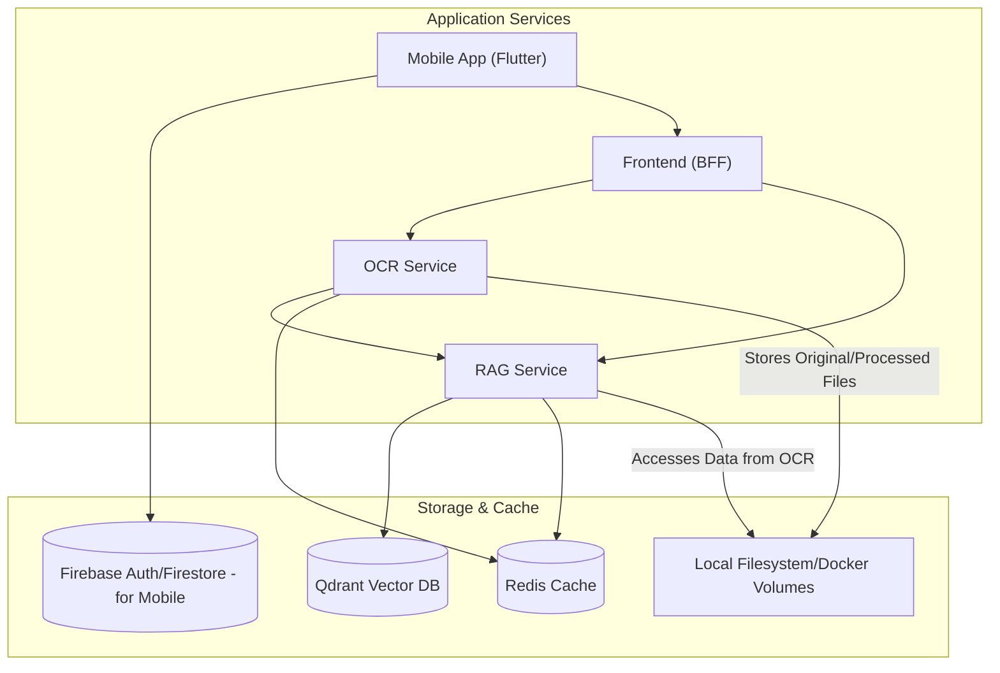

# Data Storage and Management

This document outlines the data storage architecture and management strategies for the Insurance Policy Parser & QA App.

## Overview

The data storage architecture is designed to efficiently handle various types of data including uploaded documents, processed text, and vector embeddings for semantic search. The system primarily uses Qdrant for vector and payload storage, and Redis for caching.

## Data Categories

The application manages the following categories of data:

1.  **Document Data**: Original policy documents (PDFs, images).
2.  **Processed Text Data**: Text extracted from documents, potentially broken into chunks.
3.  **Vector Data & Associated Payloads**: Embeddings for text chunks, along with their corresponding text content and metadata (e.g., document ID, page number, block ID), stored together in Qdrant.
4.  **Cache Data**: OCR results, RAG query results, stored in Redis.
5.  **User Data (Mobile-Focus)**: For the mobile application, user authentication and basic profile data are typically managed via Firebase Auth.

## Storage Architecture

*Note: For local development, original/processed documents are typically stored on the local filesystem via Docker volumes. In a production environment, dedicated object storage (e.g., AWS S3, Google Cloud Storage) would be used for raw document files.*

## Key Storage Components

### 1. Qdrant (Vector Database)

Qdrant serves as the primary store for text embeddings and their associated payloads (which include the text content and metadata).

**Stored Data:**
-   Document chunk embeddings.
-   Payloads associated with each vector, containing:
    -   `document_id`
    -   `text_content` (the actual text chunk)
    -   `page_number`
    -   `block_id` (original ID from OCR if available)
    -   `bbox` (bounding box coordinates)
    -   `embedding_model` (model used for the embedding)
    -   `embedding_timestamp`
    -   Any other document-level metadata passed during ingestion.
-   Vector indices for similarity search.

**Key Characteristics:**
-   Optimized for vector similarity search.
-   Low-latency vector operations.
-   Scalable to millions of vectors.
-   Support for rich payload filtering alongside vector search.
-   Configured and accessed as defined in `docker-compose.yml` and used by `src/rag/pipeline.py`.

### 2. Redis (Caching Layer)

Redis is used for caching frequently accessed data to improve performance and reduce redundant computations or API calls.

**Stored Data:**
-   **OCR Results**: Full structured output from the `OCRPipeline` for processed documents, keyed by document ID. This allows quick retrieval without reprocessing.
-   **RAG Query Results**: Answers generated by the `RAGPipeline` for specific user queries, keyed by a hash of the query and relevant parameters. This avoids re-querying Qdrant and re-generating answers with the LLM for identical requests.
-   Potentially other temporary data or session information if applicable.

**Key Characteristics:**
-   In-memory data store for fast access.
-   Configurable TTL (Time-To-Live) for cached items.
-   Used by `src/ocr/service.py` and `src/rag/pipeline.py`.

### 3. Local Filesystem / Docker Volumes (Development)

For local development using Docker:
-   Uploaded original documents are temporarily stored on the filesystem accessible to the services within Docker.
-   Any intermediate files (like page images during OCR) are also handled on this filesystem.

*In a production environment, these would be replaced by a robust Object Storage solution (e.g., AWS S3, MinIO, Google Cloud Storage) for persistent and scalable storage of original policy documents and potentially their processed versions if needed outside Qdrant/Redis.*

### 4. Firebase (Primarily for Mobile Application)

If the Flutter mobile application (`mobile/`) is in use and requires user management:
-   **Firebase Authentication**: Handles user sign-up, login (email/password, Google Sign-In, etc.), and session management.
-   **Cloud Firestore (Optional)**: Could be used by the mobile app for storing user-specific preferences, mobile app state, or data directly managed by the mobile client.

*The backend services (`ocr_service`, `rag_service`, `frontend` BFF) as defined in `src/` do not directly interact with Firebase in the current primary architecture; they are self-contained or interact with Qdrant/Redis.*

## Data Management & Security

### Data Flow
-   **Ingestion**: Documents uploaded via the `frontend` (BFF) are passed to the `ocr_service`. The `ocr_service` processes them, caches results in Redis, and sends text blocks/metadata to the `rag_service`. The `rag_service` generates embeddings and stores them with payloads in Qdrant.
-   **Querying**: Queries via the `frontend` (BFF) go to the `rag_service`. The `rag_service` checks Redis cache, then generates query embeddings, searches Qdrant, generates an answer (e.g., via OpenAI), caches the result in Redis, and returns it.

### Data Retention & Deletion
-   **Qdrant**: Data points can be deleted by ID or via filtering. Strategies for document deletion would involve removing all associated points from Qdrant.
-   **Redis Cache**: Data expires based on TTL. Specific cache entries can also be deleted by key.
-   **Original Files**: If stored on a persistent volume or object store, files would need to be deleted from there as well.

### Security
-   Access to Qdrant and Redis is managed by network configuration within the Docker environment (and by API keys/auth in production cloud deployments).
-   Sensitive data in `.env` (API keys) should be managed securely, especially for production.
-   For data in transit, HTTPS should be enforced for all external-facing services in production.
-   Data at rest in Qdrant/Redis can be encrypted if the underlying storage or service supports it (Qdrant Cloud often provides this).

This document reflects the data storage mechanisms currently evident in the project's core backend services. As the application evolves, especially with regards to user management for the web frontend and more complex metadata storage, dedicated relational or document databases might be introduced or expanded.
