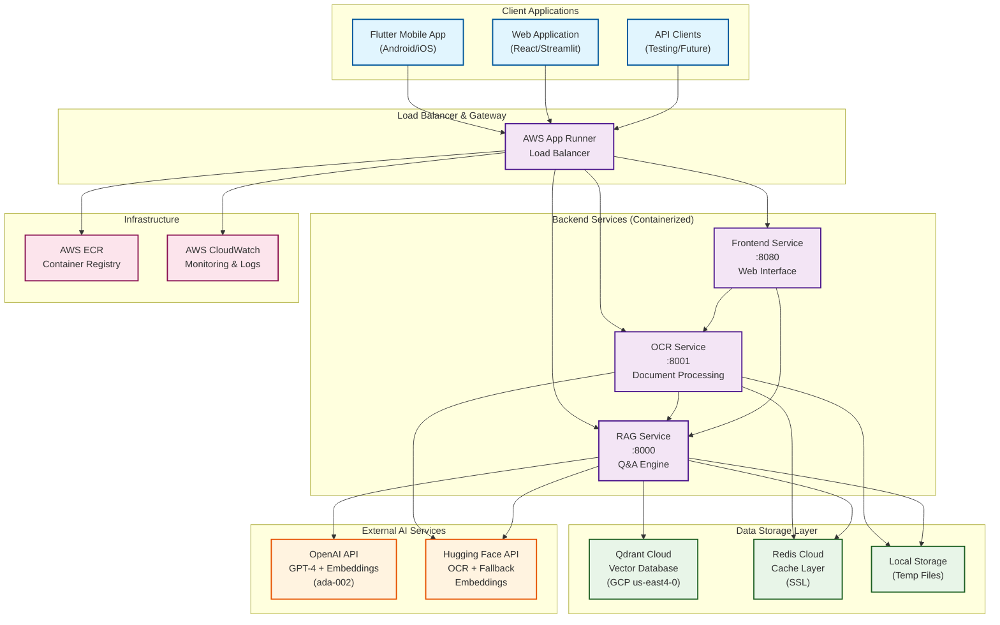
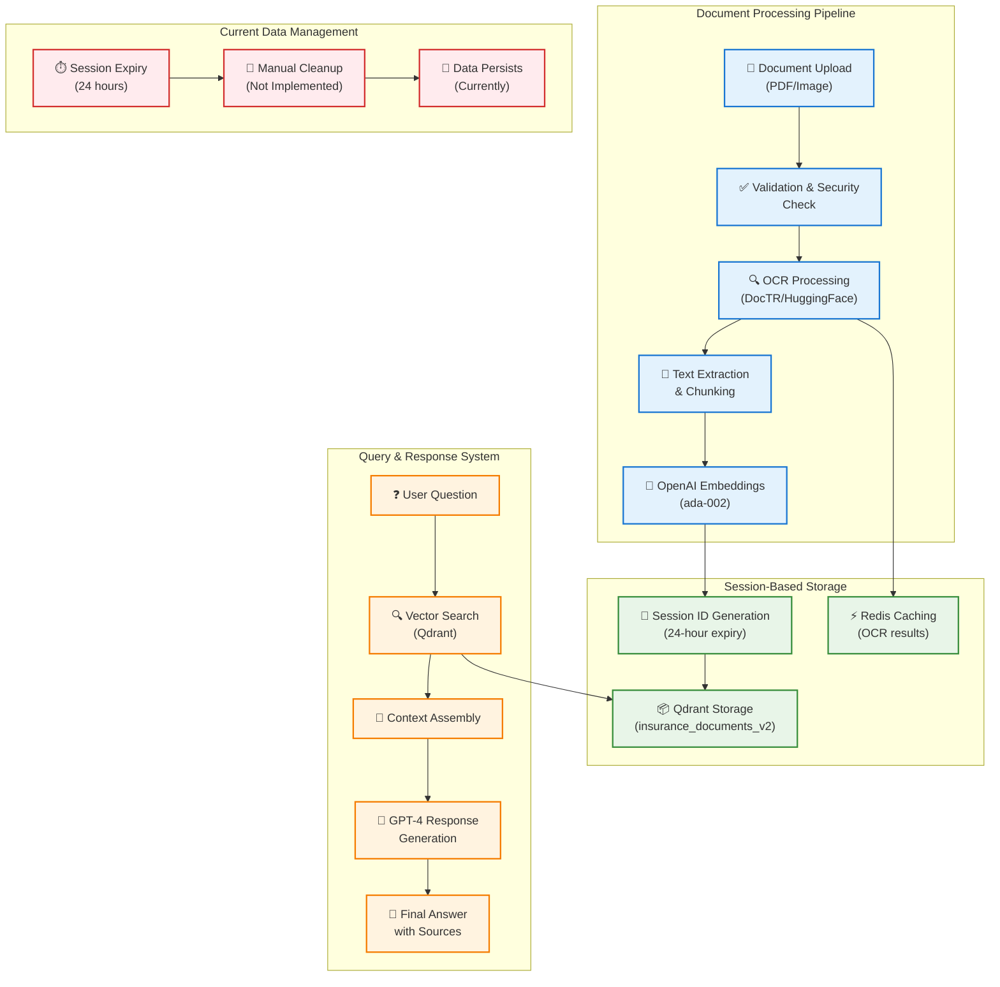
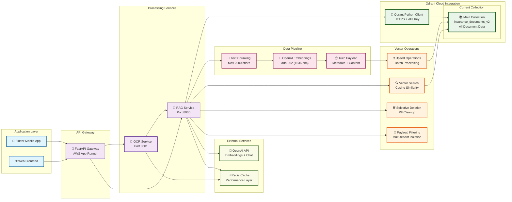

# Qdrant DevRel Call Preparation Guide

**Date**: January 2025  
**Purpose**: Technical consultation with Qdrant Developer Relations team  
**Attendee**: Pranay (Solo Developer)  
**Project**: Insurance Policy Parser & QA Application  

---

## 🏗️ System Architecture Diagrams

### **1. High-Level System Architecture**



### **2. Current Data Processing Flow**



### **3. Qdrant Integration Architecture**



---

## 📋 Executive Summary

This document prepares for a technical consultation with Qdrant's DevRel team to optimize our insurance policy document processing application. We're seeking guidance on architecture, performance, and scaling strategies before public launch.

---

## 🎯 Use Case Overview

### **What We're Building**
An **Insurance Policy Parser & QA Application** that helps consumers understand their personal insurance policies through natural language queries.

### **Core Functionality**
1. **Document Upload**: Users upload insurance policy PDFs (health, auto, home, life insurance)
2. **OCR Processing**: Extract text from scanned/image-based documents
3. **Document Classification**: Automatically identify policy type and insurer
4. **RAG Pipeline**: Convert documents into searchable embeddings stored in Qdrant
5. **Natural Language Q&A**: Users ask questions like:
   - "What's my deductible?"
   - "Am I covered for dental work?"
   - "What are the exclusions in my policy?"
   - "When does my policy expire?"

### **Target Users**
- Individual consumers managing personal insurance policies
- Families with multiple insurance documents
- Users who struggle with complex insurance terminology

### **Business Context**
- **Stage**: Pre-launch (awaiting Play Store verification)
- **Team**: Solo developer building MVP
- **Market**: India-focused initially, global expansion planned
- **Deployment**: Production-ready on AWS App Runner

---

## 🏗️ Current Technical Architecture

### **Qdrant Setup**
- **Version**: qdrant-client 1.6.9
- **Deployment**: Qdrant Cloud (GCP us-east4-0 region)
- **Collection**: `insurance_documents_v2`
- **Vector Dimensions**: 1536 (OpenAI text-embedding-ada-002)
- **Distance Metric**: Cosine similarity
- **Connection**: HTTPS with API key authentication

### **Data Pipeline**
```
Insurance PDF → OCR (DocTR) → Text Chunking → OpenAI Embeddings → Qdrant Storage → RAG Query
```

### **Current Configuration**
```json
{
  "QDRANT_URL": "https://c0496763-dd69-4f30-9b8a-ca0b9294ddf2.us-east4-0.gcp.cloud.qdrant.io:6333",
  "QDRANT_COLLECTION": "insurance_documents_v2",
  "OPENAI_EMBEDDING_MODEL": "text-embedding-ada-002",
  "OPENAI_CHAT_MODEL": "gpt-3.5-turbo",
  "CHUNK_SIZE": "2000 characters max",
  "DISTANCE_METRIC": "COSINE"
}
```

### **Document Processing Flow**
1. **Text Extraction**: OCR with DocTR for image-based PDFs
2. **Chunking**: Split into blocks (max 2000 chars to avoid embedding limits)
3. **Embedding Generation**: OpenAI ada-002 (1536 dimensions)
4. **Qdrant Storage**: Upsert with rich payload metadata
5. **Query Processing**: Embed user query → Vector search → LLM generation

### **Payload Structure**
```json
{
  "document_id": "uuid",
  "text_content": "extracted text chunk",
  "page_number": 1,
  "block_id": "uuid",
  "bbox": [x, y, width, height],
  "embedding_model": "text-embedding-ada-002",
  "embedding_timestamp": "2025-01-11T10:00:00Z",
  "document_type": "Health Insurance",
  "insurer": "Company Name",
  "policy_number": "POL123456"
}
```

---

## 🎯 Key Questions for DevRel Team

### **1. Architecture & Design Optimization**

#### **Document Chunking Strategy**
- **Current**: 2000 character max chunks with no overlap
- **Question**: "What's the optimal chunk size and overlap strategy for insurance documents that contain complex tables, structured data, and cross-references?"
- **Follow-up**: "Should we use semantic chunking instead of fixed-size chunks for better context preservation?"

#### **Collection Design**
- **Current**: Single collection for all document types
- **Question**: "Should we use separate collections for different insurance types (health, auto, life) or maintain one collection with payload filtering?"
- **Follow-up**: "What are the performance implications of each approach at scale?"

#### **Embedding Model Selection**
- **Current**: OpenAI text-embedding-ada-002
- **Question**: "For insurance domain-specific content, would you recommend upgrading to text-embedding-3-small/large?"
- **Follow-up**: "Are there specific considerations for financial/legal document embeddings?"

### **2. Performance & Scaling**

#### **Query Performance**
- **Question**: "What query latency should we expect for ~5-10K documents with our current 2 vCPU / 4GB setup?"
- **Follow-up**: "How does performance scale with document volume and concurrent users?"

#### **Indexing Configuration**
- **Question**: "Should we configure HNSW parameters differently for insurance document search patterns?"
- **Context**: "Our queries are typically specific (policy numbers, coverage details, exclusions)"

#### **Regional Optimization**
- **Current**: GCP us-east4-0, serving Mumbai users
- **Question**: "Should we consider regional placement for better latency? What's the latency impact of cross-region queries?"

### **3. Cost Management**

#### **Resource Planning**
- **Question**: "How should we estimate Qdrant Cloud costs as we scale from hundreds to thousands of documents?"
- **Follow-up**: "What's the cost breakdown between storage, compute, and API calls?"

#### **Optimization Strategies**
- **Question**: "Would vector quantization help reduce costs without significantly impacting search quality for our use case?"
- **Follow-up**: "Are there other cost optimization techniques for document-heavy applications?"

### **4. Advanced Features & Data Privacy**

#### **Selective Data Deletion & FAQ System**
- **Current Strategy**: Delete PII while retaining generic insurance content for FAQ building
- **Question**: "What's the best approach for selective deletion of PII from vector payloads while preserving generic insurance knowledge?"
- **Follow-up**: "How can we efficiently categorize and filter content as 'PII' vs 'generic knowledge' for FAQ systems?"

#### **Data Anonymization**
- **Question**: "Best practices for anonymizing insurance document content before embedding?"
- **Context**: "We want to build a knowledge base of common insurance terms and coverage explanations"
- **Follow-up**: "Should we use separate collections for anonymized FAQ content vs user-specific data?"

#### **Payload Filtering**
- **Current**: Filter by document_type, user_id, policy metadata
- **Question**: "What's the most efficient way to structure payloads for complex filtering scenarios including content classification?"
- **Follow-up**: "How do filters impact query performance when separating PII vs generic content?"

#### **Hybrid Search**
- **Question**: "Should we consider combining vector search with keyword search for specific insurance terms and policy numbers?"
- **Context**: "Users often search for exact policy numbers or specific coverage terms"

#### **Multi-tenancy & Privacy**
- **Question**: "What's the best approach for user data isolation while building shared FAQ knowledge base?"
- **Context**: "Need user document isolation + shared anonymized knowledge base"

### **5. Monitoring & Quality**

#### **Observability**
- **Current**: Tracking embedding failures and basic search latency
- **Question**: "What production metrics should we monitor for search quality and system health?"

#### **Search Quality Measurement**
- **Question**: "How can we measure and improve search relevance for insurance-specific queries?"
- **Follow-up**: "Are there techniques for handling insurance jargon and abbreviations?"

### **6. Development & Operations**

#### **Development Workflow**
- **Current**: Docker Compose with local Qdrant for development
- **Question**: "Best practices for maintaining dev/prod parity with Qdrant Cloud?"

#### **Data Management**
- **Question**: "What's the recommended approach for backing up vector data and handling data migrations?"
- **Follow-up**: "How do we handle schema changes or embedding model updates?"
- **Context**: "We're planning to implement selective data deletion for privacy compliance"

### **7. Technical Deep Dive**

#### **Connection Optimization**
- **Current**: Python client with FastAPI
- **Question**: "Any optimization recommendations for connection pooling and client configuration?"

#### **Batch Operations**
- **Question**: "For document ingestion, what's the optimal batch size for upsert operations?"
- **Context**: "We process documents in background tasks after upload"

### **8. Future Roadmap**

#### **Multi-modal Capabilities**
- **Question**: "We're considering adding image search for policy documents with diagrams and charts. How would you approach multi-modal search in Qdrant?"

#### **Analytics & Insights**
- **Question**: "Any recommendations for analytics on search patterns and user behavior?"
- **Follow-up**: "Can we build recommendation systems on top of search data?"

---

## 📊 Current Performance Metrics

### **System Specifications**
- **Qdrant Cloud**: 2 vCPU, 4 GB Memory
- **Collection Size**: ~100 test documents currently
- **Average Document Size**: 10-50 pages
- **Embedding Dimensions**: 1536
- **Query Response Time**: <2 seconds (current test load)

### **Data Characteristics**
- **Document Types**: Health (40%), Auto (30%), Home (20%), Life (10%)
- **Languages**: Primarily English, some Hindi terms
- **Document Quality**: Mix of native PDFs and scanned documents
- **Average Chunks per Document**: 15-30 chunks

---

## 🚧 Current Challenges & Pain Points

### **Technical Challenges**
1. **Pre-launch Status**: Haven't stress-tested at scale yet
2. **Data Privacy Implementation**: Planning selective PII deletion while preserving knowledge
3. **Domain Specificity**: Optimizing for insurance terminology and legal language
4. **Document Complexity**: Handling tables, forms, and structured data
5. **Search Quality**: Ensuring relevance for complex insurance queries
6. **Content Classification**: Identifying PII vs generic insurance knowledge

### **Business Constraints**
1. **Budget Sensitivity**: Bootstrapped startup, need cost-effective scaling
2. **Solo Development**: Limited time for deep optimization
3. **Regulatory Compliance**: Need to ensure data privacy and security
4. **User Experience**: Must be simple enough for non-technical users

### **Scaling Concerns**
1. **Performance**: Maintaining low latency as document volume grows
2. **Cost**: Keeping per-user costs sustainable
3. **Quality**: Maintaining search relevance with diverse document types
4. **Reliability**: Ensuring high availability for production users

---

## 🎯 Desired Outcomes from Call

### **Immediate Goals**
1. **Architecture Validation**: Confirm our current approach is sound
2. **Optimization Roadmap**: Identify key areas for improvement before launch
3. **Scaling Strategy**: Plan for growth from hundreds to thousands of users
4. **Cost Optimization**: Strategies to keep costs manageable

### **Long-term Vision**
1. **Performance Excellence**: Sub-second query responses at scale
2. **Privacy-First FAQ System**: Robust anonymized knowledge base for common insurance questions
3. **Advanced Features**: Hybrid search, multi-modal capabilities
4. **Global Expansion**: Multi-region deployment strategy
5. **AI Enhancement**: Better understanding of insurance context with privacy preservation

---

## 📚 Key Information to Share

### **Success Metrics**
- **Current**: 100% deployment reliability on AWS App Runner
- **Target**: <1 second query response time
- **Goal**: Support 1000+ concurrent users post-launch

### **Technical Stack**
- **Backend**: FastAPI, Python 3.11
- **Frontend**: Flutter mobile app
- **Deployment**: AWS App Runner, Docker containers
- **Monitoring**: Basic logging, planning comprehensive observability

### **Business Context**
- **Market**: Insurance policy management is underserved
- **Differentiation**: Focus on consumer-friendly natural language interface
- **Traction**: Positive feedback from beta testers
- **Timeline**: Public launch planned within 4-6 weeks

---

## 🔧 Technical Specifications to Reference

### **Current Dependencies**
```
qdrant-client==1.6.9
openai==1.3.0
fastapi==0.104.1
redis==5.0.1
python-doctr[torch]==0.7.0
```

### **Environment Configuration**
```bash
QDRANT_URL=https://c0496763-dd69-4f30-9b8a-ca0b9294ddf2.us-east4-0.gcp.cloud.qdrant.io:6333
QDRANT_COLLECTION=insurance_documents_v2
OPENAI_EMBEDDING_MODEL=text-embedding-ada-002
OPENAI_CHAT_MODEL=gpt-3.5-turbo
CACHE_TTL_SECONDS=3600
```

### **Code Snippets to Reference**
```python
# Current Qdrant initialization
self.qdrant_client = QdrantClient(
    url=qdrant_url,
    api_key=qdrant_api_key
)

# Document ingestion
points_to_upsert.append(qdrant_models.PointStruct(
    id=block.get("id", str(uuid.uuid4())),
    vector=embeddings[embedding_idx],
    payload=payload
))

# Query processing
search_results = self.qdrant_client.search(
    collection_name=self.collection_name,
    query_vector=query_embedding,
    limit=top_k,
    with_payload=True
)
```

---

## 📝 Call Preparation Checklist

### **Before the Call**
- [ ] Review current Qdrant documentation for latest features
- [ ] Prepare specific performance metrics and requirements
- [ ] List current pain points with concrete examples
- [ ] Identify 3-5 top priority questions
- [ ] Have code examples ready for reference

### **During the Call**
- [ ] Take detailed notes on recommendations
- [ ] Ask for specific configuration examples
- [ ] Request documentation links for follow-up
- [ ] Clarify timeline for implementing suggestions
- [ ] Discuss ongoing support options

### **After the Call**
- [ ] Document all recommendations
- [ ] Create implementation roadmap
- [ ] Update architecture documentation
- [ ] Plan optimization sprints
- [ ] Schedule follow-up if needed

---

## 🤝 Relationship Building

### **Collaboration Opportunities**
- **Case Study**: Willing to share success story post-launch
- **Feedback**: Provide insights on insurance domain usage
- **Community**: Contribute to Qdrant community discussions
- **Beta Testing**: Test new features relevant to document processing

### **Long-term Partnership**
- **Growth**: Planning to scale significantly post-launch
- **Innovation**: Interested in cutting-edge vector search features
- **Advocacy**: Willing to recommend Qdrant to other developers
- **Feedback Loop**: Provide regular usage insights and feature requests

---

## 📖 Technical Glossary

### **Vector Search & Embeddings**
- **Vector**: A numerical representation of text/data as an array of numbers (e.g., [0.1, -0.3, 0.7...])
- **Embedding**: The process of converting text into vectors that capture semantic meaning
- **Embedding Model**: AI model that converts text to vectors (e.g., OpenAI text-embedding-ada-002)
- **Embedding Dimensions**: The size of the vector array (e.g., 1536 numbers for ada-002)
- **Semantic Search**: Finding similar content based on meaning, not just keywords
- **Cosine Similarity**: Method to measure how similar two vectors are (0 = different, 1 = identical)

### **Qdrant-Specific Terms**
- **Qdrant**: Open-source vector database optimized for similarity search
- **Collection**: A container for vectors in Qdrant (like a table in traditional databases)
- **Point**: A single vector entry in Qdrant with its associated data (payload)
- **Payload**: Additional data stored with each vector (metadata, text content, etc.)
- **Upsert**: Insert or update operation - adds new points or updates existing ones
- **HNSW**: Hierarchical Navigable Small World - algorithm for fast approximate nearest neighbor search
- **Quantization**: Technique to reduce vector storage size and improve performance

### **RAG (Retrieval-Augmented Generation)**
- **RAG**: Combines information retrieval with text generation for better AI responses
- **Retrieval**: Finding relevant documents/chunks based on user query
- **Augmentation**: Adding retrieved context to the AI prompt
- **Generation**: Creating the final answer using retrieved context
- **Context Window**: Maximum amount of text an AI model can process at once
- **Chunking**: Splitting large documents into smaller, manageable pieces

### **Document Processing**
- **OCR**: Optical Character Recognition - converting images/scans to text
- **DocTR**: Document Text Recognition - specific OCR library we use
- **Bounding Box (bbox)**: Coordinates defining where text appears on a page [x, y, width, height]
- **Text Block**: A chunk of text extracted from a document with its metadata
- **Document Classification**: Automatically identifying document type (health, auto, etc.)

### **Performance & Architecture**
- **Latency**: Time delay between request and response (measured in milliseconds)
- **Throughput**: Number of requests processed per second
- **Concurrent Users**: Multiple users accessing the system simultaneously
- **Batch Processing**: Handling multiple operations together for efficiency
- **Connection Pooling**: Reusing database connections to improve performance
- **Caching**: Storing frequently accessed data in fast memory (Redis)

### **Development & Deployment**
- **FastAPI**: Modern Python web framework for building APIs
- **Docker**: Containerization platform for packaging applications
- **Container**: Lightweight, portable application package with all dependencies
- **AWS App Runner**: Amazon's service for running containerized applications
- **Environment Variables**: Configuration settings stored outside the code
- **API Key**: Secret token for authenticating with external services
- **Endpoint**: A specific URL where an API can be accessed

### **Data Management**
- **UUID**: Universally Unique Identifier - unique ID for each document/chunk
- **JSON**: JavaScript Object Notation - format for storing and exchanging data
- **Payload Filtering**: Searching vectors based on their associated metadata
- **Multi-tenancy**: Serving multiple users while keeping their data separate
- **Schema**: Structure/format of data in a database
- **Migration**: Process of updating database structure or moving data

### **Monitoring & Quality**
- **Observability**: Ability to monitor and understand system behavior
- **Metrics**: Quantitative measurements of system performance
- **Search Relevance**: How well search results match user intent
- **Query Response Time**: Time taken to process and return search results
- **Embedding Failures**: Errors when converting text to vectors
- **Health Check**: Automated test to verify system is working properly

### **Business & Scaling**
- **MVP**: Minimum Viable Product - basic version with core features
- **Play Store Verification**: Google's approval process for Android apps
- **Bootstrapped**: Self-funded startup without external investment
- **Pre-launch**: Development phase before public release
- **DevRel**: Developer Relations - team that helps developers use a product
- **API Rate Limiting**: Controlling how many requests users can make
- **Cost Optimization**: Strategies to reduce operational expenses

### **Machine Learning**
- **LLM**: Large Language Model - AI trained on vast amounts of text
- **OpenAI GPT**: Generative Pre-trained Transformer - specific type of LLM
- **Temperature**: Setting controlling randomness in AI responses (0 = deterministic, 1 = creative)
- **Token**: Basic unit of text processing in AI models (roughly 4 characters)
- **Fine-tuning**: Training AI model on specific domain data
- **Inference**: Using trained AI model to make predictions/generate responses

### **Security & Privacy**
- **Authentication**: Verifying user identity
- **Authorization**: Controlling what authenticated users can access
- **Data Isolation**: Ensuring users can only see their own data
- **Encryption**: Protecting data by converting it to unreadable format
- **Compliance**: Following legal/regulatory requirements for data handling
- **Firebase**: Google's platform for authentication and backend services

### **Insurance Domain**
- **Policy**: Insurance contract document
- **Premium**: Amount paid for insurance coverage
- **Deductible**: Amount user pays before insurance coverage begins
- **Coverage**: What is protected/included in insurance policy
- **Exclusions**: What is not covered by insurance policy
- **Insurer**: Insurance company providing coverage
- **Policyholder**: Person who owns the insurance policy
- **Claims**: Requests for payment when covered events occur

### **Technical Abbreviations**
- **API**: Application Programming Interface
- **CPU**: Central Processing Unit
- **GB**: Gigabyte (unit of memory/storage)
- **HTTP/HTTPS**: HyperText Transfer Protocol (Secure)
- **JSON**: JavaScript Object Notation
- **PDF**: Portable Document Format
- **RAM**: Random Access Memory
- **SQL**: Structured Query Language
- **SSL/TLS**: Secure Sockets Layer/Transport Layer Security
- **URL**: Uniform Resource Locator
- **vCPU**: Virtual CPU (cloud computing unit)

---

*This document serves as a comprehensive preparation guide for optimizing our insurance policy processing application with Qdrant's vector search capabilities.* 