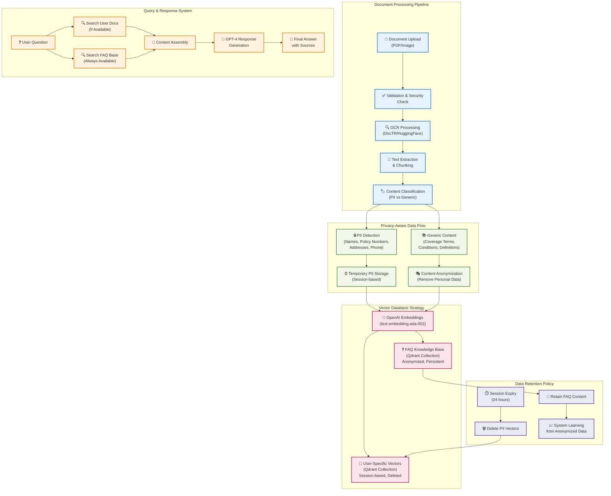

# Qdrant DevRel Call - Planned Privacy-First Architecture

**Date**: January 2025  
**Purpose**: Future roadmap and privacy-first features discussion  
**Project**: Insurance Policy Parser & QA Application  

---

## 🚀 Planned Privacy-First Architecture

This document outlines the **planned features** discussed with the Qdrant team regarding selective PII deletion and FAQ knowledge base building.

### **Privacy-Aware Data Processing Flow (PLANNED)**

## 🎯 Implementation Roadmap

### **Phase 1: PII Detection & Classification**
- Implement content classification (PII vs generic)
- Add NLP-based PII detection
- Create separate processing pipelines

### **Phase 2: Dual Collection Strategy**
- Create `insurance_faq_v1` collection
- Implement anonymization pipeline
- Set up dual ingestion workflow

### **Phase 3: Selective Deletion**
- Implement Qdrant point deletion by filters
- Add automated session cleanup
- Build FAQ knowledge base

### **Phase 4: Advanced Features**
- Hybrid search across collections
- FAQ recommendation system
- Analytics on anonymized data

---

*This represents the planned privacy-first architecture discussed with Qdrant team for future implementation.* 