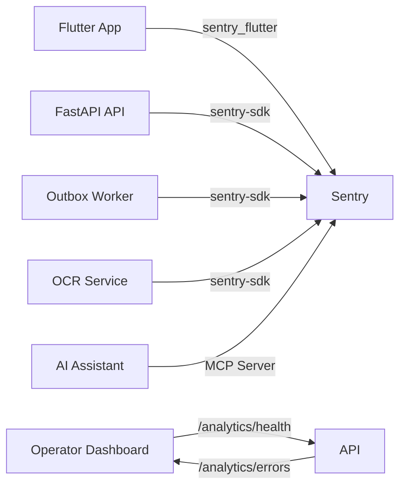

# Sentry Setup & Configuration

**Last updated:** 2026-07-27

## Overview

Sentry provides crash reporting, error tracking, and performance monitoring for both the CoverWise mobile app (Flutter) and backend (Python/FastAPI). The Sentry MCP server gives AI assistants direct access to issues, performance data, and root cause analysis.

## MCP Server

Connect AI assistants to Sentry crash data via the Model Context Protocol:

```
# Scoped to your personal org:
https://mcp.sentry.dev/mcp/pranaysuyash

# Scoped to a specific project (recommended for defaults):
https://mcp.sentry.dev/mcp/pranaysuyash/coverwise-api
https://mcp.sentry.dev/mcp/pranaysuyash/coverwise-mobile
```

Add the scoped URL as a Streamable HTTP MCP Server in your agent client.

## Projects

Two Sentry projects should be created:

| Project | Platform | Purpose | DSN Env Var |
|---------|----------|---------|-------------|
| `coverwise-mobile` | Flutter / Dart | Mobile crash reporting | `SENTRY_DSN` (build-time `--dart-define`) |
| `coverwise-api` | Python (FastAPI) | Backend error tracking | `SENTRY_DSN` (`.env` runtime) |

## CLI Setup

The CLI is installed at `~/.local/bin/sentry` (v0.38.0). Use `sentry` (not `sentry-cli`) for all commands.

```bash
# Add to PATH if not already
export PATH="$HOME/.local/bin:$PATH"

# Authenticate (opens browser)
sentry auth login

# List projects (after auth):
sentry projects list

# Create a project:
# Use platform identifier 'flutter' for mobile, 'python-fastapi' for backend.
sentry projects create --name coverwise-mobile --platform flutter
sentry projects create --name coverwise-api --platform python-fastapi

# Get DSN for a project:
sentry projects list  # shows DSN in output
# Or from Dashboard → Settings → Projects → [project] → Client Keys (DSN)
```

## DSN Injection

### Backend (Python)

Add to `.env`:
```env
SENTRY_DSN=https://your-dsn@sentry.io/project_id
```

The backend Sentry init is in `src/utils/sentry_config.py`:
- Silently disabled when `SENTRY_DSN` is empty — local dev works without it
- Sets `send_default_pii=True` (user IDs attributed to crashes)
- **Important:** Configure Sentry project's **Data Scrubbing** settings to strip email, credit card, and other PII patterns server-side

### Mobile (Flutter)

Inject at build time via `--dart-define` in `.vscode/launch.json`, build scripts, or CI:
```bash
# Run
flutter run --dart-define=SENTRY_DSN=https://your-dsn@sentry.io/project_id

# Build
flutter build appbundle --dart-define=SENTRY_DSN=https://your-dsn@sentry.io/project_id
flutter build ipa --dart-define=SENTRY_DSN=https://your-dsn@sentry.io/project_id
```

The mobile init is in `mobile/lib/main.dart` — gated by `AppConfig.hasSentryConfig`.
Add `SENTRY_DSN` to the `--dart-define` list in your IDE's run configuration and CI build step.

### CI/CD

Set `SENTRY_DSN` as a GitHub Actions secret. Add the DSN to the CI workflow's build steps:
```yaml
- name: Build Flutter
  run: flutter build appbundle --dart-define=SENTRY_DSN=${{ secrets.SENTRY_DSN }}
```

The existing `.github/workflows/ci.yml` may need Sentry source map upload steps added — check the file and configure if needed.

## Verification

### Backend
```bash
# Start API with DSN
SENTRY_DSN=https://your-dsn@sentry.io/project_id uvicorn src.app.main:app

# Check startup logs — should show:
# "Sentry SDK initialised for service=api env=production"
```

### Trigger a test error (backend)
```bash
# Use Python to trigger a deliberate exception with Sentry active:
SENTRY_DSN=https://your-dsn@sentry.io/project_id python3 -c "
import sentry_sdk
sentry_sdk.init()
try:
    1/0
except ZeroDivisionError:
    sentry_sdk.capture_exception()
print('Test error sent to Sentry')
"
```

Then check `https://pranaysuyash.sentry.io/issues/` for the captured event.

### Mobile (after DSN is injected)
```bash
flutter analyze lib/main.dart  # Should show no issues
```

## Architecture



## Release Tracking

Every deploy should tag the Sentry release for source map association and commit attribution:

```bash
# Backend
sentry releases new coverwise-api@0.1.2
sentry releases set-commits --auto coverwise-api@0.1.2

# Mobile (after build)
sentry releases new coverwise-mobile@0.1.2
sentry releases set-commits --auto coverwise-mobile@0.1.2
sentry releases files coverwise-mobile@0.1.2 upload-sourcemaps mobile/build/
```
