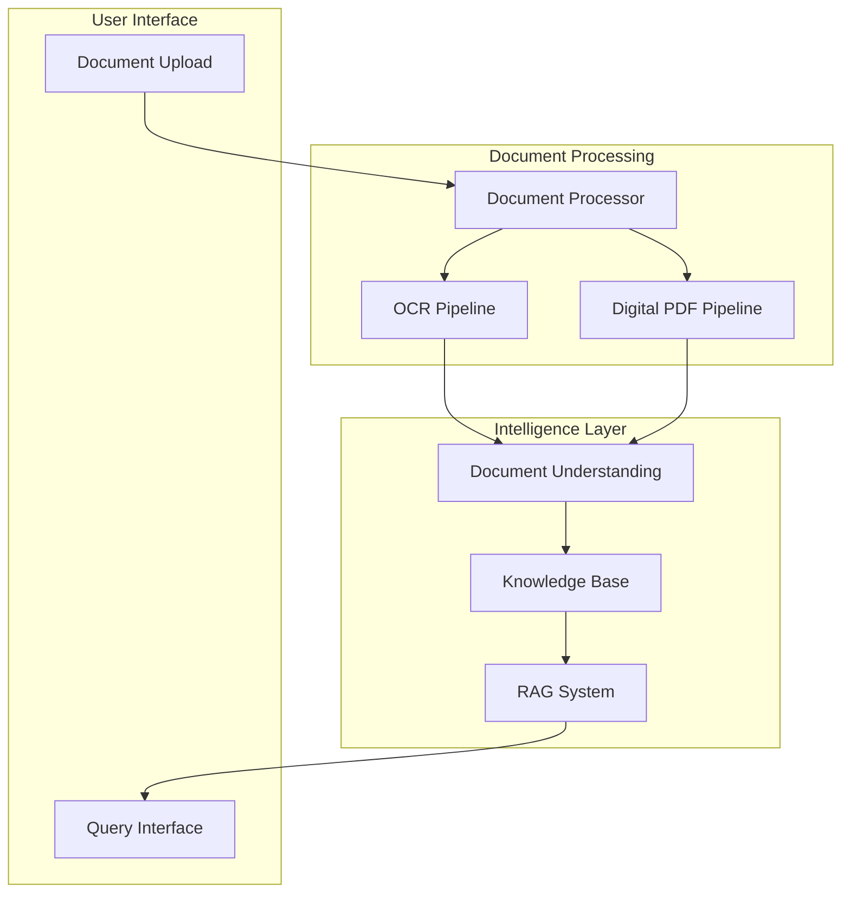
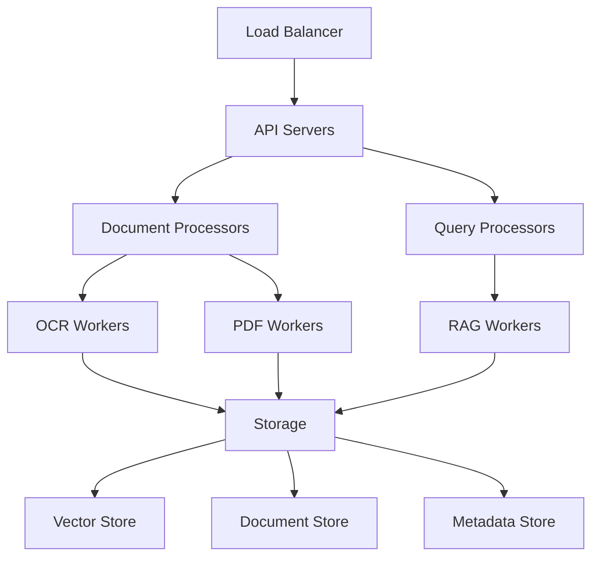

# Comprehensive System Architecture (2024)

> **Historical architecture snapshot.** This document contains earlier
> Firebase, Qdrant, Redis, and Celery proposals and is preserved for context.
> It is not an implementation authority. Use
> [`docs/architecture/coverwise_canonical_architecture.md`](../../architecture/coverwise_canonical_architecture.md)
> for the current managed-Supabase architecture and
> [`docs/review/coverwise_supabase_gap_register_2026-07-16.md`](../../review/coverwise_supabase_gap_register_2026-07-16.md)
> for verified gaps.

> If this file is referenced for production claims, it is non-authoritative
> without a dated ADR addendum and a migration note that maps historical claims
> to current Supabase control-plane contracts.

## Overview

This document provides a comprehensive overview of the Insurance Policy Parser & QA System's architecture, incorporating modern technologies and best practices as of 2024. The system is designed to be scalable, maintainable, and capable of handling complex insurance document processing tasks.

## System Architecture



## Core Components

### 1. Document Processing Layer

#### Modern OCR Pipeline
- **Primary Engine:** PaddleOCR
- **Layout Analysis:** LayoutLMv3
- **Table Extraction:** Table Transformer + Camelot
- **Quality Assurance:** ML-based validation

#### Digital Document Processing
- **PDF Processing:** pypdf + pdfplumber
- **Structure Analysis:** LayoutLMv3
- **Content Extraction:** Custom extractors

### 2. Intelligence Layer

#### Document Understanding
```python
from transformers import AutoTokenizer, AutoModel
from sentence_transformers import SentenceTransformer

class DocumentUnderstanding:
    def __init__(self):
        self.layout_model = AutoModel.from_pretrained("microsoft/layoutlmv3-base")
        self.text_embedder = SentenceTransformer('intfloat/e5-large-v2')
        self.tokenizer = AutoTokenizer.from_pretrained("microsoft/layoutlmv3-base")
        
    async def process_document(self, document):
        """Process document through the understanding pipeline"""
        # Extract layout and structure
        layout_features = await self._extract_layout_features(document)
        
        # Generate semantic embeddings
        embeddings = await self._generate_embeddings(document)
        
        # Combine understanding
        understanding = self._combine_understanding(layout_features, embeddings)
        
        return understanding
```

#### Knowledge Base
- **Vector Store:** Qdrant
- **Metadata Store:** PostgreSQL
- **Document Store:** MinIO (S3-compatible)

#### RAG System
```python
class ModernRAGSystem:
    def __init__(self):
        self.embedder = SentenceTransformer('intfloat/e5-large-v2')
        self.vector_store = QdrantClient()
        self.llm = MixtralInterface()  # Custom interface to Mixtral
        
    async def process_query(self, query: str) -> QueryResponse:
        # Generate query embedding
        query_embedding = self.embedder.encode(query)
        
        # Retrieve relevant contexts
        contexts = await self._retrieve_contexts(query_embedding)
        
        # Generate response
        response = await self._generate_response(query, contexts)
        
        return QueryResponse(
            answer=response.answer,
            sources=response.sources,
            confidence=response.confidence
        )
```

### 3. API Layer

#### FastAPI Implementation
```python
from fastapi import FastAPI, File, UploadFile, HTTPException
from typing import List, Optional

app = FastAPI(title="Insurance Policy Parser & QA API")

@app.post("/documents/upload")
async def upload_document(
    file: UploadFile,
    process_type: Optional[str] = "auto"
) -> DocumentResponse:
    """Upload and process insurance document"""
    try:
        processor = DocumentProcessor()
        result = await processor.process(file, process_type)
        return DocumentResponse(**result)
    except Exception as e:
        raise HTTPException(status_code=500, detail=str(e))

@app.post("/query")
async def query_system(
    query: str,
    filters: Optional[dict] = None
) -> QueryResponse:
    """Query the system using natural language"""
    try:
        rag = ModernRAGSystem()
        response = await rag.process_query(query, filters)
        return response
    except Exception as e:
        raise HTTPException(status_code=500, detail=str(e))
```

## Infrastructure

### Deployment Architecture


### Scalability
- Kubernetes-based deployment
- Autoscaling based on queue length
- Resource optimization

### Monitoring
```python
from opentelemetry import trace, metrics
from prometheus_client import Counter, Histogram

class SystemMonitoring:
    def __init__(self):
        self.tracer = trace.get_tracer(__name__)
        self.processing_time = Histogram(
            'document_processing_seconds',
            'Time spent processing documents'
        )
        self.error_counter = Counter(
            'processing_errors_total',
            'Total processing errors'
        )
```

## Security & Compliance

### Data Protection
- End-to-end encryption
- Secure data transmission
- Access control and authentication

### Compliance Framework
- HIPAA compliance
- GDPR requirements
- SOC 2 controls

## Performance Optimization

### Caching Strategy
```python
from redis import Redis
from typing import Optional

class CacheManager:
    def __init__(self):
        self.redis = Redis()
        
    async def get_cached_result(
        self,
        query_hash: str
    ) -> Optional[QueryResponse]:
        """Retrieve cached query result"""
        cached = await self.redis.get(query_hash)
        return QueryResponse.from_cache(cached) if cached else None
        
    async def cache_result(
        self,
        query_hash: str,
        response: QueryResponse
    ):
        """Cache query result"""
        await self.redis.setex(
            query_hash,
            3600,  # 1 hour TTL
            response.to_cache()
        )
```

### Resource Management
- Memory-efficient processing
- Batch operations
- Async processing

## Future Roadmap

### Planned Enhancements
1. Multi-modal document understanding
2. Advanced table extraction
3. Improved accuracy metrics
4. Enhanced security features

### Experimental Features
1. Zero-shot document classification
2. Automated quality improvement
3. Cross-document reference resolution

## Development Guidelines

### Code Quality
- Type hints
- Comprehensive testing
- Documentation standards
- Code review process

### Deployment Process
- CI/CD pipeline
- Automated testing
- Canary deployments
- Rollback procedures

## Conclusion

## Architecture Overview
- **Frontend:** React (Material-UI, Ant Design, or Tailwind CSS), Streamlit (for MVP/prototyping)
- **Backend:** FastAPI (Python 3.10+), Celery (with Redis) for background tasks
- **PDF & Document Processing:** pdfplumber, PyPDF2, pypdf, pdf2image
- **OCR:** pytesseract, easyocr, Google Cloud Vision, Amazon Textract
- **Table Extraction:** camelot-py, tabula-py, layoutparser
- **NLP/NER:** spaCy, transformers (Hugging Face), custom NER models
- **RAG Pipeline:** langchain, llama-index
- **LLMs:** OpenAI GPT-4o, Anthropic Claude 3, Hugging Face (Mistral, Llama-3, Gemma)
- **Embeddings:** sentence-transformers, Instructor-XL, OpenAI embeddings
- **Vector DB:** faiss (local), qdrant (open-source), pinecone/weaviate (cloud)
- **Storage:** S3-compatible (boto3, minio), Google Cloud Storage
- **Notifications:** sendgrid, twilio, smtplib

## Key Libraries/Models Table

| Feature                | Library/Model (Latest)                                  | Open Source? |
|------------------------|--------------------------------------------------------|--------------|
| PDF Parsing            | pdfplumber, PyPDF2, pypdf                              | Yes          |
| OCR                    | pytesseract, easyocr, Google Vision, Textract          | Yes/Cloud    |
| Table Extraction       | camelot-py, tabula-py, layoutparser                    | Yes          |
| NER/Extraction         | spaCy, transformers (custom NER)                       | Yes          |
| Embeddings             | sentence-transformers, Instructor-XL, OpenAI           | Yes/Cloud    |
| Vector DB              | faiss, qdrant, pinecone, weaviate                      | Yes/Cloud    |
| RAG Pipeline           | langchain, llama-index                                 | Yes          |
| LLMs                   | OpenAI GPT-4o, Llama-3, Mistral, Gemma                 | Yes/Cloud    |
| Reranking              | cross-encoder/ms-marco-MiniLM-L-6-v2                   | Yes          |
| Backend API            | FastAPI                                                | Yes          |
| Task Queue             | Celery + Redis                                         | Yes          |
| Frontend               | React, Streamlit                                       | Yes          |

## General Guidelines
- Use only actively maintained, modern libraries
- Prefer open-source and cloud-agnostic solutions where possible
- Avoid legacy or deprecated dependencies (e.g., old Flutter wrappers)
- All Python code should target Python 3.10+

---

# Insurance Policy Parser & QA App: Comprehensive Technical Architecture

This document provides a consolidated overview of the technical architecture for the Insurance Policy Parser & QA App, covering system components, document processing pipeline, AI/NLP strategy, and implementation details.

## Table of Contents

1. [System Architecture Overview](#system-architecture-overview)
2. [Document Processing Pipeline](#document-processing-pipeline)
3. [AI/NLP Strategy](#ainlp-strategy)
4. [Core Technology Stack](#core-technology-stack)
5. [Component Details](#component-details)
6. [Data Models](#data-models)
7. [API Interfaces](#api-interfaces)
8. [Scalability Considerations](#scalability-considerations)
9. [Monitoring and Observability](#monitoring-and-observability)
10. [Security Architecture](#security-architecture)
11. [Implementation Roadmap](#implementation-roadmap)

## System Architecture Overview

The Insurance Policy Parser & QA App uses a modern, cloud-based architecture to deliver high performance, scalability, and reliability while maintaining data security and privacy. The system follows a layered architectural pattern with clear separation of concerns between components.

### Architecture Diagram

```
┌───────────────────────────────────────────────────────────────────┐
│                      WEB APPLICATION (FRONTEND)                    │
├───────────┬───────────┬───────────┬───────────┬───────────────────┤
│           │           │           │           │                   │
│  UI Layer │ Dashboard │   QA      │ Document  │ User Management   │
│ (React/   │ Components│ Interface │ Management│                   │
│  Streamlit)│          │           │           │                   │
│           │           │           │           │                   │
└─────┬─────┴─────┬─────┴─────┬─────┴─────┬─────┴─────────┬─────────┘
      │           │           │           │               │
      ▼           ▼           ▼           ▼               ▼
┌─────────────────────────────────────────────────────────────────────┐
│                   API GATEWAY / BACKEND FOR FRONTEND                │
└─────────────────────────────────────────────────────────────────────┘
      │           │           │           │               │
      ▼           ▼           ▼           ▼               ▼
┌─────────────────────────────────────────────────────────────────────┐
│                           MICROSERVICES                             │
├───────────┬───────────┬───────────┬───────────┬───────────────────┬─┤
│           │           │           │           │                   │ │
│   Auth    │ Document  │   QA      │ Metadata  │ Notification      │ │
│  Service  │ Processor │  Engine   │ Service   │ Service           │ │
│           │           │           │           │                   │ │
└───────────┴─────┬─────┴─────┬─────┴─────┬─────┴─────────┬─────────┘ │
                  │           │           │               │           │
                  ▼           ▼           ▼               ▼           │
┌───────────┬─────────────────────────────────────────────────────────┤
│           │                   DATA LAYER                            │
├───────────┼───────────┬───────────┬───────────┬───────────────────┤ │
│           │           │           │           │                   │ │
│ Document  │  Vector   │ Relational│  Cache    │   Object          │ │
│  Store    │ Database  │ Database  │  (Redis)  │   Storage         │ │
│           │           │           │           │                   │ │
└───────────┴───────────┴───────────┴───────────┴───────────────────┘ │
                                                                      │
┌──────────────────────────────────────────────────────────────────────┘
│                         EXTERNAL SERVICES                            
├───────────┬───────────┬───────────┬───────────┬───────────────────┤
│           │           │           │           │                   │
│  OpenAI   │ Anthropic │  OCR      │  Email    │  Payment          │
│   API     │   API     │ Services  │ Provider  │  Gateway          │
│           │           │           │           │                   │
└───────────┴───────────┴───────────┴───────────┴───────────────────┘
```

### Key Architecture Principles

1. **Modularity**: System components are designed with clear boundaries and interfaces
2. **Scalability**: Horizontal scaling for services with variable load
3. **Resilience**: Fault isolation between components and graceful degradation
4. **Security**: Defense in depth with multiple security controls
5. **Performance**: Optimized for responsiveness in user interactions
6. **Maintainability**: Well-documented code and infrastructure
7. **Observability**: Comprehensive logging and monitoring

## Document Processing Pipeline

### Overview
The document processing pipeline handles the end-to-end process from document upload to information extraction and indexing for search and retrieval.

### High-Level Flow

The complete document processing pipeline consists of these major steps:

1. **Document Upload & Initial Processing**
2. **Document Classification & Type Detection**
3. **OCR & Text Extraction**
4. **Structure Analysis & Section Detection**
5. **Table & Form Recognition**
6. **Metadata Extraction**
7. **Information Indexing**
8. **Vector Generation for Retrieval**

### Detailed Component Architecture

#### 1. Document Upload & Initial Processing

```
┌──────────────┐     ┌──────────────┐     ┌──────────────┐
│  Upload UI   │     │ Validation   │     │Document Store│
│  Component   │────>│ Service      │────>│ & Initial    │
│              │     │              │     │ Metadata     │
└──────────────┘     └──────────────┘     └──────────────┘
                            │                    │
                            ▼                    ▼
                     ┌──────────────┐     ┌──────────────┐
                     │Format Check & │     │Processing    │
                     │Virus Scanning │     │Task Queue    │
                     └──────────────┘     └──────────────┘
```

#### 2. Document Classification & OCR

```
┌───────────────┐    ┌───────────────┐    ┌───────────────┐
│ Document from │    │Document Type  │    │OCR Service    │
│ Queue         │───>│Classifier     │───>│Selection      │
│               │    │               │    │               │
└───────────────┘    └───────────────┘    └───────────────┘
                                                  │
┌───────────────┐    ┌───────────────┐           │
│Text-Based     │    │Image-Based    │           │
│PDF Processing │<───┤PDF Processing │<──────────┘
│               │    │(OCR)          │
└───────────────┘    └───────────────┘
         │                  │
         └──────────┬───────┘
                    │
                    ▼
           ┌───────────────┐
           │Unified Text   │
           │Representation │
           └───────────────┘
```

#### 3. Structure Analysis & Information Extraction

```
┌───────────────┐    ┌───────────────┐    ┌───────────────┐
│ Unified Text  │    │Section        │    │Table          │
│ Content       │───>│Detection      │───>│Recognition    │
│               │    │               │    │               │
└───────────────┘    └───────────────┘    └───────────────┘
                            │                     │
                            ▼                     ▼
                     ┌───────────────┐    ┌───────────────┐
                     │Key-Value      │    │Tabular Data   │
                     │Extraction     │    │Extraction     │
                     └───────────────┘    └───────────────┘
                            │                     │
                            └─────────┬───────────┘
                                      │
                                      ▼
                             ┌───────────────┐
                             │Structured     │
                             │Policy Data    │
                             └───────────────┘
```

#### 4. Information Indexing & Vectorization

```
┌───────────────┐    ┌───────────────┐    ┌───────────────┐
│ Structured    │    │Metadata       │    │Database       │
│ Policy Data   │───>│Storage        │───>│Indexing       │
│               │    │               │    │               │
└───────────────┘    └───────────────┘    └───────────────┘
         │                                        │
         │                                        │
         ▼                                        │
┌───────────────┐    ┌───────────────┐           │
│Text Chunking  │    │Vector         │           │
│for RAG        │───>│Embedding      │───────────┘
│               │    │Generation     │
└───────────────┘    └───────────────┘
                            │
                            ▼
                     ┌───────────────┐
                     │Vector Database│
                     │Storage        │
                     └───────────────┘
```

### Document Processing Optimization

The system incorporates several optimizations for document processing:

1. **Parallel Processing**: Multiple documents or sections processed simultaneously
2. **Adaptive OCR Selection**: Document quality determines OCR approach
3. **Incremental Processing**: Documents are made available for basic features while advanced processing continues
4. **Processing Resumability**: Long-running tasks can be paused and resumed
5. **Cache Strategy**: Frequently accessed documents and extraction results are cached

## AI/NLP Strategy

### Core NLP Architecture Principles

The Insurance Policy Parser & QA App implements a sophisticated NLP architecture based on these principles:

1. **Accuracy First**: Prioritize correctness of information over speed
2. **Efficient Retrieval**: Optimize document retrieval to find relevant context
3. **Source Attribution**: Always provide references to source information
4. **Multi-stage Processing**: Use specialized models for different NLP tasks
5. **Verification**: Implement answer validation checks

### RAG (Retrieval Augmented Generation) Architecture

```
┌─────────────────────────────────────────────────────────────────┐
│                     QUERY UNDERSTANDING LAYER                    │
├─────────────┬─────────────┬─────────────┬─────────────┬─────────┘
│             │             │             │             │
▼             ▼             ▼             ▼             ▼
┌─────────────┐ ┌─────────────┐ ┌─────────────┐ ┌─────────────┐
│  QUERY      │ │ QUERY       │ │ CONTEXT     │ │ POLICY      │
│  ANALYSIS   │ │ EXPANSION   │ │ DETECTION   │ │ SELECTION   │
│             │ │             │ │             │ │             │
└──────┬──────┘ └──────┬──────┘ └──────┬──────┘ └──────┬──────┘
       │               │               │               │
       └───────────────┴───────────────┴───────────────┘
                               │
                               ▼
┌─────────────────────────────────────────────────────────────────┐
│                      RETRIEVAL LAYER                            │
├─────────────┬─────────────┬─────────────┬─────────────┬─────────┘
│             │             │             │             │
▼             ▼             ▼             ▼             ▼
┌─────────────┐ ┌─────────────┐ ┌─────────────┐ ┌─────────────┐
│  VECTOR     │ │ KEYWORD     │ │ HYBRID      │ │ METADATA    │
│  SEARCH     │ │ SEARCH      │ │ SEARCH      │ │ FILTERS     │
│             │ │             │ │             │ │             │
└──────┬──────┘ └──────┬──────┘ └──────┬──────┘ └──────┬──────┘
       │               │               │               │
       └───────────────┴───────────────┴───────────────┘
                               │
                               ▼
┌─────────────────────────────────────────────────────────────────┐
│                   GENERATION & VERIFICATION                      │
├─────────────┬─────────────┬─────────────┬─────────────┬─────────┘
│             │             │             │             │
▼             ▼             ▼             ▼             ▼
┌─────────────┐ ┌─────────────┐ ┌─────────────┐ ┌─────────────┐
│  CONTEXT    │ │ ANSWER      │ │ FACTUAL     │ │ SOURCE      │
│  SYNTHESIS  │ │ GENERATION  │ │ VERIFICATION │ │ CITATION    │
│             │ │             │ │             │ │             │
└──────┬──────┘ └──────┬──────┘ └──────┬──────┘ └──────┬──────┘
       │               │               │               │
       └───────────────┴───────────────┴───────────────┘
                               │
                               ▼
┌─────────────────────────────────────────────────────────────────┐
│                  RESPONSE FORMATTING LAYER                      │
│  (Formatting, Citations, Confidence Levels, UI Elements)        │
└─────────────────────────────────────────────────────────────────┘
```

### Multi-Stage Processing

The QA system uses a multi-stage approach for accurate answers:

1. **Query Understanding**: Parse the user's question intent
2. **Context Retrieval**: Find relevant policy sections
3. **Answer Generation**: Generate initial response using retrieved context
4. **Verification**: Check answer against source material
5. **Refinement**: Improve answer based on verification results
6. **Formatting**: Present answer with proper citations and formatting

### Model Selection Strategy

The system uses different models for different tasks in the processing pipeline:

#### Text Extraction & Classification
- **Document Classification**: Specialized document type classifier
- **Section Detection**: Layout analysis and section boundary detection
- **OCR**: Tesseract or commercial OCR for scanned documents
- **Table Extraction**: Specialized table extraction models

#### Embedding & Retrieval
- **Text Embedding**: State-of-the-art embedding models for semantic search
- **Retrieval Models**: Hybrid vector and keyword retrieval systems
- **Re-ranking**: Learning-to-rank models for result refinement

#### Question Answering
- **Primary LLM**: OpenAI GPT-4/GPT-4 Turbo or Anthropic Claude 3.5/3 Opus
- **Backup LLM**: Alternative model from different provider for redundancy
- **Specialized Extractors**: Task-specific models for complex extraction

### Cost Optimization Strategy

1. **Tiered Model Usage**: Use smaller models for simpler tasks
2. **Caching**: Cache common questions and answers
3. **Optimized Context**: Only send relevant context to LLMs
4. **Batched Processing**: Group operations where possible
5. **Prompt Engineering**: Optimized prompts to minimize token usage

## Core Technology Stack

### Frontend
- **Framework**: React with TypeScript (or Streamlit for MVP)
- **State Management**: Redux or React Context API
- **UI Component Library**: Material-UI or Tailwind CSS
- **Visualization**: Chart.js or D3.js for data visualization
- **PDF Rendering**: PDF.js for in-browser PDF display
- **Testing**: Jest, React Testing Library

### Backend
- **API Framework**: FastAPI or Flask
- **Authentication**: JWT with OAuth providers
- **Task Queue**: Celery with Redis
- **PDF Processing**: PyPDF2, pdfplumber, pdf2image
- **OCR**: Tesseract, Google Cloud Vision, or Amazon Textract
- **Table Extraction**: Camelot, Tabula
- **Testing**: Pytest

### AI/NLP Components
- **Framework**: LangChain or LlamaIndex for RAG pipeline
- **LLM Providers**: OpenAI API (GPT-4), Anthropic (Claude)
- **Embeddings**: OpenAI or open-source embeddings (e.g., BERT, Sentence Transformers)
- **Vector Database**: FAISS, Pinecone, or Weaviate
- **Structured Data Extraction**: Spacy, NER custom models

### Data Storage
- **Document Store**: Amazon S3 or Google Cloud Storage
- **Vector Database**: Pinecone, Weaviate, or self-hosted FAISS
- **Relational Database**: PostgreSQL for user data and metadata
- **Caching**: Redis
- **Search**: Elasticsearch (optional for keyword search)

### DevOps & Infrastructure
- **Containerization**: Docker
- **Orchestration**: Kubernetes or AWS ECS
- **CI/CD**: GitHub Actions or GitLab CI
- **Monitoring**: Prometheus, Grafana
- **Logging**: ELK Stack or Cloud Provider logging
- **Infrastructure as Code**: Terraform or CloudFormation

## Component Details

### 1. Document Processing Service

#### Responsibilities
- Handle document uploads and validation
- Orchestrate document processing workflow
- Extract text from PDFs (native or via OCR)
- Detect document structure and sections
- Extract tables and form data
- Generate document metadata
- Create chunks for semantic search

#### Key Modules
- **Upload Manager**: Handles secure file uploads and initial validation
- **Document Classifier**: Identifies document types and categories
- **OCR Service**: Applies OCR to image-based PDFs
- **Structure Analyzer**: Identifies document sections and hierarchy
- **Table Extractor**: Specialized component for table detection and extraction
- **Form Extractor**: Identifies form fields and values
- **Chunking Service**: Creates optimally sized text chunks for RAG

#### Processing Workflow
1. Receive document upload and validate format/security
2. Classify document and determine processing strategy
3. Extract text with appropriate method (direct extraction or OCR)
4. Identify document structure and sections
5. Extract tables and structured data
6. Generate metadata and extract key-value pairs
7. Store processed document and metadata
8. Generate text chunks for semantic search
9. Create vector embeddings
10. Index document for retrieval

### 2. QA Engine

#### Responsibilities
- Parse and understand user questions
- Retrieve relevant context from documents
- Generate accurate answers from context
- Verify answer correctness
- Format responses with citations
- Handle follow-up questions and context

#### Key Modules
- **Query Processor**: Parses and analyzes user questions
- **Retrieval Engine**: Finds relevant document sections
- **Context Assembler**: Prepares retrieved content for LLM
- **Answer Generator**: Generates answers using LLM
- **Verifier**: Checks answer accuracy against sources
- **Response Formatter**: Formats answers with citations and UI elements
- **Conversation Manager**: Maintains context across interactions

#### QA Workflow
1. Receive user question
2. Process and analyze question intent
3. Retrieve relevant document sections
4. Assemble context from retrieved sections
5. Generate initial answer using LLM
6. Verify answer against source material
7. Refine answer if needed
8. Format response with citations and confidence level
9. Store interaction in conversation history
10. Return response to user

### 3. Metadata Service

#### Responsibilities
- Store and manage structured policy information
- Provide API for querying policy metadata
- Update metadata when documents change
- Track document versions and changes
- Generate analytics on policy information

#### Key Modules
- **Metadata Store**: Database and access layer for policy information
- **Change Tracker**: Tracks changes between document versions
- **Analytics Generator**: Creates insights from policy metadata
- **Search Index**: Enables efficient metadata searching
- **API Layer**: Provides structured access to metadata

#### Metadata Workflow
1. Receive structured data from document processor
2. Validate and clean extracted metadata
3. Compare with existing metadata (for updates)
4. Store in structured database
5. Index for efficient searching
6. Generate notifications for significant changes
7. Make available through API endpoints

## Data Models

### Core Entities

#### User
```python
class User:
    id: str  # UUID
    email: str
    name: str
    created_at: datetime
    last_active: datetime
    subscription_tier: SubscriptionTier
    preferences: Dict[str, Any]
    profile_complete: bool
```

#### Document
```python
class Document:
    id: str  # UUID
    user_id: str  # Owner reference
    filename: str
    original_path: str  # Storage location
    processed_path: str  # Processed version location
    upload_date: datetime
    file_size: int  # In bytes
    mime_type: str
    document_type: DocumentType
    processing_status: ProcessingStatus
    processing_errors: List[str]
    pages: int
    is_ocr_processed: bool
    has_tables: bool
    extracted_metadata: Dict[str, Any]
    version: int
    previous_version_id: Optional[str]
```

#### Policy
```python
class Policy:
    id: str  # UUID
    document_id: str  # Source document
    policy_number: str
    insurer: str
    policy_type: PolicyType
    effective_date: datetime
    expiration_date: datetime
    premium_amount: float
    premium_frequency: PremiumFrequency
    policyholder: str
    beneficiaries: List[str]
    coverage_summary: Dict[str, Any]
    deductibles: Dict[str, float]
    exclusions: List[str]
    has_renewal_option: bool
    section_data: Dict[str, Any]  # Structured section information
    tables: List[Dict[str, Any]]  # Extracted tables
```

#### TextChunk
```python
class TextChunk:
    id: str  # UUID
    document_id: str
    policy_id: str
    text: str
    start_page: int
    end_page: int
    section_title: str
    embedding: List[float]  # Vector representation
    metadata: Dict[str, Any]
```

#### Conversation
```python
class Conversation:
    id: str  # UUID
    user_id: str
    start_time: datetime
    last_message_time: datetime
    messages: List[Message]
    active_policies: List[str]  # Referenced policy IDs
```

#### Message
```python
class Message:
    id: str  # UUID
    conversation_id: str
    timestamp: datetime
    is_user: bool  # True for user, False for system
    content: str
    referenced_chunks: List[str]  # Chunk IDs used for answer
    confidence_score: float
    sources: List[Dict[str, Any]]  # Citations
```

## API Interfaces

### Document Management API

```python
@router.post("/documents/upload")
async def upload_document(file: UploadFile, user_id: str) -> DocumentUploadResponse:
    """Upload a new insurance policy document"""
    
@router.get("/documents/{document_id}")
async def get_document(document_id: str, user_id: str) -> DocumentResponse:
    """Get document information by ID"""
    
@router.get("/documents")
async def list_documents(
    user_id: str, 
    limit: int = 10, 
    offset: int = 0, 
    document_type: Optional[str] = None
) -> DocumentListResponse:
    """List user's documents with pagination and filtering"""
    
@router.delete("/documents/{document_id}")
async def delete_document(document_id: str, user_id: str) -> DeleteResponse:
    """Delete a document and all associated data"""
    
@router.post("/documents/{document_id}/reprocess")
async def reprocess_document(document_id: str, user_id: str) -> ProcessingResponse:
    """Trigger reprocessing of an existing document"""
```

### Policy Information API

```python
@router.get("/policies/{policy_id}")
async def get_policy(policy_id: str, user_id: str) -> PolicyResponse:
    """Get detailed policy information by ID"""
    
@router.get("/policies")
async def list_policies(
    user_id: str, 
    limit: int = 10, 
    offset: int = 0, 
    policy_type: Optional[str] = None
) -> PolicyListResponse:
    """List user's policies with pagination and filtering"""
    
@router.get("/policies/{policy_id}/coverage")
async def get_coverage_details(policy_id: str, user_id: str) -> CoverageResponse:
    """Get detailed coverage information for a policy"""
    
@router.post("/policies/{policy_id}/update")
async def update_policy_metadata(
    policy_id: str, 
    user_id: str, 
    updates: PolicyUpdateRequest
) -> PolicyUpdateResponse:
    """Update manually editable policy metadata"""
    
@router.get("/policies/compare")
async def compare_policies(
    user_id: str,
    policy_id_1: str,
    policy_id_2: str
) -> PolicyComparisonResponse:
    """Generate a comparison between two policies"""
```

### QA API

```python
@router.post("/qa/question")
async def ask_question(
    question_request: QuestionRequest, 
    user_id: str
) -> QuestionResponse:
    """Ask a question about insurance policies"""
    
@router.get("/qa/conversations")
async def list_conversations(
    user_id: str, 
    limit: int = 10, 
    offset: int = 0
) -> ConversationListResponse:
    """List user's QA conversations"""
    
@router.get("/qa/conversations/{conversation_id}")
async def get_conversation(
    conversation_id: str, 
    user_id: str
) -> ConversationResponse:
    """Get a specific conversation history"""
    
@router.post("/qa/conversations/{conversation_id}/messages")
async def add_message(
    conversation_id: str,
    user_id: str,
    message: MessageRequest
) -> MessageResponse:
    """Add a message to an existing conversation"""
```

## Scalability Considerations

### Performance Optimizations

#### Document Processing
- **Parallel Document Processing**: Process multiple documents concurrently
- **Chunked Processing**: Process large documents in manageable chunks
- **Prioritized Pipeline**: Critical metadata extraction before full processing
- **Optimized OCR**: Use specialized OCR for specific document types
- **Processing Tiers**: Basic features available before complete processing

#### Query Processing
- **Query Caching**: Cache results for common questions
- **Embedding Precomputation**: Precompute embeddings for all document chunks
- **Optimized Retrieval**: Use efficient vector search algorithms
- **Tiered Response Generation**: Fast responses for simple queries, more processing for complex ones
- **Batch Processing**: Group operations when possible

### Scalability Strategy

#### Horizontal Scaling
- **Stateless API Services**: Scale API layer based on request volume
- **Worker Pools**: Separate worker pools for document processing and QA
- **Database Partitioning**: Shard data by user or policy type
- **Regional Deployment**: Deploy in multiple regions for global users

#### Vertical Scaling
- **Optimized Algorithms**: Continuously improve core algorithms
- **Memory Management**: Efficient use of memory for large documents
- **Database Optimization**: Index tuning and query optimization
- **Caching Strategy**: Multi-level caching for frequently accessed data

## Security Architecture

### Data Security

#### At Rest
- **Document Encryption**: All stored documents are encrypted
- **Database Encryption**: Encrypted database for user and policy data
- **Key Management**: Secure management of encryption keys
- **Secure Storage**: Compliant cloud storage with proper access controls

#### In Transit
- **TLS Encryption**: All API communication uses TLS 1.3
- **API Security**: Authentication and authorization for all endpoints
- **Secure File Transfer**: Encrypted upload and download processes
- **Certificate Management**: Regular rotation of TLS certificates

### Access Control

#### Authentication
- **Multi-factor Authentication**: Optional MFA for enhanced security
- **OAuth Integration**: Support for secure third-party authentication
- **Session Management**: Secure session handling with proper expiration
- **API Key Management**: Secure management of API keys for service accounts

#### Authorization
- **Role-Based Access Control**: Granular permissions based on user roles
- **Document Ownership**: Strict enforcement of document access
- **Audit Logging**: Comprehensive logging of all access attempts
- **Least Privilege**: Minimal permissions for service accounts

### Compliance

- **HIPAA Compliance**: Necessary for health insurance documents
- **SOC 2 Controls**: Security, availability, and confidentiality
- **GDPR Considerations**: Data minimization and right to be forgotten
- **Data Retention**: Configurable data retention policies

## Implementation Roadmap

### Phase 1: MVP Development (1-3 months)

- **Core Infrastructure Setup**
  - Basic cloud infrastructure
  - Authentication system
  - Document storage
  - Database schema

- **Basic Document Processing**
  - PDF upload and validation
  - Basic text extraction
  - Simple metadata extraction
  - Basic vector storage

- **Simple QA Implementation**
  - Basic RAG pipeline
  - Direct question answering
  - Simple UI for questions

- **Minimal UI**
  - Streamlit-based interface
  - Document upload flow
  - Basic QA interface
  - Simple dashboard

### Phase 2: Core Features (3-6 months)

- **Enhanced Document Processing**
  - Improved OCR capabilities
  - Table extraction
  - Form recognition
  - Structured data extraction

- **Advanced QA System**
  - Multi-stage retrieval
  - Answer verification
  - Citation generation
  - Conversation history

- **Policy Dashboard**
  - Metadata visualization
  - Policy summary view
  - Coverage details
  - Timeline visualization

- **Basic Comparison Features**
  - Simple policy comparison
  - Version difference highlighting
  - Basic metrics comparison

### Phase 3: Enhanced Features (6-9 months)

- **Advanced Document Analysis**
  - Complex document structure analysis
  - Advanced table processing
  - Multi-document correlation
  - Historical version tracking

- **Enhanced QA Capabilities**
  - Complex question handling
  - Multi-policy questions
  - Hypothetical scenarios
  - Explanation generation

- **Premium Features**
  - Advanced analytics
  - Custom reporting
  - Bulk processing
  - API access

- **Improved UI/UX**
  - React-based production interface
  - Mobile responsiveness
  - Improved visualizations
  - User customization

### Phase 4: Productionization (9-12 months)

- **Performance Optimization**
  - Enhanced scalability
  - Improved response times
  - Cost optimization
  - Caching improvements

- **Enterprise Features**
  - Multi-user accounts
  - Team collaboration
  - Role-based access control
  - Audit logging

- **Integration Capabilities**
  - API documentation
  - Webhook support
  - Third-party integrations
  - Export capabilities

- **Deployment Optimization**
  - Multi-region deployment
  - Enhanced monitoring
  - Disaster recovery
  - Automated scaling

# Upgrades & Future-Proofing (2024)

To ensure the architecture remains modern and scalable, consider these upgrades:

- **Centralized Modern Stack Doc:**
  - Create `docs/technical/modern_stack_overview.md` as a single source of truth for stack and upgrade status.
- **Model Monitoring:**
  - Add monitoring for LLM, embedding, and OCR model latency, throughput, and error rates (see DevOps/Observability docs).
- **How-to Guides:**
  - Add step-by-step guides for switching between cloud/local models, upgrading vector DBs, and adding new LLMs.
- **Changelog:**
  - Add a changelog section to this doc to track upgrades and library/model changes.
- **Schema Versioning:**
  - Add documentation for schema migrations and versioning for vector DBs.
- **Batch Processing:**
  - Add batch processing and parallelization strategies for document and QA pipelines.
- **Support for New Models:**
  - Document how to add support for new LLMs and embeddings as they are released.

See the RAG and OCR docs for more details on each upgrade area.

# User Authentication & Management (Firebase) — Historical Reference Only

> This is a historical architecture sketch carried for migration context. It is not
> the active production authentication model. The active identity contract is in
> [`docs/architecture/coverwise_canonical_architecture.md`](../../architecture/coverwise_canonical_architecture.md)
> and [`docs/decisions/ADR-2026-07-22-08-auth-and-provider-platform-strategy.md`](../decisions/ADR-2026-07-22-08-auth-and-provider-platform-strategy.md).

Firebase Authentication is described here as a historical approach for handling user sign-up and login, especially for Indian insurance users who may prefer phone/OTP or email-based access. Here's how it fit into this legacy architecture:

## Authentication Methods
- **Email/Password:** Users can register and log in with email and password. Firebase handles password resets and email verification.
- **Google (Gmail) Login:** Users can log in with their Google account. Firebase manages OAuth and token security.
- **Phone Number (OTP/SMS):** Users can register and log in with their mobile number. Firebase sends and verifies OTPs via SMS, supporting Indian carriers.
- **Other Social Logins:** Facebook, Apple, etc., can be enabled as needed.

## Family Member & Policy Management
- **Family Members:** Each user can add profiles for family members (name, relationship, DOB, etc.) in your backend database, historically linked to a Firebase UID.
- **Policy Assignment:** Policies can be assigned to the user or any family member profile. The backend manages these relationships.
- **Dashboard:** Show all policies grouped by family member. Send reminders for all family policies to the main user.

## Backend Integration Example (FastAPI)
```python
from fastapi import Request, HTTPException
import firebase_admin
from firebase_admin import auth, credentials

cred = credentials.Certificate("path/to/serviceAccountKey.json")
firebase_admin.initialize_app(cred)

async def get_current_user(request: Request):
    id_token = request.headers.get("Authorization")
    if not id_token:
        raise HTTPException(status_code=401, detail="Missing auth token")
    try:
        decoded_token = auth.verify_id_token(id_token.replace("Bearer ", ""))
        return decoded_token  # contains uid, email, phone_number, etc.
    except Exception:
        raise HTTPException(status_code=401, detail="Invalid auth token")
```

## Summary Table
| Feature         | Firebase Support? | Notes                                  |
|-----------------|------------------|----------------------------------------|
| Email/Password  | Yes              | Built-in                               |
| Google Login    | Yes              | Built-in                               |
| Phone/OTP       | Yes              | Built-in, works in India               |
| Family Members  | No (custom)      | Store in your backend, link by UID     |
| Policy Tracking | No (custom)      | Store in your backend, link by UID     |

## Notes
- Use Firebase Auth for authentication only; manage user profiles, family members, and policies in your backend database.
- See the [Modern Stack Overview](modern_stack_overview.md) for more on authentication and user management options.

## Mobile-First Approach

- The primary user interface is a cross-platform Flutter mobile app (Android/iOS), designed for Indian insurance users.
- The mobile app integrates with Firebase Auth for authentication (email, phone/OTP, Google) and communicates with the backend API for all core features.
- See [Mobile App Architecture](../../user_experience/mobile_app_architecture.md) for details on mobile flows, integration, and packages.
