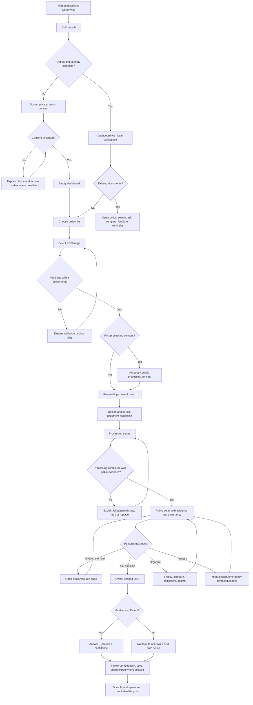
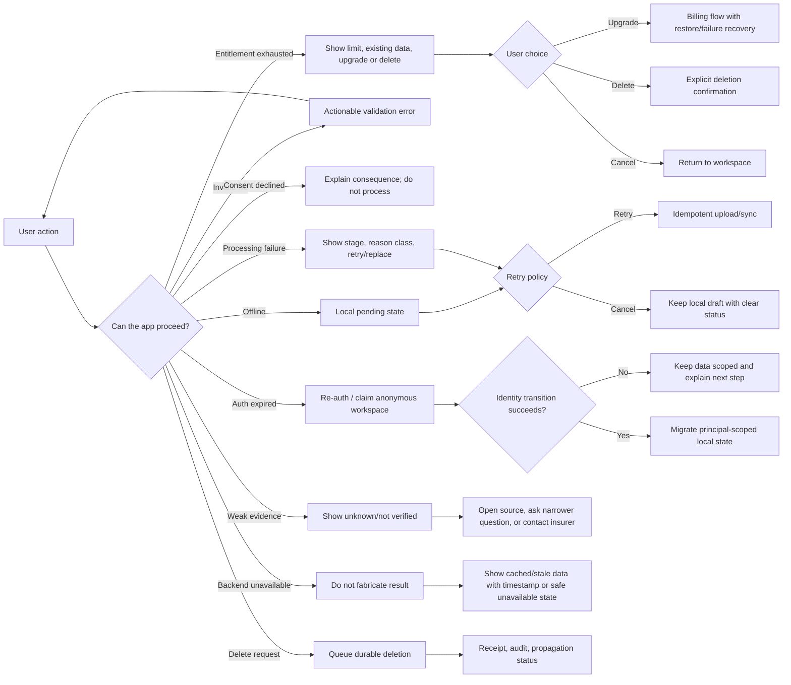
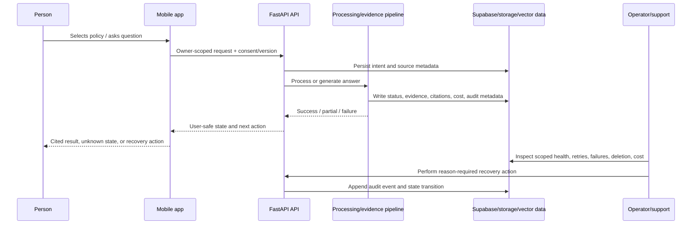

# CoverWise User Journey Map

**Status:** Living product artifact; append dated updates rather than rewriting history.
**Version:** 1.0 baseline, 2026-07-21
**Owner / next reviewer:** Pranay
**Evidence boundary:** This document separates static code evidence, targeted-test evidence, runtime/manual evidence, product decisions, and future exploration. A journey marked “current” means the path exists in the present codebase; it does not mean the whole journey has passed real-device end-to-end validation.

## 0. Why this document exists

This is the canonical journey map for CoverWise. It answers:

1. What a person is trying to accomplish.
2. What the ideal experience should do from trigger to outcome.
3. What the current code and observed runtime actually do.
4. What future journeys are worth building, and which are deliberately rejected.
5. What happens on happy, failure, optional, alternate, retry, offline, privacy, and operator paths.

The strategic exploration map remains the place for product-boundary and opportunity exploration: [`docs/review/exploration_map.md`](../review/exploration_map.md). The canonical system map remains [`docs/architecture/coverwise_canonical_architecture.md`](../architecture/coverwise_canonical_architecture.md). This file is the single journey-shaped source of truth; older journey documents are historical inputs and should not be treated as current implementation contracts.

## 1. Product boundary that governs every journey

CoverWise is a solo, non-regulated personal-information product. It helps a person understand and organize policies they already own.

The durable core is:

```text
user-owned policy
  → securely import
  → process and normalize
  → show evidence and uncertainty
  → explain in plain language
  → organize household knowledge
  → remind and help the person prepare
```

The product does not sell, solicit, procure, rank, recommend, quote, renew, represent claims, sell leads, or act as insurer/broker infrastructure. It must not diagnose, predict disease, prescribe treatment, or turn health records into an insurer/employer/advertiser signal.

That boundary changes how journeys are named:

| User language | CoverWise interpretation | Allowed outcome |
|---|---|---|
| “Am I covered?” | Find what the uploaded policy says and what it does not make verifiable | Cited facts, uncertainty, and a prompt to check the insurer/contract |
| “Which policy is better?” | Compare owned policies dimension by dimension | Cited differences and missing-data warnings; no overall recommendation |
| “How do I claim?” | Explain the policy’s stated process and preparation checklist | Neutral guidance and insurer contact; no representation or claim filing |
| “Should I renew?” | Make dates and contact details easy to find | Reminder and neutral contact action; no renewal transaction or recommendation |
| “Do I need more cover?” | Show missing or unverified information without declaring under-insurance | Factual “not found in uploaded documents” state; no premium advice |

## 2. Journey inventory: ideal, current, and future

Legend:

- **Ideal** = the long-term first-principles experience inside the product boundary.
- **Current** = present code path, with evidence level stated.
- **Future** = an approved or exploratory direction, not a current promise.
- **Rejected / parked** = deliberately outside the product boundary.

| ID | Journey | Ideal outcome | Current reality | Future direction / decision |
|---|---|---|---|---|
| J01 | Discover and decide to try | Person understands the neutral value proposition and starts without being misled about advice, selling, or claims | App has CoverWise onboarding copy and a first-policy CTA; external acquisition and message consistency need review | Evidence-backed public education and an example-driven entry path; no lead capture from sensitive content |
| J02 | Cold launch and onboarding | Splash → three concise value moments → clear scope/privacy notice → explicit consent → usable home | `SplashScreen`, `OnboardingScreen`, SharedPreferences completion flag, terms/consent and analytics consent paths exist. Real-device audit found intermittent lower-screen interaction and relaunch/onboarding persistence failures; treat Tier 4 proof as incomplete | Durable onboarding state, resumable consent, accessible hit targets, and an optional read-only sample policy |
| J03 | Anonymous start, account creation, sign-in, sign-out | Person gets value quickly, then can claim the workspace without losing documents; identity changes are explicit | Anonymous token, auth provider, email/password, Google OAuth, reset-password and account screens exist; owner-claim and backend refresh routes exist | Make principal ownership and local encrypted-data migration observable; verify every identity transition end to end |
| J04 | First document import | Person selects a PDF/image, understands what is uploaded and why, consents once for processing, and sees immediate durable progress | `DocumentsScreen` supports file selection, web/file variants, processing consent, limit checks, local pending state, and `POST /documents/upload` | Multi-file queue, camera capture, resumable upload, clear local/server state machine, and consent withdrawal semantics |
| J05 | Document processing and extraction | Processing is asynchronous, retryable, explainable, and ends in a cited, reviewable policy record | Backend accepts upload, persists document state, runs processing/evidence paths, and exposes status/summary/page routes. Architecture says outbox is the long-term primitive, but migration is incomplete | Finish one durable outbox path, expose real stages, retry safely, quarantine partial results, and show operator health |
| J06 | Review extracted policy | Person can distinguish source-backed facts, missing fields, uncertain extraction, and original pages | `PolicyDetailScreen`, evidence route, citation cards, document preview, and page routes exist; substrate architecture defines source spans and field evidence | Source-page highlighting, field correction with provenance, reprocessing, and “not verified” states for every claim-shaped field |
| J07 | Ask a policy question | Person asks in natural language, gets a concise answer, sees source citations/confidence, and can recover when evidence is weak | `QaScreen`, `/query`, `/documents/query`, RAG pipeline, history, follow-ups, feedback, and usage/entitlement surfaces exist. Cross-document scope and fresh-runtime RAG health remain verification gaps | One canonical owner-scoped Q&A route, streaming or staged progress, citation verification, answer history export/deletion, and safe fallback templates |
| J08 | Search and navigate knowledge | Person finds a policy, field, clause, or prior answer without remembering where it lives | `SearchScreen` and `/search` navigation surface exist in the mobile app; backend-wide search contract needs inventory/verification | Unified search over policy metadata, source text, citations, and saved answers with explicit ranking and no unsupported semantic claims |
| J09 | Manage document lifecycle | Person views, previews, replaces, reprocesses, archives, deletes, and understands consequences | List, preview, replacement, delete, status, local encrypted storage, storage contract, and account deletion paths exist; full deletion propagation is still a high-risk closure item | Durable lifecycle state machine, undo window where safe, deletion receipt, and source/object/vector/cache/analytics cleanup evidence |
| J10 | Understand coverage facts and gaps | Person sees what is explicitly present, absent, or unknown in owned policies | `CoverageGapScreen` and tracking exist, but exploration-map boundary says recommendation-like wording must be neutralized | “Coverage understanding” substrate view: cited facts, missing fields, questions to ask insurer; never “you are under-insured” or product recommendations |
| J11 | Compare owned policies | Person compares two or more owned policies on normalized, cited dimensions | `PolicyComparisonScreen` exists; normalization, source citation, missing-field behavior, and recommendation copy require continued alignment | Dimension-specific comparison with denominator/tax/rider rules, evidence links, and export; no best-policy verdict |
| J12 | Family / household organization | Person sees who is named across owned policies, corrects household records, and understands visibility | `FamilyScreen`, detail screen, manual members, auto-detected members, and family routes exist; privacy/deletion expansion is documented in ADRs | Per-member coverage map, explicit source/manual badges, scoped sharing, and deletion propagation |
| J13 | Renewal awareness | Person sees expiry dates, receives controlled reminders, and can contact the named insurer | `RenewalCalendarScreen`, notification preferences, local scheduling, and neutral contact actions exist; “start renewal” language needs review | Renewal diff against a newly uploaded document; reminders remain informational, never a sales funnel |
| J14 | Emergency access | Person reaches policy number, insurer, coverage, expiry, and helpline quickly—even with poor connectivity | `EmergencyScreen` and insurance-card surface exist; offline completeness is not yet proven | Signed/encrypted offline emergency card, explicit stale timestamp, controlled sharing, and revocation behavior |
| J15 | Claims preparation | Person understands policy-stated steps and gathers documents without believing CoverWise represents them | Claims assistant and claim tracking screens exist; current path is guidance/local tracking, not insurer integration | Evidence-backed claim-preparation packet and optional document vault, subject to separate medical-data/privacy decisions; no filing or representation by default |
| J16 | Insurance literacy | Person learns terminology while viewing their own policy | `InsuranceLiteracyScreen` and quiz exist | Contextual definitions tied to cited policy clauses, with accessibility and localization research |
| J17 | Plan limits, paywall, and subscription | Person sees limits before being blocked, understands price/entitlement, and can restore or cancel safely | RevenueCat initialization, entitlement providers, paywall/upgrade screens, and subscription routes exist; full billing E2E/idempotency proof remains required | Provider-neutral entitlement ledger, webhook reconciliation, restore/refund recovery, and transparent cost/value messaging |
| J18 | Help, feedback, and trust | Person can report a problem, understand uncertainty, and reach support without exposing excess data | Help/support, feedback, analytics, legal screens, and consent ledger paths exist; analytics safety and operator access still need hardening | Redacted diagnostics, explainable processing receipt, purpose-scoped support access, and auditable operator workflow |
| J19 | Privacy, consent, export, and deletion | Person can see purposes, withdraw optional consent, export own data, and request complete deletion | Privacy/terms/profile/deletion UI and server-side consent primitives exist; deletion is high-risk and not fully Tier 3+ closed | Purpose-specific ledger enforcement, deletion outbox, propagation receipt, export format, retention register, and privacy release gates |
| J20 | Return visit / lifecycle loop | Person returns when a policy changes, a reminder fires, a question arises, or a household record needs updating | Dashboard, local persistence, reminders, history, and notifications exist; cold relaunch stability and freshness need runtime proof | A trustworthy “what changed / what needs attention / what is stale” home, with no manufactured engagement |

## 3. Canonical end-to-end happy path

This is the primary product journey: a person has a policy, wants to understand it, and receives a cited result.



### Happy-path acceptance contract

The journey is not successful merely because a file reached an API. A successful outcome requires:

| Layer | Required result |
|---|---|
| Person | Understands at least one policy fact and where it came from |
| Product | Shows a useful, plain-language result without overstating certainty |
| Evidence | Claim-shaped fields have source/page/span provenance or are shown as not verified |
| Pipeline | Upload, processing, extraction, and query have owner scope, retry/failure states, and no silent fallback |
| Storage | Original file, metadata, derived fields, vectors, cache, and local copies have explicit lifecycle ownership |
| Operator | Failure, retry, cost, latency, model/provider, and deletion state are inspectable |

## 4. Non-happy paths, alternates, and optional branches



### Alternate and optional branches that must remain explicit

| Branch | User choice | Product rule |
|---|---|---|
| Anonymous vs account | Start now or sign in first | Anonymous value is allowed, but ownership transfer must be explicit and lossless |
| File vs camera | Import existing PDF/image or capture pages | Original capture remains source; image quality and page order are visible |
| Local OCR vs server processing | Use device-assisted extraction where offered | Label local OCR as a sidecar; original file remains source of truth |
| Sample policy vs real policy | Explore a bundled/read-only example or upload personal data | Sample must never mix with the user’s owned workspace or analytics identity |
| One policy vs household | Understand one policy or organize multiple policies | Every result shows document and owner scope |
| Question vs browse | Ask in natural language or inspect source | Browse/source verification is always available when a claim is shown |
| Compare vs recommend | Compare dimensions or ask “what should I buy?” | Comparison is allowed; purchase/recommendation is rejected or reframed |
| Claim guidance vs claim filing | Read preparation steps or submit to insurer | CoverWise can guide and organize; it does not represent or file by default |
| Renewal reminder vs renewal transaction | Receive reminder or contact insurer | Reminders and contact are allowed; renewal transaction is out of scope |
| Share/export | Share a bounded card/report or keep private | Show exact fields, destination, timestamp, and revoke/delete implications |
| Optional health records | Keep local records/reminders or do not use | Local-first, neutral, optional, and separate from policy intelligence until separately approved |

## 5. Journey detail cards

Each card uses the same contract: trigger → input → system work → state → user output → operator visibility → failure/retry → stored data.

### J02 — Cold launch and onboarding

**Ideal:** Open app → splash → understand / ask / stay-ready value → read scope and privacy → choose optional analytics consent separately → accept required terms → land on an empty but actionable dashboard. On repeat launch, skip onboarding and restore the correct principal-scoped workspace.

**Current evidence:** `mobile/lib/main.dart` checks `SharedPreferences` for `onboarding_complete`; `mobile/lib/screens/onboarding_screen.dart` writes completion and records consent. The 2026-07-20 runtime audit observed clean cold-launch visuals but also intermittent lower-screen taps, black-screen relaunch behavior, and onboarding appearing again after relaunch. The visual path is Tier 4; the complete reliable path is not closed.

**Non-happy paths:** consent declined; app killed during completion; backend unavailable; terms version changes; partial analytics consent; accessibility text scaling; deep link before onboarding; repeated tap on CTA.

**Required future state:** onboarding completion, consent version, and workspace readiness must be separate state transitions with an observable receipt. No silent “best effort” path may make the user believe a server-side consent event succeeded when it did not.

### J03 — Identity and ownership

**Ideal:** Anonymous user can upload and inspect a policy. Sign-up/sign-in claims that exact workspace. Sign-out makes ownership and local-data behavior explicit. Password reset and OAuth return through validated deep links. Account deletion revokes access and starts durable deletion.

**Current evidence:** `AuthService`, `auth_provider.dart`, `account_screen.dart`, `reset_password_screen.dart`, `src/api/user.py`, and principal-scoped local storage implement substantial pieces. Full device + backend ownership transition is not established at Tier 3+ in this baseline.

**High-risk checks:** token expiry, refresh failure, two users on one device, app reinstall, auth callback tampering, anonymous claim replay, local Hive lock, deletion during processing, and no cross-owner document access.

### J04/J05 — Import, processing, extraction

**Ideal:** Select → validate → consent → upload → durable accepted state → progress by real stage → retryable processing → evidence-backed result. Every retry is idempotent; a failed attempt never silently replaces a prior good result.

**Current evidence:** `POST /documents/upload`, document repository/object storage, `DocumentProcessingService`, status and summary routes, evidence pipeline, local pending upload state, and `ProcessingStatusScreen` exist. The architecture identifies the outbox as the long-term async primitive but records that current migration is incomplete. This is a high-risk path; static presence is not E2E proof.

**Failure classes:** invalid/encrypted/oversized file; unsupported image; network timeout; duplicate upload; lease contention; OCR failure; extraction hallucination; missing citation; vector-store failure; outbox dead letter; entitlement race; user deletes during processing.

**Operator requirement:** a support/operator view must show document id, owner scope, stage, attempts, lease, last error class, model/provider, cost, and safe retry action without exposing raw content unnecessarily.

### J06/J07 — Evidence review and Q&A

**Ideal:** Policy detail is the trust center. A field is either cited to source text/page/span, explicitly marked uncertain/not found, or not rendered as a fact. Q&A uses the same owner scope and evidence contract, cites source text, and declines safely when retrieval or verification fails.

**Current evidence:** `docs/architecture/coverwise_canonical_architecture.md` defines the substrate and source/retrieval-text split. `src/api/evidence.py`, `evidence_pipeline.py`, `citation_verifier.py`, `PolicyDetailScreen`, and `QaScreen` implement pieces. Current docs also note cross-document Q&A and fresh-runtime RAG health as gaps.

**Failure classes:** no documents; question outside corpus; ambiguous policy scope; stale index; low retrieval confidence; LLM timeout; malformed structured answer; citation not substring of source; provider fallback; user asks for advice or diagnosis.

**Safe response:** say what the document supports, what it does not show, why confidence is limited, and the next safe action. Never fill missing insurance facts from general model knowledge.

### J09/J19/J20 — Lifecycle, privacy, and return visits

**Ideal:** The person can see every stored representation of a document, update or delete it, inspect consent purposes, export bounded data, and return later to a clearly timestamped workspace. Deletion is a durable workflow with a receipt, not a best-effort HTTP response.

**Current evidence:** local encrypted Hive work, Supabase storage/data contracts, consent ledger, account deletion endpoint, profile UI, and notification scheduling exist. The repo’s audits and ADRs explicitly treat deletion propagation, consent enforcement, operator trust, and durable work as incomplete/high-risk areas.

**Required future state:** object → metadata → chunks/vector → cache → analytics → derived evidence → local copy → backups/retention must have a documented lifecycle, owner, and proof of completion or exception.

## 6. Operator and system journey behind the user journey

The product journey is only complete when the system can explain itself after the person leaves the screen.



Operator questions that every meaningful journey must answer:

- What happened?
- When did it happen?
- Which owner, document, and request were involved?
- Which external service/model/provider was used?
- Was there a retry, fallback, duplicate, timeout, or partial result?
- What did the person see?
- What can the operator safely do next?
- What data was stored, for what purpose, and how is deletion proven?

## 7. Future journey portfolio

### Approved long-term directions

1. **Evidence-backed policy intelligence:** every claim-shaped output has a source, page, span, confidence, and “not verified” alternative.
2. **Household policy organization:** family members, ownership, source/manual corrections, scoped sharing, and deletion.
3. **Coverage understanding:** factual missing-field and clause comparison, not under-insurance advice.
4. **Renewal diff:** compare old and newly uploaded policy documents to reveal changed dates, limits, exclusions, and missing fields.
5. **Claim preparation:** neutral checklist and document organization, with separate privacy rules for sensitive records.
6. **Durable privacy lifecycle:** consent purpose, export, deletion propagation, retention, and auditable operator access.
7. **Trustworthy return loop:** stale-state and change detection that earns a return visit without engagement manipulation.

### Exploratory directions requiring a separate decision

- optional local-first health records, reminders, and export;
- controlled value-add partnerships with explicit disclosure and consent;
- paid review services only if the entity, role, contracts, and regulatory posture are separately decided;
- multilingual documents and localized explanation;
- camera capture and page-quality correction;
- cross-document Q&A with explicit scope selection.

### Rejected or parked journeys

- buy or renew insurance inside CoverWise;
- product recommendations, ranking, “best plan,” or personalized premium advice;
- insurer/employer/advertiser targeting based on uploaded content or health;
- clinical diagnosis, prediction, prescription, or treatment planning;
- customer claim representation or false certainty that a claim will succeed;
- behavioral advertising in the authenticated policy viewer;
- training on raw customer documents by default.

## 8. Evidence and verification register

| Area | Evidence in this baseline | Tier | Closure needed |
|---|---|---:|---|
| Cold launch visuals | `docs/review/coverwise_launch_audit_2026-07-20.md` screenshots and observations | 4 | Repeat on current build after navigation fixes |
| Mobile navigation | Static route/navigation inspection plus audit failures | 1 + 4 | Reliable real-device navigation through all five tabs |
| Upload contract | Flutter service and FastAPI route inspection | 1 | Real document upload through storage and processing |
| Evidence substrate | Architecture, routes, services, migrations, tests | 1–2 | Real policy with page/source citation verification |
| Q&A | Screens, routes, RAG code, targeted tests; runtime health has known gaps | 1–2 | Fresh backend, owner-scoped question, citation and fallback proof |
| Auth/ownership | Auth providers, user routes, principal storage code and tests | 1–2 | Anonymous → account claim, expiry, two-user isolation, deletion |
| Billing | RevenueCat and subscription code | 1–2 | Sandbox purchase/restore/webhook/idempotency proof |
| Deletion/privacy | UI, consent ledger, deletion endpoint, ADRs/audits | 1–2 | Durable deletion receipt across every representation |

## 9. Open exploration questions

These are deliberately left open for continued discussion:

1. Is the first-run value proposition “understand one policy” strong enough without a bundled sample policy, or does a sample create trust/data-separation risk worth the complexity?
2. What is the smallest evidence-backed output that makes a person trust the app after upload: policy identity, dates, premium, insurer contact, or a cited answer?
3. Should Q&A be document-scoped by default, with an explicit household scope switch, or should the policy detail screen own all questions?
4. What does “share” mean in the product: emergency card, cited answer, full policy, or an export bundle—and which fields are never shareable by default?
5. Is coverage-gap language worth keeping if it cannot recommend action, or should it become a narrower “missing or unverified policy fields” surface?
6. What operator role is needed at launch: a single support/security operator with reason-required audit, or a staged role model already reflected in the ADRs?
7. What is the minimum real-document benchmark and citation acceptance threshold before evidence-backed claims can appear in marketing?
8. Which future features create the highest durable value without creating a second business model: household organization, renewal diff, claim preparation, or evidence-backed annual review?

## 10. Pass notes

### Pass 1 — Immediate correctness and completeness

The inventory covers primary navigation, deep-link features, document lifecycle, Q&A, family, reminders, emergency access, claims preparation, billing, identity, privacy, and operator recovery. Each journey has ideal/current/future status and non-happy branches. Current runtime failures are retained rather than normalized away.

### Pass 2 — Architecture and long-term viability

The map routes all journeys through the canonical mobile → FastAPI → storage/evidence/RAG path. It does not introduce a second API, pipeline, consent system, or journey source of truth. Recommendation-like surfaces are explicitly constrained by the permanent product boundary.

### Pass 3 — Rule compliance and supervision readiness

Claims are tiered by evidence. High-risk journeys name their missing Tier 3+ checks. Future work is framed as decisions and durable contracts, not calendar estimates. The map preserves open questions and rejected paths so later exploration cannot silently drift the product boundary.

### Anything else?

Yes: the main hidden risk is not missing screens; it is a mismatch between a polished screen and the lifecycle underneath it. Every later journey discussion must therefore trace input → processing → storage → output → operator visibility, and must update this map when the product boundary, source of truth, or verification status changes.

## 11. Update log

- **2026-07-21:** Created baseline journey inventory from current Flutter screens, route declarations, FastAPI routes, canonical architecture, exploration map, user-flow planning docs, and the 2026-07-20 runtime launch audit. Established ideal/current/future labels, non-happy-path diagrams, evidence tiers, and open questions. No code behavior changed.

## 12. J02–J07 deep-dive addendum (2026-07-21)

The detailed implementation audit is preserved at
`docs/review/coverwise_j02_j07_deep_dive_2026-07-21.md`. The canonical map’s
status is now more precise:

- **J02/J03:** local onboarding consent and server consent use different purpose
  vocabularies; the traced onboarding path does not call the server consent
  ledger. Anonymous-to-account claim transfers server document ownership, but
  local encrypted principal migration is not proven. Account deletion’s `202`
  contract references a durable job not enqueued by the inspected route.
- **J04/J05:** upload validation, owner-scoped dedupe, storage rollback, and
  capability-aware processing states are real. The upload route still launches
  processing through FastAPI `BackgroundTasks` even though the durable outbox is
  documented as canonical, so crash recovery is not closed.
- **J06:** the evidence substrate and owner check are real, and the main RAG
  query path verifies citations against immutable source text. A fresh
  real-document proof and convergence of weaker model-backed extraction paths
  remain open.
- **J07:** owner scope and honest unavailable/not-found fallbacks exist, but
  `/query` and `/documents/query` remain parallel product query actions. One
  canonical route and a retirement path for the other are required.

This addendum does not convert static inspection into end-to-end completion. The
next verification gate is a real-document, two-principal Tier 3 pass covering
consent, claim, upload, processing retry, evidence citation, and Q&A fallback.

**2026-07-21 deep-dive update:** Added the dated J02–J07 contract audit,
Supabase security references, risk-ranked closure order, and follow-up questions.
No code behavior changed.

**2026-07-21 verification addendum:** The focused Python checks returned 45
passed, 8 failed, and 3 errors after excluding the missing-`jose` collection
blocker. The failures are citation-verifier test/API unpacking drift and a
missing usable Supabase client fixture; J06/J07 targeted verification therefore
remains open rather than being reported as clean.
