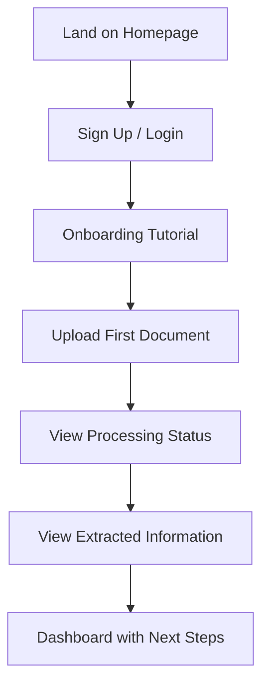
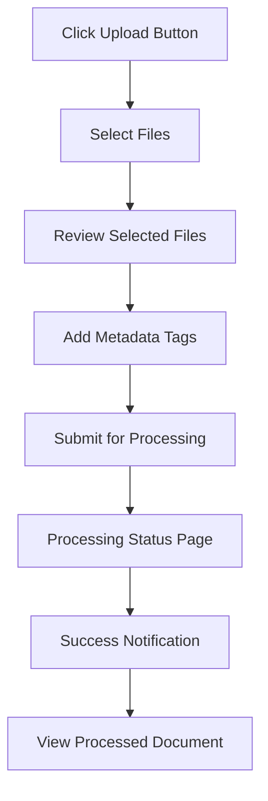
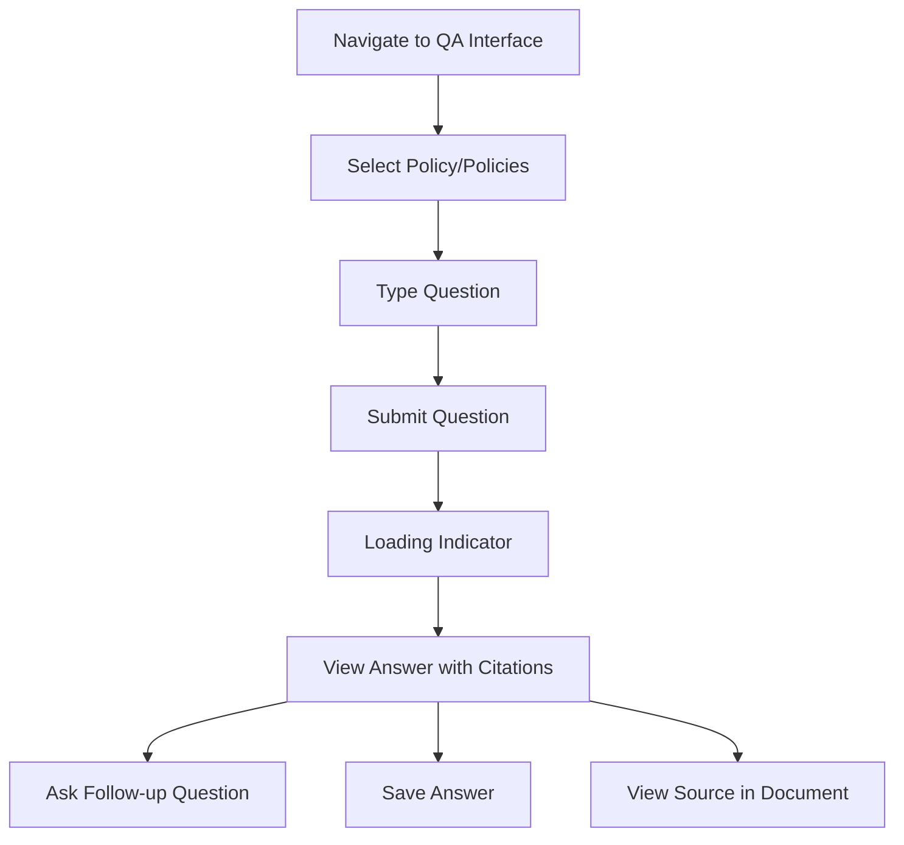
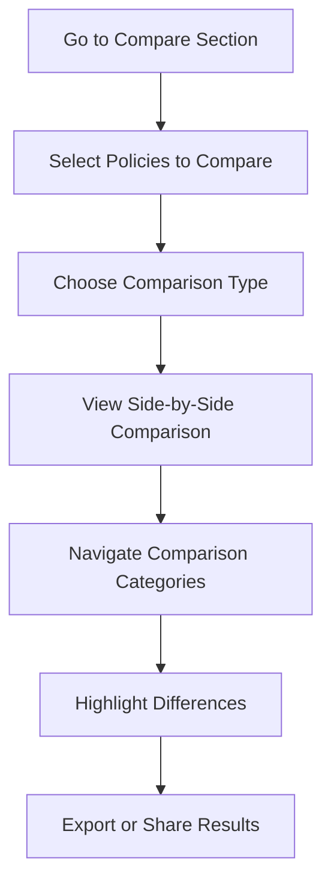

# Frontend Implementation Guide

This document provides a comprehensive guide for implementing the frontend user interface of the Insurance Policy Parser & QA App. It covers UI components, design principles, user flows, and implementation details.

## Table of Contents

1. [Design Principles](#design-principles)
2. [Technology Stack](#technology-stack)
3. [Component Architecture](#component-architecture)
4. [Key Screens and Components](#key-screens-and-components)
5. [User Flows](#user-flows)
6. [State Management](#state-management)
7. [Responsive Design](#responsive-design)
8. [Accessibility](#accessibility)
9. [Performance Optimization](#performance-optimization)
10. [Integration with Backend](#integration-with-backend)

## Design Principles

The Insurance Policy Parser & QA App UI follows these core design principles:

### 1. Clarity and Simplicity

- **Clear Information Hierarchy**: Present information in a logical, prioritized manner
- **Focused Interactions**: Limit options to what's necessary for each task
- **Progressive Disclosure**: Reveal details progressively to avoid overwhelming users
- **Consistent Patterns**: Use consistent UI patterns throughout the application

### 2. Trust and Confidence

- **Transparent Processing**: Clear visibility into document processing status
- **Source Attribution**: Clear citations for answers to build trust
- **Confidence Indicators**: Visual indication of confidence levels for generated answers
- **Editable Results**: Allow users to correct or refine extracted information

### 3. Efficiency and Productivity

- **Streamlined Workflows**: Minimize steps for common tasks
- **Batch Operations**: Enable handling multiple documents efficiently
- **Keyboard Shortcuts**: Support power users with keyboard navigation
- **Context Preservation**: Maintain context during complex interactions

### 4. Accessibility and Inclusion

- **Universal Design**: Ensure the interface works for users of all abilities
- **Clear Language**: Use straightforward, jargon-free language
- **Flexible Interaction**: Support multiple ways to accomplish tasks
- **Responsive Design**: Adapt to different devices and screen sizes

## Technology Stack

### Core Technologies

- **React**: For component-based UI development
- **TypeScript**: For type safety and better developer experience
- **React Router**: For navigation and routing
- **Redux Toolkit**: For state management
- **Axios**: For API communication
- **Styled Components**: For component-specific styling

### UI Component Libraries

- **Material UI**: Core component library for consistent design
- **React PDF**: For PDF rendering and viewer
- **React Markdown**: For rich text display
- **Recharts**: For data visualization
- **React Query**: For data fetching and caching

### Development Tools

- **Vite**: Modern build tool for faster development
- **ESLint**: For code linting
- **Prettier**: For code formatting
- **Storybook**: For component development and documentation
- **Jest and React Testing Library**: For testing

## Component Architecture

The frontend follows a modular architecture with reusable components organized by feature:

```
src/
├── assets/              # Static assets like images, icons
├── components/          # Shared UI components
│   ├── common/          # Generic UI components
│   ├── layout/          # Layout components
│   ├── forms/           # Form components
│   ├── feedback/        # Loading, error states
│   ├── pdf/             # PDF related components
│   └── visualizations/  # Charts and data visualizations
├── features/            # Feature-specific components
│   ├── auth/            # Authentication
│   ├── documents/       # Document management
│   ├── policy/          # Policy display and management
│   ├── qa/              # Question answering interface
│   └── comparison/      # Policy comparison
├── hooks/               # Custom React hooks
├── services/            # API and service integrations
├── store/               # Redux store configuration
├── styles/              # Global styles and themes
├── utils/               # Utility functions
└── App.tsx              # Application entry point
```

### Component Hierarchy

The component hierarchy follows a layered approach:

1. **App Shell**: Core layout components (Header, Footer, Navigation)
2. **Page Containers**: Route-specific containers for each major section
3. **Feature Components**: Functional groupings of related components
4. **Common Components**: Reusable UI elements used across features
5. **Primitive Components**: Base-level UI building blocks

## Key Screens and Components

### 1. Authentication Screens

#### Login Screen
- Username/email and password fields
- "Remember me" option
- Forgot password link
- OAuth provider buttons
- Create account link

#### Registration Screen
- Email field with validation
- Password field with strength indicator
- Name fields
- Terms and privacy policy acceptance
- Email verification integration

### 2. Dashboard

#### Overview Panel
- Summary of document count by type
- Recently uploaded documents
- Upcoming policy expirations
- Recent questions and answers

#### Quick Actions
- Upload document button
- Ask question button
- View policies button
- Compare policies button

#### Activity Feed
- Recent document uploads
- Recent policy QA interactions
- System notifications

### 3. Document Management

#### Upload Interface
- Drag-and-drop upload area
- File selection dialog
- Multiple file support
- Upload progress indicator
- File format validation

#### Document List
- Sortable and filterable list
- Thumbnail previews
- Status indicators (processed, processing, error)
- Action buttons (view, delete, rename)
- Batch selection for operations

#### Document Viewer
- PDF renderer with page navigation
- Extraction result overlay
- Side-by-side view of original and processed content
- Annotation support
- Highlight of extracted data

### 4. Policy Information

#### Policy Dashboard
- Policy cards with key information
- Visual status indicators
- Premium and coverage summaries
- Expiration countdowns
- Quick action buttons

#### Policy Detail View
- Tabbed interface for different sections:
  1. Overview tab
  2. Coverage details tab
  3. Exclusions tab
  4. Premium information tab
  5. Timeline tab
  6. Documents tab

#### Extracted Sections Display
- Layout elements from OCR are converted to sections for easier readability
- Sections are displayed by their IDs (e.g., policy number, effective date)
- Fallbacks for different data formats (sections, layout_elements)
- Clear error messages when no sections are available

#### Policy Editor
- Editable fields for extracted information
- Validation of input values
- Save and cancel actions
- Change history

### 5. Question and Answer Interface

#### Question Input
- Natural language question field
- Policy selector dropdown
- Question history and suggestions
- Voice input option

#### Answer Display
- Formatted answer text
- Source citations with highlights
- Properly formatted source references showing page numbers, document IDs, and relevance scores
- Confidence indicator
- Follow-up question suggestions
- Save/bookmark option

#### Conversation History
- Scrollable conversation thread
- Question and answer pairs
- Timestamp indicators
- Ability to return to previous questions

### 6. Policy Comparison

#### Comparison Selector
- Policy selection interface
- Side-by-side policy cards
- Comparison type options (same type, versions, different types)

#### Comparison View
- Split-screen layout
- Synchronized scrolling
- Highlight of differences
- Tabbed categories for comparison
- Summary of key differences

#### Comparison Export
- Selection of export format
- Options for inclusion/exclusion of sections
- Preview before export
- Share options

## User Flows

### 1. First-Time User Experience



### 2. Document Upload and Processing



### 3. Asking Questions About Policies



### 4. Comparing Policies



## State Management

The application uses Redux Toolkit for global state management with a structured approach:

### 1. State Structure

```typescript
interface RootState {
  auth: AuthState;
  documents: DocumentsState;
  policies: PoliciesState;
  qa: QAState;
  ui: UIState;
  notifications: NotificationsState;
}

interface AuthState {
  user: User | null;
  isAuthenticated: boolean;
  isLoading: boolean;
  error: string | null;
}

interface DocumentsState {
  documents: Document[];
  selectedDocument: Document | null;
  uploadProgress: Record<string, number>;
  processing: Record<string, ProcessingStatus>;
  isLoading: boolean;
  error: string | null;
}

interface PoliciesState {
  policies: Policy[];
  selectedPolicy: Policy | null;
  comparisonPolicies: Policy[];
  isLoading: boolean;
  error: string | null;
}

interface QAState {
  conversations: Conversation[];
  currentConversation: Conversation | null;
  isLoading: boolean;
  error: string | null;
}

// Additional types as needed
```

### 2. Redux Slices

Each main feature has its own Redux slice:

```typescript
// Auth slice example
const authSlice = createSlice({
  name: 'auth',
  initialState,
  reducers: {
    loginStart: (state) => {
      state.isLoading = true;
      state.error = null;
    },
    loginSuccess: (state, action) => {
      state.isLoading = false;
      state.isAuthenticated = true;
      state.user = action.payload;
    },
    loginFailure: (state, action) => {
      state.isLoading = false;
      state.error = action.payload;
    },
    logout: (state) => {
      state.isAuthenticated = false;
      state.user = null;
    },
    // Other auth actions
  },
});
```

### 3. Async Thunks

For API interactions, we use Redux Toolkit's `createAsyncThunk`:

```typescript
export const uploadDocument = createAsyncThunk(
  'documents/upload',
  async (fileData: FormData, { rejectWithValue }) => {
    try {
      const response = await api.uploadDocument(fileData);
      return response.data;
    } catch (error) {
      return rejectWithValue(error.response?.data || 'Upload failed');
    }
  }
);
```

### 4. Selectors

Memoized selectors for efficient state access:

```typescript
export const selectDocumentsByType = createSelector(
  [(state: RootState) => state.documents.documents, (state, type) => type],
  (documents, type) => documents.filter(doc => doc.documentType === type)
);

export const selectUpcomingExpirations = createSelector(
  [(state: RootState) => state.policies.policies],
  (policies) => policies
    .filter(policy => {
      const expirationDate = new Date(policy.expirationDate);
      const now = new Date();
      const diffDays = Math.ceil((expirationDate.getTime() - now.getTime()) / (1000 * 60 * 60 * 24));
      return diffDays > 0 && diffDays <= 30;
    })
    .sort((a, b) => new Date(a.expirationDate).getTime() - new Date(b.expirationDate).getTime())
);
```

## Responsive Design

The application is built with a mobile-first responsive design approach:

### 1. Breakpoint System

```typescript
const breakpoints = {
  xs: '0px',
  sm: '600px',
  md: '960px',
  lg: '1280px',
  xl: '1920px'
};

const theme = {
  breakpoints: {
    up: (key: keyof typeof breakpoints) => `@media (min-width: ${breakpoints[key]})`,
    down: (key: keyof typeof breakpoints) => `@media (max-width: ${breakpoints[key]})`,
    between: (start: keyof typeof breakpoints, end: keyof typeof breakpoints) =>
      `@media (min-width: ${breakpoints[start]}) and (max-width: ${breakpoints[end]})`,
  },
  // Other theme properties
};
```

### 2. Responsive Layout Components

```typescript
const ResponsiveGrid = styled.div`
  display: grid;
  grid-template-columns: 1fr;
  gap: 16px;
  
  ${props => props.theme.breakpoints.up('sm')} {
    grid-template-columns: repeat(2, 1fr);
  }
  
  ${props => props.theme.breakpoints.up('md')} {
    grid-template-columns: repeat(3, 1fr);
  }
  
  ${props => props.theme.breakpoints.up('lg')} {
    grid-template-columns: repeat(4, 1fr);
  }
`;

const DashboardLayout = styled.div`
  display: flex;
  flex-direction: column;
  
  ${props => props.theme.breakpoints.up('md')} {
    flex-direction: row;
  }
  
  .sidebar {
    width: 100%;
    
    ${props => props.theme.breakpoints.up('md')} {
      width: 300px;
      min-width: 300px;
    }
  }
  
  .main-content {
    flex: 1;
  }
`;
```

### 3. Component Adaptations

```typescript
const PolicyCard = ({ policy, isCompact }) => {
  return (
    <Card>
      <CardHeader 
        title={policy.policyType} 
        subheader={policy.insurer}
        action={isCompact ? null : <IconButton><MoreVertIcon /></IconButton>}
      />
      <CardContent>
        <Typography variant="body2" color="textSecondary">
          Policy #: {policy.policyNumber}
        </Typography>
        {!isCompact && (
          <>
            <Typography variant="body2">
              Effective: {formatDate(policy.effectiveDate)}
            </Typography>
            <Typography variant="body2">
              Expires: {formatDate(policy.expirationDate)}
            </Typography>
          </>
        )}
        <Typography variant="h6">
          ${policy.premium}/{policy.premiumFrequency}
        </Typography>
      </CardContent>
      {!isCompact && (
        <CardActions>
          <Button size="small">View Details</Button>
          <Button size="small">Ask Question</Button>
        </CardActions>
      )}
    </Card>
  );
};
```

### 4. Responsive Testing Framework

```typescript
// hooks/useResponsive.ts
export const useResponsive = () => {
  const theme = useTheme();
  const isMobile = useMediaQuery(theme.breakpoints.down('sm'));
  const isTablet = useMediaQuery(theme.breakpoints.between('sm', 'md'));
  const isDesktop = useMediaQuery(theme.breakpoints.up('md'));
  const isLargeScreen = useMediaQuery(theme.breakpoints.up('lg'));
  
  return {
    isMobile,
    isTablet,
    isDesktop,
    isLargeScreen,
    // Short-circuit for specific layouts
    belowTablet: isMobile,
    belowDesktop: isMobile || isTablet,
  };
};
```

## Accessibility

The application is built with accessibility in mind, following WCAG 2.1 AA standards:

### 1. Semantic HTML

```typescript
// Correct usage of semantic elements
const PolicySection = ({ title, children }) => {
  return (
    <section aria-labelledby={`section-${slugify(title)}`}>
      <h2 id={`section-${slugify(title)}`}>{title}</h2>
      <div className="section-content">
        {children}
      </div>
    </section>
  );
};
```

### 2. ARIA Attributes

```typescript
// Proper ARIA usage for custom components
const TabPanel = ({ children, value, index, ...props }) => {
  return (
    <div
      role="tabpanel"
      hidden={value !== index}
      id={`tabpanel-${index}`}
      aria-labelledby={`tab-${index}`}
      {...props}
    >
      {value === index && <Box p={3}>{children}</Box>}
    </div>
  );
};

const Tab = ({ label, index, selected, onChange }) => {
  return (
    <button
      role="tab"
      id={`tab-${index}`}
      aria-controls={`tabpanel-${index}`}
      aria-selected={selected}
      onClick={() => onChange(index)}
    >
      {label}
    </button>
  );
};
```

### 3. Focus Management

```typescript
// Custom hook for managing focus traps in modals
export const useFocusTrap = (isOpen) => {
  const ref = useRef(null);
  
  useEffect(() => {
    if (!isOpen || !ref.current) return;
    
    const focusableElements = ref.current.querySelectorAll(
      'button, [href], input, select, textarea, [tabindex]:not([tabindex="-1"])'
    );
    
    if (focusableElements.length === 0) return;
    
    const firstElement = focusableElements[0];
    const lastElement = focusableElements[focusableElements.length - 1];
    
    // Focus the first element when opened
    firstElement.focus();
    
    const handleKeyDown = (e) => {
      if (e.key !== 'Tab') return;
      
      // If shift+tab on first element, go to last
      if (e.shiftKey && document.activeElement === firstElement) {
        e.preventDefault();
        lastElement.focus();
      }
      
      // If tab on last element, go to first
      if (!e.shiftKey && document.activeElement === lastElement) {
        e.preventDefault();
        firstElement.focus();
      }
    };
    
    ref.current.addEventListener('keydown', handleKeyDown);
    return () => {
      ref.current?.removeEventListener('keydown', handleKeyDown);
    };
  }, [isOpen]);
  
  return ref;
};
```

### 4. Color and Contrast

```typescript
// Color tokens with accessibility in mind
const colors = {
  primary: {
    main: '#1976d2',    // WCAG AA compliant
    light: '#4791db',
    dark: '#115293',
    contrastText: '#ffffff'
  },
  error: {
    main: '#d32f2f',    // WCAG AA compliant
    light: '#ef5350',
    dark: '#c62828',
    contrastText: '#ffffff'
  },
  warning: {
    main: '#ed6c02',    // WCAG AA compliant
    light: '#ff9800',
    dark: '#e65100',
    contrastText: '#ffffff'
  },
  success: {
    main: '#2e7d32',    // WCAG AA compliant
    light: '#4caf50',
    dark: '#1b5e20',
    contrastText: '#ffffff'
  },
  grey: {
    50: '#fafafa',
    100: '#f5f5f5',
    200: '#eeeeee',
    300: '#e0e0e0',
    400: '#bdbdbd',
    500: '#9e9e9e',
    600: '#757575',
    700: '#616161',
    800: '#424242',
    900: '#212121',
  }
};
```

### 5. Keyboard Navigation

```typescript
// Enhanced button component with keyboard support
const ActionButton = ({ onClick, children, ...props }) => {
  const handleKeyDown = (e) => {
    if (e.key === 'Enter' || e.key === ' ') {
      e.preventDefault();
      onClick(e);
    }
  };
  
  return (
    <div
      role="button"
      tabIndex={0}
      onClick={onClick}
      onKeyDown={handleKeyDown}
      {...props}
    >
      {children}
    </div>
  );
};
```

## Performance Optimization

The application implements various performance optimizations:

### 1. Code Splitting

```typescript
// Route-based code splitting
import { lazy, Suspense } from 'react';
import { Routes, Route } from 'react-router-dom';
import LoadingFallback from './components/common/LoadingFallback';

const Dashboard = lazy(() => import('./features/dashboard/Dashboard'));
const DocumentManager = lazy(() => import('./features/documents/DocumentManager'));
const PolicyViewer = lazy(() => import('./features/policy/PolicyViewer'));
const QAInterface = lazy(() => import('./features/qa/QAInterface'));
const Comparison = lazy(() => import('./features/comparison/Comparison'));

const AppRoutes = () => (
  <Suspense fallback={<LoadingFallback />}>
    <Routes>
      <Route path="/" element={<Dashboard />} />
      <Route path="/documents" element={<DocumentManager />} />
      <Route path="/policies/:id" element={<PolicyViewer />} />
      <Route path="/qa" element={<QAInterface />} />
      <Route path="/compare" element={<Comparison />} />
    </Routes>
  </Suspense>
);
```

### 2. Virtualization for Long Lists

```typescript
import { FixedSizeList } from 'react-window';
import AutoSizer from 'react-virtualized-auto-sizer';

const DocumentList = ({ documents }) => {
  const renderRow = ({ index, style }) => {
    const document = documents[index];
    return (
      <div style={style}>
        <DocumentCard document={document} />
      </div>
    );
  };
  
  return (
    <div style={{ height: '100%', minHeight: '400px' }}>
      <AutoSizer>
        {({ height, width }) => (
          <FixedSizeList
            height={height}
            width={width}
            itemCount={documents.length}
            itemSize={100}
          >
            {renderRow}
          </FixedSizeList>
        )}
      </AutoSizer>
    </div>
  );
};
```

### 3. Memoization

```typescript
import { memo, useMemo, useCallback } from 'react';

// Memoized component
const PolicyCard = memo(({ policy, onSelect }) => {
  // Component implementation
});

// Inside a parent component
const PolicyList = ({ policies }) => {
  // Memoized derived data
  const sortedPolicies = useMemo(() => {
    return [...policies].sort((a, b) => 
      new Date(a.expirationDate).getTime() - new Date(b.expirationDate).getTime()
    );
  }, [policies]);
  
  // Memoized callback
  const handleSelect = useCallback((id) => {
    dispatch(selectPolicy(id));
  }, [dispatch]);
  
  return (
    <div className="policy-list">
      {sortedPolicies.map(policy => (
        <PolicyCard 
          key={policy.id}
          policy={policy}
          onSelect={handleSelect}
        />
      ))}
    </div>
  );
};
```

### 4. Image Optimization

```typescript
const optimizedImageLoader = ({ src, width, quality }) => {
  return `https://image-service.example.com/${src}?w=${width}&q=${quality || 75}`;
};

const PolicyProviderLogo = ({ provider, size = 'medium' }) => {
  const dimensions = {
    small: { width: 40, height: 40 },
    medium: { width: 80, height: 80 },
    large: { width: 120, height: 120 }
  };
  
  const { width, height } = dimensions[size];
  
  return (
    <div className="provider-logo-container">
      
    </div>
  );
};
```

### 5. Efficient API Data Handling

```typescript
import { useQuery, useMutation, useQueryClient } from 'react-query';

// In a component
const PolicyDetail = ({ policyId }) => {
  const queryClient = useQueryClient();
  
  // Fetch policy data
  const { data: policy, isLoading, error } = useQuery(
    ['policy', policyId], 
    () => api.getPolicy(policyId),
    {
      staleTime: 5 * 60 * 1000, // 5 minutes
      cacheTime: 30 * 60 * 1000, // 30 minutes
    }
  );
  
  // Update policy mutation
  const mutation = useMutation(
    (updatedPolicy) => api.updatePolicy(policyId, updatedPolicy),
    {
      // Optimistic update
      onMutate: async (newPolicyData) => {
        // Cancel any outgoing refetches
        await queryClient.cancelQueries(['policy', policyId]);
        
        // Snapshot previous value
        const previousPolicy = queryClient.getQueryData(['policy', policyId]);
        
        // Optimistically update to the new value
        queryClient.setQueryData(['policy', policyId], {
          ...previousPolicy,
          ...newPolicyData
        });
        
        return { previousPolicy };
      },
      onError: (err, newData, context) => {
        // Rollback on error
        queryClient.setQueryData(
          ['policy', policyId],
          context.previousPolicy
        );
      },
      onSettled: () => {
        // Refetch after error or success
        queryClient.invalidateQueries(['policy', policyId]);
      },
    }
  );
  
  // Component rendering logic
};
```

## Integration with Backend

### 1. API Service Structure

```typescript
// services/api.ts
import axios from 'axios';

const baseURL = process.env.REACT_APP_API_URL || 'http://localhost:8000/api';

const api = axios.create({
  baseURL,
  timeout: 30000, // 30 seconds
  headers: {
    'Content-Type': 'application/json',
  }
});

// Auth token handling
api.interceptors.request.use(
  (config) => {
    const token = localStorage.getItem('authToken');
    if (token) {
      config.headers['Authorization'] = `Bearer ${token}`;
    }
    return config;
  },
  (error) => Promise.reject(error)
);

// Response handling
api.interceptors.response.use(
  (response) => response,
  async (error) => {
    const originalRequest = error.config;
    
    // Handle token refresh
    if (error.response?.status === 401 && !originalRequest._retry) {
      originalRequest._retry = true;
      try {
        const refreshToken = localStorage.getItem('refreshToken');
        if (!refreshToken) throw new Error('No refresh token');
        
        const res = await axios.post(`${baseURL}/auth/refresh`, { token: refreshToken });
        localStorage.setItem('authToken', res.data.token);
        api.defaults.headers.common['Authorization'] = `Bearer ${res.data.token}`;
        
        return api(originalRequest);
      } catch (refreshError) {
        // Redirect to login if refresh fails
        window.location.href = '/login';
        return Promise.reject(refreshError);
      }
    }
    
    return Promise.reject(error);
  }
);

// API methods organized by domain
const auth = {
  login: (credentials) => api.post('/auth/login', credentials),
  register: (userData) => api.post('/auth/register', userData),
  logout: () => api.post('/auth/logout'),
  refreshToken: (token) => api.post('/auth/refresh', { token }),
  getProfile: () => api.get('/auth/profile'),
};

const documents = {
  upload: (formData) => api.post('/documents/upload', formData, {
    headers: {
      'Content-Type': 'multipart/form-data',
    },
    onUploadProgress: (progressEvent) => {
      // Track and report upload progress
      const percentCompleted = Math.round((progressEvent.loaded * 100) / progressEvent.total);
      // Update progress in state or callback
    },
  }),
  getAll: () => api.get('/documents'),
  getById: (id) => api.get(`/documents/${id}`),
  delete: (id) => api.delete(`/documents/${id}`),
  getProcessingStatus: (id) => api.get(`/documents/${id}/status`),
};

const policies = {
  getAll: () => api.get('/policies'),
  getById: (id) => api.get(`/policies/${id}`),
  update: (id, data) => api.put(`/policies/${id}`, data),
  getComparison: (ids) => api.get('/policies/compare', { params: { ids: ids.join(',') } }),
};

const qa = {
  askQuestion: (data) => api.post('/qa/question', data),
  getConversations: () => api.get('/qa/conversations'),
  getConversationById: (id) => api.get(`/qa/conversations/${id}`),
  addMessage: (conversationId, message) => api.post(`/qa/conversations/${conversationId}/messages`, { message }),
};

export default {
  auth,
  documents,
  policies,
  qa,
};
```

### 2. Integration with Document Upload

```typescript
import { useState } from 'react';
import { useDropzone } from 'react-dropzone';
import { useMutation, useQueryClient } from 'react-query';
import api from '../../services/api';

const DocumentUploader = () => {
  const [uploadProgress, setUploadProgress] = useState({});
  const queryClient = useQueryClient();
  
  const upload = useMutation(
    (files) => {
      const formData = new FormData();
      files.forEach((file) => {
        formData.append('files', file);
      });
      
      return api.documents.upload(formData, {
        onUploadProgress: (progressEvent) => {
          const percentCompleted = Math.round((progressEvent.loaded * 100) / progressEvent.total);
          setUploadProgress((prev) => ({
            ...prev,
            total: percentCompleted
          }));
        },
      });
    },
    {
      onSuccess: () => {
        queryClient.invalidateQueries('documents');
        setUploadProgress({});
      },
    }
  );
  
  const { getRootProps, getInputProps, isDragActive } = useDropzone({
    accept: {
      'application/pdf': ['.pdf'],
    },
    maxSize: 50 * 1024 * 1024, // 50MB
    onDrop: (acceptedFiles) => {
      upload.mutate(acceptedFiles);
    },
  });
  
  return (
    <div className="uploader-container">
      <div
        {...getRootProps()}
        className={`dropzone ${isDragActive ? 'active' : ''} ${upload.isLoading ? 'uploading' : ''}`}
      >
        <input {...getInputProps()} />
        
        {upload.isLoading ? (
          <div className="upload-progress">
            <ProgressBar value={uploadProgress.total || 0} />
            <p>Uploading... {uploadProgress.total || 0}%</p>
          </div>
        ) : (
          <div className="upload-prompt">
            <DocumentIcon size={48} />
            <p>Drag & drop PDF files here, or click to select files</p>
            <p className="upload-hint">Maximum file size: 50MB</p>
          </div>
        )}
      </div>
      
      {upload.isError && (
        <div className="upload-error">
          <ErrorIcon />
          <p>Upload failed: {upload.error.message}</p>
        </div>
      )}
    </div>
  );
};
```

### 3. QA Interface Integration

```typescript
import { useState } from 'react';
import { useMutation, useQuery } from 'react-query';
import api from '../../services/api';

const QAInterface = ({ conversationId }) => {
  const [question, setQuestion] = useState('');
  
  // Fetch or initialize conversation
  const { data: conversation, isLoading: isConversationLoading } = useQuery(
    ['conversation', conversationId],
    () => conversationId ? api.qa.getConversationById(conversationId) : null,
    {
      enabled: !!conversationId,
    }
  );
  
  // Ask question mutation
  const askQuestion = useMutation(
    (questionData) => {
      if (conversationId) {
        return api.qa.addMessage(conversationId, questionData);
      } else {
        return api.qa.askQuestion(questionData);
      }
    },
    {
      onSuccess: (data) => {
        // If this was a new conversation, set the conversation ID
        if (!conversationId && data.conversationId) {
          // Update URL or state with new conversation ID
        }
        
        // Clear the question input
        setQuestion('');
      },
    }
  );
  
  const handleSubmit = (e) => {
    e.preventDefault();
    if (!question.trim()) return;
    
    askQuestion.mutate({
      content: question,
      policyIds: selectedPolicyIds, // Assuming this is defined elsewhere
    });
  };
  
  return (
    <div className="qa-interface">
      {/* Conversation history */}
      <div className="conversation-history">
        {isConversationLoading ? (
          <LoadingSpinner />
        ) : conversation?.messages?.length > 0 ? (
          conversation.messages.map((message) => (
            <MessageBubble
              key={message.id}
              message={message}
              isUser={message.role === 'user'}
            />
          ))
        ) : (
          <EmptyConversation />
        )}
        
        {askQuestion.isLoading && (
          <div className="typing-indicator">
            <span></span>
            <span></span>
            <span></span>
          </div>
        )}
      </div>
      
      {/* Question input */}
      <form onSubmit={handleSubmit} className="question-form">
        <TextField
          value={question}
          onChange={(e) => setQuestion(e.target.value)}
          placeholder="Ask a question about your policy..."
          fullWidth
          multiline
          maxRows={4}
          disabled={askQuestion.isLoading}
        />
        <Button
          type="submit"
          variant="contained"
          color="primary"
          disabled={!question.trim() || askQuestion.isLoading}
        >
          {askQuestion.isLoading ? <CircularProgress size={24} /> : <SendIcon />}
        </Button>
      </form>
    </div>
  );
};
```

### 4. Policy Comparison Integration

```typescript
import { useState, useEffect } from 'react';
import { useQuery } from 'react-query';
import api from '../../services/api';

const PolicyComparison = () => {
  const [selectedPolicyIds, setSelectedPolicyIds] = useState([]);
  
  // Fetch all policies
  const { data: policies, isLoading: isPoliciesLoading } = useQuery(
    'policies',
    () => api.policies.getAll()
  );
  
  // Fetch comparison data
  const { data: comparison, isLoading: isComparisonLoading } = useQuery(
    ['policyComparison', selectedPolicyIds.sort().join('-')],
    () => api.policies.getComparison(selectedPolicyIds),
    {
      enabled: selectedPolicyIds.length >= 2,
    }
  );
  
  const handlePolicySelect = (policyId) => {
    setSelectedPolicyIds((prev) => {
      if (prev.includes(policyId)) {
        return prev.filter(id => id !== policyId);
      }
      
      // Limit to comparing 2 policies for simplicity
      if (prev.length >= 2) {
        return [prev[1], policyId];
      }
      
      return [...prev, policyId];
    });
  };
  
  return (
    <div className="policy-comparison">
      {/* Policy selector */}
      <div className="policy-selector">
        <h2>Select Policies to Compare</h2>
        {isPoliciesLoading ? (
          <LoadingSpinner />
        ) : (
          <div className="policy-grid">
            {policies?.map((policy) => (
              <PolicyCard
                key={policy.id}
                policy={policy}
                isSelected={selectedPolicyIds.includes(policy.id)}
                onClick={() => handlePolicySelect(policy.id)}
              />
            ))}
          </div>
        )}
      </div>
      
      {/* Comparison view */}
      {selectedPolicyIds.length >= 2 && (
        <div className="comparison-view">
          {isComparisonLoading ? (
            <LoadingSpinner />
          ) : comparison ? (
            <div className="comparison-container">
              {/* Tabs for different comparison categories */}
              <ComparisonTabs comparison={comparison} />
            </div>
          ) : (
            <EmptyComparison />
          )}
        </div>
      )}
    </div>
  );
};

const ComparisonTabs = ({ comparison }) => {
  const [activeTab, setActiveTab] = useState('overview');
  
  const tabs = [
    { id: 'overview', label: 'Overview' },
    { id: 'coverage', label: 'Coverage Details' },
    { id: 'premium', label: 'Premium & Costs' },
    { id: 'exclusions', label: 'Exclusions' },
    { id: 'terms', label: 'Terms & Conditions' },
  ];
  
  return (
    <div className="comparison-tabs">
      <div className="tabs-header">
        {tabs.map((tab) => (
          <button
            key={tab.id}
            className={`tab-button ${activeTab === tab.id ? 'active' : ''}`}
            onClick={() => setActiveTab(tab.id)}
          >
            {tab.label}
          </button>
        ))}
      </div>
      
      <div className="tab-content">
        {activeTab === 'overview' && (
          <ComparisonOverview comparison={comparison} />
        )}
        {activeTab === 'coverage' && (
          <CoverageComparison comparison={comparison} />
        )}
        {/* Other tab contents */}
      </div>
    </div>
  );
};
```

This frontend implementation guide provides a comprehensive approach to building the user interface for the Insurance Policy Parser & QA App, with detailed component designs, user flows, and integration patterns with the backend services. The implementation follows best practices for modern React development, emphasizing performance, accessibility, and responsive design.
